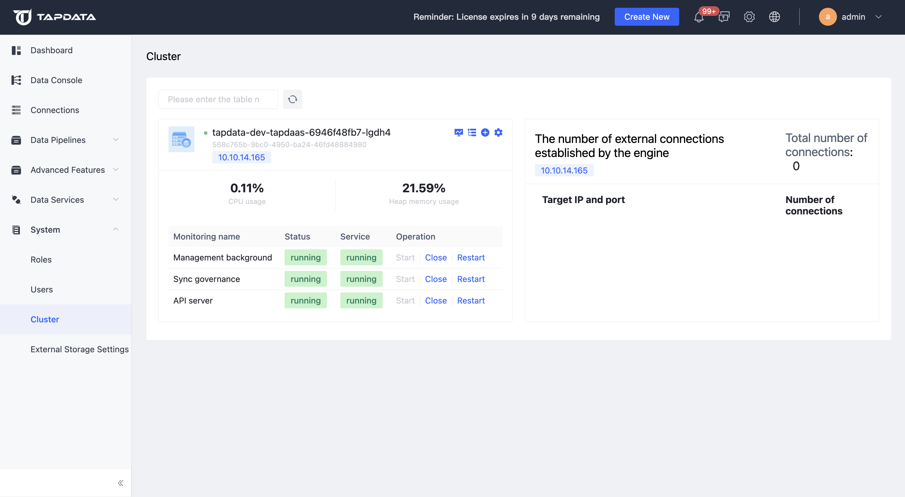
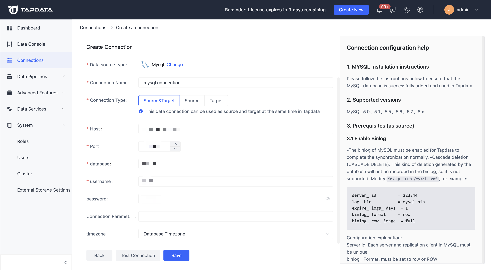
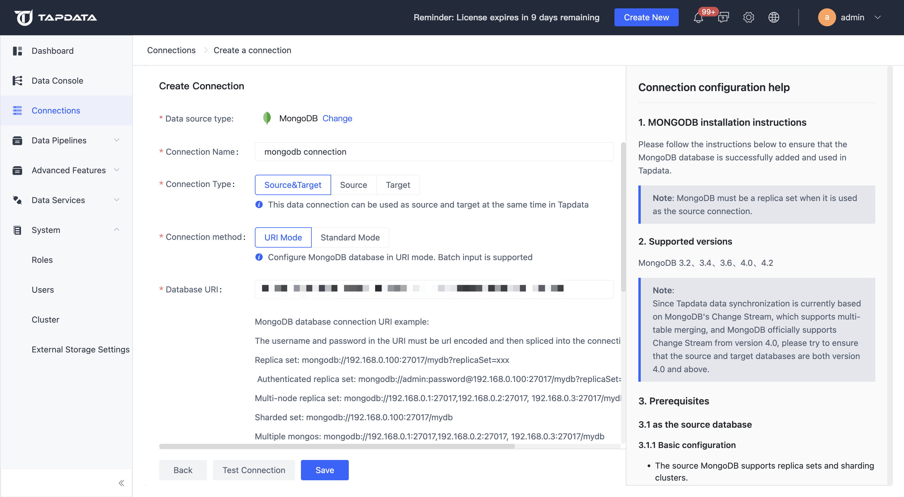
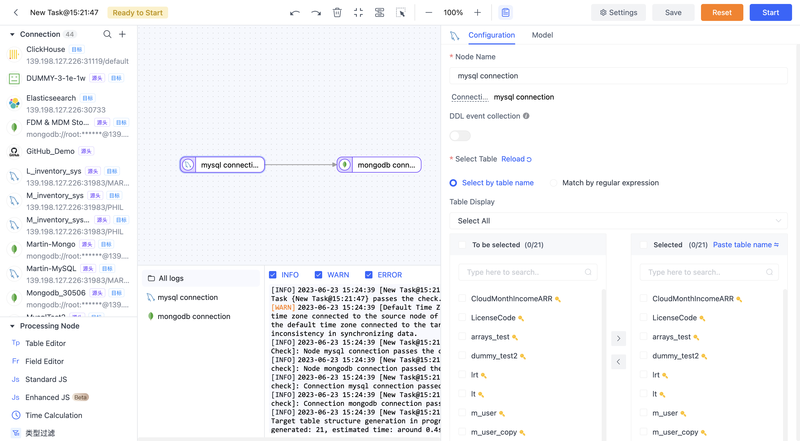
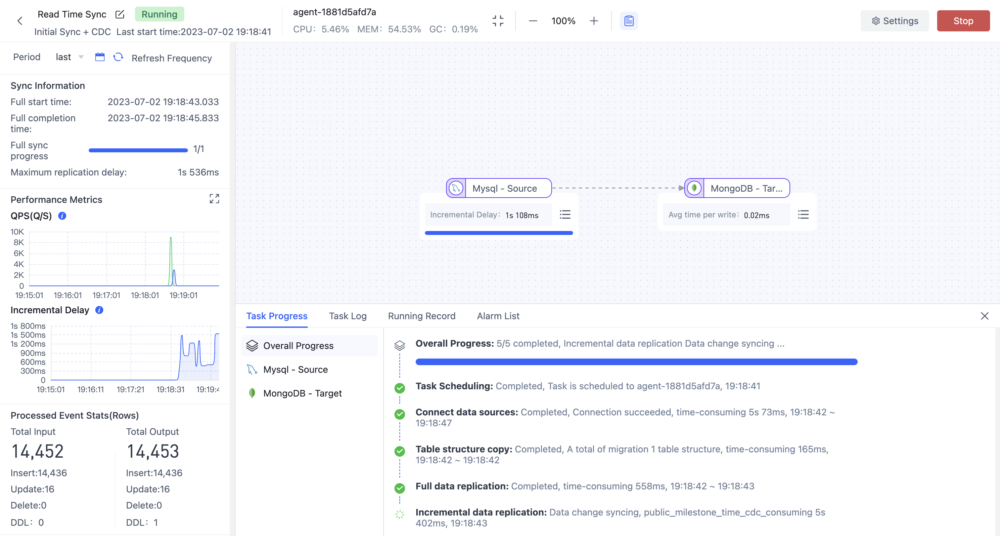

    
    
    

## Online Document: https://docs.tapdata.io/
## Cloud Service: https://cloud.tapdata.io/

## What is Tapdata?
Tapdata is a real-time data integration platform that enables data to be synchronized in real-time among various systems such as databases, SaaS services, applications, and files.
The synchronization tasks can be easily built through drag-and-drop operations, from table creation to full and incremental synchronization, all processes are fully automated.

Once the MongoDB-based data centralized storage feature is enabled, Tapdata immediately transforms into an integrated data service platform.
Through a user-friendly visual interface, you can form real-time, complete, and accurate document-based data in MongoDB from dispersed but interrelated data from various sources. This allows business developers to develop their applications more quickly, and data analysis engineers can rapidly construct their own metrics systems. Once integrated, the data can be used ubiquitously.

 
### Quick Start
1. Click https://cloud.tapdata.io/, start your real-time data journey immediately, Free Trial(NO Credit Card Required)
2. You can easily deploy the service in your local environment with 2 Steps:
    1. Install Docker
    2. Exec: `docker run -itd -p 3030:3030 github.com/tapdata/tapdata-opensource:latest bash`, then you can get tapdata server by visting http://localhost:3030,
    default username is: admin@admin.com, default password is admin

### Example Usage
Before starting the task, please ensure that you can see the following content through your browser.

#### Sync Data From Mysql To MongoDB
1. Add Mysql Connection

2. Add MongoDB Connection

3. Click Data Pipelines => Replications, Create a new job

4. Drag Mysql Connection and MongoDB Connection from left side bar, Drag a line from the MySQL connection node and connect it to the MongoDB node
5. Click Mysql Node, select tables what you want to sync

6. Start Job and watch data keep syncing!

## License
Defaults to Apache V2 License.

For Connectors, the license is Apache V2.

## Join now
- [Send Email](mailto:team@tapdata.io)
- [Slack channel](https://join.slack.com/t/tapdatacommunity/shared_invite/zt-1biraoxpf-NRTsap0YLlAp99PHIVC9eA)
