

<a href="https://tapdata.io/">
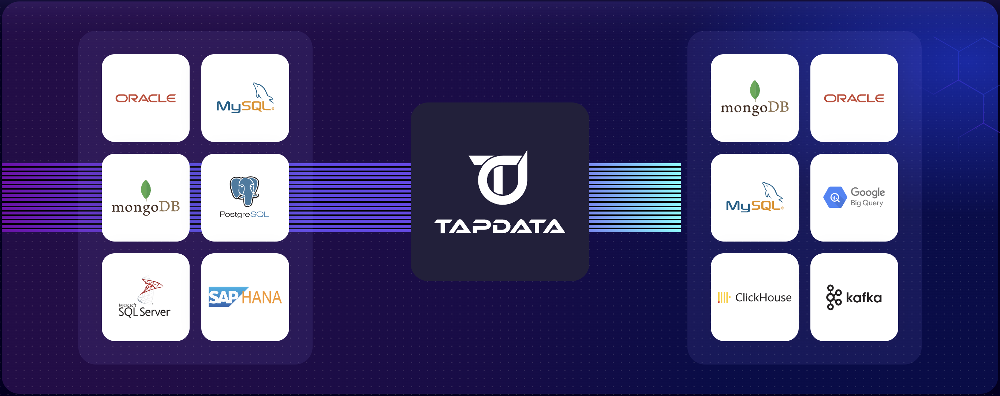
</a>
  

---

[?style=for-the-badge>)](https://cloud.tapdata.net)
[?style=for-the-badge>)](https://cloud.tapdata.net)
[?style=for-the-badge>)](https://docs.tapdata.io)

## What is Tapdata ?
Tapdata is a CDC-based, Real-Time data integration platform that enables data to be synchronized in real-time among various systems such as databases, SaaS services, applications, and files.
The synchronization tasks can be easily built through drag-and-drop operations, from table creation to full and incremental synchronization, all processes are fully automated.

1. [Supported Connectors](https://docs.tapdata.io/cloud/introduction/supported-databases)
2. [FAQ](https://docs.tapdata.io/faq/)

For more details, please read [docs](https://docs.tapdata.io/)

## Key Features
### End-To-End Visual UI

| |
| --------------------------------------------------------------------------------------------------------------------------------------------------------------------------------------------------------------------------------------------------------------------------------------------------------------------------------------------------------------------------------------------------------------------------------------------------------------- | ------------------------------------------------------------------------------------ |
| <b>Full Process Automation</b> Heterogeneous table creation, switch Full and Incremental automation.  <b>Drag-And-Drop</b> Operate through a visual interface, Easy to use  <b>Monitor</b> sync performance, task progress, key events, and logs. | 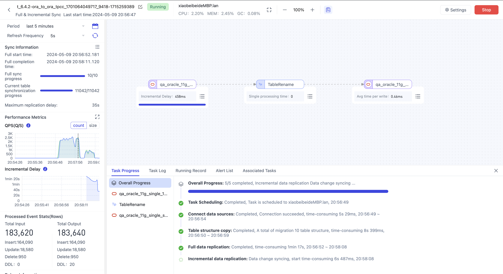 |
| |

 

### Lightweight ETL Solution

| |
| --------------------------------------------------------------------------------------------------------------------------------------------------------------------------------------------------------------------------------------------------------------------------------------------------------------------------------------------------------------------------------------------------------------------------------------------------------------- | ------------------------------------------------------------------------------------ |
| <b>Table Filter and Mapping</b> Rich visual processors that allow table selection, renaming, adding or deleting fields, and renaming.  <b>Record Transformation</b> Easily use JS/Python code to do transformation  <b>Union</b> Union multi tables to one target. | 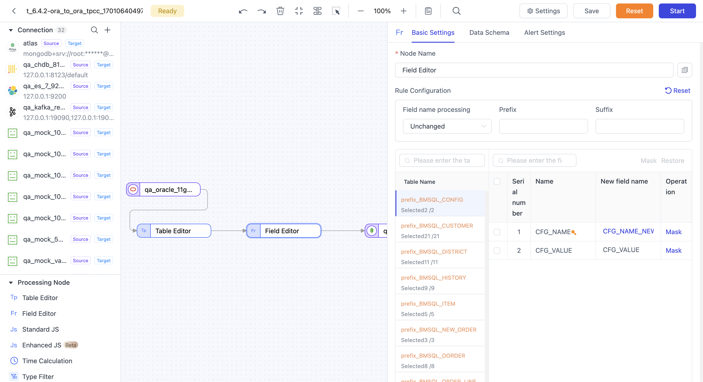 |
| |

 

### Build materialized views in MongoDB

| |
| --------------------------------------------------------------------------------------------------------------------------------------------------------------------------------------------------------------------------------------------------------------------------------------------------------------------------------------------------------------------------------------------------------------------------------------------------------------- | ------------------------------------------------------------------------------------ |
| <b>Document-style view</b> Support Embedded documents and arrays, deeply integrated with MongoDB.  <b>Multi-table association</b> Supports multi-table association, hierarchical nesting, and convenient construction of 1:1 and 1:N models.  <b>Multi-table stream merging</b> Unified batch and stream processing, multi-table updates in any order, consistent results. |  |
| |

 

## Primary Use Cases
1. Synchronize data from traditional RDBMS to modern databases such as MongoDB, Elasticsearch (ES), or Redis to support new business uses.
2. Consolidate data from various databases into a unified data warehouse.
3. Stream database changes to Kafka.
4. Perform data synchronization between heterogeneous databases.
5. Use MongoDB to build your unified data hub.
 
## Quick Start
### Start with local docker
RUN `docker run -d -p 3030:3030 github.com/tapdata/tapdata-opensource:latest`, wait for 3 minutes, then you can get it from http://localhost:3030/

default username is: admin@admin.com, default password is admin

### Start with cloud service
Tapdata service is available in cloud service, you can use fully-managed service, or deploy engine to your private network

Try on https://cloud.tapdata.io/, support google and github account login, free trial, NO credit card needed, start your real-time data journey immediately.

## Examples

    
<h4>🗂️ Create Datasource and Test it</h4>

1. Login tapdata platform

2. In the left navigation panel, click Connections

3. On the right side of the page, click Create

4. In the pop-up dialog, search and select MySQL

5. On the page that you are redirected to, follow the instructions below to fill in the connection information for MySQL

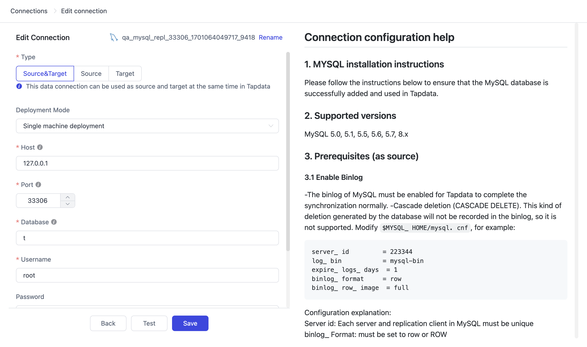</img>

6. Click Test, make sure all test pass, then click Save

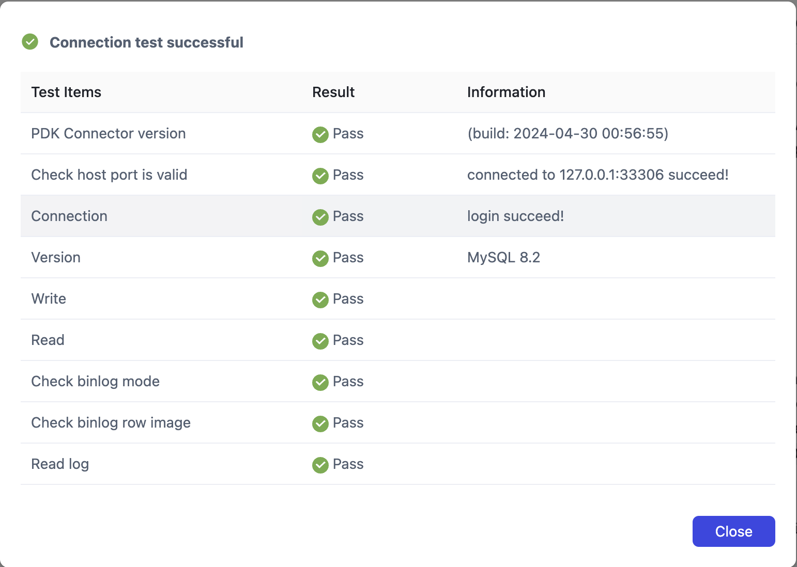</img>

    
<h4>🗂️ Sync Data From MySQL To MongoDB</h4>

1. Create MySQL and MongoDB data source

2. In the left navigation panel, click Data Pipelines -> Data Replications

3. On the right side of the page, click Create

4. Drag and drop MySQL and MongoDB data sources onto the canvas

5. Drag a line from the MySQL data source to MongoDB

6. Configure the MySQL data source and select the data tables you want to synchronize

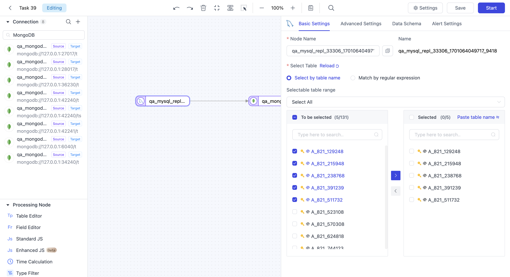</img>

7. Click the Save button in the upper right corner, then click the Start button

8. Observe the indicators and events on the task page until data is in sync

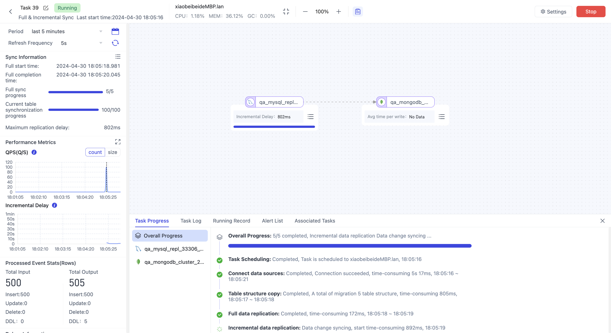</img>

    
<h4>🗂️ MySQL To PostgreSQL with Simple ETL</h4>

1. Create MySQL and PostgreSQL data source

2. In the left navigation panel, click Data Pipelines -> Data Transformation

3. On the right side of the page, click Create

4. Drag and drop MySQL and PostgreSQL data sources onto the canvas

5. Drag a line from the MySQL data source to PostgreSQL

6. Click the plus sign on the connection line and select Field Rename

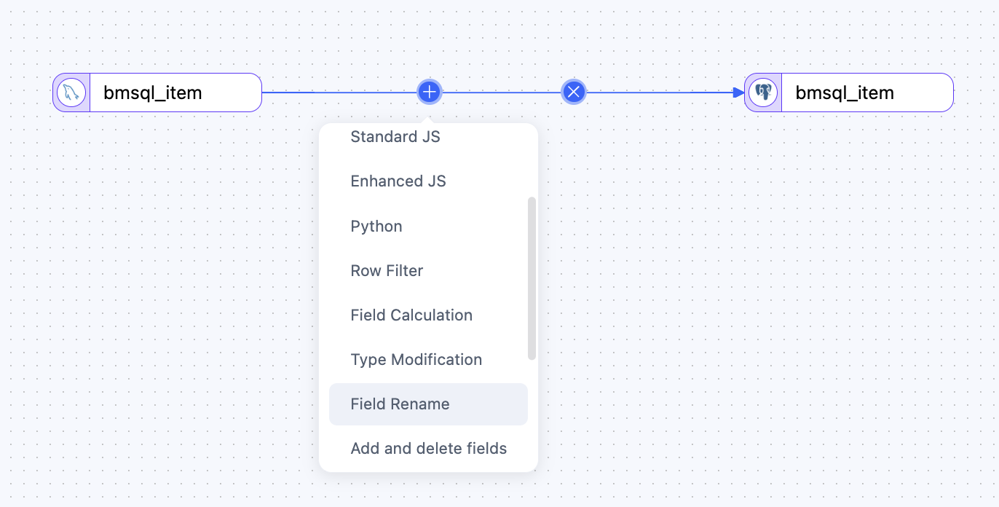</img>

7. Click Field Rename node, change i_price to price, i_data to data in config form

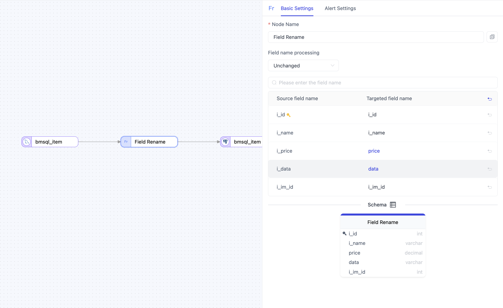</img>

8. Click the Save button in the upper right corner, then click the Start button

9. Observe the indicators and events on the task page until data is in sync

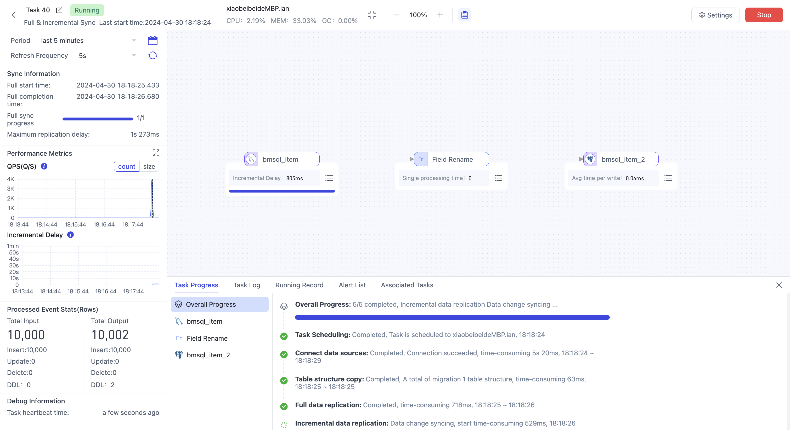</img>

    
<h4>🗂️ Making materialized views in MongoDB</h4>

Materialized view is a special feature of tapdata, You can give full play to the characteristics of MongoDB document database and create the data model you need, try enjoy it !

In this example, I will make a view using 2 tables in MySQL: order and product, make product as a embedded document of order, here is the step:

1. Create MySQL and MongoDB data source

2. In the left navigation panel, click Data Pipelines -> Data Transformation

3. On the right side of the page, click Create

4. Click mysql data source in left up side, then drag and drop order table and product table onto the canvas

5. Drag and drop "Master-slave merge" node in left bottom side onto the canvas

6. Drag a line from the order table to Master-slave merge

7. Drag a line from the product table to Master-slave merge

8. Drag and drop MongoDB data source onto the canvas, and drag a line from the "Master-slave merge" node to MongoDB node

</img>

9. Click "Master-slave merge" node, then drag product table into order table in the right side in "Table Name"

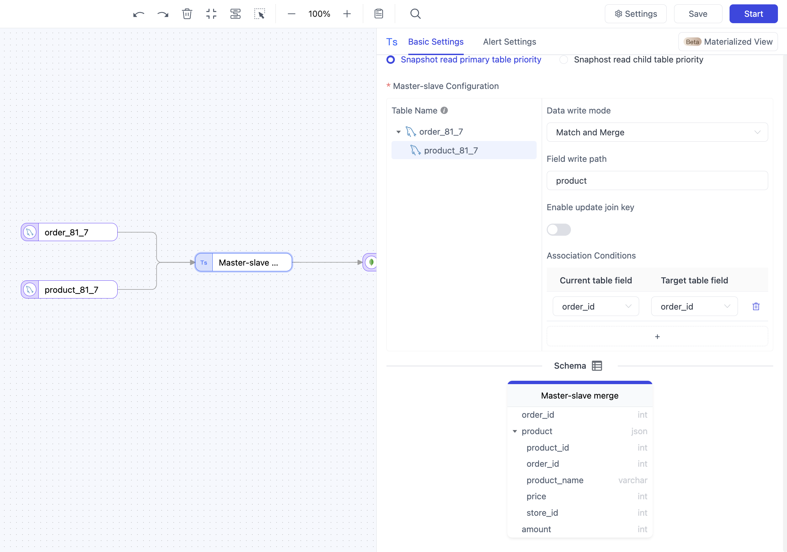</img>

10. Click "Master-slave merge" node, then click product table, config Data write model to "Match and Merge", Field write path to "product", Association Conditions to "order_id" => "order_id", then you can see Schema in bottom changed

11. Click MongoDB node, and config target table name as order_with_product, update condition field config as "order_id"

</img>

12. Click the Save button in the upper right corner, then click the Start button

13. Observe the indicators and events on the task page until data is in sync

14. Check collection order_with_product in MongoDB, and you will see the data model

    
<h4>🗂️ Data consistency check</h4>

Using the data verification feature, you can quickly check whether the synchronized data is consistent and accurate

1. In the left navigation panel, click Data Pipelines -> Data Validation

2. On the right side of the page, click Task Consistency Validation

3. Choose 1 task, and valid type choose "All Fields Validation", it means system will check all fields for all record

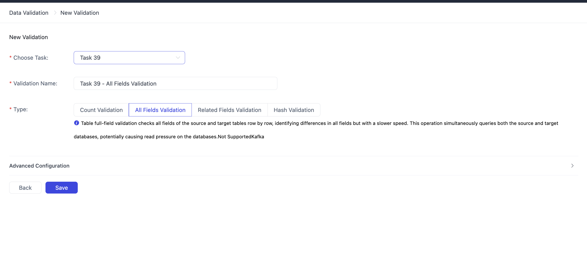</img>

4. Click Save, then click Execute in the task list

5. Wait validation task finished, click Result in the task list, and check the validation result

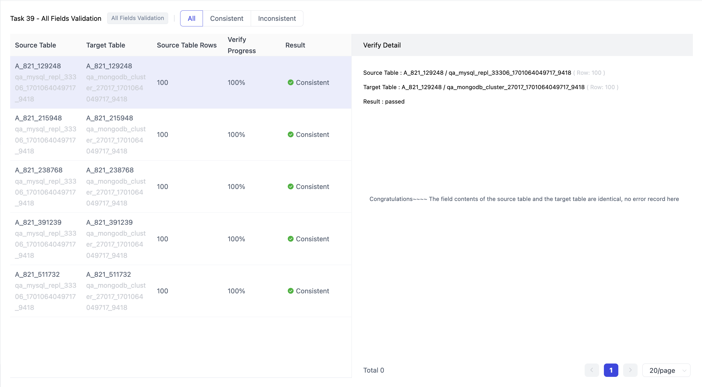</img>

## Architecture
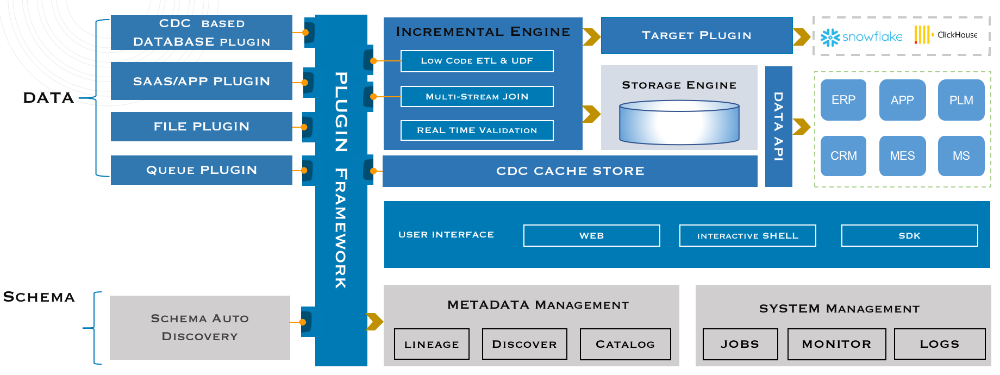

## License
Tapdata is under the Apache 2.0 license. See the [LICENSE](https://github.com/tapdata/tapdata/blob/main/LICENSE) file for details.

## Contact Us
- [Send Email](mailto:team@tapdata.io)
- [Slack channel](https://join.slack.com/t/tapdatacommunity/shared_invite/zt-1biraoxpf-NRTsap0YLlAp99PHIVC9eA)
