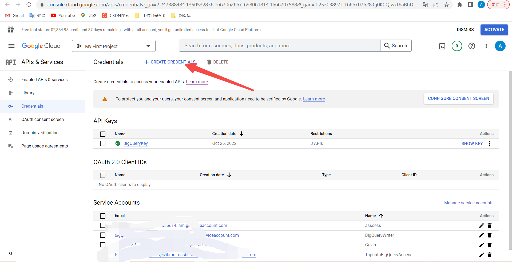
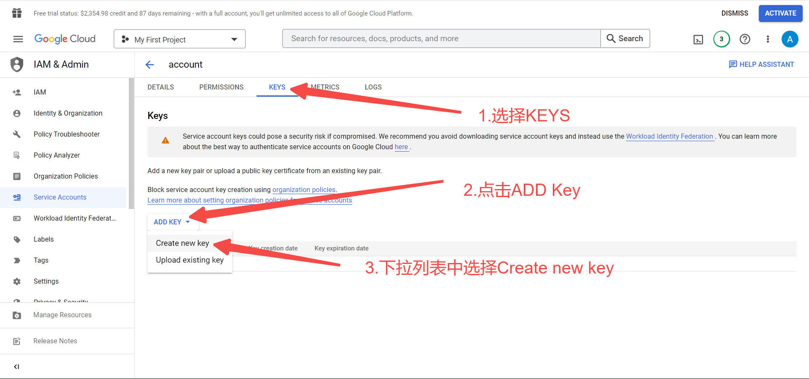

###  Write on the front 
 If you are interested, you can go to the documents provided by Google to learn all the contents in detail :

- Documentation：[https://cloud.google.com/docs](https://cloud.google.com/docs)
- Operation document：[https://cloud.google.com/bigquery/docs/](https://cloud.google.com/bigquery/docs/)
- Create and manage service account: [https://cloud.google.com/iam/docs/creating-managing-service-accounts](https://cloud.google.com/iam/docs/creating-managing-service-accounts)

Of course, you can also browse the following content to quickly start the configuration process of BigQuery data sources. 

---

###1. Attribute Description

1. Service account: You need to manually go to the BigQuery console to set rules and create a service account as a data access credential;

2. Dataset ID: You need to confirm the dataset corresponding to the BigQuery data source and enter it;

---

###2. Configuration steps

####2.1 Basic Configuration

Obtain **service account**:

- 1.Please go to the BigQuery console to enter the credential management interface:[ https://console.cloud.google.com/apis/credentials ]( https://console.cloud.google.com/apis/credentials )

- 2.If you have configured the corresponding service account (***Please skip steps 2-6 directly and start from step 7***), you need to create a new service account now. Click the **CREATE CREDENTIAL** option in the menu bar:

 

- 3.Select **Service Account** to create a service account:

 

- 4.Fill in the basic information of the service account:

 

- 5.Associate this service account with the project and configure its access permission rules. Here we need to select BigQuery Admin permission under BigQuery;

 

 

- 6.After configuration, click Create. We will return to the Credentital page, and we can see the service account we just created in the Service Account table:

 

- 7.Click the created Service Account to enter the Service Account At this point, we begin to configure the access secret key, that is, we need to use the key information to create the data source. Select the key option and click Add Key. Create a new key;

 

- 8.Click Create and select the secret key in JSON format. After saving to the local, open the JSON file, copy all the contents to the Tapdata creation connection page, and paste the copied contents into the service account text field;

 

Get **Dataset ID**

- 1. Enter the BigQuery console: [https://console.cloud.google.com/bigquery](https://console.cloud.google.com/bigquery)

- 2.You can directly obtain the dataset ID from the interface, as shown in the following figure. The hierarchical relationship is Item ID ->Dataset ID ->Datasheet ID:

 