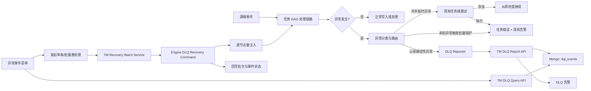
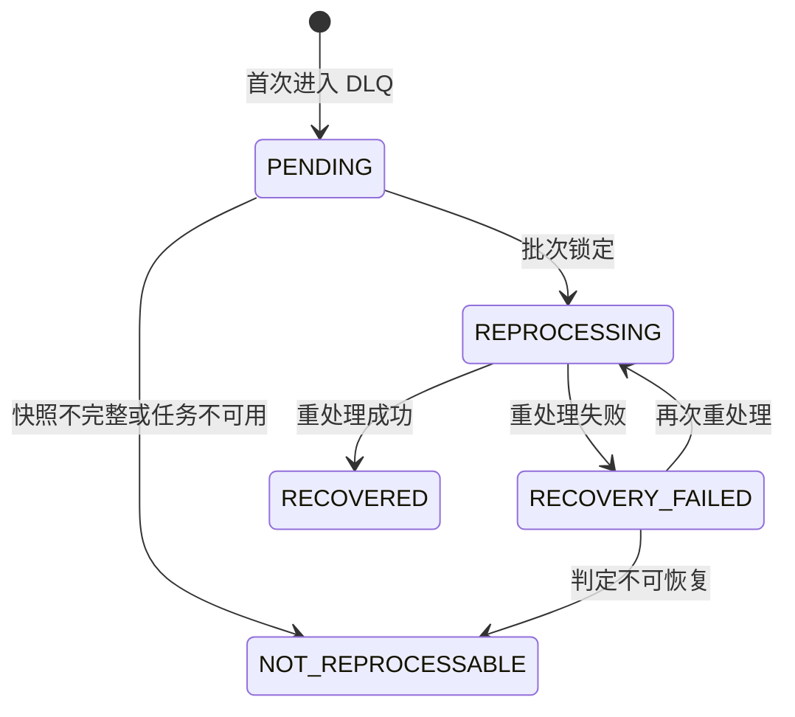

# TAP-12615 TapData 异常事件（DLQ）与受控重处理 POC 功能设计

## 1. 文档说明

- Jira：TAP-12615
- 主题：TapData 异常事件（DLQ）与受控重处理 POC
- 编写日期：2026-08-25
- 更新日期：2026-08-27
- 范围：需求总结、现状分析、功能设计和可行性边界
- 不包含：Xray 测试用例设计、测试脚本实现、详细开发排期

本文基于 TAP-12615 需求描述、Jira 评论中已确认的产品口径，以及当前 TapData 代码现状进行设计。目标是给出一套可以在现有架构中落地的 POC 功能方案，而不是重新设计 TapData 的整体错误处理体系。

## 2. 需求总结

客户希望在 TapData 中演示一套完整的异常数据处理闭环：同一个复制/转换任务开启 DLQ 后，系统能够按异常影响范围分层处理。网络抖动、数据库临时不可用等共享临时异常继续走现有任务级重试；字段格式、字段类型、长度、约束、转换失败等能够归因到单条记录的确定性异常直接隔离到 DLQ，不阻断正常数据；运维人员可以在页面查看异常上下文和告警；数据工程师修复任务规则后，可以对单条或同一任务内批量异常事件进行受控重处理，并保留审计轨迹。

核心诉求如下：

- 开启 DLQ 后仍保留现有任务级重试能力，不能把“任务级重试”和“DLQ”设计成互斥能力。
- 共享临时异常走现有任务级重试；故障恢复后从原进度继续，不生成 DLQ 记录。
- 任务级重试耗尽后任务进入错误状态并触发现有任务告警，不把积压数据批量写入 DLQ。
- 可归因到单条记录的确定性异常进入结构化 DLQ，而不是只写入任务日志文件。
- 未知异常需要有批量保护：当同类未知异常影响多条记录或超过阈值时，停止逐条写入 DLQ，转入任务级重试或任务错误，避免形成 DLQ 风暴。
- DLQ 事件支持按任务、表、关键字、DML 类型、错误类型、状态和时间查询。
- 支持单条和批量重处理，批量必须属于同一任务，允许跨表。
- 重处理使用当前已发布任务配置，不支持在线修改异常 Payload。
- 重处理失败不新增平级异常主记录，只更新原记录状态和尝试历史。
- 告警复用现有渠道和发送间隔，但告警抑制不能影响 DLQ 事件逐条落库。
- 顺序保证限定在同一任务、同一批次内，排序规则为 `event_time`、`capture_seq`、`event_id`。
- 无重复和无数据丢失只在 POC 约定的主键、唯一键、幂等写入或 Exactly-Once 能力支持范围内证明。

TAP-12615 V1.2 已确认的产品口径：

- DLQ 与任务级重试在同一任务中分层生效，不再采用“开启 DLQ 后完全跳过任务重试”的口径。
- 网络抖动、数据库临时不可用等共享异常走任务级重试；重试期间受影响的待处理数据不逐条进入 DLQ。
- 字段长度、类型、约束、格式、转换失败等确定性记录异常直接进入 DLQ，不做“记录级分钟级重试后再进入 DLQ”的链路。
- 共享故障恢复后从原进度继续，不生成 DLQ 记录；任务级重试耗尽后进入错误状态并告警，不把积压数据批量写入 DLQ。
- 未知异常的错误码分类、识别方式和批量异常保护阈值交由研发设计，但必须能避免 DLQ 风暴。
- 异常数据从日志文件同步记录到 MongoDB 的 `dql_events` 集合。
- UI 新增独立“异常事件”菜单。
- 支持单条和批量回放，由引擎按 `event_time` 保证回放顺序，事件从源节点重新注入。
- 恢复操作不生成新异常主记录，通过原记录维护 `status`、`recovery_count`、`last_recovery_time`。
- 权限复用现有菜单权限控制，可见即可操作。
- 对 `error_details` 截断，建立 `task_id + event_time` 复合索引。

## 3. 当前 TapData 现状

### 3.1 已具备能力

当前 TapData 已具备以下可复用基础：

- 任务级重试配置：系统设置中已有 `retry_interval_second` 和 `max_retry_time_minute`，任务出错后可展示现有重试行为。
- 记录级跳过：`SkipErrorEventAspectTask` 会在 `SkipData` 模式下先批量写入，批量失败且异常可跳过时拆成单条重试；单条仍失败时执行跳过并写日志。
- 跳过统计：记录级跳过数量会写入 `Task.attrs.skipErrorEvent`，供任务维度观测。
- 表级跳过和恢复：已有 `TaskSkipErrorTable` 集合、Repository、Service、Controller、Engine Storage 和 Web 页签，可复用其 TM API、权限校验、状态更新和前端分页模式。
- 数据校验：已有 count、field、jointField、hash 等校验能力，可用于 POC 证明恢复后目标数据符合预期。
- 数据修复注入基础：`AutoRecovery` / `AutoRecoveryClient` 已能把修复事件送入源节点队列，`HazelcastSourcePdkBaseNode.enqueue` 和 `HazelcastTargetPdkBaseNode` 已支持修复事件经过正常 DAG 处理链路。
- 告警框架：已有 `AlarmKeyEnum`、任务告警配置、告警模板和任务错误告警处理链路。

### 3.2 主要缺口

当前能力不足以直接满足 TAP-12615：

- 记录级跳过只写日志和计数，没有结构化异常事件集合。
- 日志里的 `TapRecordEvent` 和异常堆栈不适合作为可查询、可权限控制、可审计的数据源。
- 已有 `TaskSkipErrorTable` 是表级能力，粒度不足，状态也只有 `SKIPPED` 和 `RECOVERING`。
- 已有 `TapdataRecoveryEvent` 面向数据校验修复，主要覆盖 Insert/Delete，缺少对原始 Insert/Update/Delete 事件快照的通用回放语义。
- 现有 `SkipErrorEventAspectTask` 主要依赖错误码是否可跳过，缺少“共享临时异常、记录级确定性异常、未知异常”的统一归因和路由决策。
- 批量写入失败后的拆单逻辑适合定位 Poison Record，但如果失败原因是连接不可用、目标库临时不可用、TM 不可用等共享异常，不能继续把拆出的每条记录写入 DLQ。
- 缺少未知异常的批量保护机制；当同类异常在短时间内影响多条记录时，需要转任务级重试或任务错误，而不是持续生成 DLQ 记录。
- 任务暂停接口会下发 `DataSyncMq.OP_TYPE_STOP`，可能停止 TaskClient；如果直接用任务 stop/pause 做“回放前暂停”，会影响从源节点队列注入事件的可行性。
- 前端目前只有任务监控页签里的“跳过异常表”，没有独立异常事件菜单，也没有展示“共享异常正在任务级重试但未生成 DLQ”的说明位置。
- 权限菜单枚举中没有异常事件菜单，需要新增或明确映射到现有任务菜单权限。

## 4. 设计原则

- 先分类路由，再决定是否入 DLQ。所有异常先经过 `DlqExceptionClassifier` 判定为任务级共享异常、记录级确定性异常或未知异常，再分别进入任务重试、DLQ 或保护性任务错误链路。
- DLQ 与任务级重试在同一任务内分层生效。开启 `SkipData` 或 DLQ 不代表关闭现有任务重试；共享临时异常继续复用现有任务级重试配置和失败语义。
- 确定性记录异常直接进入 DLQ。字段长度、类型、约束、格式、转换失败等可定位到单条 `TapRecordEvent` 的异常不做记录级分钟级重试，DLQ 落库成功后才允许 skip。
- 共享故障不生成记录级 DLQ。网络、数据库临时不可用、连接、TM、资源、任务配置等影响一批或整个任务的异常走任务级重试；重试耗尽后任务错误并告警，不把积压数据批量写入 DLQ。
- 未知异常必须有批量保护。无法明确归因为单条记录的问题，在短时间或同一批次内命中阈值后停止逐条隔离，转入任务级重试或错误告警，避免 DLQ 风暴。
- 重处理走当前任务规则。异常事件保存原始事件快照，重处理时不允许在线编辑 Payload。
- 审计记录不可覆盖。主记录只表达当前状态，所有重处理尝试以追加方式记录。
- 顺序和一致性不做过度承诺。POC 只证明同一任务、同一批次、受控暂停期间的相对顺序；不承诺跨任务、跨分片或同一业务键后续事件自动等待。
- 优先复用现有 TapData 架构。TM 负责权限、查询、批次和审计；Engine 负责异常分类、事件序列化和重新注入；Web 负责独立页面和操作入口。

## 5. 总体方案

整体采用“Engine 捕获异常并先做路由判定，TM 管理 DLQ 事件和批次，Engine 执行重处理，Web 提供独立菜单”的方案。核心变化是把 DLQ 上报从“可跳过即上报”调整为“分类为记录级确定性异常后才上报”。



### 5.1 组件职责

| 组件 | 职责 |
| --- | --- |
| Engine `DlqExceptionClassifier` | 在写入和处理节点异常处判断 `RECORD_DLQ`、`TASK_RETRY` 或 `TASK_ERROR`，避免共享异常被误写入 DLQ |
| Engine `skip-error-event-module` | 仅对分类为 `RECORD_DLQ` 的异常生成事件快照、顺序信息和错误摘要，上报 TM |
| Engine Task Retry | 对共享临时异常复用现有 `TaskRetryService`、重试间隔、最大重试时间和重试耗尽后的错误状态 |
| TM `dlqevent` 域服务 | 管理 `dql_events`、批次、权限、查询、状态流转、告警触发，并拒绝非记录级异常上报 |
| Engine DLQ Recovery | 接收 TM 重处理命令，按批次顺序把事件从源节点边界重新注入任务处理链 |
| Web 异常事件菜单 | 独立列表、详情、筛选、单条和批量重处理；通过事件详情的 `recoveryAttempts` 展示进度和结果，并在空结果或任务异常上下文中说明共享异常不会产生 DLQ |
| Alarm | 复用现有任务错误/重试告警，新增 DLQ 进入、DLQ 保存失败、重处理失败告警 |
| Inspect/Data Validation | POC 重处理后复用现有数据校验证明结果 |

### 5.2 命名说明

Jira 评论中明确集合名为 `dql_events`。本文按已确认口径使用该集合名；代码包名、类名建议使用语义更清晰的 `dlqevent`，避免业务概念中出现拼写歧义。若后续产品允许统一命名，可将集合名调整为 `dlq_events`，但 POC 阶段以 Jira 评论为准。

## 6. 数据模型设计

### 6.1 `dql_events`

`dql_events` 保存每一条被跳过的异常事件主记录。

| 字段 | 类型 | 说明 |
| --- | --- | --- |
| `_id` | ObjectId | DLQ 事件 ID |
| `event_id` | String | 对外 API 定位 ID，可由任务、表、事件身份哈希生成；当前页面不展示 |
| `task_id` | String | 任务 ID |
| `task_record_id` | String | 当前任务运行记录 ID |
| `task_name` | String | 冗余任务名，便于列表展示 |
| `task_version` | Long | 捕获时任务版本 |
| `agent_id` | String | 捕获事件的引擎节点 |
| `source_node_id` | String | 源节点 ID |
| `source_node_name` | String | 源节点名称，供详情展示 |
| `target_node_id` | String | 目标节点 ID，可选 |
| `target_node_name` | String | 目标节点名称，供详情展示，可选 |
| `failed_node_id` | String | 失败节点 ID |
| `failed_node_name` | String | 失败节点名称 |
| `failed_stage` | String | 失败阶段；对外详情字段映射为 `stage` |
| `source_table` | String | 源表名 |
| `target_table` | String | 目标表名 |
| `table_id` | String | TapRecordEvent 表 ID |
| `dml_type` | String | `I`、`U`、`D` |
| `event_time` | Date/Long | 原事件时间，用于排序 |
| `capture_seq` | Long | 同任务内捕获序号，解决同时间排序 |
| `failed_at` | Date | 首次失败并进入 DLQ 时间 |
| `event_key` | Object | 主键、唯一键或业务键摘要 |
| `event_identity` | String | 事件幂等身份，优先用原始事件唯一标识，缺失时用稳定哈希 |
| `payload` | Object/Binary | 完整 TapRecordEvent 快照，供重处理反序列化使用 |
| `payload_preview` | Object | UI 展示用截断和脱敏后的预览 |
| `payload_preview_truncated` | Boolean | UI 安全预览是否被截断，与原始 Payload 是否完整分开表达 |
| `error_type` | String | `MALFORMED_RECORD`、`POISON_RECORD`、`TRANSFORM_ERROR`、`TARGET_WRITE_ERROR`、`UNKNOWN_RECORD_ERROR` |
| `error_code` | String | TapData 完整错误码 |
| `error_details` | String | 截断、脱敏后的错误详情 |
| `error_details_truncated` | Boolean | 错误详情是否被截断 |
| `exception_scope` | String | 异常影响范围。DLQ 主记录只允许 `RECORD`，用于审计分类结论 |
| `route_decision` | String | 路由决策。进入本集合的记录固定为 `RECORD_DLQ` |
| `classification_reason` | String | 分类命中的错误码、节点类型、异常链或保护规则摘要 |
| `classification_confidence` | String | `EXACT`、`RULE`、`UNKNOWN_SINGLE` 等分类可信度 |
| `raw_error_ref` | String | 可选，指向任务日志文件和偏移位置 |
| `status` | String | `PENDING`、`REPROCESSING`、`RECOVERED`、`RECOVERY_FAILED`、`NOT_REPROCESSABLE` |
| `recovery_count` | Int | 重处理尝试次数 |
| `last_recovery_time` | Date | 最近重处理时间 |
| `last_recovery_user_id` | String | 最近操作人 |
| `last_recovery_result` | String | 最近重处理结果摘要 |
| `current_batch_id` | String | 当前运行批次 ID |
| `recovery_attempts` | Array | 重处理尝试历史，POC 阶段内嵌保存；对外映射为 `recoveryAttempts` |
| `created` | Date | 创建时间 |
| `updated` | Date | 更新时间 |

`recovery_attempts` 元素建议包含：

| 字段 | 类型 | 说明 |
| --- | --- | --- |
| `attempt_id` | String | 尝试 ID |
| `batch_id` | String | 批次 ID |
| `operator_id` | String | 操作人 ID |
| `operator_name` | String | 操作人名称 |
| `started_at` | Date | 开始时间 |
| `finished_at` | Date | 结束时间 |
| `task_version` | Long | 重处理使用的任务版本 |
| `result` | String | `RUNNING`、`SUCCESS`、`FAILED`、`SKIPPED`、`TIMEOUT` |
| `message` | String | 结果摘要 |
| `error_code` | String | 失败错误码 |
| `error_details` | String | 截断、脱敏后的失败原因 |

对外 `DqlRecoveryAttempt` 将内部 `error_details` 映射为 `errorMessage`；当前 Web 契约只依赖 `attemptId`、`batchId`、`startedAt`、`finishedAt`、`result`、`message`、`errorMessage`。

### 6.2 `dql_recovery_batches`

`dql_recovery_batches` 保存人工重处理批次。

| 字段 | 类型 | 说明 |
| --- | --- | --- |
| `_id` | ObjectId | 批次 ID |
| `task_id` | String | 任务 ID，一批只允许一个任务 |
| `event_ids` | Array | 批次选择的 DLQ 事件 ID |
| `ordered_event_ids` | Array | TM 按排序规则固化后的处理顺序 |
| `operator_id` | String | 操作人 ID |
| `operator_name` | String | 操作人名称 |
| `task_status_before` | String | 发起前任务状态 |
| `task_version` | Long | 使用的当前发布版本 |
| `status` | String | `CREATED`、`RUNNING`、`SUCCESS`、`PARTIAL_FAILED`、`FAILED`、`CANCELED` |
| `selected_count` | Int | 选中数 |
| `success_count` | Int | 成功数 |
| `failed_count` | Int | 失败数 |
| `skipped_count` | Int | 未执行数 |
| `started_at` | Date | 开始时间 |
| `finished_at` | Date | 结束时间 |
| `message` | String | 批次摘要 |
| `created` | Date | 创建时间 |
| `updated` | Date | 更新时间 |

### 6.3 索引

POC 必建索引：

```javascript
db.dql_events.createIndex({ task_id: 1, event_time: 1, capture_seq: 1, _id: 1 })
db.dql_events.createIndex({ status: 1, failed_at: -1 })
db.dql_events.createIndex({ task_id: 1, status: 1, failed_at: -1 })
db.dql_events.createIndex({ task_id: 1, source_table: 1, failed_at: -1 })
db.dql_recovery_batches.createIndex({ task_id: 1, created: -1 })
db.dql_recovery_batches.createIndex({ status: 1, created: -1 })
```

为避免同一异常事件被重复保存，建议在 `event_identity` 可用时建立部分唯一索引：

```javascript
db.dql_events.createIndex(
  { task_id: 1, task_record_id: 1, table_id: 1, event_identity: 1, failed_node_id: 1 },
  { unique: true, partialFilterExpression: { event_identity: { $exists: true } } }
)
```

如果源事件没有稳定唯一标识，`event_identity` 由事件类型、表 ID、主键摘要、事件时间、源 offset 和 Payload 哈希生成。该策略不能证明业务无重复，只用于降低重复 DLQ 主记录概率。

## 7. 异常捕获、分类和入库设计

### 7.1 捕获点

记录级 DLQ 捕获点放在 `SkipErrorEventAspectTask.checkSkip(...)` 成功判定之后、返回 skip 之前，但在调用 DLQ 上报前必须先通过 `DlqExceptionClassifier` 做异常影响范围判定。

原因：

- 该位置已经完成批量失败后的单条拆分，能准确知道哪一条 `TapRecordEvent` 失败。
- 该位置能继续复用现有 `syncAndSkipMap` 统计和 split log。
- 先分类再上报，可以避免连接不可用、目标库临时不可用等共享故障被拆成大量 DLQ 记录。
- 先上报 DLQ 再返回 skip，可保证“没有结构化记录就不跳过”。

批量写入失败时需要先做批量级判断：

- 如果异常明显属于连接、网络、目标库不可用、TM 不可用、资源不足或任务配置错误，直接抛回现有任务错误处理，由任务级重试接管，不进入拆单 DLQ。
- 如果异常可能由个别记录触发，允许拆成单条重试；单条仍失败后再做记录级分类和 DLQ 上报。
- 如果拆单后同类未知异常持续出现并命中保护阈值，停止继续生成 DLQ，转任务级重试或任务错误。

建议新增：

- `DlqExceptionClassifier`：把 TapData 错误码、节点类型、异常链、失败阶段和批量影响范围归类为 `RECORD_DLQ`、`TASK_RETRY` 或 `TASK_ERROR`。
- `DlqStormGuard`：按任务、节点、表、错误码和时间窗口统计未知异常命中次数，超过阈值后阻断 DLQ 写入。
- `DlqEventReporter`：由 `SkipErrorEventAspectTask` 持有，负责组装 DTO 并调用 TM 上报 API。
- `DlqEventSnapshotSerializer`：序列化 `TapRecordEvent`，保留完整原始事件，并生成脱敏预览。
- `DlqSanitizer`：截断并脱敏 `error_details` 和 `payload_preview`。

### 7.2 路由决策表

| 异常类型 | 典型场景 | 路由 | 是否生成 `dql_events` |
| --- | --- | --- | --- |
| 共享临时异常 | 网络抖动、数据库短暂不可用、连接池临时失败、外部依赖短暂不可用 | 现有任务级重试 | 否 |
| 共享异常重试耗尽 | 目标库持续不可用、网络持续失败 | 任务错误 + 现有告警 | 否 |
| 记录确定性异常 | 字段长度、类型、非空、唯一约束、格式校验、单条 JS 转换失败 | `RECORD_DLQ` | 是 |
| 持久任务异常 | 账号密码错误、权限不足、目标表不存在、任务配置非法、脚本初始化失败 | 任务错误或现有有限重试 | 否 |
| 未知单条异常 | 能定位单条记录，且未触发批量保护 | POC 可按 `UNKNOWN_RECORD_ERROR` 进入 DLQ | 是 |
| 未知批量异常 | 同类未知异常短时间影响多条记录或超过阈值 | 任务级重试或任务错误 + 告警 | 否 |

### 7.3 上报链路

推荐使用 TM 内部上报 API，而不是 Engine 直接写 Mongo：

```text
Engine exception capture
  -> DlqExceptionClassifier
  -> RECORD_DLQ only
  -> DlqEventReporter
  -> HttpClientMongoOperator.postOne("task/{taskId}/dql-events/report")
  -> TM DlqEventController.report
  -> DlqEventService.upsertPendingEvent
  -> Mongo dql_events
  -> AlarmService
```

这样可以复用当前 `SkipErrorTableStorage` 已采用的 Engine -> TM 回调模式，并把权限、校验、告警和去重逻辑收敛在 TM。日志文件仍保留，`raw_error_ref` 可记录对应任务日志位置，但不建议通过异步解析日志文件来生成 DLQ，因为解析日志无法可靠还原完整 `TapRecordEvent`。

### 7.4 保存失败处理

DLQ 保存失败必须作为强约束处理：

- `DlqEventReporter` 上报失败时抛出异常，`checkSkip(...)` 返回 false 或直接抛出包装异常。
- 原事件不能被标记为跳过，任务进入现有错误处理和告警链路。
- TM 或 Engine 追加“DLQ 保存失败”告警，告警内容包含任务、表、错误码和保存失败原因。
- split log 仍记录原始跳过候选事件和异常，便于人工排查。

该处理会牺牲“继续同步”，但避免在结构化 DLQ 缺失时形成不可追踪的数据缺口。

## 8. 状态流转设计

### 8.1 事件状态



状态说明：

| 状态 | 含义 | 可操作性 |
| --- | --- | --- |
| `PENDING` | 待处理 | 可选中重处理 |
| `REPROCESSING` | 正在重处理 | 不可再次选中 |
| `RECOVERED` | 已恢复 | 默认不展示在可选列表，不可再次选中 |
| `RECOVERY_FAILED` | 最近一次重处理失败 | 可再次选中 |
| `NOT_REPROCESSABLE` | 快照缺失、任务不存在或其他永久不可处理原因 | 不可选中 |

### 8.2 批次状态

| 状态 | 触发条件 |
| --- | --- |
| `CREATED` | TM 已创建批次并固化事件顺序 |
| `RUNNING` | Engine 已接受重处理命令 |
| `SUCCESS` | 全部事件重处理成功 |
| `PARTIAL_FAILED` | 部分成功、部分失败或未执行 |
| `FAILED` | 批次级失败，未产生成功事件 |
| `CANCELED` | 发起前置校验失败或人工取消 |

## 9. 重处理设计

### 9.1 前置校验

TM 发起重处理前必须校验：

- 用户具备“异常事件”菜单权限。
- 所选事件存在且状态为 `PENDING` 或 `RECOVERY_FAILED`。
- 所选事件属于同一个任务。
- 原任务存在，且当前发布配置已经可运行。
- 任务不处于 `error`、`scheduling`、`wait_run`、`wait_start`、`stopping`、`renewing`、`deleting` 等不稳定状态。
- 事件 `payload` 完整，能反序列化为原始 `TapRecordEvent`。
- 事件没有被其他运行中批次锁定。

关于暂停状态：当前 `TaskDto` 中只有 `running`、`stop` 等状态，没有独立 `paused` 常量。POC 中建议把可回放状态收敛为：

- `running`：允许重处理，Engine 在任务内部暂停正常源读取并注入 DLQ 事件。
- 引擎仍保留 TaskClient 的 suspended/pause 态：允许重处理，重处理后保持暂停。
- 仅 TM 显示为 `stop` 且 Engine 已释放 TaskClient：不开放重处理，除非研发额外实现 recovery-only runner。

这个边界能避免调用 `TaskService.pause(...)` 后 TaskClient 被停止，导致无法从源节点重新注入事件。

### 9.2 批次锁定

TM 使用原子更新锁定事件：

```text
query:  _id in selectedIds AND status in [PENDING, RECOVERY_FAILED] AND current_batch_id is null
update: status = REPROCESSING, current_batch_id = batchId, updated = now
```

若实际锁定数量小于选中数量，批次创建失败并回滚已锁定事件，页面提示存在事件状态变化。

### 9.3 排序规则

批量事件固定使用以下排序，并把结果写入 `ordered_event_ids`：

```text
task_id ASC,
event_time ASC,
capture_seq ASC,
event_id ASC
```

排序在 TM 创建批次时固化，Engine 必须按 `ordered_event_ids` 执行，不能重新按本地时间或查询结果排序。

### 9.4 Engine 回放机制

推荐新增 Engine 侧 `DlqRecoveryCoordinator`，复用 `AutoRecovery` 的注入思想，但不要直接复用 `TapdataRecoveryEvent` 作为领域模型。

原因：

- `TapdataRecoveryEvent` 面向 Inspect 修复，当前静态工厂只覆盖 Insert/Delete。
- DLQ 需要还原原始 Insert/Update/Delete 的完整 `TapRecordEvent`、Info 和上下文。
- DLQ 重处理需要批次、操作人、事件 ID、尝试 ID 等审计元信息。

建议新增 `TapdataDlqRecoveryEvent extends TapdataEvent`：

- `batch_id`
- `dlq_event_id`
- `attempt_id`
- `recovery_type`: `BEGIN`、`DATA`、`END`
- `original_tap_record_event`
- `operator_id`
- `task_version`

运行中任务的处理流程：

1. TM 下发 `DLQ_RECOVERY` 消息到任务所在 Agent。
2. Engine 校验任务实例存在且版本匹配。
3. `DlqRecoveryCoordinator` 获得任务级重处理锁。
4. Source 节点进入“正常读取暂停”状态，不再向队列追加新的源端事件。
5. 等待已进入 DAG 的普通事件排空或达到可配置超时。
6. 按 `ordered_event_ids` 逐条反序列化原始 `TapRecordEvent`，包装成 `TapdataDlqRecoveryEvent` 并调用源节点 `enqueue(...)`。
7. Target 节点处理成功后回调 TM 更新事件尝试结果。
8. 批次完成后解除正常读取暂停。

如果任务已处于真正暂停但 TaskClient 仍存在，可跳过第 4 步，只执行 DLQ 注入，完成后保持暂停。若暂停状态已释放 TaskClient，POC 不做隐式启动，页面拒绝并提示任务需要处于运行中或引擎可回放暂停态。

### 9.5 正常流量暂停边界

重处理期间暂停的是任务内部正常源读取，而不是通过 TM `TaskService.pause(...)` 下发 stop。当前代码中的 `TaskService.pause(...)` 会发送 `DataSyncMq.OP_TYPE_STOP`，该路径可能释放 `AutoRecovery` 和 TaskClient，不适合作为本方案的回放前置步骤。

POC 的可行暂停方式：

- 在 `HazelcastSourcePdkBaseNode` 增加可恢复的读取闸门。
- DLQ 重处理开始时设置闸门为 `recoveryOnly`。
- 源连接器 reader 暂停拉取或暂停 enqueue 普通事件。
- DLQ 事件从同一个源节点边界进入 DAG。
- 批次结束后恢复普通读取。

该方式能满足客户看到的“正常同步暂停、恢复后继续运行”，同时避免销毁任务运行时。

### 9.6 结果更新

每条事件处理完成后，Engine 回调 TM：

- 成功：事件状态改为 `RECOVERED`，`recovery_count + 1`，更新 `last_recovery_time`、`last_recovery_user_id`、`last_recovery_result`，追加成功 attempt。
- 失败：事件状态改为 `RECOVERY_FAILED`，清空 `current_batch_id`，`recovery_count + 1`，追加失败 attempt。
- 未执行：例如批次前置失败或前序失败导致批次终止，事件状态回到原状态，追加 `SKIPPED` attempt 或只写批次明细。

同一条事件的重处理失败不能创建新的 `dql_events` 主记录。如果重处理过程中再次触发 SkipErrorEventAspectTask，应通过 `TapdataDlqRecoveryEvent` 标记识别为重处理上下文，转为更新原事件 attempt。

## 10. TM API 设计

### 10.1 Engine 上报 API

```http
POST /api/task/{taskId}/dql-events/report
```

用途：Engine 上报被跳过的异常事件。

请求体核心字段：

```json
{
  "taskRecordId": "string",
  "taskVersion": 12,
  "agentId": "string",
  "sourceNodeId": "string",
  "sourceNodeName": "mysql_src",
  "targetNodeId": "target-node",
  "targetNodeName": "mysql_sink",
  "failedNodeId": "string",
  "failedNodeName": "JS Processor",
  "failedStage": "TRANSFORM",
  "sourceTable": "orders",
  "targetTable": "orders_sink",
  "tableId": "orders",
  "dmlType": "U",
  "eventTime": 1787580000000,
  "captureSeq": 1024,
  "eventIdentity": "sha256:...",
  "payload": {},
  "payloadPreview": {},
  "errorType": "TRANSFORM_ERROR",
  "errorCode": "xxxx",
  "errorDetails": "...",
  "exceptionScope": "RECORD",
  "routeDecision": "RECORD_DLQ",
  "classificationReason": "JS process failed on single TapRecordEvent"
}
```

权限：Engine 回调沿用现有内部认证，不使用普通用户菜单权限。

### 10.2 页面查询 API

```http
GET /api/dql-events
GET /api/dql-events/{eventId}
GET /api/dql-events/summary
```

过滤参数：

- `taskId`
- `taskName`
- `sourceTable`
- `targetTable`
- `keyword`
- `dmlType`
- `errorType`
- `status`
- `startTime`
- `endTime`
- `skip`
- `limit`
- `order`

当前前端契约要求 `keyword` 至少匹配任务名和错误码。来源表、目标表分别通过 `sourceTable`、`targetTable` 做包含匹配；不要把完整原始 Payload 纳入搜索，避免敏感数据扩大暴露面。

### 10.3 重处理 API

```http
POST /api/dql-events/recovery/preview
POST /api/dql-events/recovery
GET /api/dql-events/recovery-batches/{batchId}
```

`preview` 用于返回前置校验结果、排序后的事件列表和不可执行原因。前端只有在 `canSubmit=true` 时允许确认，并必须按 `orderedEvents` 顺序提取 `eventId` 后提交。

`GET /api/dql-events/recovery-batches/{batchId}` 由服务端保留为可选诊断接口，当前 Web UI 不调用。页面通过事件详情的 `recoveryAttempts` 查看运行态、完成态和失败原因。

`recovery` 请求体：

```json
{
  "eventIds": ["eventId1", "eventId2"],
  "confirm": true
}
```

响应：

```json
{
  "batchId": "string",
  "taskId": "task-orders",
  "taskName": "订单同步",
  "status": "RUNNING",
  "selectedCount": 2,
  "successCount": 0,
  "failedCount": 0,
  "skippedCount": 0,
  "eventIds": ["eventId1", "eventId2"],
  "orderedEventIds": ["eventId1", "eventId2"],
  "startedAt": "2026-08-27T08:00:00.000Z",
  "finishedAt": null,
  "message": null
}
```

## 11. Web 功能设计

### 11.1 菜单入口

在“高级功能”分组下新增“异常事件”菜单。页面不是任务监控页签的补充，而是跨任务统一查询入口。

菜单权限按 Jira 已确认口径执行：用户能看到该菜单即可查看并执行重处理。POC 阶段只给授权运维和数据工程师角色开放该菜单。产品化阶段建议拆分为“查看异常事件”和“执行重处理”两个权限动作。

### 11.2 列表页

列表顶部提供状态汇总标签和两层筛选：

- 高频筛选：关键字、任务、DML 类型、错误类型。
- 更多筛选：来源表、目标表、失败时间范围，点击“应用筛选”后生效。
- 筛选和状态写入 URL query，页面加载时恢复。
- 刷新和显示列设置。

列表列使用 `eventId` 作为内部行键，但不在界面展示。来源表、目标表、事件时间、最近重处理时间默认隐藏；默认可见列包括任务、DML、错误类型、错误码、失败时间、状态、重处理次数和操作。

状态统计：

- 待处理
- 处理中
- 已恢复
- 恢复失败
- 不可重处理

列表存在 `REPROCESSING` 事件时，每 8 秒静默刷新列表和汇总。

### 11.3 详情页

详情展示：

- 基本信息：任务和表流向、源/目标节点、失败节点和阶段、DML、事件时间、捕获顺序。
- 错误信息：错误类型、错误码、截断后的安全错误详情和原始错误引用。
- Payload 预览：脱敏和截断后的 before/after/key 字段。
- 重处理历史：`recoveryAttempts` 展示运行中、成功、失败、跳过和超时记录。

事件 ID 只用于详情接口定位，不在详情中展示。事件处于 `REPROCESSING` 时，详情每 3 秒刷新，直到运行中的 attempt 结束。

详情页不能提供 Payload 编辑和下载入口。

### 11.4 操作规则

- 单条重处理：只允许 `PENDING` 和 `RECOVERY_FAILED`。
- 批量重处理：只能选择同一任务的 `PENDING` 和 `RECOVERY_FAILED` 事件。
- 默认不允许选择 `RECOVERED`。
- `REPROCESSING` 行禁用选择。
- 提交前必须弹出确认，说明将使用当前已发布任务配置回放原始事件。
- 只有 preview 返回 `canSubmit=true` 才能确认；阻塞事件通过表名、DML、事件时间和捕获顺序识别，不展示 eventId。
- recovery 请求使用 preview 的 `orderedEvents` 顺序，而不是用户最初勾选顺序。
- 提交后刷新列表和汇总，不打开独立批次进度抽屉；“查看进度”打开事件详情。

## 12. 权限设计

POC 可采用新增菜单权限：

- `DataPermissionMenuEnums.DlqEvents` 或 `ExceptionEvents`
- 菜单文案：“异常事件”
- 操作：POC 阶段菜单可见即可查看和重处理

服务端仍应执行任务数据权限过滤：

- 查询列表时，只返回用户对任务有 `View` 权限的数据。
- 发起重处理时，要求用户对任务有 `Edit` 或 `Start` 权限；如果严格执行 Jira“可见即可操作”，则至少保留审计中的操作人，并在 POC 角色上限制菜单授予范围。

推荐实现：页面菜单可见是第一道门槛，服务端对任务仍复用 `DataPermissionHelper.checkOfQuery(...)`，避免用户通过接口操作无权任务。

## 13. 告警设计

新增告警类型：

- `TASK_DQL_EVENT`：记录级异常事件进入 DLQ。
- `TASK_DQL_SAVE_FAILED`：DLQ 保存失败。
- `TASK_DQL_RECOVERY_FAILED`：重处理失败或批次部分失败。
- 共享临时异常的重试、恢复和重试耗尽告警复用现有任务告警；告警文案需要明确“该类异常不生成 DLQ 记录”。
- 未知异常批量保护触发时复用任务错误告警或新增保护告警，告警内容包含阻断原因和被抑制的 DLQ 估算数量。

实现注意：

- 新增 `AlarmKeyEnum` 时追加到任务告警 key 末尾，不能插入已有 key 中间，因为 `TaskSaveServiceImpl.supplementAlarm(...)` 注释说明前端依赖顺序。
- 告警模板需要增加中文、繁体和英文资源。
- 告警参数只包含安全字段：任务、表、事件 ID、DML、错误类型、路由依据、失败时间、待处理数量、截断脱敏原因、页面定位信息；未知异常保护告警额外包含保护维度、窗口、阈值和被抑制数量估算。
- 发送间隔抑制只影响通知发送，不影响 `dql_events` 逐条保存。
- 批次失败告警包含批次 ID、操作人、选中数、成功数、失败数和未执行数。

## 14. 数据一致性和验收证明设计

### 14.1 顺序证明

POC 仅证明同一任务、同一批次内的重处理顺序：

```text
event_time ASC -> capture_seq ASC -> event_id ASC
```

重处理开始后暂停正常源读取，降低实时新事件与回放事件交错风险。该设计不承诺：

- 跨任务顺序。
- 跨 Agent 顺序。
- 同一业务键后续事件自动等待早期失败事件。
- 无主键或无唯一键场景的最终状态可证明性。

### 14.2 无重复证明

POC 中无重复成立条件：

- 测试表具备主键或唯一业务键。
- 目标端写入策略支持幂等，或任务启用了当前版本支持的 Exactly-Once 写入。
- 事件身份在 DLQ 保存和回放中保持稳定。
- 已恢复事件默认不可再次选择。

如果目标连接器、任务模式或写入策略不支持幂等，页面和 POC 报告只能证明“事件有审计轨迹”，不能承诺目标无重复。

### 14.3 无数据丢失证明

POC 报告至少展示：

```text
唯一输入事件数 = 首次处理成功事件数 + 进入 DLQ 的唯一事件数
选中重处理事件数 = 重处理成功数 + 重处理失败数 + 未执行数
进入 DLQ 的唯一事件数 = 已恢复数 + 当前未恢复数
```

验证方式：

- Insert：使用记录数和主键集合校验。
- Update：使用主键和关键字段最终值校验，不只看总数。
- Delete：使用主键最终不存在或删除标记校验。
- 转换失败：校验修复后的转换字段结果。

可复用现有 Inspect 的 count、field、jointField、hash 能力生成证据。

### 14.4 分层路由证明

POC 报告需要同时证明 DLQ 与任务级重试在同一任务中分层生效：

```text
共享临时异常期间 dql_events 新增数 = 0
共享故障恢复后任务从原进度继续
共享故障重试耗尽后任务状态 = error，且存在任务告警
确定性记录异常 dql_events 新增数 = 注入的异常记录数
未知异常触发保护后，被保护窗口内不再持续新增 DLQ 主记录
```

该证明不设置吞吐或延迟阈值，只要求页面、日志、任务状态、告警和 DLQ 计数能够定性说明路由正确。

## 15. 模块落地设计

### 15.1 TM 后端

建议新增模块路径：

- `manager/tm-common/.../dlqevent/dto/DlqEventDto.java`
- `manager/tm-common/.../dlqevent/dto/DlqRecoveryBatchDto.java`
- `manager/tm-common/.../dlqevent/vo/*`
- `manager/tm/src/main/java/com/tapdata/tm/dlqevent/entity/DlqEventEntity.java`
- `manager/tm/src/main/java/com/tapdata/tm/dlqevent/repository/DlqEventRepository.java`
- `manager/tm/src/main/java/com/tapdata/tm/dlqevent/service/DlqEventService.java`
- `manager/tm/src/main/java/com/tapdata/tm/dlqevent/controller/DlqEventController.java`

TM 主要职责：

- 初始化集合和索引。
- 处理 Engine 上报并去重。
- 查询和脱敏返回。
- 创建重处理批次并锁定事件。
- 下发 Engine 重处理命令。
- 接收 Engine 结果回调。
- 写入告警。

### 15.2 Engine

建议新增或扩展：

- `DlqExceptionClassifier`
- `DlqStormGuard`
- `DlqEventReporter`
- `DlqEventSnapshotSerializer`
- `DlqRecoveryCoordinator`
- `TapdataDlqRecoveryEvent`
- `DlqRecoveryMessageHandler`

与现有代码的结合点：

- `SkipErrorEventAspectTask.checkSkip(...)`：成功判定可跳过后先执行异常分类，只有 `RECORD_DLQ` 才上报 DLQ。
- `HazelcastSourcePdkBaseNode.enqueue(...)`：复用源节点入队能力。
- `HazelcastTargetPdkBaseNode`：识别 DLQ recovery event，成功或失败后回调 TM。
- `AutoRecovery`：复用设计思想，不直接绑定 Inspect 的事件类型。

### 15.3 Web

TapData Web 建议新增：

- API：`packages/api/src/core/dql-event.ts`
- 页面：异常事件列表、详情抽屉、重处理预览弹窗
- 路由和菜单：高级功能 / 异常事件
- i18n：菜单、状态、错误类型、操作确认和错误提示

已有 `SkipErrorTable.vue` 的分页、错误弹窗、恢复按钮和状态样式可作为交互参考，但新页面不应挂在单个任务监控页签内。

## 16. 关键流程

### 16.1 异常分层路由与 DLQ 入库

1. 任务开启 `skipErrorEvent.errorMode = SkipData` 或 POC DLQ 开关。
2. 目标写入或处理节点发生异常。
3. Engine 将异常、节点、事件、批次影响范围传入 `DlqExceptionClassifier`。
4. 如果判定为共享临时异常，抛回现有任务错误处理，由 `TaskRetryService` 执行任务级重试；恢复后从原进度继续，不写 `dql_events`。
5. 如果任务级重试耗尽，任务进入错误状态并触发现有任务告警，不把积压数据批量写入 DLQ。
6. 如果判定为持久任务异常，直接走现有任务错误处理，不写 `dql_events`。
7. 如果判定为记录级确定性异常，Engine 构造 DLQ 上报请求。
8. 如果判定为未知异常，先检查 `DlqStormGuard`；未触发保护且可定位单条记录时允许按 `UNKNOWN_RECORD_ERROR` 上报，触发保护时停止写 DLQ 并转任务级处理。
9. TM upsert `dql_events` 主记录并触发 DLQ 告警。
10. Engine 记录 split log 并返回 skip。
11. 正常记录继续处理。

### 16.2 单条重处理

1. 用户在异常事件详情点击重处理。
2. Web 调用 preview，TM 校验权限、任务状态、事件状态、业务键和 Payload 完整性，并返回最终顺序。
3. 用户确认后，Web 按 preview 的 `orderedEvents` 顺序调用 recovery。
4. TM 再次执行相同校验，创建批次并锁定该事件为 `REPROCESSING`。
5. TM 下发重处理命令到 Agent，Web 刷新列表，不打开批次抽屉。
6. Engine 暂停正常源读取，注入原始事件。
7. 事件按当前任务规则重新经过 DAG。
8. Engine 上报成功或失败，TM 更新事件状态和 attempts。
9. 用户从事件详情的 `recoveryAttempts` 查看进度和结果。
10. Engine 恢复正常源读取。

### 16.3 批量重处理

1. 用户选择同一任务下多条事件。
2. TM 在 preview 中固化排序结果，并返回可提交与阻塞事件。
3. Web 按 `orderedEvents` 顺序提交；TM 再次校验并创建批次。
4. Engine 按 `ordered_event_ids` 逐条注入。
5. 每条事件独立记录结果，批次结束后 TM 汇总成功、失败、未执行数量。
6. 页面通过列表状态和各事件详情的 `recoveryAttempts` 展示结果；失败事件可再次重处理。

## 17. 风险和限制

| 风险或限制 | 处理方式 |
| --- | --- |
| 现有暂停接口可能停止 TaskClient | 重处理期间暂停 Engine 内部源读取，不调用 `TaskService.pause(...)` 做前置暂停 |
| 客户误解为“重试耗尽后进 DLQ” | POC 在同一个开启 DLQ 的任务中演示分层路由：共享异常走任务重试，确定性记录异常直接进入 DLQ |
| 共享故障被拆单后形成大量 DLQ | 批量失败先做共享异常识别，命中连接、网络、目标库不可用等场景时直接走任务级重试，不进入拆单 DLQ |
| 未知异常形成 DLQ 风暴 | `DlqStormGuard` 按任务、节点、表、错误码和时间窗口限流，触发后转任务级重试或错误告警 |
| DLQ 保存失败造成静默丢数 | 保存失败不允许 skip，转入现有任务错误处理 |
| 同一业务键后续事件可能越过失败事件 | POC 数据避免该冲突，本期不做 key-level 阻塞 |
| Payload 过大 | 完整 Payload 设置保存上限，预览截断；超限事件标记不可重处理并告警 |
| 敏感数据进入 Payload | 原始 Payload 仅后端保存，页面只返回脱敏预览；访问受菜单和任务权限控制 |
| 无主键目标无法证明无重复 | POC 仅选择主键、唯一键、幂等或 Exactly-Once 支持场景 |
| 重处理再次失败 | 更新原事件 attempts，不新增主记录 |
| `TapdataRecoveryEvent` 语义不匹配 | 新增 DLQ 专用 recovery event，复用源节点 enqueue 能力 |
| 菜单可见即操作权限偏粗 | POC 控制角色授予；服务端仍建议叠加任务级权限校验 |

## 18. POC 前置参数

POC 环境确定后需要冻结以下参数：

- 数据源和目标连接器。
- 任务模式：migrate、sync 或含 JS 处理节点的同步任务。
- 测试表主键或唯一业务键。
- 目标端写入策略和是否启用 Exactly-Once。
- 单批最大事件数。
- 未知异常批量保护阈值和时间窗口。
- 共享临时异常注入方式，例如目标库短暂停止、网络断开或连接拒绝。
- 单事件完整 Payload 最大保存大小。
- `error_details` 最大展示长度。
- 告警渠道、接收人和发送间隔。
- DLQ 数据在 POC 环境中的保留周期。

## 19. 推荐实施顺序

虽然本文不做详细开发排期，但从可行性看，建议按以下顺序落地：

1. Engine 异常分类器和未知异常批量保护，先保证共享异常不会误入 DLQ。
2. TM 数据模型、Repository、Service、Controller 和索引。
3. Engine 在 `SkipErrorEventAspectTask` 对 `RECORD_DLQ` 异常上报 `dql_events`。
4. Engine 处理节点异常捕获和分类。
5. Web 异常事件列表、详情和筛选。
6. 告警 key、模板和 DLQ 事件告警；共享异常继续复用现有任务告警。
7. TM 批次创建、事件锁定和结果更新。
8. Engine DLQ recovery event、正常源读取暂停和源节点重注入。
9. Web 单条和批量重处理、详情 attempt 进度和结果展示。
10. POC 数据校验和分层路由证据模板。

## 20. 结论

TAP-12615 POC 应按“同一任务内分层异常处理”落地：共享临时异常保留现有任务级重试，恢复后从原进度继续；任务级重试耗尽后进入错误状态并告警，不把积压数据批量写入 DLQ；可归因到单条记录的确定性异常直接进入 `dql_events`，由异常事件菜单完成查询、告警、受控重处理和审计。

方案的关键可行性边界是：不要用异步解析日志替代结构化上报；不要通过 TM stop/pause 销毁任务运行时后再尝试源节点注入；不要把共享故障或未知批量异常当作记录级异常持续写入 DLQ；不要在无主键、无幂等或无 Exactly-Once 能力的场景承诺无重复。只要 POC 场景选择受支持连接器、明确主键和写入策略，并冻结异常分类和保护阈值，本设计可以满足异常隔离、查询、告警、受控重处理、审计和分层路由验证闭环。
