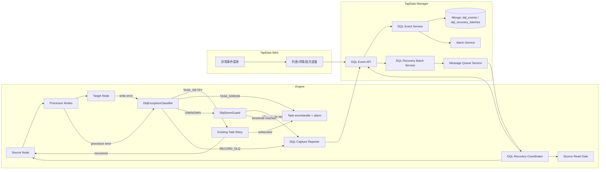
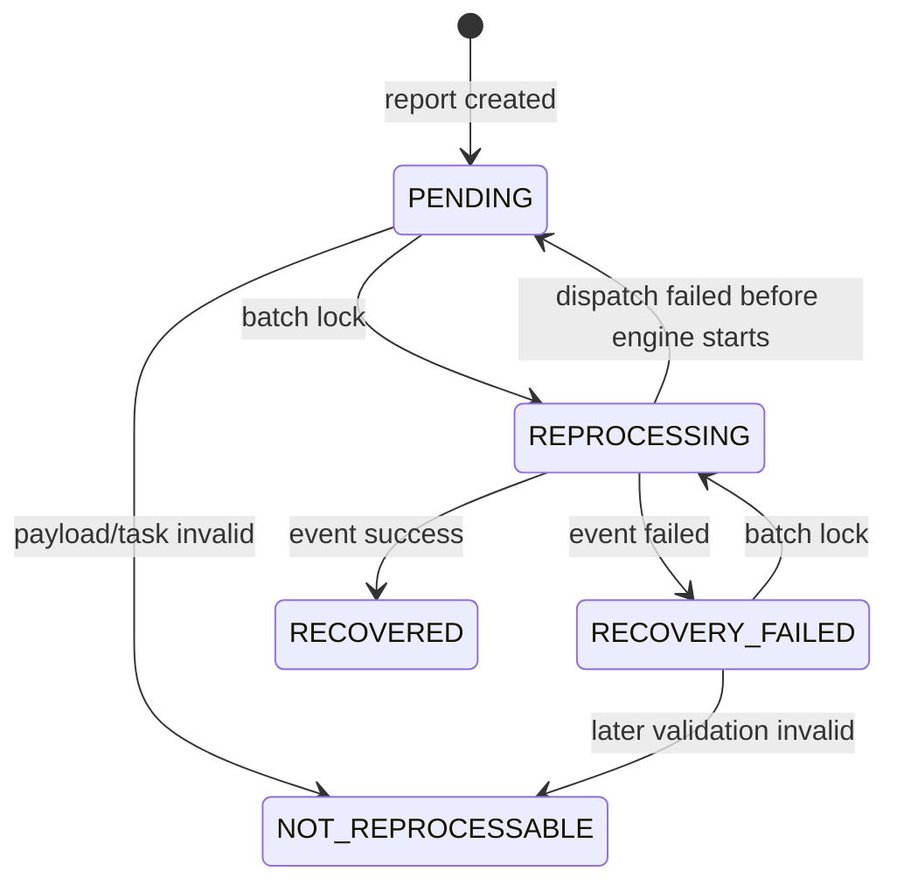

# TAP-12615 TapData 异常事件（DLQ）与受控重处理 POC 详细设计

## 1. 文档目标

- Jira：TAP-12615
- 主题：TapData 异常事件（DLQ）与受控重处理 POC
- 编写日期：2026-08-25
- 更新日期：2026-08-26
- 文档类型：详细设计
- 基础文档：`doc/TAP-12615-DLQ-controlled-reprocessing-design.md`

本文在功能设计基础上进一步细化 TM、Engine、Web、告警、权限、数据模型、状态流转、并发控制和失败补偿方案，使研发可以直接拆分任务并落地 POC。

本文不包含 Xray 测试用例、自动化脚本或开发排期。

## 2. 需求边界

### 2.1 必须交付

| 编号 | 需求 | 详细设计覆盖 |
| --- | --- | --- |
| R1 | 格式错误、Poison Record、转换失败记录可进入 DLQ | Engine 增加目标写入捕获和处理节点捕获两条链路 |
| R2 | 开启 DLQ 后同一任务内分层生效 | `DlqExceptionClassifier` 先判断 `TASK_RETRY`、`RECORD_DLQ`、`TASK_ERROR`，再决定任务重试或 DLQ 入库 |
| R3 | 结构化保存到 MongoDB `dql_events` | 新增 `dql_events` 集合、实体、索引和上报 API；集合只保存记录级 DLQ 事件 |
| R4 | 独立“异常事件”菜单 | Web 新增路由、菜单、API 封装和列表/详情页面 |
| R5 | 按任务、表、关键字、I/U/D 等查询 | TM 查询 API 提供分页、过滤和任务权限过滤 |
| R6 | 支持单条和批量回放 | TM 批次服务 + Engine `dqlRecovery` 消息处理 |
| R7 | 批量按 `event_time` 保证顺序 | TM 固化 `event_time`、`capture_seq`、`event_id` 排序 |
| R8 | 事件从源节点重新注入 | 运行中任务使用源节点队列注入；暂停任务使用 recovery-only runner 从源边界注入 |
| R9 | 恢复不生成新异常主记录 | 重处理只更新原 `dql_events`，并追加 attempts |
| R10 | 维护 `status`、`recovery_count`、`last_recovery_time` | `dql_events` 主记录包含状态和恢复摘要字段 |
| R11 | 可见即可操作 | 新增菜单权限；POC 中菜单可见即可发起操作，同时后端做任务数据范围过滤 |
| R12 | `error_details` 截断 | TM 统一执行错误详情截断和敏感字段脱敏 |
| R13 | 建立 `task_id + event_time` 索引 | Mongo 字段按 Jira 口径使用 `task_id`、`event_time` |
| R14 | DLQ 告警和重处理失败告警 | 新增告警 key、模板和触发点；共享异常复用现有任务告警 |
| R15 | 证明无重复、顺序、无丢失 | 提供受限适用范围和 POC 证据采集口径 |
| R16 | 网络抖动、数据库临时不可用等共享异常走任务级重试 | 复用 `TaskRetryService`，DLQ 开启时不禁用现有重试 |
| R17 | 任务级重试耗尽后任务错误并告警，不批量写 DLQ | 分类器返回 `TASK_RETRY` 或 `TASK_ERROR` 时不调用 DLQ 上报 |
| R18 | 未知异常需要批量保护，避免 DLQ 风暴 | 新增 `DlqStormGuard`，按任务、节点、表、错误码、时间窗口限流 |
| R19 | 页面和日志区分“记录已隔离”和“任务共享异常重试/停止” | DLQ 页面展示记录级事件；共享异常通过任务状态、告警和说明文案表达 |
| R20 | 同记录异常后若后续成功写入，需要提示重放覆盖风险 | `record_identity` 记录业务键，Engine 成功写入回调标记前序事件 `overwrite_risk=true` |

### 2.2 不做内容

- 不改 TapData 现有任务级重试策略、重试间隔、最大重试时间和重试耗尽后的任务失败语义。
- 不做“记录级重试耗尽后自动进入 DLQ”链路。
- 不做“所有异常先进入记录级重试，再进入 DLQ”的统一链路。
- 不把网络、连接、数据库临时不可用等共享故障期间的积压数据批量转换为 DLQ 记录。
- 不对未知异常默认无限逐条写入 DLQ；未知异常必须受批量保护约束。
- 不支持在线编辑或下载异常 Payload。
- 不支持跨任务批量重处理；同一任务内批量允许跨表。
- 不支持客户直接修改 `dql_events` 集合。
- 不做同一业务键后续事件自动阻塞等待。
- 不对无主键、无唯一键、无幂等能力的任意拓扑承诺无重复。
- 不在 POC 中实现生产级保留策略、容量配额和归档。
- 不设置吞吐或延迟验收阈值；POC 只做功能和结果定性证明。

## 3. 代码现状依据

### 3.1 Engine

| 文件 | 现状 | 设计使用方式 |
| --- | --- | --- |
| `iengine/modules/skip-error-event-module/.../SkipErrorEventAspectTask.java` | `SkipData` 模式下目标写入失败后拆成单条，单条失败可跳过并写日志 | 作为目标写入异常进入 DLQ 的主捕获点，但必须前置异常分类和风暴保护 |
| `iengine/iengine-app/.../TaskRetryService.java` | 已实现任务级重试窗口、重试间隔和重试耗尽判断 | 共享临时异常继续复用该能力，不因 DLQ 开启而旁路 |
| `iengine/api/.../SkipErrorDataAspect.java` | 暴露 `TapTable`、`TapRecordEvent` 列表、`PDKMethodInvoker`、写入函数 | 扩展上报所需上下文 |
| `iengine/iengine-app/.../HazelcastTargetPdkDataNode.java` | 执行 `SkipErrorDataAspect`；已处理 `TapdataRecoveryEvent` 完成回调 | 新增 DLQ recovery event 的目标完成回调 |
| `iengine/iengine-app/.../HazelcastProcessorBaseNode.java` | 处理节点异常进入 `errorHandle(...)` | 新增处理节点记录级异常捕获切面 |
| `iengine/iengine-app/.../HazelcastJavaScriptProcessorNode.java` | JS 执行失败包装为 `TapCodeException` | 转换失败归类为 `TRANSFORM_ERROR` |
| `iengine/api/.../AutoRecovery.java` | 为 Inspect 修复提供任务级 enqueue consumer | 复用设计思想，不直接复用事件模型 |
| `iengine/iengine-common/.../TapdataRecoveryEvent.java` | Inspect 修复事件，主要支持 Insert/Delete | 不直接用于 DLQ，新增 `TapdataDqlRecoveryEvent` |
| `iengine/iengine-common/.../TapdataCountDownLatchEvent.java` | 可作为队列屏障，目标节点会 count down | 用于暂停后排空队列和逐条回放顺序屏障 |
| `iengine/iengine-app/.../DataSyncEventHandler.java` | `dataSync` 仅处理 start/stop/reset/delete | 新增独立 `dqlRecovery` handler |

### 3.2 TM

| 文件 | 现状 | 设计使用方式 |
| --- | --- | --- |
| `manager/tm/.../TaskSkipErrorTableController.java` | 表级跳过查询、上报、恢复接口，含任务权限校验 | 作为 DLQ Controller 风格参考 |
| `manager/tm/.../TaskSkipErrorTableRepository.java` | 手动初始化 Mongo 集合和索引 | 作为 `dql_events` 索引初始化参考 |
| `manager/tm-api/.../DataPermissionMenuEnums.java` | 菜单和任务类型权限映射 | 新增异常事件菜单权限 |
| `manager/tm-api/.../DataPermissionActionEnums.java` | 权限动作：View/Edit/Start/Stop 等 | POC 菜单可见即可操作，后端仍过滤任务数据范围 |
| `manager/tm-common/.../DataSyncMq.java` | 任务生命周期消息 DTO | 不复用 opType，避免污染 start/stop 语义 |
| `manager/tm/.../MessageQueueServiceImpl.java` | 支持通过 WebSocket 或队列表向 Agent 下发消息 | 下发 `dqlRecovery` 命令 |
| `manager/tm-common/.../AlarmKeyEnum.java` | 已有任务错误、重试等告警 key | 追加 DLQ 告警 key |
| `manager/tm/.../TaskSaveServiceImpl.java` | 告警 key 补齐逻辑要求追加到末尾 | 新增 key 时保持顺序兼容 |

### 3.3 Web

| 文件 | 现状 | 设计使用方式 |
| --- | --- | --- |
| `tapdata-web/apps/daas/src/router/menu.ts` | 菜单定义 | 新增异常事件菜单 |
| `tapdata-web/apps/daas/src/router/routes.ts` | 路由定义 | 新增 `/exception-events` 路由 |
| `tapdata-web/packages/api/src/core/task.ts` | 表级跳过 API 封装 | 新增 `dql-event.ts` API 封装 |
| `tapdata-web/packages/dag/.../SkipErrorTable.vue` | 表级跳过页签 | 复用列表、错误弹窗和恢复交互经验 |

## 4. 总体架构



### 4.1 关键设计决策

1. Mongo 持久化字段使用 Jira 确认的 `task_id`、`event_time` 等 snake_case 字段；Java DTO 和 VO 使用 camelCase，并通过 `@Field` 映射。
2. 目标写入异常复用 `SkipErrorDataAspect` 捕获，处理节点异常新增 `SkipErrorProcessAspect` 捕获。
3. 捕获到异常后必须先经过 `DlqExceptionClassifier`，只有 `RECORD_DLQ` 决策才允许上报 `dql_events`。
4. 共享临时异常复用现有 `TaskRetryService`，DLQ 开启不改变 `retry_interval_second`、`max_retry_time_minute` 和重试耗尽后的失败语义。
5. 未知异常进入 `DlqStormGuard`，在同一任务、节点、表、错误码和时间窗口内达到阈值后停止逐条 DLQ，转任务错误或任务级重试。
6. Engine 上报使用 TM 内部 API，保持告警、去重、截断和状态规则在 TM 收敛。
7. 重处理消息使用独立 `dqlRecovery` WebSocket handler，不扩展 `DataSyncMq.OP_TYPE_*`。
8. 运行中任务不调用 `TaskService.pause(...)`；改用 Engine 内部 source read gate 暂停正常读取。
9. 暂停任务如果 TaskClient 已释放，使用 recovery-only runner 从源节点边界注入事件，完成后不改变任务业务状态。
10. 批量回放按单事件串行 + 队列屏障执行，优先满足 POC 的顺序可证明性。
11. 每条 DQL 事件保存 `record_identity`，Engine 按主键、唯一索引、全字段 hash 的优先级生成；后续同记录成功写入只标记覆盖风险，不自动阻止用户重放。

## 5. 领域模型

### 5.1 状态枚举

`DqlEventStatus`：

| 枚举 | 页面文案 | 含义 | 是否可重处理 |
| --- | --- | --- | --- |
| `PENDING` | 待处理 | 首次进入 DLQ，尚未恢复 | 是 |
| `REPROCESSING` | 重处理中 | 已被某个批次锁定 | 否 |
| `RECOVERED` | 已恢复 | 最近一次重处理成功 | 默认否 |
| `RECOVERY_FAILED` | 重处理失败 | 最近一次重处理失败 | 是 |
| `NOT_REPROCESSABLE` | 不可重处理 | Payload 不完整、任务不存在、拓扑不支持等 | 否 |

`DqlRecoveryBatchStatus`：

| 枚举 | 含义 |
| --- | --- |
| `CREATED` | TM 已创建批次 |
| `DISPATCHED` | 已下发给 Agent |
| `RUNNING` | Engine 已开始处理 |
| `SUCCESS` | 全部成功 |
| `PARTIAL_FAILED` | 部分成功、部分失败或未执行 |
| `FAILED` | 批次级失败，未产生成功事件 |
| `CANCELED` | 发起后未下发或人工取消 |

`DqlRecoveryAttemptResult`：

| 枚举 | 含义 |
| --- | --- |
| `SUCCESS` | 单事件回放成功 |
| `FAILED` | 单事件回放失败 |
| `SKIPPED` | 批次中未执行 |
| `TIMEOUT` | 等待屏障或完成回调超时 |

`DqlErrorType`：

| 枚举 | 适用场景 |
| --- | --- |
| `MALFORMED_RECORD` | 记录字段格式、类型转换、日期格式、非空等记录局部问题 |
| `POISON_RECORD` | 当前任务规则下必然失败，但修复规则后可恢复的业务记录 |
| `TRANSFORM_ERROR` | JS 或自定义处理节点对单条 DML 处理失败 |
| `TARGET_CONSTRAINT_ERROR` | 目标端唯一键、非空、长度、类型等单条记录约束错误 |
| `UNKNOWN_RECORD_ERROR` | 可定位到单条记录、未触发批量保护、但无法更细分类的记录级异常 |

`DqlExceptionScope`：

| 枚举 | 含义 |
| --- | --- |
| `RECORD` | 异常可归因到单条 `TapRecordEvent`，允许进入 DLQ |
| `TASK_SHARED` | 网络、连接、数据库临时不可用等影响一批或整个任务的共享异常 |
| `SYSTEM` | TM、资源、线程中断、进程关闭、任务配置等系统或任务级异常 |
| `UNKNOWN` | 尚不能确定影响范围，需要进入批量保护判断 |

`DqlRouteDecision`：

| 枚举 | 含义 |
| --- | --- |
| `RECORD_DLQ` | 写入 `dql_events`，DLQ 保存成功后返回 skip |
| `TASK_RETRY` | 抛回现有任务错误处理，由 `TaskRetryService` 判断是否继续重试 |
| `TASK_ERROR` | 不进入 DLQ，任务进入错误状态并触发现有告警 |

### 5.2 状态机



状态更新必须使用条件更新，不能无条件覆盖：

- 进入 `REPROCESSING`：当前状态必须是 `PENDING` 或 `RECOVERY_FAILED`，且 `current_batch_id` 为空。
- 进入 `RECOVERED`：当前状态必须是 `REPROCESSING`，且 `current_batch_id` 等于当前批次。
- 进入 `RECOVERY_FAILED`：当前状态必须是 `REPROCESSING`，且 `current_batch_id` 等于当前批次。
- 重新发起重处理：`RECOVERY_FAILED` 可再次进入 `REPROCESSING`，`RECOVERED` 默认不可进入。

## 6. Mongo 数据模型

### 6.1 `dql_events`

Java 实体建议：

```java
@Document("dql_events")
public class DqlEventEntity extends Entity {
  @Field("event_id")
  private String eventId;
  @Field("task_id")
  private String taskId;
  @Field("task_record_id")
  private String taskRecordId;
  @Field("task_name")
  private String taskName;
  @Field("task_version")
  private Long taskVersion;
  @Field("agent_id")
  private String agentId;
  @Field("source_node_id")
  private String sourceNodeId;
  @Field("source_node_name")
  private String sourceNodeName;
  @Field("failed_node_id")
  private String failedNodeId;
  @Field("failed_node_name")
  private String failedNodeName;
  @Field("failed_stage")
  private String failedStage;
  @Field("source_table")
  private String sourceTable;
  @Field("target_table")
  private String targetTable;
  @Field("table_id")
  private String tableId;
  @Field("dml_type")
  private String dmlType;
  @Field("event_time")
  private Date eventTime;
  @Field("capture_seq")
  private Long captureSeq;
  @Field("failed_at")
  private Date failedAt;
  @Field("event_key")
  private Map<String, Object> eventKey;
  @Field("event_key_missing")
  private Boolean eventKeyMissing;
  @Field("event_identity")
  private String eventIdentity;
  @Field("record_identity")
  private String recordIdentity;
  @Field("record_identity_type")
  private String recordIdentityType;
  @Field("record_identity_fields")
  private List<String> recordIdentityFields;
  @Field("payload_format")
  private String payloadFormat;
  @Field("payload_data")
  private Object payloadData;
  @Field("payload_hash")
  private String payloadHash;
  @Field("payload_size")
  private Long payloadSize;
  @Field("payload_complete")
  private Boolean payloadComplete;
  @Field("payload_preview")
  private Map<String, Object> payloadPreview;
  @Field("payload_preview_truncated")
  private Boolean payloadPreviewTruncated;
  @Field("error_type")
  private String errorType;
  @Field("error_code")
  private String errorCode;
  @Field("exception_scope")
  private String exceptionScope;
  @Field("route_decision")
  private String routeDecision;
  @Field("classification_reason")
  private String classificationReason;
  @Field("classification_confidence")
  private String classificationConfidence;
  @Field("error_details")
  private String errorDetails;
  @Field("error_details_truncated")
  private Boolean errorDetailsTruncated;
  @Field("raw_error_ref")
  private String rawErrorRef;
  private String status;
  @Field("recovery_count")
  private Integer recoveryCount;
  @Field("last_recovery_time")
  private Date lastRecoveryTime;
  @Field("last_recovery_user_id")
  private String lastRecoveryUserId;
  @Field("last_recovery_user_name")
  private String lastRecoveryUserName;
  @Field("last_recovery_result")
  private String lastRecoveryResult;
  @Field("current_batch_id")
  private String currentBatchId;
  @Field("overwrite_risk")
  private Boolean overwriteRisk;
  @Field("overwrite_risk_message")
  private String overwriteRiskMessage;
  @Field("later_success_at")
  private Date laterSuccessAt;
  @Field("later_success_event_time")
  private Date laterSuccessEventTime;
  @Field("later_success_capture_seq")
  private Long laterSuccessCaptureSeq;
  @Field("later_success_dml_type")
  private String laterSuccessDmlType;
  @Field("recovery_attempts")
  private List<DqlRecoveryAttempt> recoveryAttempts;
  private Date created;
  private Date updated;
}
```

字段说明：

| 字段 | 是否必填 | 说明 |
| --- | --- | --- |
| `event_id` | 是 | 对外展示 ID。格式建议 `DQL-{taskShortId}-{captureSeq}` |
| `task_id` | 是 | 任务 ID，字符串 ObjectId |
| `task_record_id` | 是 | 捕获时任务运行记录 ID |
| `task_name` | 是 | 捕获时任务名，用于列表展示 |
| `task_version` | 是 | 捕获时任务版本；重处理时用当前发布版本，不使用旧版本执行 |
| `agent_id` | 是 | 捕获事件的 Agent |
| `source_node_id` | 是 | 源节点 ID |
| `failed_node_id` | 是 | 发生异常的节点 ID |
| `failed_stage` | 是 | `PROCESSOR`、`TARGET_WRITE` 等 |
| `source_table` | 是 | 源表名或源表 ID |
| `target_table` | 否 | 目标表名，处理节点失败时可能为空 |
| `table_id` | 是 | `TapRecordEvent.tableId` |
| `dml_type` | 是 | `I`、`U`、`D` |
| `event_time` | 是 | 排序用事件时间 |
| `capture_seq` | 是 | TM 分配的任务内递增序号 |
| `event_key` | 否 | 主键/唯一键摘要，不能包含全量敏感字段 |
| `event_key_missing` | 是 | 是否无法抽取主键 |
| `event_identity` | 是 | 去重身份 |
| `record_identity` | 是 | 同一业务记录身份；Engine 按主键、唯一索引、全字段 hash 优先级生成 |
| `record_identity_type` | 是 | `PRIMARY_KEY`、`UNIQUE_INDEX`、`FULL_FIELD_HASH`、`UNKNOWN` |
| `record_identity_fields` | 否 | 参与生成同一记录身份的字段名；全字段 hash 时可为空 |
| `payload_data` | 是 | 原始 TapRecordEvent 快照 |
| `payload_complete` | 是 | 是否具备重处理所需完整 Payload |
| `payload_preview` | 是 | 页面展示用脱敏预览 |
| `error_details` | 是 | 截断、脱敏后的错误详情 |
| `exception_scope` | 是 | 进入 `dql_events` 的主记录固定为 `RECORD`，用于审计分类结果 |
| `route_decision` | 是 | 进入 `dql_events` 的主记录固定为 `RECORD_DLQ` |
| `classification_reason` | 是 | 分类命中的错误码、节点类型、异常链或保护规则摘要 |
| `classification_confidence` | 是 | `EXACT`、`RULE`、`UNKNOWN_SINGLE` 等，用于识别误分类风险 |
| `status` | 是 | 事件状态 |
| `overwrite_risk` | 否 | 异常后同记录是否存在后续成功写入 |
| `overwrite_risk_message` | 否 | 前端提示文案，提醒继续重放可能覆盖后续成功数据 |
| `later_success_at` | 否 | 后续成功写入上报到 TM 的时间 |
| `later_success_event_time` | 否 | 后续成功事件自身的事件时间 |
| `later_success_capture_seq` | 否 | 后续成功事件在任务内的捕获序号 |
| `later_success_dml_type` | 否 | 后续成功事件 DML 类型 |
| `recovery_attempts` | 否 | 人工重处理历史，追加写 |

### 6.2 Payload 格式

`payload_format` 固定为 `tap-record-event-json-v1`。

`payload_data` 保存内容：

```json
{
  "tapEventClass": "io.tapdata.entity.event.dml.TapUpdateRecordEvent",
  "type": 302,
  "tableId": "orders",
  "time": 1787580000000,
  "referenceTime": 1787580000000,
  "before": { "id": 1, "status": "new" },
  "after": { "id": 1, "status": "paid" },
  "info": {
    "syncStage": "CDC",
    "sourceOffset": "..."
  },
  "exactlyOnceId": "optional"
}
```

保存规则：

- Insert 保存 `after`。
- Update 保存 `before` 和 `after`。
- Delete 保存 `before`。
- `info` 中保留恢复所需上下文，但对页面返回时只返回安全字段。
- 原始 Payload 超过 `dql.event.payload.maxBytes` 时，主记录仍保存摘要并标记 `payload_complete=false`，状态置为 `NOT_REPROCESSABLE`，同时告警；该事件可查询但不可重处理。
- POC 默认 `dql.event.payload.maxBytes=1048576`，可通过系统设置调整。

### 6.3 Payload Preview

`payload_preview` 只用于页面展示：

```json
{
  "key": { "id": 1 },
  "before": { "status": "new" },
  "after": { "status": "paid" },
  "truncatedFields": ["remark"],
  "maskedFields": ["password", "token"]
}
```

脱敏规则：

- 字段名命中 `password`、`passwd`、`secret`、`token`、`access_token`、`authorization`、`credential`、`apikey` 时显示为 `******`。
- 单字段字符串超过 `dql.event.preview.fieldMaxLength` 时截断。
- Map/List 超过 `dql.event.preview.maxDepth` 或 `dql.event.preview.maxItems` 时截断。
- `error_details` 截断长度使用 `dql.event.errorDetails.maxLength`。

### 6.4 `recovery_attempts`

保存在 `dql_events.recovery_attempts` 中，追加写，不覆盖历史。

```java
public class DqlRecoveryAttempt {
  @Field("attempt_id")
  private String attemptId;
  @Field("batch_id")
  private String batchId;
  @Field("operator_id")
  private String operatorId;
  @Field("operator_name")
  private String operatorName;
  @Field("task_version")
  private Long taskVersion;
  @Field("started_at")
  private Date startedAt;
  @Field("finished_at")
  private Date finishedAt;
  private String result;
  private String message;
  @Field("error_code")
  private String errorCode;
  @Field("error_details")
  private String errorDetails;
}
```

POC 阶段同一事件最多展示最近 20 条 attempts；数据库可以完整保留。生产化后如担心单文档增长，可迁移为独立 `dql_recovery_attempts` 集合，但本期不拆分，保证“恢复操作不生成新的异常主记录”语义直观。

### 6.5 `dql_recovery_batches`

Java 实体建议：

```java
@Document("dql_recovery_batches")
public class DqlRecoveryBatchEntity extends Entity {
  @Field("batch_id")
  private String batchId;
  @Field("task_id")
  private String taskId;
  @Field("task_name")
  private String taskName;
  @Field("task_status_before")
  private String taskStatusBefore;
  @Field("task_version")
  private Long taskVersion;
  @Field("agent_id")
  private String agentId;
  @Field("event_ids")
  private List<String> eventIds;
  @Field("ordered_event_ids")
  private List<String> orderedEventIds;
  @Field("operator_id")
  private String operatorId;
  @Field("operator_name")
  private String operatorName;
  private String status;
  @Field("selected_count")
  private Integer selectedCount;
  @Field("success_count")
  private Integer successCount;
  @Field("failed_count")
  private Integer failedCount;
  @Field("skipped_count")
  private Integer skippedCount;
  @Field("started_at")
  private Date startedAt;
  @Field("finished_at")
  private Date finishedAt;
  private String message;
  private Date created;
  private Date updated;
}
```

### 6.6 索引

索引由 `DqlEventRepository.init()` 创建，风格参考 `TaskSkipErrorTableRepository.init()`。

```javascript
db.dql_events.createIndex(
  { task_id: 1, event_time: 1, capture_seq: 1, event_id: 1 },
  { name: "idx_task_event_time" }
)

db.dql_events.createIndex(
  { task_id: 1, status: 1, failed_at: -1 },
  { name: "idx_task_status_failed_at" }
)

db.dql_events.createIndex(
  { status: 1, failed_at: -1 },
  { name: "idx_status_failed_at" }
)

db.dql_events.createIndex(
  { task_id: 1, source_table: 1, failed_at: -1 },
  { name: "idx_task_source_table_failed_at" }
)

db.dql_events.createIndex(
  { event_id: 1 },
  { name: "uk_event_id", unique: true }
)

db.dql_events.createIndex(
  { task_id: 1, task_record_id: 1, table_id: 1, record_identity: 1, event_time: -1, capture_seq: -1 },
  { name: "idx_task_record_identity_event_time" }
)

db.dql_events.createIndex(
  { task_id: 1, task_record_id: 1, table_id: 1, event_identity: 1, failed_node_id: 1 },
  {
    name: "uk_task_event_identity",
    unique: true,
    partialFilterExpression: { event_identity: { $exists: true, $ne: "" } }
  }
)

db.dql_recovery_batches.createIndex(
  { batch_id: 1 },
  { name: "uk_batch_id", unique: true }
)

db.dql_recovery_batches.createIndex(
  { task_id: 1, created: -1 },
  { name: "idx_task_created" }
)

db.dql_recovery_batches.createIndex(
  { status: 1, created: -1 },
  { name: "idx_status_created" }
)
```

## 7. TM 后端详细设计

### 7.1 包结构

```text
manager/tm-common/src/main/java/com/tapdata/tm/dql/
  DqlEventStatusEnum.java
  DqlRecoveryBatchStatusEnum.java
  DqlRecoveryAttemptResultEnum.java
  DqlRecordIdentityTypeEnum.java
  DqlErrorTypeEnum.java
  DqlExceptionScopeEnum.java
  DqlRouteDecisionEnum.java
  dto/
    DqlEventDto.java
    DqlRecoveryBatchDto.java
    DqlRecoveryAttemptDto.java
  vo/
    DqlEventReportVo.java
    DqlEventQueryVo.java
    DqlEventDetailVo.java
    DqlRecoveryPreviewVo.java
    DqlRecoveryRequestVo.java
    DqlRecoveryResultReportVo.java
    DqlRecordSuccessReportVo.java
    DqlRecordSuccessReportResultVo.java
    DqlEventSummaryVo.java

manager/tm/src/main/java/com/tapdata/tm/dql/
  entity/
    DqlEventEntity.java
    DqlRecoveryBatchEntity.java
  repository/
    DqlEventRepository.java
    DqlRecoveryBatchRepository.java
  service/
    DqlEventService.java
    DqlRecoveryBatchService.java
    DqlEventAlarmService.java
    DqlEventPermissionService.java
    DqlReportValidationService.java
  controller/
    DqlEventController.java
```

### 7.2 Service 职责

`DqlEventService`：

- `report(DqlEventReportVo vo)`：Engine 上报异常事件，只接受 `exceptionScope=RECORD` 且 `routeDecision=RECORD_DLQ` 的记录级事件。
- `reportRecordSuccess(String taskId, DqlRecordSuccessReportVo vo)`：Engine 上报同记录后续成功写入，标记前序未完成 DQL 事件的覆盖风险。
- `page(DqlEventQueryVo query, UserDetail user)`：分页查询。
- `detail(String eventId, UserDetail user)`：详情查询。
- `summary(DqlEventQueryVo query, UserDetail user)`：统计。
- `markNotReprocessable(...)`：标记不可重处理。
- `appendAttempt(...)`：追加 attempts。
- `completeEvent(...)`：单事件成功。
- `failEvent(...)`：单事件失败。
- `releaseBatchLocks(...)`：下发失败时释放锁。

`DqlRecoveryBatchService`：

- `preview(List<String> eventIds, UserDetail user)`：校验并返回排序结果。
- `start(List<String> eventIds, UserDetail user)`：创建批次、锁定事件、下发命令。
- `handleEngineBatchStarted(...)`：Engine 接受后更新批次。
- `handleEngineEventResult(...)`：处理逐事件结果。
- `handleEngineBatchFinished(...)`：收尾汇总。
- `failBatchBeforeStart(...)`：下发或前置校验失败时回滚。

`DqlEventAlarmService`：

- `notifyEventCreated(DqlEventDto event)`。
- `notifySaveFailed(...)`。
- `notifyRecoveryFailed(DqlRecoveryBatchDto batch)`。
- `notifyBatchPartialFailed(DqlRecoveryBatchDto batch)`。
- `notifyStormGuardTriggered(...)`：未知异常保护触发时告警，或把该信息并入现有任务错误告警。

`DqlEventPermissionService`：

- 检查异常事件菜单权限。
- 查询时按任务数据权限过滤。
- 操作时检查任务可见范围和菜单可见状态。

### 7.3 Engine 上报 API

```http
POST /api/task/{taskId}/dql-events/report
```

接口性质：Engine 内部回调接口。路径放在 `/api/task/{taskId}` 下，便于复用已有 Engine -> TM 回调风格。

请求体：

```json
{
  "taskRecordId": "64f...",
  "taskName": "sync_order",
  "taskVersion": 7,
  "agentId": "agent-1",
  "sourceNodeId": "source-node",
  "sourceNodeName": "mysql_src",
  "failedNodeId": "js-node",
  "failedNodeName": "JS Processor",
  "failedStage": "PROCESSOR",
  "sourceTable": "orders",
  "targetTable": "orders_sink",
  "tableId": "orders",
  "dmlType": "U",
  "eventTime": 1787580000000,
  "eventKey": { "id": 1001 },
  "eventIdentity": "sha256:...",
  "recordIdentity": "key:orders:id=1001",
  "recordIdentityType": "PRIMARY_KEY",
  "recordIdentityFields": ["id"],
  "payloadFormat": "tap-record-event-json-v1",
  "payloadData": {},
  "payloadHash": "sha256:...",
  "payloadSize": 2048,
  "payloadComplete": true,
  "payloadPreview": {},
  "errorType": "TRANSFORM_ERROR",
  "errorCode": "JS_PROCESS_FAILED",
  "exceptionScope": "RECORD",
  "routeDecision": "RECORD_DLQ",
  "classificationReason": "JS process failed on single TapRecordEvent",
  "classificationConfidence": "RULE",
  "errorDetails": "..."
}
```

响应：

```json
{
  "eventId": "DQL-12615-000001",
  "status": "PENDING",
  "duplicate": false
}
```

处理规则：

1. 校验 `taskId` 合法，任务存在。
2. 对 `errorDetails` 和 `payloadPreview` 执行 TM 侧二次截断和脱敏。
3. 标准化并校验路由元数据：`exceptionScope` 为空时保存为 `RECORD`，`routeDecision` 为空时保存为 `RECORD_DLQ`；若 Engine 显式上报其他值，TM 返回错误，Engine 不允许 skip。
4. 若 `captureSeq` 为空，由 TM 原子分配。
5. 若 `recordIdentity` 为空，由 TM 根据 `eventKey` 或 `payloadHash` 兜底生成；准确性以 Engine 按主键、唯一索引、全字段 hash 生成的显式值为准。
6. 若 `eventIdentity` 为空，由 TM 根据 Payload 和 `recordIdentity` 生成。
7. 按唯一索引 upsert。
8. 新增主记录时触发 DLQ 告警；重复上报时只返回已有事件，不重复告警。
9. 保存失败向 Engine 返回错误，Engine 不允许 skip。

### 7.3.1 Engine 后续成功写入回调 API

```http
POST /api/task/{taskId}/dql-events/record-success/report
```

接口性质：Engine 内部回调接口。仅用于在普通任务流后续成功写入同一业务记录时，标记已有 DQL 事件的重放覆盖风险。

请求体：

```json
{
  "taskRecordId": "64f...",
  "sourceTable": "orders",
  "targetTable": "orders_sink",
  "tableId": "orders",
  "eventKey": { "id": 1001 },
  "recordIdentity": "key:orders:id=1001",
  "recordIdentityType": "PRIMARY_KEY",
  "recordIdentityFields": ["id"],
  "dmlType": "U",
  "eventTime": 1787580100000,
  "captureSeq": 12,
  "payloadHash": "sha256:...",
  "successAt": 1787580102300
}
```

响应：

```json
{
  "marked": true,
  "eventId": "DQL-12615-000001",
  "recordIdentity": "key:orders:id=1001",
  "overwriteRiskMessage": "该事件异常后，同记录后续存在成功执行的事件，继续重放存在数据覆盖风险，请谨慎操作"
}
```

处理规则：

1. 校验 `taskId` 和请求体。
2. 如果 `recordIdentity` 为空，按 `eventKey` 或 `payloadHash` 兜底生成。
3. 查询同 `task_id`、同 `record_identity`、同 `task_record_id` 和 `table_id` 的未完成事件，状态范围为 `PENDING`、`REPROCESSING`、`RECOVERY_FAILED`。
4. 如果上报包含 `eventTime`，只标记 `event_time <= laterSuccessEventTime` 的前序异常事件。
5. 按 `event_time DESC, capture_seq DESC, failed_at DESC` 选择最新一条并原子设置 `overwrite_risk=true` 及后续成功摘要字段。
6. 未匹配到事件时返回 `marked=false`；不创建新主记录，不改变状态。

### 7.4 查询 API

```http
GET /api/dql-events
```

查询参数：

| 参数 | 类型 | 说明 |
| --- | --- | --- |
| `taskId` | String | 任务 ID |
| `taskName` | String | 任务名模糊匹配 |
| `sourceTable` | String | 源表模糊匹配 |
| `targetTable` | String | 目标表模糊匹配 |
| `keyword` | String | 事件 ID、错误码、安全错误摘要、预览字段 |
| `dmlType` | String | `I`、`U`、`D` |
| `errorType` | String | 错误类型 |
| `status` | String | 状态 |
| `startTime` | Long | 失败时间起点 |
| `endTime` | Long | 失败时间终点 |
| `skip` | Long | 分页 offset |
| `limit` | Int | 分页大小 |
| `order` | String | 排序 |

响应：

```json
{
  "total": 1,
  "items": [
    {
      "id": "66c...",
      "eventId": "DQL-12615-000001",
      "taskId": "64f...",
      "taskName": "sync_order",
      "sourceTable": "orders",
      "targetTable": "orders_sink",
      "dmlType": "U",
      "errorType": "TRANSFORM_ERROR",
      "errorCode": "JS_PROCESS_FAILED",
      "routeDecision": "RECORD_DLQ",
      "classificationReason": "JS process failed on single TapRecordEvent",
      "recordIdentity": "key:orders:id=1001",
      "recordIdentityType": "PRIMARY_KEY",
      "overwriteRisk": true,
      "overwriteRiskMessage": "该事件异常后，同记录后续存在成功执行的事件，继续重放存在数据覆盖风险，请谨慎操作",
      "eventTime": 1787580000000,
      "failedAt": 1787580010000,
      "status": "PENDING",
      "recoveryCount": 0,
      "lastRecoveryTime": null
    }
  ]
}
```

权限规则：

- 用户必须具备异常事件菜单可见权限。
- 未传 `taskId` 时，TM 只返回用户可见任务范围内的数据。
- 传 `taskId` 时，TM 校验用户对该任务可见。

### 7.5 详情 API

```http
GET /api/dql-events/{eventId}
```

响应包含：

- 基本字段。
- `payloadPreview`。
- `errorDetails`。
- `recoveryAttempts`。
- 当前批次摘要。
- 异常分类字段：`exceptionScope`、`routeDecision`、`classificationReason`、`classificationConfidence`。
- 记录身份字段：`recordIdentity`、`recordIdentityType`、`recordIdentityFields`。
- 覆盖风险字段：`overwriteRisk`、`overwriteRiskMessage`、`laterSuccessAt`、`laterSuccessEventTime`、`laterSuccessCaptureSeq`、`laterSuccessDmlType`。
- 不返回完整 `payloadData`。

完整 Payload 只给 Engine 回放使用，不暴露给 Web。

### 7.6 统计 API

```http
GET /api/dql-events/summary
```

响应：

```json
{
  "total": 42,
  "pending": 12,
  "reprocessing": 1,
  "recovered": 20,
  "recoveryFailed": 8,
  "notReprocessable": 1
}
```

统计使用同一套权限过滤和查询过滤。

### 7.7 重处理预览 API

```http
POST /api/dql-events/recovery/preview
```

请求：

```json
{
  "eventIds": ["DQL-12615-000001", "DQL-12615-000002"]
}
```

响应：

```json
{
  "taskId": "64f...",
  "taskName": "sync_order",
  "canSubmit": true,
  "orderedEvents": [
    {
      "eventId": "DQL-12615-000001",
      "eventTime": 1787580000000,
      "captureSeq": 1,
      "dmlType": "I",
      "sourceTable": "orders",
      "overwriteRisk": true,
      "overwriteRiskMessage": "该事件异常后，同记录后续存在成功执行的事件，继续重放存在数据覆盖风险，请谨慎操作",
      "laterSuccessAt": 1787580102300,
      "laterSuccessEventTime": 1787580100000,
      "laterSuccessCaptureSeq": 12,
      "laterSuccessDmlType": "U"
    }
  ],
  "blockedEvents": [],
  "message": ""
}
```

预览校验失败时，`canSubmit=false`，并返回每条事件的原因。校验必须确认任务处于 `running` 或可回放暂停态；任务 `stop`、未完成初始化、已有恢复批次运行中、任务不存在、任务版本不兼容时均拒绝。

### 7.8 发起重处理 API

```http
POST /api/dql-events/recovery
```

请求：

```json
{
  "eventIds": ["DQL-12615-000001", "DQL-12615-000002"],
  "confirm": true
}
```

响应：

```json
{
  "batchId": "DQLB-20260825-000001",
  "status": "DISPATCHED",
  "selectedCount": 2,
  "orderedEventIds": ["DQL-12615-000001", "DQL-12615-000002"]
}
```

发起流程：

1. 执行与 preview 相同的校验。
2. 创建 `dql_recovery_batches`，状态 `CREATED`。
3. 原子锁定事件为 `REPROCESSING`。
4. 更新批次为 `DISPATCHED`。
5. 通过 `MessageQueueService` 下发 `dqlRecovery` 消息。
6. 下发失败时释放事件锁，批次置 `FAILED`。

### 7.9 Engine 结果回调 API

```http
POST /api/task/{taskId}/dql-events/recovery/report
```

请求：

```json
{
  "batchId": "DQLB-20260825-000001",
  "eventId": "DQL-12615-000001",
  "attemptId": "A-000001",
  "type": "EVENT_RESULT",
  "result": "SUCCESS",
  "message": "Recovered",
  "errorCode": null,
  "errorDetails": null,
  "startedAt": 1787580100000,
  "finishedAt": 1787580102300
}
```

`type` 可选：

- `BATCH_STARTED`
- `EVENT_STARTED`
- `EVENT_RESULT`
- `BATCH_FINISHED`
- `BATCH_FAILED`

TM 处理时必须校验：

- 批次存在。
- 批次 `task_id` 与路径一致。
- 事件属于该批次。
- 事件 `current_batch_id` 等于当前批次。

## 8. Engine 捕获详细设计

### 8.1 捕获入口和分类前置

现有目标写入异常流程：

```text
HazelcastTargetPdkDataNode
  -> WriteRecordFuncAspect
  -> SkipErrorDataAspect
  -> SkipErrorEventAspectTask.skipErrorDataNoeAspectImpl
  -> batch write failed
  -> single write failed
  -> checkSkip(...)
  -> logSkipEvent(...)
  -> return skip
```

调整后必须把异常分类放到 DLQ 上报之前：

```text
write/process failed
  -> DlqExceptionClassifier.classify(error, stage, node, event, batchContext)
  -> if TASK_RETRY: throw original error to current task error path
  -> if TASK_ERROR: throw original or wrapped non-skippable error
  -> if UNKNOWN: DlqStormGuard.decide(...)
  -> if RECORD_DLQ: check skip limit and report DQL event
  -> report success: log skip event and return skip
  -> report failed: rollback metric and throw DqlEventReportException
```

批量写入失败时先做批量级分类：

- 命中连接不可用、网络抖动、目标库不可用、连接池耗尽、TM 不可用、线程中断、任务停止等共享异常时，不进入拆单 DLQ，直接抛回现有任务错误处理。
- 无法判断为共享异常，且异常可能由个别记录触发时，保留现有拆单逻辑。
- 拆单后的单条失败仍需再次分类；只有 `RECORD_DLQ` 才允许上报。

`checkSkip(...)` 逻辑调整：

```text
classification = classifier.classify(...)
if classification.routeDecision == TASK_RETRY:
  throw original error
if classification.routeDecision == TASK_ERROR:
  throw non-skippable error
if classification.scope == UNKNOWN:
  classification = stormGuard.decide(classification)
if classification.routeDecision != RECORD_DLQ:
  throw original or guarded error
if throwable is skippable and limit allows:
  report DQL event with classification fields
  if report success:
    log skip event
    return true
  rollback candidate metric
  throw DqlEventReportException
return false
```

注意：当前代码先 `skipCounts.addAndGet(1)`，新增上报失败或路由被保护时应回滚计数，避免显示已跳过但无 DLQ 主记录。

### 8.2 `DlqExceptionClassifier`

分类器输入：

| 输入 | 说明 |
| --- | --- |
| `Throwable error` | 原始异常链，优先识别 `TapCodeException` 和错误码 |
| `failedStage` | `SOURCE_READ`、`PROCESSOR`、`TARGET_WRITE`、`TM_CALLBACK` 等 |
| `nodeType` | 源、处理、目标、连接器、TM 回调等节点类型 |
| `TapRecordEvent event` | 单条事件；无法构造时不能进入可重处理 DLQ |
| `BatchContext` | 是否批量写失败、批次大小、已拆单数量、同类异常数量 |
| `TaskContext` | 任务类型、任务状态、是否启用 `SkipData`、重试配置快照 |

分类器输出：

| 字段 | 说明 |
| --- | --- |
| `exceptionScope` | `RECORD`、`TASK_SHARED`、`SYSTEM`、`UNKNOWN` |
| `routeDecision` | `RECORD_DLQ`、`TASK_RETRY`、`TASK_ERROR` |
| `errorType` | 写入 `dql_events.error_type` 的记录级错误类型 |
| `classificationReason` | 命中的规则摘要，用于日志和页面展示 |
| `classificationConfidence` | `EXACT`、`RULE`、`UNKNOWN_SINGLE` |

核心规则：

| 规则 | 输出 |
| --- | --- |
| 网络抖动、连接超时、连接拒绝、连接池耗尽、数据库临时不可用 | `TASK_SHARED` + `TASK_RETRY` |
| 目标库持续不可用、重试耗尽后的同类共享故障 | `TASK_SHARED` + `TASK_ERROR` |
| TM 不可用、Engine 线程中断、OOM、任务被停止、进程关闭 | `SYSTEM` + `TASK_ERROR` |
| 账号密码错误、权限不足、目标表不存在、任务配置非法、脚本初始化失败 | `SYSTEM` + `TASK_ERROR` |
| 可定位到单条 DML 的字段类型、长度、非空、唯一约束、格式校验失败 | `RECORD` + `RECORD_DLQ` |
| JS 或自定义处理节点对单条 DML 执行失败，且不是外部依赖或资源不足导致 | `RECORD` + `RECORD_DLQ` |
| 源连接器解析阶段无法构造 `TapRecordEvent` | `SYSTEM` 或 `TASK_SHARED` + `TASK_ERROR/TASK_RETRY` |
| 能定位单条事件但错误码未归类 | `UNKNOWN`，交给 `DlqStormGuard` |

分类器必须保持保守：无法证明是记录级确定性异常时，不应直接进入 DLQ。

### 8.3 `DlqStormGuard`

`DlqStormGuard` 用于防止未知异常形成 DLQ 风暴。建议按以下维度建立内存窗口，必要时同步到任务 attrs 或 TM 侧轻量状态：

```text
guardKey = taskId + failedNodeId + tableId + errorCode + normalizedErrorMessage
window = dql.unknown.guard.windowSeconds
threshold = dql.unknown.guard.maxEvents
```

处理规则：

1. `exceptionScope != UNKNOWN` 时不进入保护器。
2. 未知异常能够定位单条记录，且同一窗口内计数未超过阈值，可作为 `UNKNOWN_RECORD_ERROR` 写入 DLQ，`classificationConfidence=UNKNOWN_SINGLE`。
3. 计数超过阈值或同一批次未知异常比例超过阈值时，保护器返回 `TASK_RETRY` 或 `TASK_ERROR`，Engine 停止继续写入 DLQ。
4. 保护触发后记录任务日志，并触发任务告警或专用保护告警，告警中展示保护维度、窗口、阈值和被抑制的估算记录数。
5. 窗口过期后允许重新评估，避免一次误判永久阻断。

POC 默认建议：

| 配置 | 默认值 | 说明 |
| --- | --- | --- |
| `dql.unknown.guard.windowSeconds` | `60` | 未知异常统计窗口 |
| `dql.unknown.guard.maxEvents` | `20` | 单窗口最多允许进入 DLQ 的未知事件数 |
| `dql.unknown.guard.maxBatchRatio` | `0.2` | 同批未知异常占比超过该值时触发保护 |
| `dql.unknown.guard.decision` | `TASK_RETRY` | 保护触发后的默认路由 |

### 8.4 处理节点异常捕获

为覆盖 JS 转换失败，新增 `SkipErrorProcessAspect`：

```java
public class SkipErrorProcessAspect extends ProcessorFunctionAspect<SkipErrorProcessAspect> {
  private TapdataEvent inputEvent;
  private Throwable error;
  private ProcessorBaseContext processorBaseContext;
}
```

在 `HazelcastProcessorBaseNode.tryProcess(...)` catch 分支中接入：

```text
try process
catch error:
  result = AspectUtils.executeAspect(SkipErrorProcessAspect)
  if result.intercepted:
    return true
  else:
    errorHandle(error)
```

`SkipErrorEventAspectTask` 扩展注册：

```text
interceptHandlers.register(SkipErrorDataAspect.class, this::handleWriteSkip)
interceptHandlers.register(SkipErrorProcessAspect.class, this::handleProcessSkip)
```

处理节点跳过条件：

- 任务类型是 migrate 或 sync。
- 任务启用 `skipErrorEvent.errorMode = SkipData` 或 POC DLQ 开关。
- 输入是 DML `TapRecordEvent`。
- `DlqExceptionClassifier` 输出 `exceptionScope=RECORD` 且 `routeDecision=RECORD_DLQ`。
- 不属于任务级、连接级、初始化级、资源级错误。
- 未触发未知异常批量保护。
- DLQ 上报成功。

建议允许列表：

- `JAVA_SCRIPT_PROCESS_FAILED`
- 自定义处理节点脚本执行失败。
- 字段类型转换失败。
- 字段长度、非空、格式校验失败。
- 目标端单条约束冲突或类型不匹配。

不允许跳过：

- 脚本引擎初始化失败。
- 连接不可用。
- 网络或数据库临时不可用。
- TM 不可用。
- OOM、线程中断、进程关闭。
- 任务配置非法。
- 同类未知异常触发保护阈值。

### 8.5 格式错误覆盖口径

POC 中“格式错误”必须能形成 `TapRecordEvent` 才能进入 DLQ。例如字段类型、长度、日期格式、非空等记录局部问题。如果源连接器在解析阶段无法构造任何 `TapRecordEvent`，则没有可恢复 Payload，不能进入可重处理 DLQ；此类错误保持任务级错误处理。

文档和演示应把“格式错误”限定为可定位到单条记录的格式错误。

### 8.6 事件时间和捕获顺序

`event_time` 取值顺序：

1. `TapRecordEvent.referenceTime`
2. `TapRecordEvent.time`
3. `TapdataEvent.referenceTime`
4. 捕获时间 `failed_at`

`capture_seq` 由 TM 生成，保证同一任务内单调递增：

```text
findAndModify Task
  query:  _id = taskId
  update: $inc { "attrs.dqlEventSeq": 1 }
  returnNew: true
```

TM 把返回的 `attrs.dqlEventSeq` 写入 `dql_events.capture_seq`。

### 8.7 Event Identity

`event_identity` 生成顺序：

1. 如果原事件有 `exactlyOnceId`，使用 `eo:{exactlyOnceId}`。
2. 如果事件 info 中有源 offset、LSN、oplog position 等，使用 `offset:{sourceOffsetHash}`。
3. 如果存在主键/唯一键，使用 `key:{taskRecordId}:{tableId}:{dmlType}:{eventTime}:{keyHash}:{payloadHash}`。
4. 否则使用 `payload:{taskRecordId}:{tableId}:{dmlType}:{eventTime}:{payloadHash}:{failedNodeId}`。

`event_identity` 用于避免重复保存 DLQ 主记录，不用于证明业务幂等。

### 8.8 DML 类型识别

| TapEvent 类型 | `dml_type` |
| --- | --- |
| `TapInsertRecordEvent` | `I` |
| `TapUpdateRecordEvent` | `U` |
| `TapDeleteRecordEvent` | `D` |

其他事件类型不进入本期 DLQ。

### 8.9 上报失败

如果 `DqlEventReporter.report(...)` 失败：

- 当前事件不返回 skip。
- 抛出 `DqlEventReportException`。
- 任务走现有 `errorHandle(...)` 或目标写入异常路径。
- split log 记录 `DQL report failed`。
- 任务错误告警中包含 DLQ 保存失败信息。

该规则是防数据丢失底线。

## 9. Engine 重处理详细设计

### 9.1 消息类型

新增 WebSocket handler：

```java
@EventHandlerAnnotation(type = "dqlRecovery")
public class DqlRecoveryEventHandler extends BaseEventHandler {
  @Override
  public Object handle(Map event) { ... }
}
```

TM 下发 `MessageQueueDto`：

```json
{
  "type": "dqlRecovery",
  "receiver": "agent-1",
  "data": {
    "taskId": "64f...",
    "batchId": "DQLB-20260825-000001",
    "taskVersion": 8,
    "orderedEventIds": ["DQL-12615-000001"],
    "operatorId": "user-1",
    "operatorName": "admin",
    "mode": "AUTO"
  }
}
```

`mode` 由 Engine 根据任务运行态确认实际执行方式：

- `LIVE_TASK`：运行中任务，使用现有 TaskClient。
- `RECOVERY_ONLY`：暂停任务，启动一次性回放 runtime。

### 9.2 运行中任务回放

运行中任务使用现有 TaskClient，新增 `DqlRecoveryCoordinator`。

流程：

1. `DqlRecoveryEventHandler` 找到任务对应 `HazelcastTaskClient`。
2. 校验任务版本与 TM 命令中的 `taskVersion` 一致或兼容。
3. 获取任务级 `ReentrantLock`，防止同一任务多个批次并发。
4. Source 节点的 `DqlSourceReadGate` 进入 `PAUSING`。
5. Source reader 停止 enqueue 普通源事件。
6. Coordinator 向源节点 enqueue `TapdataCountDownLatchEvent`，等待目标节点全部 count down，确认暂停前事件已穿过 DAG。
7. Gate 进入 `RECOVERY_ONLY`。
8. 按 `orderedEventIds` 串行回放。
9. 每条 DLQ 事件回放后插入一个屏障事件并等待完成，再处理下一条。
10. 批次结束，Gate 回到 `OPEN`。

Source read gate 状态：

| 状态 | 行为 |
| --- | --- |
| `OPEN` | 普通事件和 DLQ recovery 事件都允许入队 |
| `PAUSING` | 普通 reader 不再拉取或不再入队；已入队事件继续流转 |
| `RECOVERY_ONLY` | 只允许 DLQ recovery 事件和屏障事件入队 |
| `RESUMING` | 恢复普通 reader |

### 9.3 暂停任务回放

如果任务在 TM 上处于暂停态，且 Engine 已释放 TaskClient，运行中注入不可用。为满足“原本暂停，完成后保持暂停”的需求，新增 `DqlRecoveryOnlyRunner`。

设计：

- Runner 从 TM 读取当前发布任务配置。
- 克隆 DAG。
- 源节点替换为 `DqlReplaySourceNode`。
- `DqlReplaySourceNode` 不连接源库，不读 offset，只按 `orderedEventIds` 发出保存的原始事件。
- 下游处理节点和目标节点使用当前任务配置。
- Runner 不更新原任务状态，不创建普通任务运行记录。
- Runner 的生命周期绑定 `dql_recovery_batches.batch_id`。
- Runner 结束后释放所有连接和脚本资源，原任务仍保持暂停态。

该方案比隐式启动原任务更符合需求，因为它不会改变任务状态，也不会恢复正常同步。

### 9.4 串行回放和屏障

POC 默认串行回放，优先保证顺序可证明：

```text
for eventId in orderedEventIds:
  report EVENT_STARTED
  enqueue TapdataDqlRecoveryEvent(DATA)
  enqueue TapdataCountDownLatchEvent(targetCount)
  wait barrier or timeout
  if success callback arrived:
    report SUCCESS
  else:
    report FAILED or TIMEOUT
continue
```

批量吞吐不是本期目标。后续如果需要性能，可在同表、不同业务键场景增加窗口并发，但不能影响本期顺序承诺。

### 9.5 `TapdataDqlRecoveryEvent`

新增事件：

```java
public class TapdataDqlRecoveryEvent extends TapdataEvent {
  public static final String INFO_KEY_DQL_RECOVERY = "DQL_RECOVERY";
  public static final String TYPE_BEGIN = "BEGIN";
  public static final String TYPE_DATA = "DATA";
  public static final String TYPE_END = "END";

  private String batchId;
  private String eventId;
  private String attemptId;
  private String recoveryType;
  private String operatorId;
  private Long taskVersion;
}
```

DATA 事件中：

- `tapEvent` 设置为反序列化后的原始 `TapRecordEvent`。
- `TapRecordEvent.info` 增加 `DQL_RECOVERY=true`、`DQL_EVENT_ID`、`DQL_BATCH_ID`、`DQL_ATTEMPT_ID`。
- 保留原 `tableId`、`before`、`after`、`time`、`referenceTime`。
- 如果原事件包含 `exactlyOnceId`，保持不变。

### 9.6 成功和失败判定

目标节点成功处理 `TapdataDqlRecoveryEvent` 后，调用：

```text
DqlRecovery.complete(taskId, batchId, eventId, attemptId)
```

如果处理节点或目标节点捕获到重处理事件异常：

```text
DqlRecovery.fail(taskId, batchId, eventId, attemptId, error)
```

`SkipErrorEventAspectTask` 和新增 `SkipErrorProcessAspect` 必须识别 `DQL_RECOVERY=true`：

- 普通处理失败：上报或更新 `dql_events` 主记录。
- 重处理失败：只追加原事件 attempt，不新建 DLQ 主记录。

### 9.7 批次失败补偿

| 失败点 | 处理 |
| --- | --- |
| TM 创建批次失败 | 不锁定事件，API 返回失败 |
| 事件锁定数量不足 | 回滚已锁定事件，批次置 `CANCELED` |
| WebSocket 下发失败 | 释放事件锁，批次置 `FAILED` |
| Agent 离线 | 进入消息队列等待；超过超时后批次置 `FAILED` 并释放锁 |
| Engine 接受后任务不存在 | 批次 `FAILED`，事件回到原状态或 `RECOVERY_FAILED` |
| 单事件回放失败 | 该事件 `RECOVERY_FAILED`，批次继续处理下一条 |
| 屏障超时 | 当前事件 `RECOVERY_FAILED`，批次继续或按配置终止 |
| 批次完成回调丢失 | TM 定时扫描超时批次，按已收到事件结果汇总 |

POC 默认策略：单事件失败后继续处理后续事件。这样能满足“部分失败时分别展示成功、失败和未执行事件”的需求。

## 10. 处理节点异常详细设计

### 10.1 新增 `SkipErrorProcessAspect`

该切面负责把单条 DML 的处理节点异常转换为 DLQ 事件。

字段：

| 字段 | 说明 |
| --- | --- |
| `inputEvent` | 原始 `TapdataEvent` |
| `processorBaseContext` | 节点上下文 |
| `error` | 处理节点异常 |
| `processStage` | `PROCESSOR` |
| `nodeId` | 失败节点 ID |
| `nodeName` | 失败节点名 |

返回：

- `intercepted=true`：异常已被 DLQ 处理，当前输入事件不再下发到下游。
- `intercepted=false`：不符合跳过条件，交给现有 `errorHandle(...)`。

### 10.2 JS 转换失败分类

`HazelcastJavaScriptProcessorNode.wrapScriptProcessException(...)` 已把 JS 执行失败包装为 `TapCodeException`。DLQ 分类规则：

- 错误来自 JS 处理函数执行，且输入是 DML：`TRANSFORM_ERROR`。
- JS 引擎初始化失败：任务级错误，不进入 DLQ。
- JS 执行超时：如果超时可稳定归因到单条脚本逻辑和输入数据，按 `TRANSFORM_ERROR`；如果由外部服务、网络、数据库或资源不足导致，按共享异常走任务级重试或任务错误。

### 10.3 自定义处理节点失败

`HazelcastCustomProcessor` 当前把脚本执行错误包装为 `RuntimeException`。新增捕获时需要向异常链中查找：

- `TapCodeException`
- `ScriptException`
- 包含 input record 的 `TapEventException`

只有能够定位到单条输入 DML，且 `DlqExceptionClassifier` 未识别为系统级、共享临时或未知批量异常时，才可按 `TRANSFORM_ERROR` 上报。

## 11. TM 批次并发控制

### 11.1 同任务批次互斥

同一任务同一时间只允许一个运行中批次。

实现方式：

- 创建批次前查询 `dql_recovery_batches` 是否存在 `task_id = taskId` 且状态在 `CREATED`、`DISPATCHED`、`RUNNING`。
- 使用 Mongo 唯一锁集合或 `findAndModify` 写入 `dql_recovery_locks`：

```javascript
db.dql_recovery_locks.createIndex(
  { task_id: 1 },
  { unique: true, name: "uk_task_id" }
)
```

锁文档：

```json
{
  "task_id": "64f...",
  "batch_id": "DQLB-20260825-000001",
  "owner": "tm",
  "expire_at": 1787581000000,
  "created": 1787580000000
}
```

批次结束或失败后删除锁。超时批次由 TM 定时任务释放过期锁。

### 11.2 事件级锁

事件锁通过 `current_batch_id` 实现。状态更新必须带条件：

```javascript
{
  event_id: { $in: selectedEventIds },
  status: { $in: ["PENDING", "RECOVERY_FAILED"] },
  current_batch_id: null
}
```

更新：

```javascript
{
  $set: {
    status: "REPROCESSING",
    current_batch_id: batchId,
    updated: now
  }
}
```

如果更新数不等于选中数，批次创建失败。

## 12. Web 详细设计

### 12.1 路由和菜单

新增路由：

```typescript
const ExceptionEvents = () =>
  import('@tap/business/src/views/exception-events/List.vue')

{
  path: '/exception-events',
  name: 'exceptionEvents',
  component: Layout,
  redirect: { name: 'exceptionEventsList' },
  meta: { title: 'page_title_exception_events' },
  children: [
    {
      path: '',
      name: 'exceptionEventsList',
      component: ExceptionEvents,
      meta: {
        hideTitle: true,
        title: 'page_title_exception_events',
        code: 'v2_exception_events'
      }
    }
  ]
}
```

新增菜单项建议放在数据校验附近：

```typescript
{
  name: 'exceptionEventsList',
  icon: 'alert-filled',
  code: 'v2_exception_events',
  parent: 'exceptionEvents'
}
```

### 12.2 API 封装

新增文件：

```text
tapdata-web/packages/api/src/core/dql-event.ts
```

方法：

```typescript
export function fetchDqlEvents(params: DqlEventQueryParams)
export function fetchDqlEventDetail(eventId: string)
export function fetchDqlEventSummary(params: DqlEventQueryParams)
export function previewDqlRecovery(eventIds: string[])
export function startDqlRecovery(eventIds: string[])
export function fetchDqlRecoveryBatch(batchId: string)
```

### 12.3 列表页面

页面结构：

- 顶部过滤条：任务、表、关键字、DML 类型、错误类型、状态、时间范围。
- 状态统计条：全部、待处理、重处理中、已恢复、重处理失败、不可重处理。
- 表格：异常事件列表。
- 右侧详情抽屉：事件详情和恢复历史。
- 批次抽屉：批量重处理进度。

表格列：

| 列 | 字段 |
| --- | --- |
| 事件 ID | `eventId` |
| 任务 | `taskName` |
| 源表 | `sourceTable` |
| 目标表 | `targetTable` |
| 类型 | `dmlType` |
| 错误类型 | `errorType` |
| 错误码 | `errorCode` |
| 路由依据 | `classificationReason` |
| 事件时间 | `eventTime` |
| 失败时间 | `failedAt` |
| 状态 | `status` |
| 重处理次数 | `recoveryCount` |
| 最近重处理时间 | `lastRecoveryTime` |
| 操作 | 详情、重处理 |

### 12.4 详情抽屉

详情分区：

- 基本信息：事件 ID、任务、节点、表、DML、事件时间、捕获顺序。
- 错误信息：错误类型、错误码、路由依据、分类可信度、错误详情。
- Payload 预览：key、before、after、截断字段、脱敏字段。
- 重处理历史：attempt 列表。
- 当前批次：如果状态为 `REPROCESSING`，展示批次 ID 和当前进度。

页面不提供完整 Payload 下载，不提供 Payload 编辑。

### 12.5 操作交互

单条重处理：

- 行状态为 `PENDING` 或 `RECOVERY_FAILED` 时可点击。
- 点击后调用 preview。
- preview 成功后弹出确认。
- 确认后调用 recovery API。

批量重处理：

- 只允许选择 `PENDING` 和 `RECOVERY_FAILED`。
- 选中跨任务时前端先提示；后端仍必须拒绝。
- 提交前展示排序后的事件顺序。
- 提交后打开批次进度抽屉。

状态刷新：

- 列表页定时刷新运行中批次关联事件。
- 批次抽屉每 3 秒轮询批次详情，批次进入终态后停止。

## 13. 权限详细设计

### 13.1 菜单权限

新增 `DataPermissionMenuEnums.ExceptionEvents`：

```java
ExceptionEvents(
  DataPermissionDataTypeEnums.Task,
  initViewPermissionName("v2_exception_events")
)
```

POC 口径是“可见即可操作”，因此功能权限只定义 View。为了避免越权操作，数据范围仍按任务权限过滤。

### 13.2 后端权限规则

查询：

- 必须具备 `v2_exception_events`。
- 返回结果按用户可见任务过滤。

详情：

- 必须具备 `v2_exception_events`。
- 用户必须可见事件所属任务。

重处理：

- 必须具备 `v2_exception_events`。
- 用户必须可见事件所属任务。
- POC 阶段不额外要求任务 Edit/Start 权限，以满足“可见即可操作”。
- 操作人、时间、批次和结果必须完整审计。

生产化建议把“执行重处理”拆成独立权限，但不纳入本期。

## 14. 告警详细设计

### 14.1 告警 key

在 `AlarmKeyEnum` 任务告警区域末尾追加：

```java
TASK_DQL_EVENT(Constant.TYPE_EVENT),
TASK_DQL_SAVE_FAILED(Constant.TYPE_EVENT),
TASK_DQL_RECOVERY_FAILED(Constant.TYPE_EVENT),
TASK_DQL_STORM_GUARD(Constant.TYPE_EVENT)
```

追加位置必须遵守 `TaskSaveServiceImpl.supplementAlarm(...)` 中“新增任务告警 key 时请追加到末尾”的约束。

### 14.2 告警模板

新增资源：

- `alarmTemplate_zh_CN.properties`
- `alarmTemplate_zh_TW.properties`
- `alarmTemplate_en_US.properties`

参数：

| 参数 | 说明 |
| --- | --- |
| `taskName` | 任务名 |
| `taskId` | 任务 ID |
| `eventId` | 异常事件 ID |
| `sourceTable` | 源表 |
| `targetTable` | 目标表 |
| `dmlType` | I/U/D |
| `errorType` | 错误类型 |
| `errorCode` | 错误码 |
| `failedAt` | 失败时间 |
| `pendingCount` | 当前待处理数量 |
| `safeReason` | 截断脱敏原因 |
| `pageUrl` | 异常事件页面定位 |
| `batchId` | 重处理批次 ID |
| `operatorName` | 操作人 |
| `routeDecision` | 路由决策 |
| `classificationReason` | 分类或保护原因 |
| `guardKey` | 未知异常保护维度 |
| `guardWindowSeconds` | 保护窗口 |
| `guardThreshold` | 保护阈值 |
| `suppressedCountEstimate` | 被抑制的 DLQ 数量估算 |

### 14.3 触发规则

| 场景 | 告警 |
| --- | --- |
| 新 `dql_events` 主记录创建 | `TASK_DQL_EVENT` |
| DLQ 保存失败导致任务不能 skip | `TASK_DQL_SAVE_FAILED` 或任务错误告警携带该原因 |
| 单事件重处理失败 | `TASK_DQL_RECOVERY_FAILED` |
| 批次部分失败 | `TASK_DQL_RECOVERY_FAILED` |
| 共享临时异常进入任务级重试或重试耗尽 | 复用现有任务重试/任务错误告警，不生成 DLQ 告警 |
| 未知异常保护触发 | `TASK_DQL_STORM_GUARD` 或任务错误告警携带保护原因 |

告警发送间隔复用现有告警设置。即使告警被抑制，记录级 `dql_events` 仍逐条保存；共享异常和被保护的未知批量异常不产生 `dql_events` 主记录。

## 15. 配置项

POC 新增系统配置建议：

| 配置 | 默认值 | 说明 |
| --- | --- | --- |
| `dql.event.enabled` | `true` | POC 分支启用开关 |
| `dql.event.errorDetails.maxLength` | `4000` | 错误详情最大长度 |
| `dql.event.payload.maxBytes` | `1048576` | 完整 Payload 最大保存大小 |
| `dql.event.preview.fieldMaxLength` | `512` | 预览单字段最大长度 |
| `dql.event.preview.maxDepth` | `4` | 预览最大嵌套深度 |
| `dql.event.preview.maxItems` | `50` | 预览数组或对象最大条目 |
| `dql.recovery.batch.maxSize` | `200` | 单批最大事件数 |
| `dql.recovery.eventTimeoutSeconds` | `60` | 单事件回放超时 |
| `dql.recovery.batchTimeoutSeconds` | `1800` | 批次超时 |
| `dql.recovery.continueOnEventFailure` | `true` | 单事件失败后继续后续事件 |
| `dql.unknown.guard.windowSeconds` | `60` | 未知异常保护统计窗口 |
| `dql.unknown.guard.maxEvents` | `20` | 单窗口允许进入 DLQ 的未知事件数 |
| `dql.unknown.guard.maxBatchRatio` | `0.2` | 同批未知异常占比保护阈值 |
| `dql.unknown.guard.decision` | `TASK_RETRY` | 保护触发后的默认路由 |

## 16. 一致性设计

### 16.1 顺序

顺序由三层保证：

1. TM 创建批次时固化排序：`event_time ASC, capture_seq ASC, event_id ASC`。
2. Engine 串行注入事件。
3. 每条事件后插入 `TapdataCountDownLatchEvent` 屏障，等待目标节点完成后再注入下一条。

适用范围：

- 同一任务。
- 同一批次。
- 重处理期间普通源读取已暂停或使用 recovery-only runner。

不承诺：

- 跨任务顺序。
- 跨外部系统全局顺序。
- 未选择进入批次的事件与批次内事件之间顺序。

### 16.2 无重复

DLQ 主记录去重：

- `event_identity` 唯一索引避免重复异常主记录。
- 已恢复事件默认不可再次选择。

目标数据无重复：

- 只在 POC 选择的主键/唯一键表上证明。
- 目标写入策略必须支持幂等或 Exactly-Once。
- DLQ 回放保留原始 `exactlyOnceId`。
- 不支持幂等的目标只提供审计证明，不承诺目标无重复。

### 16.3 无数据丢失

必须保证：

- 只有 DLQ 保存成功才允许 skip。
- 事件进入 DLQ 后有唯一主记录。
- 重处理 attempts 追加保存。
- 批次满足数量对账：

```text
selected_count = success_count + failed_count + skipped_count
```

POC 报告中的业务对账：

```text
唯一输入事件数 = 首次成功事件数 + 进入 DLQ 的唯一事件数
进入 DLQ 的唯一事件数 = 已恢复事件数 + 当前未恢复事件数
共享临时异常期间 dql_events 新增数 = 0
未知异常保护触发后保护窗口内持续新增 DLQ 主记录数 = 0
```

## 17. 错误处理和补偿

### 17.1 Engine 捕获异常

| 场景 | 处理 |
| --- | --- |
| 共享临时异常 | 抛回现有任务错误处理，由 `TaskRetryService` 判断任务级重试；不写 `dql_events` |
| 共享异常重试耗尽 | 任务进入错误状态并触发现有任务告警；不把积压数据批量写入 DLQ |
| 持久任务异常或系统异常 | 走现有 `errorHandle`，不写 DLQ |
| 异常不可跳过 | 走现有 `errorHandle` |
| 记录级确定性异常 | 上报 DLQ 成功后返回 skip，正常任务继续 |
| 未知单条异常未触发保护 | 可按 `UNKNOWN_RECORD_ERROR` 上报 DLQ，并记录 `classificationConfidence=UNKNOWN_SINGLE` |
| 未知异常触发保护 | 停止继续写 DLQ，转任务级重试或任务错误，并告警 |
| 达到跳过数量或比例限制 | 不写 DLQ，走现有错误处理 |
| DLQ 上报成功 | 返回 skip，正常任务继续 |
| DLQ 上报失败 | 不 skip，任务进入错误处理 |
| Payload 超限 | 上报 `NOT_REPROCESSABLE`，不允许恢复；如果无法保存摘要则不 skip |

### 17.2 TM 异常

| 场景 | 处理 |
| --- | --- |
| 查询参数非法 | 返回 `IllegalArgument` |
| 用户无菜单权限 | 返回 `NoPermission` |
| 事件不存在 | 返回 `DqlEvent.NotFound` |
| 跨任务批量 | 返回 `DqlRecovery.CrossTaskNotAllowed` |
| 事件状态不可恢复 | 返回具体事件原因 |
| Agent 不在线 | 批次进入等待或失败，按超时策略补偿 |
| Engine 回调重复 | 幂等处理，不重复增加 `recovery_count` |

### 17.3 批次超时扫描

新增 TM 定时任务 `DqlRecoveryBatchTimeoutScheduler`：

- 扫描 `DISPATCHED`、`RUNNING` 且超过超时时间的批次。
- 查询批次中事件当前状态。
- 对仍为 `REPROCESSING` 的事件追加 `TIMEOUT` attempt，状态改为 `RECOVERY_FAILED`。
- 汇总批次为 `FAILED` 或 `PARTIAL_FAILED`。
- 释放任务锁。
- 触发重处理失败告警。

## 18. 前后兼容

### 18.1 任务兼容

- 未开启 `skipErrorEvent.errorMode = SkipData` 的任务不受影响。
- 开启 DLQ 的任务仍保留现有任务级重试能力，不能因 DLQ 开关而绕过 `TaskRetryService`。
- `SkipTable` 和 `SkipTableForMigrateSnapshot` 不进入记录级 DLQ。
- 现有 `Task.attrs.skipErrorEvent` 统计保持不变。
- 现有 `TaskSkipErrorTable` 表级跳过能力保持不变。

### 18.2 API 兼容

- 新增 API，不修改已有 skip-error-table API。
- 新增 Web 菜单，不移除现有任务监控页签。
- 新增告警 key 追加到末尾，避免破坏前端依赖顺序。

### 18.3 数据兼容

- 新集合独立，不迁移历史日志。
- 历史已经跳过但只存在日志的事件不补录为 DLQ。
- POC 只保证功能上线后产生的异常事件可查询和重处理。

## 19. 研发拆分建议

### 19.1 后端模型与 API

- 新增 `dql_events`、`dql_recovery_batches` 实体、DTO、VO。
- 新增 Repository 并初始化索引。
- 新增查询、详情、统计 API。
- 新增 Engine 上报 API，并校验 `exceptionScope=RECORD`、`routeDecision=RECORD_DLQ`。
- 新增 recovery preview/start/report API。

### 19.2 Engine 捕获

- 新增 `DlqExceptionClassifier`。
- 新增 `DlqStormGuard`。
- 新增 `DqlEventReporter`。
- 扩展 `SkipErrorEventAspectTask` 的目标写入异常分类和上报。
- 新增 `SkipErrorProcessAspect`。
- 在 `HazelcastProcessorBaseNode.tryProcess(...)` 接入处理节点异常跳过。
- 新增事件序列化、脱敏预览和错误分类工具。

### 19.3 Engine 回放

- 新增 `DqlRecoveryEventHandler`。
- 新增 `TapdataDqlRecoveryEvent`。
- 新增 `DqlRecoveryCoordinator` 和任务级锁。
- 新增 `DqlSourceReadGate`。
- 新增 `DqlRecoveryOnlyRunner` 和 `DqlReplaySourceNode`。
- 在目标节点处理完成和异常分支上报结果。

### 19.4 Web

- 新增异常事件路由和菜单。
- 新增 API 封装。
- 新增列表页、详情抽屉、批次抽屉。
- 新增 i18n 文案。
- 接入菜单权限。

### 19.5 告警和初始化

- 新增告警 key 和模板，未知异常保护可以新增 key 或并入任务错误告警模板。
- 新增默认告警设置补齐。
- 新增权限初始化脚本。
- 新增索引初始化 patch。

## 20. POC 演示约束

为保证结果可证明，POC 环境必须满足：

- 使用同一个开启 DLQ 的任务同时演示任务级重试和记录级 DLQ，不能拆成“未开启跳过任务演示重试、开启跳过任务演示 DLQ”两套口径。
- 使用可定位到单条记录的格式错误数据。
- 使用 JS 处理节点演示转换失败，且当前版本只使用 JavaScript。
- 使用目标端字段长度、类型、非空或唯一键约束演示确定性记录异常直接进入 DLQ。
- 使用网络断开、目标数据库临时停止或连接拒绝演示共享临时异常进入任务级重试，恢复后从原进度继续，且 `dql_events` 不大量增加。
- 使用持续不可用场景演示任务级重试耗尽后任务进入错误状态并告警，不把积压数据批量写入 DLQ。
- 使用同类未知异常批量触发场景演示 `DlqStormGuard`，证明保护触发后不继续生成 DLQ 风暴。
- 测试表有主键或唯一业务键。
- 目标端使用支持幂等或 Exactly-Once 的写入策略。
- 批量重处理只选择同一任务，允许同一任务下跨表。
- 顺序证明只针对所选批次。
- 不设置吞吐或延迟阈值，只证明路由、状态、告警、DLQ 计数和恢复结果正确。

## 21. 需求符合性检查

| 需求点 | 设计结论 |
| --- | --- |
| 独立异常事件菜单 | 新增 `/exception-events` 和 `v2_exception_events` |
| 按任务、表、关键字、类型查询 | `GET /api/dql-events` 支持过滤 |
| 异常数据记录到 `dql_events` | 新增集合，字段使用 `task_id`、`event_time`，只保存记录级 DLQ 事件 |
| `task_id + event_time` 索引 | `idx_task_event_time` 覆盖 |
| 同一任务内分层生效 | `DlqExceptionClassifier` 先输出 `TASK_RETRY`、`RECORD_DLQ` 或 `TASK_ERROR` |
| 共享临时异常走任务级重试 | 复用 `TaskRetryService`，不生成 `dql_events` |
| 共享故障恢复后从原进度继续 | 任务重试路径保持现有进度语义，不做 DLQ 记录 |
| 任务级重试耗尽 | 任务错误 + 现有告警，不把积压数据批量写入 DLQ |
| 记录级确定性异常直接 DLQ | 字段、约束、格式、转换等单条记录异常上报 `dql_events` |
| 未知异常批量保护 | `DlqStormGuard` 达阈值后停止持续写入 DLQ，转任务级处理 |
| 单条回放 | `POST /api/dql-events/recovery` 支持单 ID |
| 批量回放 | 同 API 支持多 ID，批次集合管理 |
| 按事件时间顺序 | TM 固化排序，Engine 串行屏障 |
| 源节点重新注入 | live task 源队列注入，paused task recovery-only 源边界注入 |
| 恢复不生成新异常主记录 | 原 `dql_events` 更新状态和 attempts |
| 状态和次数维护 | `status`、`recovery_count`、`last_recovery_time` |
| 权限可见即可操作 | 新增菜单权限，POC 操作不额外要求 Edit/Start |
| `error_details` 截断 | TM 二次截断和脱敏 |
| 告警 | 新增 DLQ 进入、保存失败、恢复失败告警；共享异常复用任务告警 |
| Insert/Update/Delete | Payload 序列化和回放覆盖 I/U/D |
| 正常数据继续同步 | skip 只隔离失败单条事件，共享异常恢复后任务从原进度继续 |
| 无重复和无丢失证明 | 通过主键/幂等/Exactly-Once 受限证明 |
| 不设置吞吐/延迟阈值 | POC 只做功能和结果定性证明 |

## 22. 结论

本详细设计在现有 TapData 架构上可以落地，并覆盖 TAP-12615 V1.2 已确认需求。核心实现路径是：

- 先在 Engine 捕获点引入 `DlqExceptionClassifier` 和 `DlqStormGuard`，确保 DLQ 开启后仍能保留现有任务级重试，且共享异常不会被拆成大量记录级 DLQ。
- 仅对 `RECORD_DLQ` 决策的确定性记录异常生成 `dql_events`，并通过 TM 完成去重、截断、脱敏、告警和状态管理。
- 使用独立异常事件菜单提供查询、详情、单条/批量重处理和恢复审计。
- 运行中任务使用内部读取闸门暂停正常流量，暂停任务使用 recovery-only runner，避免破坏任务业务状态。
- 告警、权限、页面查询和审计围绕 `dql_events` 主记录展开；共享临时异常、重试耗尽和未知批量保护通过任务状态、任务告警和日志表达，不产生新的异常主记录。

该方案的关键约束是 POC 场景必须选择有主键/唯一键且支持幂等或 Exactly-Once 的目标写入模式，并提前冻结异常分类规则、未知异常保护阈值和共享故障注入方式。超出该范围时，系统仍能提供异常隔离、查询、告警和审计，但不能承诺目标端无重复，也不能把共享故障下的积压数据解释为 DLQ 记录。
