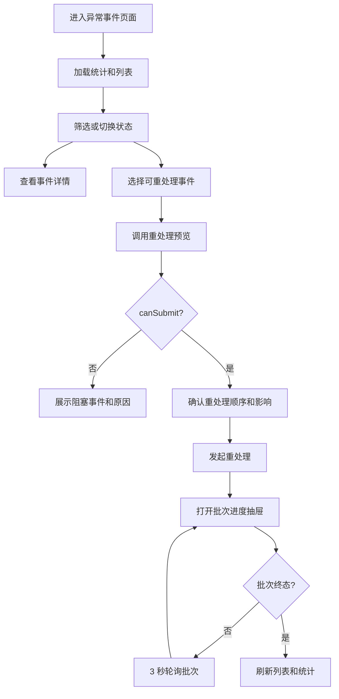

# TAP-12615 DLQ 异常事件前端交互设计

## 1. 文档说明

本文面向 TapData Web 前端开发人员，基于 TAP-12615 的概要设计、详细设计以及已完成的服务端 API 接口文档，细化“异常事件（DLQ）与受控重处理”在 Web 端的页面结构、交互流程、接口调用、状态展示、错误处理和组件拆分。

本文只描述前端交互与实现落点，不重新设计服务端接口，不包含测试脚本或 Xray 内容。

输入文档：

- `/Users/gavinxiao/kit/tapdata/tapdata/doc/TAP-12615-DLQ-controlled-reprocessing-design.md`
- `/Users/gavinxiao/kit/tapdata/tapdata/doc/TAP-12615-DLQ-controlled-reprocessing-detailed-design.md`
- `/Users/gavinxiao/kit/tapdata/tapdata/doc/TAP-12615-DLQ-controlled-reprocessing-api.md`

代码现状参考：

- `tapdata-web/apps/daas/src/router/menu.ts`
- `tapdata-web/apps/daas/src/router/routes.ts`
- `tapdata-web/packages/api/src/core/task.ts`
- `tapdata-web/packages/business/src/views/verification/List.vue`
- `tapdata-web/packages/business/src/views/task/List.vue`
- `tapdata-web/packages/dag/src/components/monitor/components/SkipErrorTable.vue`
- `tapdata-web/packages/business/src/components/TablePage.vue`
- `tapdata-web/packages/component/src/filter-bar/Main.vue`

## 2. 目标和边界

### 2.1 前端目标

前端需要提供一个跨任务统一入口，让有权限的用户可以发现、筛选、查看并重处理 DLQ 异常事件。核心目标如下：

- 新增独立菜单“异常事件”，不挂在单个任务监控页签下。
- 支持按任务、表名、关键字、DML 类型、错误类型、事件状态、失败时间范围查询。
- 支持查看事件详情，包括基本信息、错误信息、Payload 预览、重处理历史和当前批次信息。
- 支持单条和批量发起重处理。
- 批量重处理只允许同一任务下的可重处理事件。
- 发起前必须调用预览接口，并向用户展示服务端确认的重处理顺序和不可提交原因。
- 发起后展示重处理批次进度，按批次状态轮询刷新。
- 不展示完整 `payloadData`，不提供 Payload 编辑和下载入口。
- 权限遵循服务端口径：具备 `v2_exception_events` 菜单权限即可进入页面并执行 POC 操作，数据范围由服务端按任务可见范围过滤。

### 2.2 不做内容

| 不做内容 | 不做理由 | 前端落地影响 |
| --- | --- | --- |
| 不新增 Payload 编辑器 | TAP-12615 的目标是“使用原始异常事件受控回放”，不是人工修复 Payload。允许编辑会引入数据被篡改、审计不可证明、重放结果不可追溯的问题，也会让“无数据丢失、无重复、顺序一致”的证明复杂化。 | 详情页只提供只读 `payloadPreview` 展示，不出现编辑、保存、格式化后提交等入口。 |
| 不新增完整 Payload 下载、复制完整 Payload、导出 Payload | 完整 Payload 可能包含业务敏感数据。服务端 API 已明确详情接口只返回 `payloadPreview`，完整 `payloadData` 仅供 Engine 回放使用。前端只展示脱敏/截断预览，可以降低敏感数据泄露风险，也符合权限最小化原则。 | 页面不提供完整 Payload 下载、复制完整 Payload、导出文件按钮；只允许复制事件 ID、错误码、hash 等标识信息。 |
| 不在本页面实现任务启动、暂停、停止等普通任务控制 | “异常事件”页面职责是异常事件查询和重处理，不是任务运维控制台。任务启停已有任务列表和任务监控页面承载；如果在这里再做任务控制，会造成入口职责重叠，也容易让用户误以为重处理前需要手工暂停或启动任务。实际暂停/恢复应由后端和 Engine 的受控重处理流程处理。 | 页面只展示任务名并可跳转到已有任务监控入口，不提供启动、暂停、停止、重置等任务操作按钮。 |
| 不在前端绕过后端的任务可见范围、事件状态、批次锁校验 | 任务可见范围、事件状态和批次锁属于安全与一致性规则，必须以后端为准。前端可以做体验层校验，例如禁用不可选行、提示跨任务不可批量，但不能替代后端判断；否则用户仍可能通过接口调用、页面状态滞后、多窗口并发等方式绕过限制。 | 前端只做选择禁用和本地提示；提交前仍调用 preview，提交后仍以服务端错误码和批次状态为准。 |
| 不模拟 Engine 回放结果 | 重处理结果必须来自真实 Engine 执行和 TM 状态回写。前端如果根据提交成功就假设批次成功，会误导用户，也会破坏问题排查链路。接口文档也说明当前第一步已创建批次、锁定事件并预留下发结构，Engine 实际回放可能分阶段接入，因此前端必须只展示服务端返回的批次状态、成功数、失败数、跳过数。 | 批次抽屉只展示 `GET /api/dql-events/recovery-batches/{batchId}` 返回结果；提交成功后显示 `DISPATCHED`/服务端状态，不自行置为成功。 |
| 不移除现有任务监控页签里的表级跳过错误能力 | 现有 `SkipErrorTable` 是表级异常处理能力，TAP-12615 是事件级 DLQ 与批次化重处理能力，两者不是完全替代关系。保留现有入口可以兼容已有用户路径和历史任务行为。 | 新“异常事件”页面作为跨任务、事件级入口新增，不调整或删除任务监控页签里的表级跳过错误页面。 |

## 3. 命名和展示口径

业务名称使用“DLQ 异常事件”。后端 API 与集合命名沿用接口文档中的 `dql-events` / `dql_events`，前端代码文件可使用 `dql-event.ts`，页面展示文案统一使用“异常事件”。

建议前端展示：

| 场景 | 展示文案 | 说明 |
| --- | --- | --- |
| 菜单标题 | 异常事件 | 侧边栏入口 |
| 页面标题 | 异常事件 | 路由标题 |
| 列表对象 | 异常事件 | 对应 `dql_events` 主记录 |
| 操作按钮 | 重处理 | 对应服务端 recovery API |
| 进度对象 | 重处理批次 | 对应 `dql_recovery_batches` |

## 4. 用户角色和主路径

目标用户是运维、数据工程师和具备异常处理职责的管理员。用户在页面上的典型路径：

1. 从侧边栏进入“异常事件”页面。
2. 通过状态统计识别待处理、重处理失败、不可重处理事件数量。
3. 使用任务、表名、错误类型、时间范围等筛选定位事件。
4. 打开事件详情，查看错误详情、Payload 预览和历史重处理记录。
5. 对单条事件或同一任务下的多条事件发起重处理预览。
6. 确认服务端排序和阻塞项后提交重处理。
7. 在批次进度抽屉中观察批次状态，终态后回到列表继续处理。

主流程图：



## 5. 信息架构

页面采用现有运营类列表页结构，优先复用 `PageContainer`、`TablePage`、`FilterBar`、Element Plus 表格、抽屉和弹窗能力。

推荐页面结构：

```text
异常事件 /exception-events
  PageContainer
    SummaryTabs                状态统计与状态筛选
    TablePage
      Search / FilterBar       任务、表、关键字、类型、状态、时间
      Operation                刷新、列配置
      Table                    异常事件列表
      MultipleSelectionActions 批量重处理
    EventDetailDrawer          事件详情
    RecoveryPreviewDialog      重处理预览确认
    RecoveryBatchDrawer        批次进度
```

推荐新增文件：

```text
tapdata-web/packages/api/src/core/dql-event.ts
tapdata-web/packages/business/src/views/exception-events/List.vue
tapdata-web/packages/business/src/views/exception-events/components/SummaryTabs.vue
tapdata-web/packages/business/src/views/exception-events/components/EventStatusTag.vue
tapdata-web/packages/business/src/views/exception-events/components/EventDetailDrawer.vue
tapdata-web/packages/business/src/views/exception-events/components/PayloadPreview.vue
tapdata-web/packages/business/src/views/exception-events/components/RecoveryPreviewDialog.vue
tapdata-web/packages/business/src/views/exception-events/components/RecoveryBatchDrawer.vue
```

如团队希望减少初始文件数量，也可以先把 `SummaryTabs`、`EventStatusTag`、`PayloadPreview` 放在 `List.vue` 内部实现，但详情抽屉、预览弹窗、批次抽屉建议独立组件，避免列表页过重。

## 6. 路由和菜单交互

### 6.1 路由

在 `tapdata-web/apps/daas/src/router/routes.ts` 新增异步组件和路由。

推荐路由：

```typescript
const ExceptionEvents = () =>
  import('@tap/business/src/views/exception-events/List.vue')

{
  path: '/exception-events',
  name: 'exceptionEvents',
  component: Layout,
  redirect: { name: 'exceptionEventsList' },
  meta: { title: 'page_title_exception_events' },
  children: [
    {
      path: '',
      name: 'exceptionEventsList',
      component: ExceptionEvents,
      meta: {
        hideTitle: true,
        title: 'page_title_exception_events',
        code: 'v2_exception_events'
      }
    }
  ]
}
```

### 6.2 菜单

在 `tapdata-web/apps/daas/src/router/menu.ts` 新增菜单项，建议放在“数据校验”附近，因为它同属任务运行质量和数据质量处理入口。

推荐菜单：

```typescript
{
  name: 'exceptionEventsList',
  icon: 'warning',
  code: 'v2_exception_events',
  parent: 'exceptionEvents'
}
```

如果侧边栏图标系统没有 `warning`，使用现有 `data-validation` 作为第一阶段落地图标；页面内操作按钮和状态提示使用 lucide 图标，例如 `i-lucide-circle-alert`、`i-lucide-rotate-ccw`、`i-lucide-refresh-cw`。

### 6.3 权限表现

- 路由 meta 使用 `code: 'v2_exception_events'`。
- 菜单可见由现有权限系统控制。
- 如果用户直接访问 URL，前端按现有路由权限机制拦截；接口返回 `NoPermission` 时，页面展示无权限状态并停止自动刷新。
- 前端不追加任务 `Edit`、`Start` 权限判断，避免与 POC “可见即可操作”口径冲突；任务可见范围由服务端接口过滤。

## 7. API 封装设计

### 7.1 封装文件

新增：

```text
tapdata-web/packages/api/src/core/dql-event.ts
```

封装方法与服务端 API 对齐：

```typescript
import { requestClient, type Page } from '../request'

const BASE_URL = '/api/dql-events'

export function fetchDqlEvents(params: DqlEventQueryParams) {
  return requestClient.get<Page<DqlEventListItem>>(BASE_URL, { params })
}

export function fetchDqlEventDetail(eventId: string) {
  return requestClient.get<DqlEventDetail>(`${BASE_URL}/${eventId}`)
}

export function fetchDqlEventSummary(params: DqlEventQueryParams) {
  return requestClient.get<DqlEventSummary>(`${BASE_URL}/summary`, { params })
}

export function previewDqlRecovery(eventIds: string[]) {
  return requestClient.post<DqlRecoveryPreview>(`${BASE_URL}/recovery/preview`, { eventIds })
}

export function startDqlRecovery(eventIds: string[]) {
  return requestClient.post<DqlRecoveryBatch>(`${BASE_URL}/recovery`, {
    eventIds,
    confirm: true,
  })
}

export function fetchDqlRecoveryBatch(batchId: string) {
  return requestClient.get<DqlRecoveryBatch>(`${BASE_URL}/recovery-batches/${batchId}`)
}
```

说明：

- 现有 `requestClient` 通常已解包 `ResponseMessage.data`，前端业务组件按 data 结构消费。
- 查询接口使用普通 query params，不使用 LoopBack `filter` JSON。
- 时间参数按接口要求传毫秒时间戳；`FilterBar` 的 `datetimerange` 使用 `value-format="x"`，页面发起请求前转成 number 或保持后端可识别的毫秒字符串。

### 7.2 前端类型

建议在 `dql-event.ts` 中导出类型，供页面组件复用。

```typescript
export type DqlEventStatus =
  | 'PENDING'
  | 'REPROCESSING'
  | 'RECOVERED'
  | 'RECOVERY_FAILED'
  | 'NOT_REPROCESSABLE'

export type DqlErrorType =
  | 'MALFORMED_RECORD'
  | 'POISON_RECORD'
  | 'TRANSFORM_ERROR'
  | 'TARGET_WRITE_ERROR'
  | 'UNKNOWN_RECORD_ERROR'

export type DqlRecoveryBatchStatus =
  | 'CREATED'
  | 'DISPATCHED'
  | 'RUNNING'
  | 'SUCCESS'
  | 'PARTIAL_FAILED'
  | 'FAILED'
  | 'CANCELED'

export type DqlRecoveryAttemptResult =
  | 'SUCCESS'
  | 'FAILED'
  | 'SKIPPED'
  | 'TIMEOUT'

export interface DqlEventQueryParams {
  taskId?: string
  taskName?: string
  sourceTable?: string
  targetTable?: string
  keyword?: string
  dmlType?: 'I' | 'U' | 'D'
  errorType?: DqlErrorType
  status?: DqlEventStatus
  startTime?: number | string
  endTime?: number | string
  skip?: number
  limit?: number
  order?: string
}

export interface DqlEventListItem {
  id: string
  eventId: string
  taskId: string
  taskName: string
  sourceTable?: string
  targetTable?: string
  dmlType: 'I' | 'U' | 'D'
  errorType: DqlErrorType
  errorCode?: string
  eventTime?: number | string
  failedAt?: number | string
  status: DqlEventStatus
  recoveryCount: number
  lastRecoveryTime?: number | string | null
}
```

详情类型在列表字段基础上扩展：

```typescript
export interface DqlEventDetail extends DqlEventListItem {
  sourceNodeId?: string
  sourceNodeName?: string
  failedNodeId?: string
  failedNodeName?: string
  failedStage?: string
  tableId?: string
  captureSeq?: number
  eventKey?: Record<string, unknown>
  eventKeyMissing?: boolean
  payloadFormat?: string
  payloadHash?: string
  payloadSize?: number
  payloadComplete?: boolean
  payloadPreview?: Record<string, unknown>
  payloadPreviewTruncated?: boolean
  errorDetails?: string
  rawErrorRef?: string
  recoveryAttempts?: DqlRecoveryAttempt[]
  currentBatch?: DqlRecoveryBatch | null
}
```

预览和批次类型：

```typescript
export interface DqlRecoveryPreview {
  taskId: string
  taskName: string
  canSubmit: boolean
  orderedEvents: Array<{
    eventId: string
    eventTime?: number | string
    captureSeq?: number
    dmlType?: 'I' | 'U' | 'D'
    sourceTable?: string
  }>
  blockedEvents: Array<{
    eventId?: string
    message?: string
    reason?: string
    status?: DqlEventStatus
  }>
  message?: string
}

export interface DqlRecoveryBatch {
  batchId: string
  taskId: string
  taskName: string
  status: DqlRecoveryBatchStatus
  selectedCount: number
  successCount: number
  failedCount: number
  skippedCount: number
  orderedEventIds?: string[]
  eventIds?: string[]
  startedAt?: number | string | null
  finishedAt?: number | string | null
  message?: string
}

export interface DqlRecoveryAttempt {
  attemptId?: string
  batchId?: string
  result?: DqlRecoveryAttemptResult
  startedAt?: number | string
  finishedAt?: number | string
  operatorName?: string
  operatorUserId?: string
  message?: string
  errorCode?: string
  errorDetails?: string
}
```

如果实际服务端 DTO 字段比接口文档更多，前端可以增量扩展类型；如果字段缺失，页面必须以 `-` 或空态展示，不能用假成功状态替代真实结果。

## 8. 列表页布局

### 8.1 页面骨架

推荐使用：

```vue
<PageContainer>
  <TablePage
    ref="table"
    row-key="eventId"
    :remote-method="getData"
    :default-sort="{ prop: 'failedAt', order: 'descending' }"
    enable-custom-columns="exceptionEvents"
  >
    <template #nav>
      <SummaryTabs />
    </template>
    <template #search>
      <FilterBar ... />
    </template>
    <template #operation>
      <ElButton ... />
    </template>
    <template #multipleSelectionActions>
      <ElButton type="primary">重处理</ElButton>
    </template>
    <ElTableColumn type="selection" ... />
    ...
  </TablePage>
</PageContainer>
```

页面进入后并行请求：

- `GET /api/dql-events/summary`
- `GET /api/dql-events`

列表默认排序：

- `order=-failedAt`
- `limit` 使用 `TablePage` 当前 page size，默认 20
- `skip=(current - 1) * size`

### 8.2 状态统计区

位置：`TablePage` 的 `nav` 插槽，位于筛选栏上方。

展示项：

| Tab | 接口字段 | 切换行为 |
| --- | --- | --- |
| 全部 | `total` | 清空 `status` 查询参数 |
| 待处理 | `pending` | 设置 `status=PENDING` |
| 重处理中 | `reprocessing` | 设置 `status=REPROCESSING` |
| 已恢复 | `recovered` | 设置 `status=RECOVERED` |
| 重处理失败 | `recoveryFailed` | 设置 `status=RECOVERY_FAILED` |
| 不可重处理 | `notReprocessable` | 设置 `status=NOT_REPROCESSABLE` |

统计接口调用规则：

- 统计请求使用当前筛选条件，但不带 `skip`、`limit`、`order`。
- 为了让状态 Tab 数量展示“其他筛选条件下的状态分布”，统计请求建议排除当前 `status` 参数。
- 状态 Tab 自身负责写入 `status` 查询参数；统计数量保持为同一组非状态筛选条件下的全状态分布。

视觉建议：

- 使用轻量 tabs 或分段按钮，不做大面积卡片。
- 当前激活状态使用主色边框或底色。
- `RECOVERY_FAILED` 数量用 danger 强调。
- `REPROCESSING` 数量大于 0 时可显示小型 loading icon，但不要改变布局宽度。

### 8.3 筛选栏

使用 `FilterBar`，其中任务筛选使用 slot 自定义远程选择。

筛选项设计：

| 控件 | query key | 控件类型 | 交互 |
| --- | --- | --- | --- |
| 任务 | `taskId` / `taskName` | 自定义 `ElSelectV2` | 远程搜索任务，选中传 `taskId`；输入未选中时可传 `taskName` 模糊查询 |
| 源表 | `sourceTable` | `input` | 输入后 debounce 500ms 触发查询 |
| 目标表 | `targetTable` | `input` | 输入后 debounce 500ms 触发查询 |
| 关键字 | `keyword` | `input` | 匹配事件 ID、任务名、表名、错误码、错误摘要 |
| DML | `dmlType` | `select-inner` | 全部、Insert、Update、Delete |
| 错误类型 | `errorType` | `select-inner` | 枚举 `DqlErrorType` |
| 状态 | `status` | `select-inner` | 与状态统计 Tab 联动 |
| 失败时间 | `startTime,endTime` | `datetimerange` | 按 `failedAt` 起止时间过滤 |

任务筛选实现建议：

- 首选使用 `fetchTasks` 做远程任务搜索，查询条件按任务名模糊匹配，限制返回数量，例如 50。
- 选项展示任务名，必要时副标题展示任务 ID 或任务类型。
- 清空任务后同时清空 `taskId` 和 `taskName`。
- 服务端仍按用户可见任务过滤，前端任务下拉只是体验优化。

路由 query 同步：

- 筛选条件变更后同步到 `route.query`，便于刷新、返回、复制链接。
- 进入页面时从 `route.query` 初始化筛选表单。
- 清空筛选时移除对应 query key，而不是传空字符串。

### 8.4 表格列

表格默认列：

| 列 | 字段 | 宽度建议 | 交互 |
| --- | --- | --- | --- |
| 选择 | `selection` | 32 | 只允许可重处理且同任务的行可选 |
| 事件 ID | `eventId` | 180 | 点击打开详情；支持复制事件 ID |
| 任务 | `taskName` | 220 | 点击打开任务监控新标签或当前产品已有任务详情入口 |
| 源表 | `sourceTable` | 180 | 超长省略，tooltip |
| 目标表 | `targetTable` | 180 | 超长省略，tooltip |
| DML | `dmlType` | 90 | 标签展示 Insert/Update/Delete |
| 错误类型 | `errorType` | 180 | 枚举文案 |
| 错误码 | `errorCode` | 180 | 超长省略，tooltip |
| 事件时间 | `eventTime` | 180 | 可排序 |
| 失败时间 | `failedAt` | 180 | 默认倒序，可排序 |
| 状态 | `status` | 140 | 状态标签 |
| 重处理次数 | `recoveryCount` | 110 | 可排序 |
| 最近重处理时间 | `lastRecoveryTime` | 180 | 可排序 |
| 操作 | - | 160 | 详情、重处理或查看进度 |

默认隐藏列建议：

- `targetTable`
- `eventTime`
- `lastRecoveryTime`

通过 `TablePage enable-custom-columns="exceptionEvents"` 允许用户自行调整列显示。选择列和操作列锁定，不参与隐藏。

### 8.5 表格行操作

每行操作规则：

| 事件状态 | 主操作 | 选择框 | 说明 |
| --- | --- | --- | --- |
| `PENDING` | 重处理 | 可选 | 可单条或批量重处理 |
| `RECOVERY_FAILED` | 重新处理 | 可选 | 可单条或批量重处理 |
| `REPROCESSING` | 查看进度 | 禁用 | 通过详情中的当前批次查看进度 |
| `RECOVERED` | 详情 | 禁用 | 已恢复，不允许再次重处理 |
| `NOT_REPROCESSABLE` | 详情 | 禁用 | Payload 不完整或服务端判定不可重处理 |

选择逻辑：

- `selectable(row)` 返回 true 的条件是 `row.status` 为 `PENDING` 或 `RECOVERY_FAILED`。
- 如果已选中第一条事件，记录 `selectedTaskId`，不同 `taskId` 的行选择框禁用。
- 清空选择后释放 `selectedTaskId`。
- 列表刷新后，如果选中事件状态发生变化，前端清空选择并提示“所选事件状态已变化，请重新选择”。
- 表格全选只选择当前页符合状态和同任务约束的行。

### 8.6 空态和加载态

页面状态：

| 状态 | 触发条件 | 展示 |
| --- | --- | --- |
| 首次加载 | 列表请求中 | 表格 loading，统计区 skeleton |
| 无数据 | 无筛选且 total 为 0 | `el-empty`：暂无异常事件 |
| 筛选无结果 | 有筛选且 total 为 0 | `el-empty`：未找到匹配的异常事件 |
| 接口失败 | 列表请求失败 | 保留筛选，表格空态上方显示错误消息，提供刷新按钮 |
| 无权限 | 接口返回 `NoPermission` | 页面级无权限提示，停止自动刷新 |

错误详情和 Payload 内容必须以纯文本或 JSON viewer 展示，不能用 `dangerouslyUseHTMLString` 渲染服务端错误内容。

## 9. 状态和标签设计

### 9.1 事件状态

| 状态 | 文案 | Tag 类型 | 图标建议 | 可重处理 |
| --- | --- | --- | --- | --- |
| `PENDING` | 待处理 | warning | `circle-alert` | 是 |
| `REPROCESSING` | 重处理中 | primary | `loader-circle` 或小 loading | 否 |
| `RECOVERED` | 已恢复 | success | `circle-check` | 否 |
| `RECOVERY_FAILED` | 重处理失败 | danger | `circle-x` | 是 |
| `NOT_REPROCESSABLE` | 不可重处理 | info | `ban` | 否 |

### 9.2 批次状态

| 状态 | 文案 | Tag 类型 | 轮询 |
| --- | --- | --- | --- |
| `CREATED` | 已创建 | info | 是 |
| `DISPATCHED` | 已下发 | primary | 是 |
| `RUNNING` | 运行中 | primary | 是 |
| `SUCCESS` | 成功 | success | 否 |
| `PARTIAL_FAILED` | 部分失败 | warning | 否 |
| `FAILED` | 失败 | danger | 否 |
| `CANCELED` | 已取消 | info | 否 |

### 9.3 DML 类型

| 值 | 文案 | Tag 类型 |
| --- | --- | --- |
| `I` | Insert | success |
| `U` | Update | primary |
| `D` | Delete | danger |

### 9.4 错误类型

| 值 | 文案 |
| --- | --- |
| `MALFORMED_RECORD` | 记录格式错误 |
| `POISON_RECORD` | 毒性记录 |
| `TRANSFORM_ERROR` | 转换处理错误 |
| `TARGET_WRITE_ERROR` | 目标写入错误 |
| `UNKNOWN_RECORD_ERROR` | 未知记录错误 |

## 10. 查询和刷新交互

### 10.1 查询流程

页面查询由 `TablePage` 的 `remoteMethod` 驱动。

流程：

1. 从 `searchParams` 和分页状态组装 `DqlEventQueryParams`。
2. 过滤空值。
3. 将 `datetimerange` 拆成 `startTime` 和 `endTime`。
4. 发送 `fetchDqlEvents(params)`。
5. 将返回的 `items` 做前端展示格式化，例如时间格式化、状态文案、错误类型文案。
6. 返回 `{ data: items, total }` 给 `TablePage`。

排序映射：

| Element Plus sort | API order |
| --- | --- |
| `failedAt` descending | `-failedAt` |
| `failedAt` ascending | `failedAt` |
| `eventTime` descending | `-eventTime` |
| `eventTime` ascending | `eventTime` |
| `recoveryCount` descending | `-recoveryCount` |
| `lastRecoveryTime` descending | `-lastRecoveryTime` |

如果服务端只实现 `failedAt` 排序，其他列先不声明 `sortable="custom"`。

### 10.2 手动刷新

- 筛选栏保留刷新按钮。
- 点击刷新时重新请求列表和统计。
- 如果详情抽屉打开，只刷新列表不自动刷新详情；详情抽屉内提供独立刷新图标。
- 如果批次抽屉打开且批次未终态，批次轮询继续运行。

### 10.3 自动刷新

自动刷新规则：

- 当前列表中存在 `REPROCESSING` 事件时，每 8 秒静默刷新列表和统计。
- 批次抽屉打开且批次状态为 `CREATED`、`DISPATCHED`、`RUNNING` 时，每 3 秒请求批次详情。
- 页面离开或组件卸载时清理所有 timer。
- 浏览器标签不可见时可以暂停列表静默刷新；批次抽屉轮询可以继续或降频到 10 秒，避免用户错过终态。

静默刷新应使用现有 `withPassive` 类似模式，避免每次刷新都出现全表 loading。

## 11. 详情抽屉设计

### 11.1 打开方式

触发入口：

- 点击事件 ID。
- 点击行操作“详情”。
- 在预览弹窗的 ordered / blocked event 中点击事件 ID。
- 在批次抽屉的事件 ID 列中点击事件 ID。

打开流程：

1. 设置 `detailVisible=true`。
2. 展示抽屉骨架屏或 loading。
3. 调用 `GET /api/dql-events/{eventId}`。
4. 渲染详情。
5. 请求失败时保留抽屉，展示错误和重试按钮。

抽屉宽度建议：

- 桌面端 720px。
- 小屏幕小于 900px 时使用 100vw。

### 11.2 抽屉头部

头部内容：

- 左侧：事件 ID、状态标签。
- 次级信息：任务名、失败时间。
- 右侧：刷新、重处理按钮。

按钮规则：

- 状态为 `PENDING` 或 `RECOVERY_FAILED` 时显示“重处理”。
- 状态为 `REPROCESSING` 且有 `currentBatch` 时显示“查看进度”。
- 其他状态不显示重处理按钮。

### 11.3 内容分区

详情内容分为 5 个区块，按从定位问题到操作审计的顺序展示。

基本信息：

| 字段 | 展示 |
| --- | --- |
| 事件 ID | `eventId` |
| 任务 | `taskName`，可跳任务监控 |
| 任务 ID | `taskId`，支持复制 |
| 源节点 | `sourceNodeName` / `sourceNodeId` |
| 失败节点 | `failedNodeName` / `failedNodeId` |
| 失败阶段 | `failedStage` |
| 源表 | `sourceTable` |
| 目标表 | `targetTable` |
| 表 ID | `tableId` |
| DML | `dmlType` |
| 事件时间 | `eventTime` |
| 失败时间 | `failedAt` |
| 捕获顺序 | `captureSeq` |

事件标识：

| 字段 | 展示 |
| --- | --- |
| Event Identity | `eventIdentity`，支持复制 |
| Payload Hash | `payloadHash`，支持复制 |
| Payload Size | `payloadSize`，格式化为 B/KB/MB |
| Payload Complete | `payloadComplete`，false 时展示不可重处理原因 |
| Event Key Missing | `eventKeyMissing`，true 时 warning |

错误信息：

- 错误类型：`errorType` 文案。
- 错误码：`errorCode`。
- 错误详情：`errorDetails`，使用 `<pre>` 或只读文本区域，最多展示安全返回内容。
- 原始错误引用：`rawErrorRef`，如果返回则展示为可复制文本，不作为下载链接。

Payload 预览：

- 使用 `PayloadPreview` 组件承载。
- 数据来自 `payloadPreview`。
- 使用 `vue-json-pretty` 或项目已有 JSON viewer，禁用编辑。
- 如果 `payloadPreviewTruncated=true`，在 JSON 区顶部显示提示“Payload 预览已截断，仅展示服务端返回的安全预览”。
- 如果 `payloadComplete=false`，显示“Payload 不完整，当前事件不可重处理”。
- 不显示完整 `payloadData`，不提供下载或编辑按钮。

重处理历史：

| 列 | 字段 |
| --- | --- |
| 批次 ID | `batchId` |
| Attempt ID | `attemptId` |
| 操作人 | `operatorName` 或 `operatorUserId` |
| 开始时间 | `startedAt` |
| 结束时间 | `finishedAt` |
| 结果 | `result` |
| 错误码 | `errorCode` |
| 消息 | `message` |

当前批次：

- 仅在 `status=REPROCESSING` 且 `currentBatch` 存在时展示。
- 展示批次 ID、状态、成功/失败/跳过数。
- 提供“查看进度”按钮打开 `RecoveryBatchDrawer`。

### 11.4 详情刷新

- 用户点击详情抽屉头部刷新按钮时，重新请求当前事件详情。
- 如果详情刷新后事件状态变为终态，同步更新头部操作按钮。
- 如果返回 `DqlEvent.NotFound`，提示“事件不存在或已无权限查看”，关闭抽屉并刷新列表。

## 12. 单条重处理交互

### 12.1 入口

可从以下位置发起：

- 列表行操作“重处理”。
- 详情抽屉头部“重处理”。

按钮显示条件：

- `status` 为 `PENDING` 或 `RECOVERY_FAILED`。

按钮禁用条件：

- 页面正在提交其他重处理请求。
- 当前事件正在加载详情。
- 当前事件处于最新刷新后的不可重处理状态。

### 12.2 预览流程

点击后不直接提交，必须先调用：

```http
POST /api/dql-events/recovery/preview
```

请求：

```json
{
  "eventIds": ["DQL-64f000-000001"]
}
```

前端处理：

- 请求中按钮进入 loading。
- 成功后打开 `RecoveryPreviewDialog`。
- 预览弹窗展示 `taskName`、`orderedEvents`、`blockedEvents`、`message`。
- 如果 `canSubmit=false` 或 `blockedEvents` 非空，确认按钮禁用。
- 如果接口返回错误码，按错误码映射展示。

### 12.3 确认弹窗

弹窗标题：

```text
确认重处理异常事件
```

核心内容：

- 任务：`taskName`
- 事件数量：1
- 执行顺序：服务端已按 `eventTime ASC, captureSeq ASC, eventId ASC` 排序
- 影响提示：将使用当前已发布任务配置重处理原始事件；重处理期间任务正常同步可能短暂暂停；Payload 不会被修改。

确认按钮：

- 文案：`确认重处理`
- loading 状态绑定 `startDqlRecovery`
- 点击后调用 `POST /api/dql-events/recovery`

取消行为：

- 关闭弹窗。
- 不清空列表筛选。
- 不刷新列表，除非预览接口返回了状态变化错误并已提示用户刷新。

### 12.4 发起后行为

调用：

```http
POST /api/dql-events/recovery
```

请求：

```json
{
  "eventIds": ["DQL-64f000-000001"],
  "confirm": true
}
```

成功响应后：

- 关闭预览弹窗。
- 清空当前表格选择。
- 打开 `RecoveryBatchDrawer`。
- 立即按 `batchId` 请求批次详情。
- 刷新列表和统计，使事件状态尽快显示为 `REPROCESSING` 或服务端返回的状态。

## 13. 批量重处理交互

### 13.1 批量选择

入口位于 `TablePage` 的 `multipleSelectionActions`。

展示条件：

- 当前选择数量大于 0。

按钮：

```text
重处理所选
```

选择约束：

- 只允许选择 `PENDING` 和 `RECOVERY_FAILED`。
- 第一条选中事件决定批次任务，后续不同 `taskId` 行禁用选择。
- 如果用户通过刷新导致选择集中出现跨任务或不可重处理事件，点击按钮时再次前端校验并提示。

### 13.2 前端提交前校验

点击“重处理所选”时，先执行本地校验：

- 选中数量必须大于 0。
- 选中事件必须同一 `taskId`。
- 所有选中事件状态必须为 `PENDING` 或 `RECOVERY_FAILED`。

本地校验通过后调用预览接口。即使本地校验通过，后端仍可能返回：

- `DqlRecovery.CrossTaskNotAllowed`
- `DqlRecovery.EventNotReprocessable`
- `DqlRecovery.EventLockFailed`

前端必须按后端响应重新提示，不能只依赖本地校验。

### 13.3 批量预览弹窗

弹窗内容：

- 任务名。
- 选择数量。
- `orderedEvents` 表格，展示服务端排序后的执行顺序。
- `blockedEvents` 表格，展示不可提交事件和原因。
- 执行影响提示。

`orderedEvents` 表格列：

| 列 | 字段 |
| --- | --- |
| 顺序 | 前端按数组下标 + 1 |
| 事件 ID | `eventId` |
| 源表 | `sourceTable` |
| DML | `dmlType` |
| 事件时间 | `eventTime` |
| 捕获顺序 | `captureSeq` |

如果 `orderedEvents` 超过 100 条：

- 表格固定高度 360px。
- 使用虚拟表格或普通 Element Plus 表格滚动。
- 确认按钮文案显示数量，例如“确认重处理 128 条”。

如果存在 `blockedEvents`：

- 展示在 orderedEvents 上方。
- 确认按钮禁用。
- 提示用户回到列表刷新或重新筛选。

### 13.4 批量提交后行为

与单条重处理一致：

- 调用 `startDqlRecovery(eventIds)`。
- 成功后打开批次进度抽屉。
- 清空选择。
- 刷新列表和统计。

如果提交失败：

- `DqlRecovery.EventLockFailed`：提示“部分事件状态已变化，请刷新后重新选择”，清空选择并刷新列表。
- `DqlRecovery.CrossTaskNotAllowed`：提示“只能重处理同一任务下的异常事件”，保留筛选，清空选择。
- `DqlRecovery.EventNotReprocessable`：提示服务端 message，刷新列表。

## 14. 批次进度抽屉设计

### 14.1 打开入口

打开 `RecoveryBatchDrawer` 的入口：

- 单条或批量提交成功后自动打开。
- 详情抽屉当前批次区域点击“查看进度”。
- 列表 `REPROCESSING` 行操作点击“查看进度”时，如果列表行没有 batchId，先打开详情并从 `currentBatch` 进入。

### 14.2 抽屉内容

抽屉头部：

- 批次 ID。
- 批次状态标签。
- 手动刷新按钮。

摘要区：

| 指标 | 字段 |
| --- | --- |
| 任务 | `taskName` |
| 选择数量 | `selectedCount` |
| 成功 | `successCount` |
| 失败 | `failedCount` |
| 跳过 | `skippedCount` |
| 开始时间 | `startedAt` |
| 结束时间 | `finishedAt` |

进度展示：

- 使用 `selectedCount`、`successCount`、`failedCount`、`skippedCount` 计算已处理数量。
- 进度百分比：`(successCount + failedCount + skippedCount) / selectedCount`。
- 当 `selectedCount=0` 时展示 0%，避免除零。

事件列表：

- 优先展示 `orderedEventIds`。
- 如果后端 DTO 返回更细粒度 event result，前端可以展示每条事件结果；否则只展示事件 ID 列表和批次级统计。
- 事件 ID 可点击打开详情抽屉。

消息区：

- 如果 `message` 不为空，在摘要区下方展示。
- `FAILED`、`PARTIAL_FAILED` 状态下使用 warning/danger 视觉强调。

### 14.3 轮询规则

请求：

```http
GET /api/dql-events/recovery-batches/{batchId}
```

轮询状态：

- `CREATED`
- `DISPATCHED`
- `RUNNING`

终态：

- `SUCCESS`
- `PARTIAL_FAILED`
- `FAILED`
- `CANCELED`

行为：

- 抽屉打开后立即请求一次。
- 非终态每 3 秒轮询。
- 到终态后停止轮询，刷新列表和统计。
- 抽屉关闭时停止当前轮询。关闭抽屉不取消重处理。
- 如果用户再次打开同一批次，重新请求并根据最新状态决定是否轮询。

接口文档说明当前阶段服务端已创建批次、锁定事件并预留下发结构；前端在联调时应完全依据批次接口返回展示，不能在 Engine 回调尚未接入时伪造成功。

### 14.4 批次终态提示

| 状态 | 页面反馈 |
| --- | --- |
| `SUCCESS` | `ElMessage.success('重处理完成')`，刷新列表 |
| `PARTIAL_FAILED` | `ElMessage.warning('重处理部分失败')`，保留抽屉供查看失败信息 |
| `FAILED` | `ElMessage.error('重处理失败')`，保留抽屉 |
| `CANCELED` | `ElMessage.info('重处理已取消')`，刷新列表 |

同一个批次终态提示只弹一次，避免轮询重复提示。

## 15. 错误码交互映射

| code | 场景 | 前端处理 |
| --- | --- | --- |
| `IllegalArgument` | 请求参数缺失或非法 | 展示接口 message；保留筛选条件 |
| `NoPermission` | 无菜单或任务可见权限 | 页面级无权限或弹出无权限提示；停止相关轮询 |
| `DqlEvent.NotFound` | 事件不存在 | 关闭详情或预览，刷新列表 |
| `DqlRecovery.CrossTaskNotAllowed` | 跨任务选择 | 提示“只能重处理同一任务下的异常事件”，清空选择 |
| `DqlRecovery.EventNotReprocessable` | 存在不可重处理事件 | 展示 blocked events 或 message，刷新列表 |
| `DqlRecovery.EventLockFailed` | 发起时锁定失败 | 提示状态已变化，清空选择并刷新列表 |
| `DqlRecovery.BatchNotFound` | 批次不存在 | 关闭批次抽屉，提示批次不存在或已无权限查看 |
| 其他错误 | 服务端或网络异常 | 使用通用错误提示，保留当前页面状态 |

网络异常：

- 列表请求失败：表格区展示错误，不清空筛选。
- 详情请求失败：抽屉内展示重试按钮。
- 预览请求失败：关闭按钮可用，确认按钮不可用。
- 提交请求失败：保持预览弹窗打开，用户可重试或取消。
- 批次轮询失败：保留最近一次批次数据，显示“刷新失败”，下一轮继续尝试；连续失败 3 次后停止轮询并提供手动刷新。

## 16. 文案设计

### 16.1 关键操作文案

| 场景 | 文案 |
| --- | --- |
| 菜单 | 异常事件 |
| 页面空态 | 暂无异常事件 |
| 筛选空态 | 未找到匹配的异常事件 |
| 单条按钮 | 重处理 |
| 失败后单条按钮 | 重新处理 |
| 批量按钮 | 重处理所选 |
| 进度按钮 | 查看进度 |
| 预览标题 | 确认重处理异常事件 |
| 批量预览标题 | 确认批量重处理 |
| 确认按钮 | 确认重处理 |
| 提交中 | 正在发起重处理 |
| 关闭批次抽屉提示 | 关闭抽屉不会取消重处理 |

### 16.2 确认提示文案

预览弹窗中的影响说明：

```text
将使用当前已发布任务配置重处理原始异常事件。重处理期间，任务正常同步可能短暂暂停；重处理完成后恢复原状态。Payload 不会被修改。
```

如果 `payloadComplete=false` 或服务端返回阻塞项：

```text
存在不可重处理事件，请根据阻塞原因处理后重新选择。
```

跨任务本地校验：

```text
只能批量重处理同一任务下的异常事件。
```

事件锁失败：

```text
部分事件状态已变化，请刷新后重新选择。
```

### 16.3 i18n key 建议

页面标题放在 `apps/daas/src/i18n/langs/{zh-CN,en,zh-TW}.js`：

```javascript
page_title_exception_events: '异常事件'
```

业务文案放在 `packages/business/src/locale/lang/{zh-CN,en,zh-TW}.js`，建议 key：

```text
packages_business_exception_events_empty
packages_business_exception_events_filter_empty
packages_business_exception_events_reprocess
packages_business_exception_events_reprocess_selected
packages_business_exception_events_reprocess_again
packages_business_exception_events_view_progress
packages_business_exception_events_confirm_title
packages_business_exception_events_confirm_batch_title
packages_business_exception_events_confirm_message
packages_business_exception_events_blocked_message
packages_business_exception_events_cross_task_message
packages_business_exception_events_lock_failed_message
packages_business_exception_events_batch_close_tip
packages_business_exception_events_payload_preview_truncated
packages_business_exception_events_payload_incomplete
```

状态、错误类型、批次状态建议也维护 i18n key，避免组件中散落硬编码。

## 17. 组件职责

### 17.1 `List.vue`

职责：

- 页面状态管理。
- 筛选参数与路由 query 同步。
- 列表请求、统计请求、排序、分页。
- 表格选择和批量操作入口。
- 协调详情抽屉、预览弹窗、批次抽屉。

不建议在 `List.vue` 中直接写大量详情布局和批次轮询细节。

### 17.2 `SummaryTabs.vue`

Props：

- `summary`
- `modelValue` 当前状态
- `loading`

Emits：

- `update:modelValue`
- `change`

职责：

- 展示统计。
- 切换状态筛选。
- 不直接调用接口。

### 17.3 `EventStatusTag.vue`

Props：

- `status`
- `spinning` 可选，用于 `REPROCESSING`

职责：

- 统一事件状态颜色、图标、文案。
- 被列表、详情、预览、批次组件复用。

### 17.4 `EventDetailDrawer.vue`

Props / model：

- `modelValue`
- `eventId`

Emits：

- `update:modelValue`
- `reprocess`
- `openBatch`
- `refreshed`

职责：

- 加载并展示事件详情。
- 展示 Payload 预览和重处理历史。
- 根据详情状态决定头部操作。

### 17.5 `PayloadPreview.vue`

Props：

- `payloadPreview`
- `payloadPreviewTruncated`
- `payloadComplete`
- `payloadSize`

职责：

- 只读 JSON 展示。
- 展示截断和不完整提示。
- 不提供编辑、下载完整数据。

### 17.6 `RecoveryPreviewDialog.vue`

Props / model：

- `modelValue`
- `preview`
- `loading`
- `submitting`

Emits：

- `update:modelValue`
- `confirm`
- `openEvent`

职责：

- 展示预览结果。
- 禁用不可提交确认。
- 将确认动作抛给父组件。

### 17.7 `RecoveryBatchDrawer.vue`

Props / model：

- `modelValue`
- `batchId`

Emits：

- `update:modelValue`
- `terminal`
- `openEvent`

职责：

- 按批次 ID 加载批次。
- 非终态轮询。
- 终态通知父页面刷新列表和统计。

## 18. 页面状态管理

推荐使用页面级 Composition API state，不新增全局 Pinia/Vuex 模块。

关键状态：

```typescript
const table = ref<InstanceType<typeof TablePage>>()
const searchParams = ref<DqlEventQueryParams>({})
const summary = ref<DqlEventSummary>()
const summaryLoading = ref(false)
const order = ref('-failedAt')

const selectedRows = ref<DqlEventListItem[]>([])
const selectedTaskId = computed(() => selectedRows.value[0]?.taskId)

const detailVisible = ref(false)
const currentEventId = ref('')

const previewVisible = ref(false)
const previewLoading = ref(false)
const previewData = ref<DqlRecoveryPreview>()
const previewEventIds = ref<string[]>([])
const submitting = ref(false)

const batchVisible = ref(false)
const currentBatchId = ref('')
```

状态更新规则：

- `route.query` 变化触发 `searchParams` 更新和 `table.fetch(1)`。
- `status` Tab 切换通过更新 query 驱动刷新。
- `selectedRows` 只保存当前页真实对象，不跨页保留选择。
- 批量提交成功后清空选择，避免同一事件重复提交。
- 批次终态后刷新列表和统计。

## 19. 安全和合规交互

- 页面只消费详情接口返回的 `payloadPreview`，不请求或展示完整 `payloadData`。
- Payload 预览只读。
- 错误详情按纯文本展示，防止 HTML 注入。
- 复制能力限制为事件 ID、任务 ID、错误码、hash 等标识信息。
- 如果服务端返回脱敏字段标记，前端按原样展示，不尝试还原。
- 前端不能在 URL query 中写入 Payload 内容。
- 权限不足时不展示历史数据残留；应清空当前详情和批次状态。

## 20. 响应式和可访问性

桌面端是主场景，最小内容宽度建议 1200px；低于该宽度时表格横向滚动，避免压缩关键列导致不可读。

适配规则：

- 表格容器使用 `TablePage` 默认高度和横向滚动。
- 详情抽屉桌面 720px，小屏 100vw。
- 预览弹窗桌面 800px，小屏 90vw。
- 批次抽屉桌面 640px，小屏 100vw。
- 表格超长文本使用 ellipsis + tooltip。
- 操作按钮使用图标加文字；纯图标按钮必须有 tooltip 或 aria label。
- Loading 状态不能导致按钮宽度跳变。

键盘行为：

- 弹窗打开后焦点进入弹窗。
- Esc 关闭预览弹窗和详情抽屉；提交中禁止关闭或二次确认。
- Enter 不直接提交重处理，必须点击确认按钮，降低误操作风险。

## 21. 与现有前端能力的复用关系

### 21.1 复用 `SkipErrorTable.vue` 的经验

可复用思路：

- `usePagination` 或 `TablePage remoteMethod` 的分页模式。
- 表格选择和恢复按钮的操作结构。
- `i-lucide-circle-alert` 展示错误信息。
- 错误详情弹窗的纯文本展示习惯。

不能直接复用的点：

- `SkipErrorTable.vue` 是单任务监控页签，不支持跨任务查询。
- 表级状态只有 `SKIPPED`、`RECOVERING`，不能覆盖事件级状态机。
- 现有恢复接口按 sourceTable 恢复，本功能必须按 `eventIds` 恢复。

### 21.2 复用数据校验列表页能力

可复用思路：

- `PageContainer` + `TablePage` + `FilterBar`。
- 筛选条件同步到路由 query。
- `TablePage` 的多选动作区、分页和列配置。
- `getTaskList` 或 `fetchTasks` 的任务选择思路。

差异：

- 异常事件页面不需要标签分类能力。
- 异常事件的批量操作有同任务约束，需要自定义 selection selectable。
- 异常事件有批次轮询，需要独立抽屉管理。

## 22. API 与交互映射

| 用户动作 | 前端处理 | API |
| --- | --- | --- |
| 进入页面 | 加载统计和列表 | `GET /api/dql-events/summary`、`GET /api/dql-events` |
| 修改筛选 | 更新 query，刷新列表和统计 | `GET /api/dql-events`、`GET /api/dql-events/summary` |
| 切换状态 Tab | 更新 `status`，刷新列表 | `GET /api/dql-events` |
| 打开详情 | 展示抽屉并加载详情 | `GET /api/dql-events/{eventId}` |
| 单条重处理 | 预览后确认 | `POST /api/dql-events/recovery/preview` |
| 批量重处理 | 本地同任务校验，预览后确认 | `POST /api/dql-events/recovery/preview` |
| 确认提交 | 发起批次 | `POST /api/dql-events/recovery` |
| 查看进度 | 打开批次抽屉 | `GET /api/dql-events/recovery-batches/{batchId}` |
| 批次运行中 | 3 秒轮询 | `GET /api/dql-events/recovery-batches/{batchId}` |

## 23. 关键边界处理

### 23.1 预览后状态变化

用户打开预览弹窗后，其他用户或自动流程可能已经处理事件。前端不做乐观锁判断，提交失败时以服务端错误为准：

- 关闭或保留弹窗均可，本设计建议保留弹窗并展示错误。
- 提供“刷新列表”按钮。
- 清空当前选择。

### 23.2 重复点击提交

- 提交按钮 loading 期间禁用。
- 父页面维护全局 `submitting`，避免详情和列表两个入口同时提交。
- 提交成功后立即关闭预览弹窗。

### 23.3 当前页轮询导致行状态变化

- 当前选择中任意事件不再可重处理时，清空选择。
- 如果详情抽屉打开的事件状态变化，详情抽屉只有用户点击刷新才更新；批次终态时可主动刷新当前详情。

### 23.4 批次长时间不终态

- 前端持续按 3 秒轮询，直到终态或连续失败 3 次。
- 连续失败停止后显示手动刷新按钮。
- 不在前端自行判断失败，避免与后端超时扫描策略冲突。

### 23.5 批次关闭抽屉

- 关闭抽屉只是隐藏进度，不取消重处理。
- 如果用户关闭时批次未终态，可在关闭前展示轻提示，不阻止关闭。
- 页面列表中的 `REPROCESSING` 状态和详情中的当前批次仍可重新进入进度。

### 23.6 服务端只返回批次级结果

接口文档第 9 节说明批次详情包含批次 ID、任务、状态、数量、事件 ID 列表、开始/结束时间和消息。前端第一阶段以批次级统计为主，不强依赖每条事件结果字段。

如果后端后续返回每条事件 attempt 结果，前端可在 `RecoveryBatchDrawer` 事件列表中增强展示，但不影响本次交互闭环。

## 24. 研发落地顺序

建议前端按以下顺序实现：

1. 新增 API 封装和类型。
2. 新增路由、菜单、页面标题 i18n。
3. 实现 `List.vue` 列表查询、筛选、分页、状态统计。
4. 实现状态标签、DML 标签、错误类型文案。
5. 实现详情抽屉和 Payload 预览。
6. 实现单条重处理预览和提交。
7. 实现批量选择、同任务约束、批量预览和提交。
8. 实现批次进度抽屉和轮询。
9. 补齐错误码映射、无权限状态、空态和自动刷新清理。
10. 补齐中英文和繁体文案。

## 25. 需求符合性检查

| 需求点 | 前端设计覆盖 |
| --- | --- |
| 独立异常事件菜单 | `/exception-events` 路由和 `v2_exception_events` 菜单 |
| 按任务查询 | 任务远程选择，传 `taskId` 或 `taskName` |
| 按表查询 | `sourceTable`、`targetTable` 输入 |
| 按关键字查询 | `keyword` 输入 |
| 按 DML 类型查询 | `dmlType` 选择 |
| 按错误类型查询 | `errorType` 选择 |
| 按状态查询 | 状态统计 Tab 和状态选择 |
| 按时间查询 | `startTime,endTime` 时间范围 |
| 查看详情 | `EventDetailDrawer` |
| Payload 只预览 | `PayloadPreview` 只消费 `payloadPreview` |
| 不编辑和下载 Payload | 页面无相关入口 |
| 单条重处理 | 行操作和详情按钮 |
| 批量重处理 | 多选动作区 |
| 批量必须同任务 | 选择禁用、本地校验、后端错误映射 |
| 提交前确认 | `RecoveryPreviewDialog` |
| 展示服务端排序 | orderedEvents 表格 |
| 展示阻塞事件 | blockedEvents 表格，禁用确认 |
| 发起后看进度 | `RecoveryBatchDrawer` |
| 批次终态刷新 | 轮询终态后刷新列表和统计 |
| 可见即可操作 | 前端仅校验菜单权限，不追加任务操作权限 |

## 26. 结论

本设计在不改变服务端 API 的前提下，给出可直接落地的前端交互方案：新增独立“异常事件”列表页，复用现有 `PageContainer`、`TablePage`、`FilterBar` 和抽屉/弹窗体系，通过预览确认和批次进度抽屉把单条、批量受控重处理串成完整闭环。

实现时前端必须以服务端状态和错误码为准，尤其是事件是否可重处理、批量是否同任务、批次是否终态这些关键判断；前端只做体验层前置约束，不替代后端校验。
