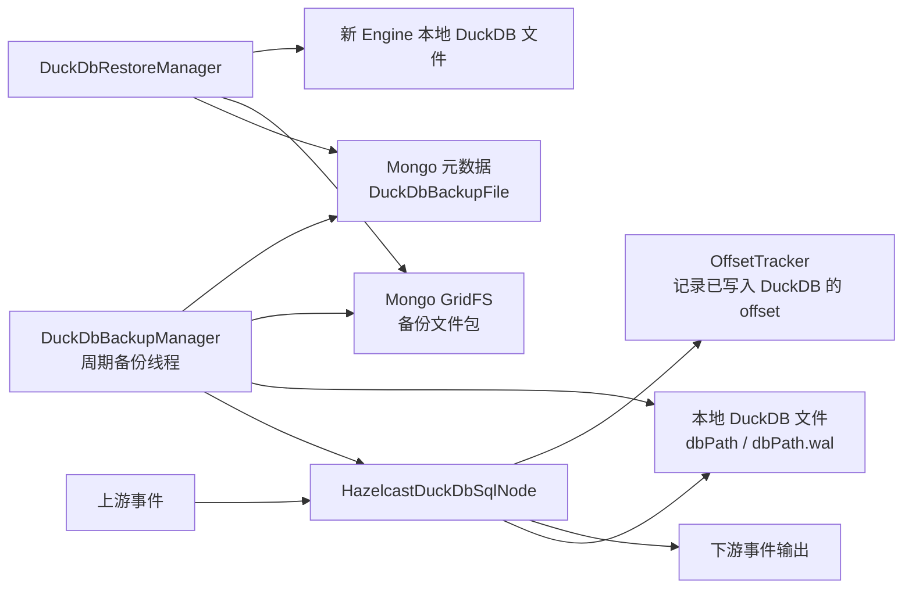

# DuckDB HA方案 - 备份文件方案详细设计

## 1. 文档目的

本文档基于 `docs/DuckDB HA方案-备份文件方案.md` 的大纲，结合当前 Tapdata DuckDB 节点实现，设计一版可落地的 DuckDB HA 备份文件方案。

本方案与“主动维护共享文件”方案是两条不同路线。本文不采用共享文件作为运行态文件，也不要求多个 Engine 访问同一个 DuckDB 数据库文件。本文的核心思路是：

> DuckDB 节点继续使用当前本地文件模式运行；Engine 在稳定一致性点将本地 DuckDB 文件打包上传到中间库 GridFS，并在 Mongo 元数据中记录任务、节点、表和 offset 的绑定关系；任务故障转移或重新调度时，新的 Engine 在打开 DuckDB 前从 GridFS 下载最近可用备份文件恢复本地工作目录，再按备份绑定的 offset 恢复上游读取。

## 2. 现有实现分析

### 2.1 当前 DuckDB 节点职责

Engine 侧核心实现为：

- `io.tapdata.flow.engine.V2.node.hazelcast.processor.HazelcastDuckDbSqlNode`
- `io.tapdata.flow.engine.V2.node.duckdb.DuckDbOperator`
- `io.tapdata.flow.engine.V2.node.duckdb.DuckDbOperatorImpl`

当前 DuckDB 节点的运行模型如下：

1. `doInit()` 解析 `DuckDbSqlNode` 配置。
2. `initDBPath(nodeConfig)` 读取节点级 `dbPath` 或全局 `DEFAULT_DUCK_DB_PATH`。
3. 如果 `dbPath` 非空，当前实现要求它是本地目录，并拼接节点 ID 得到最终 DuckDB 文件路径。
4. `DuckDbOperatorImpl` 使用 `jdbc:duckdb:<dbPath>` 打开本地持久化 DuckDB 文件；`dbPath` 为空时使用内存模式。
5. 上游 DML 事件进入 `processRecordEvent()`，按来源表落入 `PerSourceContext`。
6. 全量阶段批量写入 DuckDB 源缓存表。
7. 所有相关表进入 CDC 后，`handleAllTablesCdcTransition()` 会刷完所有上下文、创建索引、执行 `joinToWideTable()` 构建宽表、再执行 `table2Downstream()` 输出宽表全量。
8. CDC 阶段每批事件先更新 DuckDB 源缓存表，再由 `AffectedKeyCalculator` 和 `WideTableIncrementalUpdater` 维护宽表并输出 changelog。

### 2.2 当前本地文件形态

当前配置里 `DuckDbSqlNode.dbPath` 注释为数据库文件路径，但 Engine 实际把它当作基础目录使用：

```text
nodeConfig.dbPath = /data/tapdata/duckdb
nodeConfig.id     = duck_node_1
final dbPath      = /data/tapdata/duckdb/duck_node_1
```

DuckDB 运行时主要文件为：

- `<dbPath>`：DuckDB 主数据库文件。
- `<dbPath>.wal`：DuckDB WAL 文件，存在时应作为一致性恢复文件的一部分处理。
- `<dbPath>.tmp/`：DuckDB 临时目录，不作为备份恢复内容。

因此备份方案必须基于最终 `dbPath` 文件集合工作，而不是只备份节点配置中的目录。

### 2.3 当前过程状态

`HazelcastDuckDbSqlNode` 除 DuckDB 文件外，还维护了几个影响恢复语义的过程状态：

- `process.INIT_CACHE_TABLE`
- `process.JOIN_TO_WIDE_TABLE`
- `process.TABLE_TO_DOWNSTREAM`
- `acceptPreNodeCount`

这些状态通过 `ConstructIMap` 持久化到外部存储，storeName 为：

```text
DuckDbSqlNodeProcess_<taskId>_<nodeId>
```

备份文件必须和这些过程状态绑定。否则会出现文件里已经有宽表，但 process 认为还未 join；或者 process 认为已输出宽表全量，但文件里没有对应宽表数据。

### 2.4 当前 HA 缺口

当前 DuckDB 节点不支持跨 Engine 高可用，主要缺口为：

- DuckDB 文件只存在当前 Engine 本地磁盘。
- 新 Engine 启动时没有恢复入口，`doInit()` 会直接打开本地 `dbPath`。
- DuckDB 文件和 `processStore` 状态没有版本绑定。
- 没有记录“这个 DuckDB 文件包含了哪些上游 offset”。
- 任务漂移后，新 Engine 可能拿到空 DuckDB 文件，但任务 offset 已经推进，导致本地缓存缺失。

## 3. 设计目标与边界

### 3.1 目标

- 支持包含 DuckDB 节点的任务在 Engine 故障后调度到其他 Engine。
- 新 Engine 可以在 DuckDB 初始化前从中间库恢复 DuckDB 本地文件。
- 备份文件与任务、节点、表和增量 offset 建立明确关系。
- 备份文件与 `process`、`acceptPreNodeCount` 等过程状态保持一致。
- 故障恢复后不丢数据。
- 对正常运行性能影响可控，默认不显著降低单机模式吞吐。

### 3.2 非目标

- 不实现 DuckDB 多主写入。
- 不让多个 Engine 同时打开同一个 DuckDB 文件写入。
- 不依赖共享文件系统作为 DuckDB 运行目录。
- 第一阶段不做块级增量备份或 WAL 流复制。
- 第一阶段不承诺严格 exactly-once。默认恢复语义是 at-least-once，通过回滚到备份 offset 保证不丢；如果下游不是幂等写入，可能需要后续增加“静默追赶”能力来减少重复输出。

## 4. 总体方案

### 4.1 核心流程



### 4.2 一句话设计

本地继续跑，周期打一致性备份包，GridFS 存文件，Mongo 元数据建索引，恢复前先下载，再从备份 offset 重放。

### 4.3 第一阶段恢复语义

第一阶段推荐采用“回滚到备份 offset 重放”的恢复策略：

1. 每个备份都记录 `appliedOffset`，表示 DuckDB 文件已包含的最后上游 offset。
2. 故障转移时，新 Engine 选择最新 `COMMITTED` 备份。
3. 新 Engine 恢复 DuckDB 文件后，把上游恢复起点调整为该备份的 `appliedOffset`。
4. 上游从该 offset 继续读，补齐备份之后的数据。
5. 如果故障前任务进度已经超过该备份 offset，重放期间下游可能收到重复事件；但不会丢失 DuckDB 缓存状态。

为了减少重复输出，第二阶段可以增加“静默追赶”：

- 记录故障前任务 `syncProgress` 为 `targetProgress`。
- 上游从备份 offset 重放。
- DuckDB 节点只更新本地 DuckDB，不向下游输出 offset 小于等于 `targetProgress` 的派生事件。
- 达到 `targetProgress` 后恢复正常输出。

该增强依赖跨数据源 offset 可比较能力，第一阶段不强依赖。

## 5. 新增配置

建议在 `DuckDbSqlNode` 增加 HA 备份配置，默认关闭。

| 字段 | 默认值 | 说明 |
| --- | --- | --- |
| `haBackupEnabled` | `false` | 是否启用备份文件 HA |
| `haBackupStorageType` | `GRIDFS` | 第一阶段固定使用 GridFS |
| `haBackupIntervalMs` | `60000` | 周期备份间隔 |
| `haBackupMinEvents` | `1000` | 距上次备份至少处理多少事件才触发 |
| `haBackupOnFullComplete` | `true` | 全量转 CDC 后立即备份一次 |
| `haBackupOnStop` | `true` | 正常停止或 Engine 下线前尽量做最终备份 |
| `haBackupRetentionCount` | `3` | 每个任务节点保留最近几个成功备份 |
| `haBackupRetentionHours` | `24` | 备份最大保留时间 |
| `haBackupCompressEnabled` | `true` | 是否压缩备份包 |
| `haBackupMaxUploadConcurrency` | `1` | 单节点备份上传并发，第一阶段建议固定 1 |
| `haBackupRestorePolicy` | `LATEST_COMMITTED` | 恢复时选择最新已提交备份 |
| `haBackupOnCorruption` | `FALLBACK_PREVIOUS` | 当前备份校验失败时尝试上一版本 |

约束：

- `haBackupEnabled=true` 时，`dbPath` 必须非空，必须使用文件持久化模式。
- Preview/TestRun 任务默认禁用备份。
- DuckLake 模式与本方案第一阶段互斥，后续单独评估。

## 6. 元数据与文件模型

### 6.1 Mongo 中的呈现形式总览

备份文件在 Mongo 中分为两层呈现：

1. 业务元数据集合：`DuckDbBackupFile`
2. 二进制文件存储：GridFS 默认集合 `fs.files` / `fs.chunks`

`DuckDbBackupFile` 是恢复查询、状态流转、保留策略和任务清理的主索引；GridFS 是备份包的二进制载体。恢复流程必须先查询 `DuckDbBackupFile`，选出一个可恢复的 `COMMITTED` generation，再通过 `gridFsId` 下载 GridFS 文件。不能直接扫描 `fs.files` 来决定恢复版本，因为 `fs.files` 只知道文件存在，不知道该文件是否已经完成业务提交、是否和当前任务节点配置兼容、是否过期、是否被标记删除。

物理呈现如下：

```text
DuckDbBackupFile
  一条文档 = 一个 DuckDB 节点的一代备份版本
  保存 taskId/nodeId/generationId/status/offset/processState/files/archive/gridFsId 等恢复索引

fs.files
  一条文档 = 一个 GridFS 文件，即一个备份 archive
  _id 与 DuckDbBackupFile.gridFsId 对应
  filename 与 DuckDbBackupFile.gridFsFilename 对应
  metadata 中冗余 taskId/nodeId/generationId/offsetHash/status/archiveSha256

fs.chunks
  多条文档 = 一个 GridFS 文件的分块内容
  files_id 指向 fs.files._id
  n 为 chunk 序号
  data 为二进制内容
```

因此，从 Mongo shell 或管理端看到的形态不是“一个集合里直接存完整文件”，而是：

- `DuckDbBackupFile`：可读的 JSON/BSON 备份记录。
- `fs.files`：GridFS 文件头和文件级 metadata。
- `fs.chunks`：GridFS 二进制块，业务逻辑不直接读写。

`DuckDbBackupFile` 不天然等价于 Tapdata Manager 的 REST Model。若 Engine 当前使用 `HttpClientMongoOperator` 通过 Manager REST 访问中间库，而 Manager 侧没有注册 `/api/DuckDbBackupFile` 资源，直接调用该 collection 会得到 404。落地实现需要二选一：

- 在 Manager 侧显式注册 DuckDB 备份元数据服务和清理接口，让 Engine 通过受控 API 查询、删除元数据并管理 GridFS 文件。
- 在 Engine 侧使用可直连 Mongo/GridFS 的 `ClientMongoOperator` 通道，备份模块不走 Manager 泛化 REST collection API。

建议第一阶段采用“Manager 受控 API + GridFS 文件服务”或“Engine 直连 Mongo/GridFS”其中一种明确路径，避免把 `DuckDbBackupFile` 当作未声明的普通 REST 资源使用。

### 6.2 GridFS 文件命名

GridFS 使用默认 `fs.files` / `fs.chunks` 即可，备份包以逻辑路径作为 filename：

```text
duckdb-ha/tasks/<taskId>/nodes/<nodeId>/tables/<tableGroup>/offsets/<offsetHash>/<generationId>.tar.gz
```

说明：

- `taskId`：任务 ID。
- `nodeId`：DuckDB 节点 ID。
- `tableGroup`：第一阶段一个 DuckDB 文件包含多表，统一使用 `__all__`；元数据中记录具体表列表。
- `offsetHash`：对 `appliedOffset` 序列化结果计算 hash，避免文件名过长。
- `generationId`：单调版本号，建议格式 `<eventSerialNo>-<yyyyMMddHHmmssSSS>-<shortUuid>`。

### 6.3 Mongo 元数据集合

新增集合：

```text
DuckDbBackupFile
```

建议文档结构：

```json
{
  "_id": "ObjectId",
  "schemaVersion": 1,
  "taskId": "64f0...",
  "nodeId": "duck_node_1",
  "nodeName": "DuckDB SQL",
  "generationId": "00000128-20260708153045123-a1b2c3",
  "status": "COMMITTED",
  "backupType": "FULL_FILE",
  "storageType": "GRIDFS",
  "gridFsId": "668c...",
  "gridFsFilename": "duckdb-ha/tasks/.../00000128.tar.gz",
  "engineId": "engine-a",
  "taskRunId": "run-20260708153040000-engine-a",
  "backupVersion": 128,
  "parentGenerationId": null,
  "baseGenerationId": null,
  "dbPathFileName": "duck_node_1",
  "createdAt": 1783505445123,
  "completedAt": 1783505447341,
  "backupReason": "PERIODIC",
  "nodeConfigHash": "sha256...",
  "querySqlHash": "sha256...",
  "schemaHash": "sha256...",
  "tableGroup": "__all__",
  "tables": [
    {
      "sourceNodeId": "source_1",
      "sourceTableName": "orders",
      "duckTableName": "orders",
      "role": "MAIN",
      "rowCount": 100000
    },
    {
      "sourceNodeId": "source_2",
      "sourceTableName": "payments",
      "duckTableName": "payments",
      "role": "FROM",
      "rowCount": 200000
    },
    {
      "duckTableName": "wide_orders",
      "role": "WIDE",
      "rowCount": 100000
    }
  ],
  "appliedOffset": {
    "syncStage": "CDC",
    "eventSerialNo": 128,
    "sourceSerialNo": 128,
    "offsetHash": "sha256...",
    "offsetJson": "{...}",
    "batchOffsetJson": "{...}",
    "streamOffsetJson": "{...}",
    "byTable": {
      "source_1.orders": {
        "syncStage": "CDC",
        "offsetJson": "{...}",
        "streamOffsetJson": "{...}",
        "sourceSerialNo": 128
      }
    }
  },
  "processState": {
    "process": {
      "INIT_CACHE_TABLE": true,
      "JOIN_TO_WIDE_TABLE": true,
      "TABLE_TO_DOWNSTREAM": true
    },
    "acceptPreNodeCount": 2,
    "preNodeCount": 2
  },
  "archive": {
    "format": "TAR_GZIP",
    "size": 104857600,
    "sha256": "sha256..."
  },
  "files": [
    {
      "path": "db/duck_node_1",
      "size": 104857600,
      "sha256": "sha256..."
    },
    {
      "path": "db/duck_node_1.wal",
      "size": 0,
      "sha256": "sha256...",
      "optional": true
    }
  ],
  "errorMessage": null,
  "expireAt": "2026-07-09T15:30:45.123Z"
}
```

字段补充：

- `backupVersion`：用于恢复排序的版本号，第一阶段可直接使用 `appliedOffset.eventSerialNo` 或备份生成时的节点级事件序号。
- `taskRunId`：任务本次运行实例 ID，用于区分同一任务在不同 Engine 或不同调度 epoch 下产生的备份。
- `parentGenerationId`：上一代备份 ID。第一阶段全量文件备份中仅用于审计和版本链展示，不作为恢复依赖。
- `baseGenerationId`：增量备份的基础版本。第一阶段固定为空，表示每代备份都是自包含 full snapshot。

### 6.4 状态机

备份元数据状态：

- `CREATING`：已开始创建本地一致性快照。
- `UPLOADING`：已生成本地备份包，正在上传 GridFS。
- `COMMITTED`：GridFS 文件上传完成，校验通过，可用于恢复。
- `FAILED`：备份失败，不可用于恢复。
- `DELETING`：清理任务已标记删除。

恢复只能使用 `COMMITTED` 状态的备份。

### 6.5 索引

建议创建索引：

```text
{ taskId: 1, nodeId: 1, status: 1, completedAt: -1 }
{ taskId: 1, nodeId: 1, generationId: 1 } unique
{ taskId: 1, nodeId: 1, "appliedOffset.offsetHash": 1 }
{ expireAt: 1 }
```

GridFS 文件 metadata 也写入 `taskId`、`nodeId`、`generationId`、`status`、`offsetHash`，便于排查和清理。

### 6.6 GridFS 文件与备份版本的关系

第一阶段建议建立“版本索引关系”，但不建立“增量依赖关系”：

- 每个 `generationId` 对应一个 `DuckDbBackupFile` 元数据文档。
- 每个 `generationId` 对应一个 GridFS archive 文件。
- `DuckDbBackupFile.gridFsId` 指向 `fs.files._id`。
- `fs.files.metadata.generationId` 冗余保存 generation，便于从 GridFS 反查。
- `parentGenerationId` 可以记录上一代 `COMMITTED` 备份，用于审计、展示和后续增量方案演进。
- 恢复时不需要先恢复 parent，再恢复当前 generation；当前 generation 的 archive 必须自包含完整 DuckDB 文件集合。

举例：

```text
generation 5
  DuckDbBackupFile(generationId=5, gridFsId=A, parentGenerationId=4)
  fs.files(_id=A, filename=.../5.tar.gz)

generation 10
  DuckDbBackupFile(generationId=10, gridFsId=B, parentGenerationId=9)
  fs.files(_id=B, filename=.../10.tar.gz)
```

如果某个 Engine 本地已有 generation 5，而 Mongo/GridFS 最新 `COMMITTED` 是 generation 10，第一阶段不做“从 5 增量恢复到 10”。恢复策略是：

1. 如果本地 generation 5 仍是当前任务调度允许使用的安全本地版本，且远端没有更新 generation，则直接使用本地文件。
2. 如果远端 generation 10 更新，下载 generation 10 的完整 archive，校验后替换本地 DuckDB 文件。
3. 不对 generation 6 到 10 做逐代 patch，也不把旧 WAL 叠加到新主文件上。

原因是 DuckDB 主文件和 WAL 必须作为同一个一致性快照处理。没有 DuckDB 官方可依赖的块级变更链或可跨 checkpoint 安全叠加的 WAL 链时，直接从旧主文件 patch 到新主文件风险较高。第一阶段优先保证恢复确定性和不丢数据。

为了避免重复恢复或重复应用文件，恢复端应维护一个本地恢复标记文件，例如：

```text
<dbPath>.tap-duckdb-ha-restore.json
```

记录：

```json
{
  "taskId": "64f0...",
  "nodeId": "duck_node_1",
  "generationId": "00000128-20260708153045123-a1b2c3",
  "backupVersion": 128,
  "archiveSha256": "sha256...",
  "restoredAt": 1783505449000,
  "cleanLocalState": true
}
```

恢复幂等规则：

- 如果本地标记的 `generationId` 与选中的远端 generation 一致，并且 DuckDB 文件校验通过，可以跳过下载和覆盖。
- 如果本地标记版本小于远端版本，恢复远端完整 archive。
- 如果本地标记版本大于远端版本，但该版本没有对应的 `COMMITTED` 元数据，说明本地文件可能来自崩溃前未提交状态，应隔离本地文件并恢复最近远端 `COMMITTED` 版本。
- 如果恢复过程中失败，临时目录和半恢复文件不能更新本地标记；下次启动仍按上一次成功标记或远端元数据重新选择。

### 6.7 关于断点恢复和后续增量能力

需要区分两种“断点”：

1. 传输断点：备份包上传或下载到一半失败后，下次从已传输 chunk 继续。
2. 状态断点：本地 DuckDB 已是 generation 5，只把 5 到 10 的差异应用到本地，使其变成 generation 10。

第一阶段不要求支持状态断点恢复。也就是说，不支持仅通过 GridFS 版本链把本地 DuckDB 从 generation 5 patch 到 generation 10。第一阶段的恢复单位始终是完整 generation archive。

传输断点可以作为独立优化，但不改变恢复语义：

- GridFS 天然按 chunk 存储，但默认 GridFS API 更偏向完整文件上传/下载。
- 如需断点传输，需要在业务侧额外记录 archive 分片 manifest、chunk sha256、已上传 chunk 列表和最终合并校验。
- 断点传输只减少网络和重试成本，不表示支持 DuckDB 文件状态增量恢复。

若后续要实现真正的状态断点恢复，需要新增以下模型：

- `backupMode`: `FULL` / `INCREMENTAL`
- `baseGenerationId`: 增量链基础版本
- `parentGenerationId`: 直接父版本
- `versionStart` / `versionEnd`
- 每个分片或变更集的 checksum
- 增量链完整性校验和保留策略，不能删除仍被后续版本依赖的 base generation

可选技术路线：

- 逻辑重放：从 generation 5 的 `appliedOffset` 读取源端事件，重放到 generation 10 的 `appliedOffset`。这更像“恢复后追赶”，不依赖 GridFS 差异文件；需要多源 offset 可比较和输出 fencing。
- 块级去重：把完整 DuckDB 快照切块存为内容寻址对象，只下载 generation 10 相对本地缺失的块，然后重建完整文件。该方案能节省传输，但仍必须重建并校验 generation 10 完整文件后再打开 DuckDB。
- DuckDB 原生增量能力：如果后续 DuckDB 提供稳定可用的 backup/checkpoint/WAL 增量机制，再考虑用官方能力维护版本链。

结论：当前备份文件方案应先实现 full snapshot 版本链和恢复幂等，暂不承诺从版本 5 直接增量恢复到版本 10。

## 7. 备份一致性设计

### 7.1 为什么不能直接异步复制文件

DuckDB 节点运行时会持续修改本地数据库文件。若备份线程不加协调直接复制 `<dbPath>`，可能出现：

- 复制到一半时 DuckDB 正在写事务。
- 主文件和 WAL 不匹配。
- 文件对应的 offset 已经记录，但 DuckDB 数据并未完整落盘。
- 过程状态和文件内容不一致。

因此备份必须在 DuckDB 写入稳定点执行。

### 7.2 一致性锁

新增一个节点级一致性锁，建议命名：

```text
duckDbBackupConsistencyLock
```

接入原则：

- 所有会修改 DuckDB 文件的路径持有读锁。
- 备份创建本地快照时持有写锁。
- 写锁期间暂停新的 DuckDB flush，避免复制过程中发生文件变更。

需要覆盖的现有关键路径：

- `flushContext()`
- `processInitialSyncStage()`
- `processCdcStage()`
- `handleAllTablesCdcTransition()`
- `joinToWideTable()`
- `table2Downstream()` 中会影响 process 状态的部分
- `manageDuckDbTables()`
- `doClose()` 中 final flush 与 close

第一阶段也可以复用当前 `flushContext()` 的同步边界，但长期建议抽出显式锁，避免依赖 `synchronized(this)` 的隐式行为。

### 7.3 本地一致性快照步骤

备份线程触发后执行：

1. 判断 `haBackupEnabled`、节点运行状态、`dbPath` 是否有效。
2. 如果已有备份上传任务未完成，本轮跳过。
3. 获取 `duckDbBackupConsistencyLock.writeLock()`。
4. 刷新所有 `PerSourceContext` 缓冲。
5. 持久化 `process` 与 `acceptPreNodeCount`。
6. 执行 DuckDB `FORCE CHECKPOINT`，尽量把 WAL 合并到主文件。
7. 从 `DuckDbBackupOffsetTracker` 获取当前 `appliedOffset`。
8. 读取当前 `processState`。
9. 复制 `<dbPath>` 和存在的 `<dbPath>.wal` 到本地临时目录。
10. 释放一致性锁。
11. 在锁外生成 tar.gz 包、计算 sha256、上传 GridFS、提交元数据。

锁内只做 flush、checkpoint 和本地文件复制；压缩、校验和上传在锁外完成，降低对主链路吞吐的影响。

### 7.4 备份触发时机

建议支持以下触发原因：

- `PERIODIC`：按 `haBackupIntervalMs` 周期触发。
- `EVENT_THRESHOLD`：距上次备份已处理事件数超过 `haBackupMinEvents`。
- `FULL_COMPLETE`：所有表全量完成并成功执行 `joinToWideTable()` / `table2Downstream()` 后触发。
- `ENGINE_STOP`：正常停止、Engine 下线、任务迁移前尽力触发。
- `MANUAL`：运维或调试接口手动触发。

其中 `FULL_COMPLETE` 很重要，因为它是 DuckDB 节点状态从全量缓存切换到宽表物化 CDC 的边界。

## 8. Offset 绑定设计

### 8.1 Offset 来源

`TapdataEvent` 当前携带：

- `syncStage`
- `offset`
- `batchOffset`
- `streamOffset`
- `sourceSerialNo`
- `sourceTime`
- `nodeIds`

备份方案新增 `DuckDbBackupOffsetTracker`，在 DuckDB 成功写入后记录 offset，而不是在事件刚进入节点时记录。

### 8.2 更新时机

只有 DuckDB 文件已经成功应用事件后，才能推进 `appliedOffset`：

- 全量阶段：`processInitialSyncStage()` 成功提交后，用本批最后一个事件更新对应表的 batch offset。
- CDC 阶段：`processCdcStage()` 完整完成源缓存表更新和宽表更新后，用本事件更新对应表的 stream offset。
- 全量转 CDC：`handleAllTablesCdcTransition()` 成功完成后，记录 `FULL_COMPLETE` 边界 offset 和 process 状态。

如果 DuckDB 写入失败、DLQ 写入或任务停止，不能推进备份 offset。

### 8.3 多表 offset

DuckDB 节点通常汇聚多张上游表。不能只记录单个 offset，应记录：

```text
taskId / duckNodeId / sourceNodeId / sourceTableName / syncStage / offset
```

元数据中的 `appliedOffset.byTable` 记录每张表最后成功写入 DuckDB 的 offset。`appliedOffset.eventSerialNo` 记录节点级最近事件序号，用于快速排序；真正恢复仍以 byTable 为准。

### 8.4 恢复 offset 策略

第一阶段推荐策略：

1. 恢复时选择一个备份 generation。
2. 将任务恢复 offset 回滚到该 generation 的 `appliedOffset`。
3. 上游从该 offset 重放。

注意：

- 该策略保证 DuckDB 文件不会落后于源重放起点。
- 如果故障前下游已处理超过该 offset 的数据，重放可能产生重复输出。
- 对迁移、同步类任务，应依赖目标端主键 upsert、幂等写入或后续静默追赶能力降低重复影响。
- 如果源端日志已经无法从备份 offset 重放，则不能保证无丢失，应提示用户重新全量或手动修复。

## 9. 备份流程详细设计

### 9.1 初始化接入点

`HazelcastDuckDbSqlNode.doInit()` 的推荐顺序调整为：

1. `super.doInit(context)`
2. 初始化 `clientMongoOperator`
3. 读取 `DuckDbSqlNode` 配置
4. `initDBPath(nodeConfig)`
5. 如果启用 HA 备份，执行 `DuckDbRestoreManager.restoreIfNeeded(...)`
6. 初始化 `DuckDbOperatorImpl`
7. 初始化 DuckDB settings
8. 初始化 `processStore`
9. 加载或覆盖恢复出来的 process 状态
10. 初始化 schema cache、SQL、宽表组件
11. `manageDuckDbTables()`
12. 启动 `DuckDbBackupManager`

恢复必须发生在打开 DuckDB JDBC 连接之前。

### 9.2 备份管理器

新增组件建议：

```text
DuckDbBackupManager
DuckDbFileSnapshotter
DuckDbBackupOffsetTracker
DuckDbBackupRepository
DuckDbBackupCleaner
DuckDbRestoreManager
```

职责：

- `DuckDbBackupManager`：调度周期备份，处理触发条件、并发控制和生命周期。
- `DuckDbFileSnapshotter`：执行 checkpoint、本地复制、打包、sha256。
- `DuckDbBackupOffsetTracker`：维护已应用 offset。
- `DuckDbBackupRepository`：写 Mongo 元数据、上传/下载 GridFS。
- `DuckDbBackupCleaner`：按保留策略删除旧备份。
- `DuckDbRestoreManager`：选择备份、下载、校验、恢复本地文件和 process 状态。

### 9.3 备份伪流程

```text
triggerBackup(reason):
  if not enabled or dbPath is blank:
    return
  if uploadInProgress:
    return
  if not shouldBackup(reason):
    return

  meta = createMeta(status=CREATING, reason=reason)

  lock.writeLock()
  try:
    flushAllContexts(syncStage == CDC)
    persistProcessIfPossible()
    persistAcceptPreNodeCountIfPossible()
    duckDbOperator.execute("FORCE CHECKPOINT")
    offsetSnapshot = offsetTracker.snapshot()
    processSnapshot = processStoreSnapshot()
    localSnapshotDir = copyDbFilesToTemp(dbPath)
  finally:
    lock.writeUnlock()

  archive = buildArchive(localSnapshotDir, manifest)
  updateMeta(status=UPLOADING)
  gridFsId = uploadArchiveToGridFS(archive, metadata)
  verifyUpload(gridFsId, archive.sha256)
  updateMeta(status=COMMITTED, gridFsId=gridFsId)
  cleanupOldBackups()
```

### 9.4 备份包内容

tar.gz 内部建议结构：

```text
manifest.json
db/
  <nodeId>
  <nodeId>.wal
checksums/
  sha256.txt
```

其中 `<nodeId>.wal` 可选；如果 `FORCE CHECKPOINT` 后不存在，不需要强制创建。

`manifest.json` 内容应与 Mongo 元数据核心字段一致，保证 GridFS 文件即使脱离元数据也可排查。

## 10. 恢复流程详细设计

### 10.1 选择备份

恢复时查询：

```text
taskId = 当前任务 ID
nodeId = 当前 DuckDB 节点 ID
status = COMMITTED
nodeConfigHash/schemaHash 与当前节点兼容
按 completedAt 倒序
```

选择最新可用 generation。若校验失败，按 `haBackupOnCorruption=FALLBACK_PREVIOUS` 尝试上一代。

### 10.2 恢复源选择

恢复入口必须在打开 DuckDB JDBC 连接前完成，并且先决定使用本地文件还是远端 GridFS 备份。

恢复源选择规则：

| 场景 | 本地 DuckDB 文件 | 本地恢复标记 | 远端最新 `COMMITTED` | 处理策略 |
| --- | --- | --- | --- | --- |
| 新 Engine 首次接管 | 不存在 | 不存在 | 存在 | 下载远端最新 generation 并恢复 |
| 同 Engine 干净重启 | 存在 | generation 与远端一致 | 存在 | 本地校验通过则直接使用本地文件 |
| 同 Engine 本地版本落后 | 存在 | generation 小于远端 | 存在 | 下载远端最新 full archive 替换本地文件 |
| 同 Engine 本地版本领先但未提交 | 存在 | generation 大于远端或无远端记录 | 存在或不存在 | 隔离本地文件，恢复远端最新 `COMMITTED`；无远端则按任务策略决定失败或重新全量 |
| 本地文件存在但无标记 | 存在 | 不存在 | 存在 | 默认视为不可证明一致，隔离本地文件并恢复远端 |
| 本地文件存在但校验失败 | 存在 | 任意 | 存在 | 隔离本地文件，恢复远端；远端也失败则 fallback 上一代 |
| 无本地且无远端 | 不存在 | 不存在 | 不存在 | 作为首次运行初始化空 DuckDB；如果任务进度不是初始态则启动失败 |

本地文件可以直接使用的条件应较严格：

- 本地恢复标记存在。
- 标记中的 `taskId/nodeId` 与当前任务节点一致。
- 标记中的 `generationId/archiveSha256` 能在 Mongo 元数据中找到对应 `COMMITTED` 记录，或该文件来自本次干净停止且最终备份已提交。
- DuckDB 能正常打开并通过基础校验。
- 当前调度 epoch 仍允许该 Engine 作为 Active Engine。

这条规则避免“引擎离线后又恢复”时误用崩溃前未提交的本地 DuckDB 文件。宁可回滚到最近远端 `COMMITTED` 备份并重放，也不要使用无法证明与 offset/processState 一致的本地文件。

### 10.3 本地恢复步骤

```text
restoreIfNeeded(taskId, nodeId, dbPath):
  local = inspectLocalDuckDb(dbPath, marker)
  remote = findCommittedBackups(taskId, nodeId)

  decision = chooseRestoreSource(local, remote, taskRunId, schedulerEpoch)
  if decision == USE_LOCAL:
    verify local DuckDB file
    restore processStore from local marker or matched remote meta
    return LOCAL(meta.appliedOffset)

  meta = decision.selectedRemoteBackup
  if meta is null:
    return NO_BACKUP

  download GridFS archive to temp
  verify archive sha256
  extract to temp
  verify file sha256
  move existing local dbPath to backup directory
  copy extracted db/<nodeId> to dbPath
  copy extracted db/<nodeId>.wal to dbPath.wal if exists
  restore processStore from meta.processState
  record restore result in log and optional metadata
  return RESTORED(meta.appliedOffset)
```

恢复完成后再创建 `DuckDbOperatorImpl` 打开本地文件。

### 10.4 恢复后校验

打开 DuckDB 后执行轻量校验：

- `SELECT 1`
- 查询 `information_schema.tables`，确认关键缓存表和宽表存在。
- 可选执行每张表 `count(*)`，与备份元数据 `rowCount` 做弱校验。
- 校验 `processState` 与表存在性是否一致：
  - `JOIN_TO_WIDE_TABLE=true` 时，宽表必须存在。
  - `TABLE_TO_DOWNSTREAM=true` 时，宽表基线应已存在。

如果校验失败：

1. 关闭 DuckDB。
2. 将当前恢复文件移到隔离目录。
3. 尝试上一代备份。
4. 全部失败时任务启动失败，并给出可操作错误信息。

## 11. 服务恢复和任务调度场景

DuckDB HA 备份文件方案需要覆盖计划内迁移、手动停止重启、故障漂移和原 Engine 快速恢复四类场景。四类场景的共同前提是：调度层必须为任务运行分配单调递增的运行实例或调度 epoch，备份元数据必须记录 `engineId + taskRunId + schedulerEpoch`，恢复端只允许当前 Active epoch 写入和提交新的备份。

### 11.1 任务被调度到其他 Engine

这是计划内迁移或用户指定 Engine 调度场景，旧 Engine 理论上能收到停止信号。

处理流程：

1. 调度层先冻结旧 Engine 对该任务的事件接收，确保不会继续推进 DuckDB 写入。
2. 旧 Engine 执行 `flushAllContexts`，把内存 buffer 写入 DuckDB。
3. 旧 Engine 执行 checkpoint，并生成 `ENGINE_STOP` 或 `SCHEDULE_TRANSFER` 备份。
4. 备份上传成功后，元数据进入 `COMMITTED`。
5. 调度层把任务分配给新 Engine，并生成新的 `taskRunId/schedulerEpoch`。
6. 新 Engine 在打开 DuckDB 前查询最新 `COMMITTED` 备份。
7. 新 Engine 下载并恢复该备份，将上游恢复起点回滚到 `appliedOffset`。
8. 新 Engine 继续处理并产生新 generation。

如果旧 Engine 最终备份失败，新 Engine 不等待失败版本，也不读取 `CREATING/UPLOADING` 版本，而是恢复最近一个已存在的 `COMMITTED` 版本。

该场景推荐恢复源：

- 新 Engine 本地通常没有 DuckDB 文件，使用远端最新 `COMMITTED`。
- 如果新 Engine 上残留同一任务节点旧文件，只有本地标记与远端选中 generation 一致且校验通过时才可复用，否则隔离后恢复远端。

### 11.2 任务手动停止后再次重启，并调度回同一个 Engine

这是最容易复用本地文件的场景，因为停止过程通常是干净的。

处理流程：

1. 用户停止任务。
2. 当前 Engine 停止接收新事件。
3. DuckDB 节点 flush 内存 buffer。
4. 如果 `haBackupOnStop=true`，执行 `ENGINE_STOP` 最终备份。
5. 备份成功后写入本地恢复标记，记录 `generationId`、`backupVersion`、`archiveSha256`、`cleanLocalState=true`。
6. 任务再次启动且被调度回同一 Engine。
7. 恢复入口先检查本地 DuckDB 文件和本地恢复标记。
8. 如果本地 generation 与 Mongo 最新 `COMMITTED` generation 一致，并且 DuckDB 文件校验通过，直接使用本地文件。
9. 如果本地文件损坏、标记缺失、版本落后或版本不可证明，则从 GridFS 恢复最新 `COMMITTED`。

该场景的目标是避免无意义下载，但不能牺牲一致性。即使回到同一个 Engine，也不能只因为 `<dbPath>` 文件存在就跳过恢复判断。

### 11.3 当前 Engine 离线，任务被系统调度到其他 Engine

这是非计划故障转移场景，旧 Engine 可能没有机会做最终备份。

处理流程：

1. 调度层发现旧 Engine 心跳超时，关闭旧 Engine 的任务租约。
2. 调度层创建新的 `taskRunId/schedulerEpoch`，把任务分配给新 Engine。
3. 新 Engine 查询 `DuckDbBackupFile` 中最新 `COMMITTED` generation。
4. 新 Engine 下载 GridFS archive，校验 archive 和内部文件 checksum。
5. 恢复 DuckDB 本地文件和 `processState`。
6. 将上游恢复点回滚到备份的 `appliedOffset`。
7. 从 `appliedOffset` 之后重放数据，补齐旧 Engine 离线前未进入备份的增量。

该场景不能依赖旧 Engine 本地文件，也不能使用旧 Engine 未提交的 `CREATING/UPLOADING` 备份。RPO 由最近一次 `COMMITTED` 备份决定；为了降低重复输出窗口，需要缩短备份间隔或在第二阶段实现静默追赶。

### 11.4 当前 Engine 离线后恢复，任务又立刻回到当前 Engine

这是最容易出现竞态的场景，需要以调度 epoch 和远端 `COMMITTED` 版本为准，而不是以本地文件新旧为准。

可能发生两种子场景：

1. Engine A 短暂离线，任务还没有被其他 Engine 接管，A 恢复后继续拥有当前 Active epoch。
2. Engine A 离线后任务已被 Engine B 接管，随后调度层又把任务重新分配回 Engine A。

处理规则：

- 如果 A 仍拥有同一个 Active epoch，并且本地 DuckDB 文件有干净停止或已提交 generation 标记，可以按“同 Engine 干净重启”规则校验后使用本地文件。
- 如果任务曾经被 B 接管，A 旧进程或旧本地文件必须视为过期运行态；A 再次拿到任务时是新的 `taskRunId/schedulerEpoch`，必须重新走恢复源选择。
- 如果 A 本地标记为 generation 5，而 GridFS 最新 `COMMITTED` 是 generation 10，A 必须恢复到 generation 10，不能继续使用 generation 5。
- 如果 A 本地文件看起来比远端更新，但没有对应 `COMMITTED` 元数据，说明这部分状态没有进入 HA 备份闭环；默认隔离本地文件，恢复远端最近 `COMMITTED`。
- 如果 B 已经输出过 generation 10 之后的数据，A 恢复 generation 10 后应从 generation 10 的 `appliedOffset` 继续，不从旧本地 generation 5 继续。

该场景的关键原则：

- 任务归属以调度层最新 epoch 为准。
- 恢复基线以 Mongo 最新可用 `COMMITTED` generation 为准。
- 本地文件只是一种可复用缓存，不能覆盖远端已提交版本。
- 任何旧 epoch 产生但未提交的备份都不能被新 epoch 自动采用。

### 11.5 四类场景决策表

| 场景 | 是否有机会最终备份 | 默认恢复源 | offset 处理 | 重复输出风险 |
| --- | --- | --- | --- | --- |
| 任务计划调度到其他 Engine | 有 | 旧 Engine 最终 `COMMITTED` 备份 | 回滚到最终备份 `appliedOffset` | 低 |
| 手动停止后回到同一 Engine | 有 | 本地已校验文件；失败则远端备份 | 本地/远端 generation 对应 `appliedOffset` | 低 |
| 当前 Engine 离线后调度到其他 Engine | 无或不可靠 | 远端最近 `COMMITTED` 备份 | 回滚到最近备份 `appliedOffset` | 中，取决于备份间隔 |
| 当前 Engine 恢复后任务又回到当前 Engine | 视是否换过 epoch | 先比较 epoch 和 generation；通常以远端最新为准 | 以选中 generation 的 `appliedOffset` 为准 | 中，取决于是否发生过接管 |

## 12. 与当前 Tapdata 生态的集成点

### 12.1 GridFS

Engine 侧已有 `clientMongoOperator.getGridFSBucket()` 能拿到 `GridFSBucket`。备份方案可直接在 Engine 内上传和下载文件，不需要绕到 TM HTTP 文件接口。

TM 侧已有 `FileService` 使用 `GridFsTemplate` 管理 GridFS 文件，可作为后续管理端下载、查看、清理的参考。

需要注意 Engine 到 Mongo 的访问形态：

- 如果 Engine 使用直连 Mongo 的 `ClientMongoOperator`，备份模块可以直接读写 `DuckDbBackupFile` 集合和 GridFS。
- 如果 Engine 使用 `HttpClientMongoOperator`，读写集合会被转换成 Manager REST API 请求。此时只有 Manager 已注册的资源才能访问，不能假设 `/api/DuckDbBackupFile` 天然存在。
- 因此，云版或 HTTP 代理部署形态下，应在 Manager 侧提供 DuckDB 备份专用 API，例如查询最新备份、提交元数据、上传文件、下载文件、删除任务节点备份等，而不是让 Engine 直接拼通用 collection URL。
- 任务 reset 清理也应走同一套受控 API，保证同时删除 `DuckDbBackupFile` 元数据和 GridFS 文件。

### 12.2 外部状态存储

当前 DuckDB 节点已经使用 `ConstructIMap` 保存 process 状态。备份方案不替代它，而是在备份元数据中保存同一份快照，并在恢复时把快照写回 processStore，保证 `doInit()` 后加载到的过程状态与 DuckDB 文件一致。

### 12.3 任务清理

当前 `TaskCleaner` 在 DuckDB 节点重置时调用：

```text
HazelcastDuckDbSqlNode.cleanCache(node)
```

该逻辑当前会清理 DuckDB 表和 process 状态。启用备份方案后，还需要追加：

- 删除或标记删除 `DuckDbBackupFile` 中对应 `taskId/nodeId` 的元数据。
- 删除关联 GridFS 文件。
- 清理本地恢复残留目录。

### 12.4 任务复制和节点 ID 变化

备份绑定 `taskId + nodeId`。如果任务复制产生新的 taskId 或 nodeId，默认不继承旧备份，避免错误恢复到另一个任务。

如果后续需要支持“任务克隆携带备份”，必须显式执行备份迁移并重写元数据中的 taskId/nodeId。

## 13. 异常处理

### 13.1 备份失败

备份失败不应直接中断主任务，除非连续失败超过阈值且用户配置为严格 HA。

处理：

- 元数据标记 `FAILED`。
- 记录错误信息和堆栈摘要。
- 下一周期继续尝试。
- 指标上报 `lastBackupFailedAt`、`consecutiveFailureCount`。

### 13.2 GridFS 上传失败

- 本地临时备份包保留短时间用于重试。
- 不更新为 `COMMITTED`。
- 恢复端不会读取半成品。

### 13.3 本地磁盘不足

- 备份前检查 `dbPath` 文件大小和临时目录剩余空间。
- 空间不足时跳过本轮备份并告警。
- 不影响主任务运行。

### 13.4 备份文件损坏

- 下载后校验 archive sha256。
- 解压后校验每个文件 sha256。
- 校验失败则尝试上一代。
- 所有备份失败时任务启动失败，不自动创建空 DuckDB 文件继续跑。

### 13.5 源端 offset 不可重放

如果恢复时需要回滚到备份 offset，但源端日志已过期或 offset 不可用：

- 任务启动失败并提示需要重新全量或人工处理。
- 不允许用空 DuckDB 文件从当前任务进度继续跑，否则会造成 DuckDB 缓存缺失。

## 14. 性能设计

### 14.1 降低主链路阻塞

- 周期线程只在 flush/checkpoint/本地复制阶段阻塞 DuckDB 写入。
- 压缩和 GridFS 上传在锁外执行。
- 如果上一轮上传未完成，下一轮直接跳过。
- 可通过 `haBackupIntervalMs` 和 `haBackupMinEvents` 控制频率。

### 14.2 大文件优化

第一阶段采用全量文件备份，简单可靠。对于大 DuckDB 文件：

- 建议默认保留 2 到 3 份。
- 压缩可配置关闭，避免 CPU 抢占。
- 可限制备份只在 CDC 低峰或 full complete 关键点执行。
- 后续增强可评估 WAL 增量、文件块去重或对象存储分片。

### 14.3 指标

建议增加以下指标：

- `duckdb_backup_last_success_time`
- `duckdb_backup_last_failure_time`
- `duckdb_backup_duration_ms`
- `duckdb_backup_checkpoint_duration_ms`
- `duckdb_backup_local_copy_duration_ms`
- `duckdb_backup_upload_duration_ms`
- `duckdb_backup_archive_size_bytes`
- `duckdb_backup_applied_event_serial_no`
- `duckdb_restore_duration_ms`
- `duckdb_restore_generation_id`

## 15. 安全和兼容性

### 15.1 配置兼容

- 默认关闭，不影响现有单机 DuckDB 逻辑。
- 未配置 `dbPath` 且启用 HA 时启动失败，提示必须使用文件持久化模式。
- 现有 `dbPath` 的路径拼接规则保持不变。

### 15.2 版本兼容

备份元数据必须记录：

- `schemaVersion`
- Engine 版本
- DuckDB JDBC 版本
- `nodeConfigHash`
- `schemaHash`

恢复时如发现不兼容：

- 默认拒绝恢复。
- 可提供运维强制恢复开关，但不建议自动启用。

### 15.3 数据安全

GridFS 文件在中间库中保存 DuckDB 数据，可能包含业务数据。需要遵循现有中间库权限和租户隔离策略。后续可增加：

- 备份包加密。
- 敏感字段脱敏不适用于本方案，因为 DuckDB 文件用于真实恢复。
- 按租户、任务维度权限校验下载接口。

## 16. 分阶段落地计划

### 16.1 第一阶段：可用 HA

目标：故障转移后能恢复 DuckDB 文件并从备份 offset 重放，不丢数据。

范围：

- 新增配置，默认关闭。
- Engine 侧新增备份管理器、GridFS 仓储、元数据集合。
- 在 DuckDB 初始化前增加恢复入口。
- 周期全量文件备份。
- 绑定 process 状态和 appliedOffset。
- TaskCleaner 清理备份。
- 单元测试和基本集成测试。

### 16.2 第二阶段：降低重复输出

目标：恢复时尽量不重复写下游。

范围：

- 记录故障前任务 `syncProgress`。
- 引入静默追赶模式。
- 增强 offset 比较和多源表恢复控制。
- 对 output changelog 增加恢复 fencing。

### 16.3 第三阶段：性能增强

目标：降低大库备份成本。

范围：

- 增量备份或 WAL 备份。
- 分片上传。
- 对象存储适配。
- 备份压缩策略自适应。

## 17. 测试验收

### 17.1 单元测试

- `DuckDbBackupOffsetTracker` 多表 offset 更新。
- `DuckDbFileSnapshotter` 文件收集、manifest、sha256。
- `DuckDbBackupRepository` 元数据状态流转。
- `DuckDbRestoreManager` 选择最新可用备份。
- processState 写入和恢复。
- 清理策略只删除过期或超保留数量备份。

### 17.2 集成测试

- 全量阶段备份后恢复，验证缓存表行数。
- 全量转 CDC 后备份，恢复后验证宽表存在、process 状态正确。
- CDC 阶段备份，恢复后继续处理后续 CDC，验证宽表最终一致。
- 多上游表 join 场景，验证 byTable offset。
- GridFS 文件损坏，自动 fallback 到上一代。
- 最新备份 `UPLOADING` 未提交，恢复端跳过。
- 任务 reset 后备份文件和元数据被清理。
- `dbPath` 为空且启用 HA，启动失败并输出明确错误。

### 17.3 故障演练

- Engine 正常停止，验证 `ENGINE_STOP` 备份。
- Engine 进程直接 kill，验证使用最近 `COMMITTED` 备份恢复。
- 新 Engine 恢复到不同本地目录，验证 DuckDB 可打开。
- 恢复后从备份 offset 重放，验证不丢数据。

## 18. 关键风险与应对

| 风险 | 影响 | 应对 |
| --- | --- | --- |
| 备份文件大，周期备份影响吞吐 | 性能下降 | 锁外上传、降低频率、保留少量版本、后续增量备份 |
| 恢复回滚 offset 导致重复输出 | 下游重复 | 第一阶段要求下游幂等；第二阶段做静默追赶 |
| 源端日志无法回滚到备份 offset | 无法恢复 | 缩短备份周期，监控 RPO，失败时要求重新全量 |
| process 状态与文件不一致 | 重复 join 或漏输出 | processState 写入 manifest，恢复前写回 processStore |
| 半成品备份被恢复 | DuckDB 打不开 | 元数据状态机，恢复只读 `COMMITTED` |
| 多 Engine 竞态上传旧备份 | 误恢复旧版本 | 元数据记录 engineId/运行实例，恢复按 completedAt 和运行实例规则过滤 |

## 19. 结论

备份文件方案可以在不改变 DuckDB 单机本地运行模型的前提下，为 Tapdata DuckDB 节点提供可落地的 HA 能力。第一阶段以 GridFS 全量文件备份和 Mongo 元数据索引为核心，重点保证“不丢 DuckDB 本地状态”和“可从备份 offset 重放”。它对现有链路侵入较小，主要改造集中在 DuckDB 节点初始化、写入稳定点、备份线程、恢复入口和任务清理。

该方案的主要取舍是：第一阶段为了保证不丢数据，会采用回滚到备份 offset 重放的 at-least-once 语义，可能带来重复输出。若业务要求恢复后尽量不重复，应在第二阶段增加静默追赶和 offset fencing。
