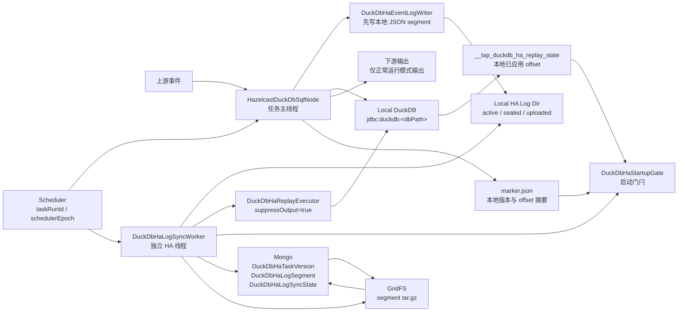
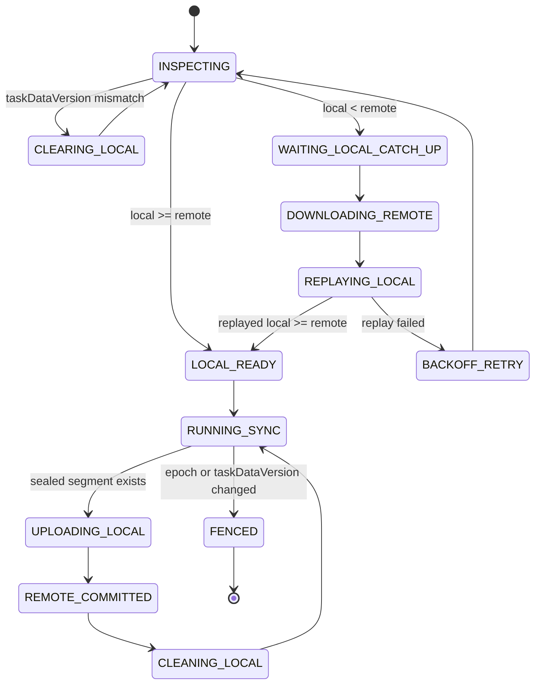

# DuckDB HA方案 - 备份文件方案详细设计 V2

## 1. 文档目的

本文档用于重新定义 DuckDB HA “备份文件方案”的 V2 详细设计。

V1/V2 早期讨论中，备份对象是本地 DuckDB 主数据库文件和 WAL 文件。经过对 DuckDB 本地文件形态和 Tapdata 事件处理链路的分析，本文将备份对象调整为 Tapdata 自主维护的逻辑事件日志文件：

```text
旧对象：DuckDB 主数据库文件 / WAL / 文件快照
新对象：Tapdata 规范化事件 JSON segment / segment tar.gz / Mongo GridFS
```

调整后的核心思路是：

> DuckDB 任务和 HA 日志备份恢复线程独立运行。DuckDB 任务仍然使用本地 `jdbc:duckdb:<local dbPath>` 文件运行，现有全量、CDC、宽表更新、processState 等主处理逻辑保持不变。任务主线程收到上游事件后，先将事件按任务版本、源表和顺序写成本地 JSON 日志 segment，再按现有逻辑写入本地 DuckDB。独立 HA 线程定期扫描已封口的新增 JSON segment，压缩成 tar 包上传 Mongo GridFS，并提交 Mongo 元数据。任务启动前先检查本地 DuckDB 已回放 offset 与远端 GridFS 已提交日志 offset 是否一致：本地不落后则放行；本地落后则先下载缺失 segment 并 replay 到本地 DuckDB，追平后再放行。备份完成并且本地已回放完成的 JSON 文件可以安全清理，不长期额外占用本地磁盘。

本方案仍属于“备份文件方案”，但这里的“备份文件”不再是 DuckDB 自身的数据库文件，而是 Tapdata 自主维护的事件日志文件。DuckDB 主文件在本方案中被定位为本地可重建缓存。

## 2. 背景与方案边界

### 2.1 为什么不继续上传 DuckDB 主数据库文件

DuckDB 以单个数据库文件为主，运行时可能存在 WAL、临时目录、checkpoint 等状态。对当前 Tapdata 场景来说，直接把 DuckDB 主文件作为 HA 备份对象会带来几个问题：

- 运行中主文件不是天然可复制的一致性增量日志。
- DuckDB 本地目录下不会按 Tapdata 事件自然新增一组可识别的业务文件块。
- 如果每次同步都完整扫描并上传主数据库文件，大任务下上传成本会随缓存体积增长，而不是随新增事件增长。
- 如果只尝试做文件块 patch，需要可靠的块级变更链、校验、断点和 WAL 语义支持，当前 Tapdata 生态没有这条完整链路。
- reset、跨 Engine 调度和 epoch fencing 场景下，主文件快照的版本边界比较重，恢复时只能选择完整快照，不容易从 local 5 增量恢复到 remote 10。

Tapdata 在 DuckDB 节点前已经有规范化事件流。与其备份 DuckDB 主文件，不如把进入 DuckDB 的事件先落成本地可顺序 replay 的日志文件。这样 HA 备份对象与 Tapdata 的任务版本、源表、offset、processState 能直接建立关系。

### 2.2 与“主动维护共享文件”方案的关系

本文不采用主动维护共享文件方案中的实现逻辑。

本方案明确不做：

- 不把共享文件作为 DuckDB 运行时数据库文件。
- 不让多个 Engine 同时打开同一个 DuckDB 文件。
- 不把 Mongo/GridFS 文件挂载成本地 DuckDB 文件。
- 不要求 DuckDB 自身具备远程文件并发写能力。

本方案只要求：

- 每个 Engine 仍使用自己的本地 DuckDB 文件。
- Mongo GridFS 保存可恢复的逻辑日志文件。
- HA 线程保证本地 DuckDB 可通过逻辑日志追平到远端 committed offset。

### 2.3 设计目标

本方案需要达到以下目标：

- DuckDB 任务运行逻辑保持本地文件模式。
- DuckDB 任务主线程和 HA 日志同步线程职责分离。
- 任务启动前通过 startup gate 校验本地与远端是否一致。
- 支持任务调度到其他 Engine 后恢复本地 DuckDB 缓存。
- 支持手动停止后回同一 Engine 快速启动。
- 支持 Engine 离线后由其他 Engine 接管。
- 支持 Engine 恢复后再次接管时按版本和 offset 决策。
- 支持任务 reset 后刷新任务数据版本，并清理旧版本 GridFS 文件块。
- 支持从 local offset 5 只下载 remote offset 6 到 10 的日志 segment 追平，而不是从 0 重放到 10。
- 支持本地 JSON 日志在远端提交且本地已应用后被清理，避免额外磁盘长期增长。
- 支持 Manager/Observable 展示 HA 同步、replay、清理和异常状态。

### 2.4 非目标

第一阶段不实现：

- DuckDB 主数据库文件的块级增量备份。
- DuckDB WAL 远程流复制。
- 多 Engine 同时写同一个 DuckDB 文件。
- 跨 Engine 共享本地 active JSON 文件。
- 远端日志的任意裁剪和压缩基线。没有逻辑 compaction 前，当前 taskDataVersion 下的远端 committed segment 链必须保留完整。
- 下游严格 exactly-once 语义。恢复 replay 阶段不向下游输出，正常运行阶段仍遵循 Tapdata 当前任务语义。

## 3. 当前 DuckDB 节点运行模型

### 3.1 Engine 侧核心类

当前 DuckDB SQL 节点主要由以下类承载：

- `io.tapdata.flow.engine.V2.node.hazelcast.processor.HazelcastDuckDbSqlNode`
- `io.tapdata.flow.engine.V2.node.duckdb.DuckDbOperator`
- `io.tapdata.flow.engine.V2.node.duckdb.DuckDbOperatorImpl`
- `io.tapdata.flow.engine.V2.node.duckdb.PerSourceContext`
- `io.tapdata.flow.engine.V2.node.duckdb.WideTableIncrementalUpdater`
- `io.tapdata.flow.engine.V2.node.duckdb.AffectedKeyCalculator`

当前处理链路可以概括为：

1. `HazelcastDuckDbSqlNode.doInit()` 解析 `DuckDbSqlNode` 配置。
2. `initDBPath(nodeConfig)` 根据配置得到最终本地 DuckDB 文件路径。
3. `DuckDbOperatorImpl` 通过 `jdbc:duckdb:<dbPath>` 打开本地文件。
4. 上游事件进入 `processRecordEvent()`。
5. 事件按源节点、源表进入对应 `PerSourceContext`。
6. 全量阶段将源表数据写入 DuckDB 源缓存表。
7. 所有前置表达到 CDC 边界后，节点创建索引、执行宽表 join，并输出宽表基线。
8. CDC 阶段根据变更事件更新源缓存表、宽表和 changelog。

V2 不改变以上主流程，只在事件进入 DuckDB 写入前增加一层“本地 HA 事件日志写入”，并在启动前增加“HA replay 追平”。

### 3.2 本地 DuckDB 文件形态

当前配置里 `DuckDbSqlNode.dbPath` 表示本地 DuckDB 文件所在基础路径。Engine 实际会结合节点 ID 得到最终路径：

```text
nodeConfig.dbPath = /data/tapdata/duckdb
nodeConfig.id     = duck_node_1
final dbPath      = /data/tapdata/duckdb/duck_node_1
```

DuckDB 运行时主要文件为：

```text
<dbPath>       DuckDB 主数据库文件
<dbPath>.wal   DuckDB WAL 文件
<dbPath>.tmp/  DuckDB 临时目录
```

V2 中这些文件只作为本地运行态缓存，不进入 GridFS 备份对象。远端 GridFS 中保存的是事件日志 segment tar 包。

### 3.3 现有 processState 语义

DuckDB 节点除本地 DuckDB 文件外，还依赖过程状态：

```text
DuckDbSqlNodeProcess_<taskId>_<nodeId>
```

关键字段包括：

- `process.INIT_CACHE_TABLE`
- `process.JOIN_TO_WIDE_TABLE`
- `process.TABLE_TO_DOWNSTREAM`
- `acceptPreNodeCount`
- `preNodeCount`

这些状态决定全量缓存、宽表构建、宽表全量输出和 CDC 阶段切换。如果只 replay DML 事件而不恢复 processState，恢复后可能出现：

- DuckDB 里已经有源缓存表，但流程认为还没有初始化缓存表。
- DuckDB 里已经构建宽表，但流程再次 join 并重复输出全量。
- 流程认为已经输出全量，但本地 DuckDB 缓存并未达到对应状态。

因此 V2 的事件日志必须包含两类记录：

- 数据事件：insert/update/delete/ddl/schema 等会影响 DuckDB 缓存的数据。
- 控制事件：全量表完成、所有前置节点完成、join 完成、table to downstream 完成等会影响 processState 的 barrier。

## 4. 总体架构

### 4.1 四层模型

V2 分为四层：

| 层 | 位置 | 职责 |
| --- | --- | --- |
| 任务运行层 | `HazelcastDuckDbSqlNode` | 消费上游事件，写本地 JSON 日志，再按现有逻辑写 DuckDB |
| 本地日志层 | `<dbPath>.ha-log` | 保存 active/sealed/uploaded/replay-temp JSON segment |
| 远端日志层 | Mongo + GridFS | 保存 `DuckDbHaLogSegment` 元数据和 segment tar 包 |
| 本地状态层 | DuckDB replay state + marker | 记录本地 DuckDB 已应用到哪个 taskDataVersion 和 offset |

这四层的关系是：

```text
上游事件 -> 本地 JSON 日志 -> 本地 DuckDB apply -> replay state
                    |
                    v
              sealed segment -> tar.gz -> GridFS -> DuckDbHaLogSegment.COMMITTED
```

启动时方向相反：

```text
DuckDbHaLogSegment.COMMITTED -> GridFS tar.gz -> replay-temp -> 本地 DuckDB replay -> replay state -> startup gate ready
```

### 4.2 架构图



### 4.3 关键组件

| 组件 | 所在侧 | 职责 | 关键约束 |
| --- | --- | --- | --- |
| `DuckDbHaStartupGate` | Engine | 任务启动门闩，阻塞业务消费，直到本地 DuckDB replay offset 不落后远端 committed offset | 版本不一致优先清理本地，不能只比较 offset |
| `DuckDbHaEventLogWriter` | Engine | 将规范化事件追加到本地 active NDJSON 文件，并按策略封口 | 日志写成功后才能写 DuckDB |
| `DuckDbHaLogSegmenter` | Engine | 按时间、大小、事件数、barrier、任务停止将 active 文件转为 sealed | 文件名排序不能作为唯一顺序依据，必须以 sequence 为准 |
| `DuckDbHaLogSyncWorker` | Engine | 独立线程，bootstrap 阶段下载 replay，running 阶段上传 sealed segment 和清理本地日志 | 必须校验 taskDataVersion 和 schedulerEpoch |
| `DuckDbHaReplayExecutor` | Engine | 从远端 segment replay 到本地 DuckDB | `suppressOutput=true`，不推进外部源端 offset |
| `DuckDbHaReplayStateStore` | Engine/DuckDB | 在 DuckDB 内记录每个源表已应用 sequence/offset | apply 和 state 更新应在同一事务中完成 |
| `DuckDbHaLocalMarkerStore` | Engine/本地磁盘 | 原子写入 `marker.json`，保存本地版本和 offset 摘要 | marker 缺失或校验失败时本地不可直接信任 |
| `DuckDbHaLogRepository` | Engine/Manager | 封装 Manager API 或直连 Mongo/GridFS 的元数据和文件操作 | HTTP Operator 场景不能假设通用 `/api/<collection>` 存在 |
| `DuckDbHaTaskVersion` | Manager/Mongo | 保存远端权威 `taskDataVersion` | reset 后即使没有任何 segment，也能识别本地旧版本无效 |
| `DuckDbHaLogSyncState` | Manager/Mongo | 保存可观测同步状态 | 只用于展示和排障，不作为唯一恢复依据 |

### 4.4 设计主线

本方案的主线可以总结为三句话：

1. 正常运行时，事件先落本地 JSON 日志，再写本地 DuckDB。
2. 远端只保存 sealed JSON segment tar 包，不保存 DuckDB 主文件。
3. 启动前用 taskDataVersion 和 offset 判断本地是否追平远端，未追平则先 replay 缺失 segment。

## 5. 本地 JSON 日志设计

### 5.1 本地目录结构

每个 DuckDB 节点在本地 DuckDB 文件旁维护一个 HA 日志目录：

```text
<dbPath>.ha-log/
  marker.json
  marker.json.tmp
  active/
    <taskDataVersion>/<sourceNodeId>/<sourceTableName>/
      current.ndjson
  sealed/
    <taskDataVersion>/<sourceNodeId>/<sourceTableName>/
      000000000001-000000000500.ndjson.gz
      000000000501-000000001000.ndjson.gz
  uploaded/
    <taskDataVersion>/<sourceNodeId>/<sourceTableName>/
      000000000001-000000000500.uploaded
  upload-temp/
    <segmentGroupId>/
      manifest.json
      segment.tar.gz
  replay-temp/
    <segmentGroupId>/
      manifest.json
      <sourceNodeId>/<sourceTableName>/*.ndjson.gz
  trash/
    <yyyyMMddHHmmss>-<reason>/
```

目录说明：

| 目录/文件 | 含义 | 是否可清理 |
| --- | --- | --- |
| `marker.json` | 本地 taskDataVersion、localLoggedOffset、localReplayedOffset 摘要 | 只有 reset/version mismatch 时清理 |
| `active` | 正在追加的 JSON 日志文件 | 不允许上传，不允许普通清理 |
| `sealed` | 已封口、可上传的压缩 segment | 远端 committed 且本地已 replay 后可清理 |
| `uploaded` | 本地上传完成标记，用于重启后继续清理 | 对应 sealed 清理后可清理 |
| `upload-temp` | 打包上传临时目录 | 上传成功或失败后按状态清理 |
| `replay-temp` | 下载远端 segment 后的 replay 临时目录 | replay 成功且 marker 更新后清理 |
| `trash` | 异常隔离目录 | 按保留时间清理 |

### 5.2 为什么需要本地 JSON 文件

本地 JSON 日志承担三个职责：

- 作为本 Engine 上传 GridFS 的源文件。
- 作为本 Engine 崩溃重启后补写本地 DuckDB 的 WAL-like 逻辑日志。
- 作为 local offset 大于 remote offset 时“本地领先”的证明材料。

如果事件只写 DuckDB 而不写 JSON 日志，一旦 DuckDB 已应用但远端未上传，调度到其他 Engine 时无法从 GridFS 恢复这部分缓存状态；调度回同一 Engine 时也缺少可审计的本地领先日志。

因此主线程写入顺序必须遵循：

```text
先写本地 JSON 日志
再写本地 DuckDB
再更新 DuckDB replay state / marker
```

### 5.3 Segment 滚动规则

active 文件封口为 sealed segment 的触发条件：

| 条件 | 示例默认值 | 说明 |
| --- | --- | --- |
| 时间窗口 | 60 秒 | 满足“每分钟数据写入同一 JSON 文件”的使用方式 |
| 文件大小 | 64MB | 避免单个文件过大，便于上传和 replay |
| 事件数量 | 10000 条 | 避免高频小事件导致单文件过大 |
| barrier | `FULL_COMPLETE`、`TABLE_COMPLETE`、`JOIN_COMPLETE` | 关键流程边界必须尽快可恢复 |
| 任务停止 | `ENGINE_STOP` | 正常停止前尽力封口上传 |
| reset/fence | 当前版本终止 | active 文件不再进入新版本 |

文件可以按时间命名，但恢复顺序不能依赖时间名。恢复顺序必须依赖 `globalSequence`、`tableSequence` 和 Mongo 元数据中的 start/end offset。

### 5.4 Segment 文件命名

建议命名：

```text
sealed/<taskDataVersion>/<sourceNodeId>/<sourceTableName>/
  <startTableSequence>-<endTableSequence>-<windowStart>-<windowEnd>.ndjson.gz
```

示例：

```text
sealed/4/mysql_1/orders/
  000000000001-000000000500-20260723103000-20260723103100.ndjson.gz
```

文件名只用于人类排查和本地扫描，权威顺序仍来自文件内容和 `DuckDbHaLogSegment` 元数据。

### 5.5 DML 事件格式

本地日志采用 NDJSON，每行一个事件。DML 示例：

```json
{
  "schemaVersion": 1,
  "recordType": "DML",
  "taskId": "64f0...",
  "nodeId": "duck_node_1",
  "taskDataVersion": 4,
  "engineId": "engine-a",
  "taskRunId": "run-20260723103000000-engine-a",
  "schedulerEpoch": 18,
  "globalSequence": 10086,
  "tableSequence": 520,
  "eventId": "4:mysql_1:orders:520",
  "sourceNodeId": "mysql_1",
  "sourceTableName": "orders",
  "targetDuckTableName": "mysql_1__orders",
  "syncStage": "CDC",
  "op": "u",
  "pk": {
    "id": 1
  },
  "before": {
    "id": 1,
    "status": "new"
  },
  "after": {
    "id": 1,
    "status": "paid"
  },
  "offset": {
    "sourceSerialNo": 128,
    "offsetJson": "{...}",
    "batchOffsetJson": null,
    "streamOffsetJson": "{...}"
  },
  "eventTime": 1784773845123,
  "schemaHash": "sha256...",
  "recordHash": "sha256..."
}
```

字段说明：

| 字段 | 说明 |
| --- | --- |
| `taskDataVersion` | reset 后刷新的任务数据版本，所有比较都先比较它 |
| `globalSequence` | 当前 DuckDB 节点内全局单调序列，用于跨表 barrier 顺序 |
| `tableSequence` | 单个源表内单调序列，用于同表严格顺序 replay |
| `eventId` | 幂等键，建议由版本、源表、tableSequence 组成 |
| `sourceNodeId/sourceTableName` | 源表维度，决定 offset vector key |
| `targetDuckTableName` | 当前事件写入的 DuckDB 源缓存表 |
| `syncStage` | `INITIAL` / `CDC` / `SNAPSHOT_REPLAY` 等阶段 |
| `op` | `i` / `u` / `d` / `r`，按 Tapdata RecordEvent 语义映射 |
| `before/after` | 用于恢复 DuckDB 源缓存表和计算宽表影响 |
| `offset` | 上游 offset 原始序列化值，用于和任务进度关联 |
| `schemaHash` | 写入时表结构签名，用于 replay 前校验 |
| `recordHash` | 当前日志行内容 hash，用于校验和排障 |

### 5.6 控制事件格式

控制事件用于恢复 processState 和阶段边界。示例：

```json
{
  "schemaVersion": 1,
  "recordType": "BARRIER",
  "barrierType": "FULL_COMPLETE",
  "taskId": "64f0...",
  "nodeId": "duck_node_1",
  "taskDataVersion": 4,
  "engineId": "engine-a",
  "taskRunId": "run-20260723103000000-engine-a",
  "schedulerEpoch": 18,
  "globalSequence": 20000,
  "barrierTime": 1784773845123,
  "processState": {
    "process": {
      "INIT_CACHE_TABLE": true,
      "JOIN_TO_WIDE_TABLE": true,
      "TABLE_TO_DOWNSTREAM": true
    },
    "acceptPreNodeCount": 2,
    "preNodeCount": 2
  },
  "offset": {
    "byTable": {
      "mysql_1.orders": {
        "syncStage": "CDC",
        "tableSequence": 520,
        "streamOffsetJson": "{...}"
      }
    }
  }
}
```

建议支持的 `recordType`：

| recordType | 用途 |
| --- | --- |
| `DML` | insert/update/delete/record 事件 |
| `DDL` | 表结构变更、字段变更、索引相关变更 |
| `SCHEMA` | schema cache 初始化或变更快照 |
| `BARRIER` | 全量完成、join 完成、table2Downstream 完成、任务停止 |
| `PROCESS_STATE` | processStore 状态快照 |
| `HEARTBEAT` | 可选，用于长时间无数据时推进可观测状态 |

第一阶段可以优先实现 `DML`、`BARRIER`、`PROCESS_STATE`。如果 DuckDB 节点已有 DDL/schema 事件会影响源缓存表结构，则必须同步实现 `DDL` 或 `SCHEMA`，否则恢复后可能无法正确 replay 后续 DML。

### 5.7 本地 marker

本地 marker 保存当前本地日志和 DuckDB replay 状态摘要：

```json
{
  "schemaVersion": 1,
  "taskId": "64f0...",
  "nodeId": "duck_node_1",
  "taskDataVersion": 4,
  "engineId": "engine-a",
  "taskRunId": "run-20260723103000000-engine-a",
  "schedulerEpoch": 18,
  "localLoggedOffset": {
    "globalSequence": 20000,
    "byTable": {
      "mysql_1.orders": {
        "tableSequence": 520,
        "syncStage": "CDC",
        "streamOffsetJson": "{...}"
      }
    }
  },
  "localReplayedOffset": {
    "globalSequence": 20000,
    "byTable": {
      "mysql_1.orders": {
        "tableSequence": 520,
        "syncStage": "CDC",
        "streamOffsetJson": "{...}"
      }
    }
  },
  "lastUploadedSegmentGroupId": "000000019501-000000020000-20260723103100",
  "lastCommittedSegmentGroupId": "000000019501-000000020000-20260723103100",
  "processState": {
    "process": {
      "INIT_CACHE_TABLE": true,
      "JOIN_TO_WIDE_TABLE": true,
      "TABLE_TO_DOWNSTREAM": true
    },
    "acceptPreNodeCount": 2,
    "preNodeCount": 2
  },
  "updatedAt": 1784773845123
}
```

写入要求：

```text
write marker.json.tmp
fsync marker.json.tmp if possible
rename marker.json.tmp -> marker.json
```

marker 不是唯一可信来源。启动时需要结合 DuckDB 内部 replay state 校验：

- marker 缺失：本地状态未知。
- marker 与 taskId/nodeId 不一致：本地状态无效。
- marker taskDataVersion 与远端 taskDataVersion 不一致：本地全部无效。
- marker localReplayedOffset 小于 DuckDB 内部 replay state：以 DuckDB 内部 state 为准修正 marker。
- marker localReplayedOffset 大于 DuckDB 内部 replay state：本地状态可疑，需要 replay 本地/远端日志或清理重建。

### 5.8 DuckDB 内部 replay state

建议在本地 DuckDB 中维护内部表：

```sql
CREATE TABLE IF NOT EXISTS __tap_duckdb_ha_replay_state (
  task_data_version BIGINT,
  source_node_id VARCHAR,
  source_table_name VARCHAR,
  last_table_sequence BIGINT,
  last_global_sequence BIGINT,
  last_offset_json VARCHAR,
  last_event_id VARCHAR,
  updated_at BIGINT,
  PRIMARY KEY (task_data_version, source_node_id, source_table_name)
);
```

可选增加事件幂等表：

```sql
CREATE TABLE IF NOT EXISTS __tap_duckdb_ha_applied_event (
  task_data_version BIGINT,
  event_id VARCHAR,
  source_node_id VARCHAR,
  source_table_name VARCHAR,
  table_sequence BIGINT,
  global_sequence BIGINT,
  applied_at BIGINT,
  PRIMARY KEY (task_data_version, event_id)
);
```

如果写入路径能保证同一表事件完全按 `tableSequence` 连续 apply，则只需要 replay state 表。若存在批量重试、乱序或跨表 barrier 复杂情况，建议增加 applied event 表强化幂等能力。

apply 事件与更新 replay state 应在同一个 DuckDB 事务中完成：

```text
begin
  apply event to source cache table / wide table
  update __tap_duckdb_ha_replay_state
commit
```

这样可以处理以下崩溃窗口：

| 崩溃点 | 恢复策略 |
| --- | --- |
| JSON 已写，DuckDB 未写 | replay JSON 补写 DuckDB |
| DuckDB 已写，state 未写 | 幂等 replay 再执行或通过 eventId 跳过 |
| state 已写，marker 未写 | 启动时用 DuckDB state 修正 marker |
| segment 已上传，local 清理未完成 | 重启后继续按远端元数据和 replay state 清理 |

## 6. Offset 与任务版本模型

### 6.1 taskDataVersion 是最高优先级

任务 reset 后，旧版本的本地 DuckDB、JSON 日志、marker、远端 segment 全部失效。V2 引入：

```text
taskDataVersion
```

同一个 `taskId/nodeId` 下，以下对象都必须绑定该版本：

- 本地 active/sealed/uploaded JSON segment。
- 本地 `marker.json`。
- DuckDB 内部 replay state。
- Mongo `DuckDbHaLogSegment`。
- GridFS tar 包及 `fs.files.metadata`。
- Manager `DuckDbHaTaskVersion`。
- `DuckDbHaLogSyncState`。

比较规则必须先看版本：

```text
if local.taskDataVersion != remote.taskDataVersion:
  return VERSION_MISMATCH
```

`VERSION_MISMATCH` 优先级高于所有 offset。即使本地 offset 大于远端 offset，只要版本不一致，本地仍然无效。

### 6.2 offset 类型

V2 需要区分四类 offset：

| 名称 | 来源 | 含义 | 用途 |
| --- | --- | --- | --- |
| `localLoggedOffset` | 本地 JSON 日志目录 + marker | 本地日志已持久化到哪里 | 判断本地是否有待上传 segment |
| `localReplayedOffset` | DuckDB replay state + marker | 本地 DuckDB 已应用到哪里 | 启动门闩放行依据 |
| `remoteCommittedOffset` | Mongo `DuckDbHaLogSegment.COMMITTED` 连续链 | GridFS 已可靠保存到哪里 | 新 Engine 可恢复的远端边界 |
| `taskCheckpointOffset` | Tapdata 任务进度 | 上游可从哪里继续读 | 判断 failover 后是否需要源端回放 |

用户口径中的 `localStableOffset` 在日志方案中等价于：

```text
localStableOffset = (taskDataVersion, localReplayedOffset)
```

也就是说，只有本地 DuckDB 已经应用完成的 offset 才能作为启动前“本地稳定 offset”。

### 6.3 offset vector

多源、多表场景不能只用一个数字比较，需要使用 vector：

```text
OffsetVector = {
  taskDataVersion,
  globalSequence,
  byTable: {
    <sourceNodeId>.<sourceTableName>: {
      syncStage,
      tableSequence,
      sourceOffsetJson,
      sourceSerialNo
    }
  }
}
```

`local >= remote` 的定义：

```text
for each tableKey in remote.byTable:
  local.byTable[tableKey] exists
  and local.byTable[tableKey].tableSequence >= remote.byTable[tableKey].tableSequence
  and taskDataVersion equals
```

如果 `sourceOffsetJson` 可比较，还应同时校验源端 offset 不落后。如果源端 offset 不可比较，则以 `tableSequence` 作为 DuckDB HA 内部顺序边界。

### 6.4 remoteCommittedOffset 的连续性

远端不能简单取 “endGlobalSequence 最大的 COMMITTED segment” 作为可恢复 offset。必须确认从 taskDataVersion 起点到该 segment 之间没有缺口。

建议每个 `DuckDbHaLogSegment` 记录：

```text
startGlobalSequence
endGlobalSequence
parentSegmentGroupId
parentEndGlobalSequence
continuousFromStart
```

远端 committed offset 的计算规则：

```text
segments = find COMMITTED segments by taskDataVersion order by startGlobalSequence
remoteCommittedOffset = largest endOffset where segments form a continuous chain
```

示例：

```text
COMMITTED: 1-100, 101-200, 301-400
remoteCommittedOffset = 200
```

虽然 301-400 已经上传成功，但 201-300 缺失，空 Engine 不能从 0 恢复到 400，因此远端连续 committed offset 只能算到 200。

### 6.5 从 local 5 恢复到 remote 10

日志方案支持同一 taskDataVersion 下的断点恢复：

```text
localReplayedOffset = 5
remoteCommittedOffset = 10
```

处理：

1. 启动门闩阻塞任务业务启动。
2. HA worker 查询远端 `DuckDbHaLogSegment`。
3. 只选择 `(5, 10]` 范围内的缺失 segment。
4. 下载这些 segment 到 `replay-temp`。
5. 按 `globalSequence/tableSequence` replay。
6. 对已经应用过的事件，依赖 replay state/eventId 跳过。
7. replay 到 10 后更新 marker。
8. 清理 `replay-temp`。
9. 启动门闩放行。

不需要从 0 重放到 10，前提是：

- local 与 remote 的 `taskDataVersion` 一致。
- local DuckDB replay state 能证明已经应用到 5。
- remote `(5, 10]` segment 链连续。
- replay 逻辑具备幂等跳过能力。

### 6.6 local 大于 remote 的含义

如果：

```text
localReplayedOffset = 10
remoteCommittedOffset = 5
```

这通常说明当前 Engine 本地已经处理更多事件，但 HA 上传线程还没把后续 segment 上传到 GridFS。

同一 Engine 重启时：

- 版本一致且本地 replay state 有效，可以放行任务。
- HA worker 应立即触发 `LOCAL_AHEAD_ON_START`，把本地 sealed segment 上传到 GridFS。

调度到其他 Engine 时：

- 其他 Engine 无法读取旧 Engine 本地未上传 segment。
- 只能恢复到 remoteCommittedOffset。
- remoteCommittedOffset 之后的数据必须依赖源端可回放能力补齐。

如果 Tapdata 任务 checkpoint 已经推进到 remoteCommittedOffset 之后，而源端又无法回放，则无法保证跨 Engine 恢复完整性。因此需要在配置和调度语义上明确 RPO 策略。

### 6.7 任务 checkpoint 与 HA offset 的关系

严格不丢缓存状态需要满足：

```text
taskCheckpointOffset <= remoteCommittedOffset
```

如果允许异步上传，则可能出现：

```text
remoteCommittedOffset < taskCheckpointOffset <= localReplayedOffset
```

这表示本地 DuckDB 已包含更高数据，任务进度也已推进，但远端 GridFS 还没提交这些日志。此时：

- 同 Engine 重启可以使用本地日志和本地 DuckDB 恢复。
- 跨 Engine 接管只能恢复到 remoteCommittedOffset。
- remoteCommittedOffset 到 taskCheckpointOffset 之间的数据必须由源端重新发送，否则新 Engine 无法重建这部分 DuckDB 缓存。

建议提供两种策略：

| 策略 | 含义 | 适用场景 |
| --- | --- | --- |
| `REMOTE_COMMITTED_CHECKPOINT` | 任务进度最多推进到远端 committed log offset | 追求跨 Engine 恢复不丢缓存状态 |
| `ASYNC_REMOTE_LOG` | 任务进度允许领先远端，依赖源端回放补齐 | 追求主链路吞吐，接受 RPO 窗口 |

第一阶段如果不改 Tapdata 任务 checkpoint 机制，应在文档和配置中明确 RPO 由 `remoteCommittedOffset` 决定。

## 7. Mongo 与 GridFS 模型

### 7.1 Mongo 中是什么形式

Mongo 中包含三类业务元数据和 GridFS 原生文件块：

```text
DuckDbHaTaskVersion
  当前 taskId/nodeId 的远端权威 taskDataVersion

DuckDbHaLogSegment
  一条记录代表一组已上传的 JSON segment tar 包

DuckDbHaLogSyncState
  一条记录代表某个 Engine 上该任务节点的 HA 同步状态，用于观测

fs.files / fs.chunks
  GridFS 原生文件头和文件块，保存 segment tar.gz 二进制内容
```

业务恢复入口必须是 `DuckDbHaLogSegment`，不能直接扫描 `fs.files`。`DuckDbHaLogSegment.gridFsId` 指向 `fs.files._id`。

### 7.2 DuckDbHaTaskVersion

`DuckDbHaTaskVersion` 是 reset 后仍然存在的版本锚点。即使旧版本 GridFS 文件已经全部删除，Engine 启动时也能通过它识别本地旧版本无效。

示例：

```json
{
  "_id": "ObjectId",
  "schemaVersion": 1,
  "taskId": "64f0...",
  "nodeId": "duck_node_1",
  "taskDataVersion": 4,
  "versionStatus": "ACTIVE",
  "resetOpId": "reset-20260723103000-a1b2",
  "resetAt": 1784773845123,
  "resetBy": "user-a",
  "resetReason": "TASK_RESET",
  "latestCommittedSegmentGroupId": "000000019501-000000020000-20260723103100",
  "remoteCommittedOffset": {
    "globalSequence": 20000,
    "byTable": {
      "mysql_1.orders": {
        "tableSequence": 520,
        "syncStage": "CDC",
        "streamOffsetJson": "{...}"
      }
    }
  },
  "createdAt": 1784773845123,
  "updatedAt": 1784773847341
}
```

规则：

- reset 时先刷新 `taskDataVersion`，再删除旧版本 segment。
- `resetOpId` 保证同一次 reset 幂等，不会重复递增版本。
- 新版本下没有任何 segment 时，`latestCommittedSegmentGroupId` 可以为空。
- Engine 启动时先读该集合，再读 segment。

### 7.3 DuckDbHaLogSegment

`DuckDbHaLogSegment` 是远端日志备份的核心元数据。

示例：

```json
{
  "_id": "ObjectId",
  "schemaVersion": 1,
  "taskId": "64f0...",
  "nodeId": "duck_node_1",
  "taskDataVersion": 4,
  "engineId": "engine-a",
  "taskRunId": "run-20260723103000000-engine-a",
  "schedulerEpoch": 18,
  "segmentGroupId": "000000019501-000000020000-20260723103100",
  "parentSegmentGroupId": "000000019001-000000019500-20260723103000",
  "parentEndGlobalSequence": 19500,
  "status": "COMMITTED",
  "storageType": "GRIDFS",
  "gridFsId": "668c...",
  "gridFsFilename": "duckdb-ha-log/tasks/64f0/nodes/duck_node_1/versions/4/segments/000000019501-000000020000-20260723103100.tar.gz",
  "startGlobalSequence": 19501,
  "endGlobalSequence": 20000,
  "startOffset": {
    "globalSequence": 19501,
    "byTable": {
      "mysql_1.orders": {
        "tableSequence": 501,
        "syncStage": "CDC",
        "streamOffsetJson": "{...}"
      }
    }
  },
  "endOffset": {
    "globalSequence": 20000,
    "byTable": {
      "mysql_1.orders": {
        "tableSequence": 520,
        "syncStage": "CDC",
        "streamOffsetJson": "{...}"
      }
    }
  },
  "segmentFiles": [
    {
      "path": "mysql_1/orders/000000000501-000000000520.ndjson.gz",
      "sourceNodeId": "mysql_1",
      "sourceTableName": "orders",
      "startTableSequence": 501,
      "endTableSequence": 520,
      "recordCount": 20,
      "sha256": "sha256..."
    }
  ],
  "archive": {
    "format": "TAR_GZIP",
    "size": 1048576,
    "sha256": "sha256..."
  },
  "processState": {
    "process": {
      "INIT_CACHE_TABLE": true,
      "JOIN_TO_WIDE_TABLE": true,
      "TABLE_TO_DOWNSTREAM": true
    },
    "acceptPreNodeCount": 2,
    "preNodeCount": 2
  },
  "createdAt": 1784773845123,
  "completedAt": 1784773847341,
  "errorMessage": null
}
```

### 7.4 Segment 状态机

`DuckDbHaLogSegment.status` 建议：

| 状态 | 含义 | 是否可恢复 |
| --- | --- | --- |
| `CREATING` | 元数据预创建，尚未上传文件 | 否 |
| `UPLOADING` | GridFS 上传中 | 否 |
| `COMMITTED` | GridFS 上传成功且元数据提交完成 | 是 |
| `FAILED` | 上传失败或校验失败 | 否 |
| `STALE` | 提交前发现 taskDataVersion/epoch 过期 | 否 |
| `DELETING` | reset/清理中 | 否 |

恢复时只能选择 `COMMITTED`。不能 replay `CREATING`、`UPLOADING`、`FAILED`、`STALE` segment。

### 7.5 GridFS tar 包结构

GridFS 保存一个 tar.gz：

```text
segment.tar.gz
  manifest.json
  mysql_1/orders/000000000501-000000000520.ndjson.gz
  mysql_1/payments/000000000301-000000000330.ndjson.gz
```

`manifest.json` 示例：

```json
{
  "schemaVersion": 1,
  "taskId": "64f0...",
  "nodeId": "duck_node_1",
  "taskDataVersion": 4,
  "segmentGroupId": "000000019501-000000020000-20260723103100",
  "startGlobalSequence": 19501,
  "endGlobalSequence": 20000,
  "files": [
    {
      "path": "mysql_1/orders/000000000501-000000000520.ndjson.gz",
      "recordCount": 20,
      "sha256": "sha256..."
    }
  ],
  "archiveSha256": "sha256..."
}
```

Mongo 元数据和 `manifest.json` 需要互相校验：

- `taskId/nodeId/taskDataVersion` 必须一致。
- `segmentGroupId` 必须一致。
- `start/end sequence` 必须一致。
- archive sha256 必须一致。
- 每个文件 sha256 必须一致。

### 7.6 DuckDbHaLogSyncState

`DuckDbHaLogSyncState` 用于 Manager/Observable 展示，不作为唯一恢复依据。

示例：

```json
{
  "taskId": "64f0...",
  "nodeId": "duck_node_1",
  "taskDataVersion": 4,
  "engineId": "engine-a",
  "taskRunId": "run-20260723103000000-engine-a",
  "schedulerEpoch": 18,
  "syncStatus": "RUNNING_SYNC",
  "startupGateStatus": "READY",
  "compareResult": "LOCAL_NOT_BEHIND",
  "localLoggedOffset": {
    "globalSequence": 20100
  },
  "localReplayedOffset": {
    "globalSequence": 20100
  },
  "remoteCommittedOffset": {
    "globalSequence": 20000
  },
  "sealedSegmentCount": 2,
  "sealedSegmentBytes": 8388608,
  "pendingUploadCount": 2,
  "cleanedLocalSegmentCount": 128,
  "lastUploadSuccessAt": 1784773847341,
  "lastReplaySuccessAt": 1784773846000,
  "lastCleanupAt": 1784773848000,
  "lastFailureAt": null,
  "errorMessage": null,
  "updatedAt": 1784773848000
}
```

状态值建议：

- `INSPECTING`
- `CLEARING_LOCAL`
- `WAITING_LOCAL_CATCH_UP`
- `DOWNLOADING_REMOTE`
- `REPLAYING_LOCAL`
- `LOCAL_READY`
- `RUNNING_SYNC`
- `UPLOADING_LOCAL`
- `REMOTE_COMMITTED`
- `CLEANING_LOCAL`
- `BACKOFF_RETRY`
- `FAILED`
- `FENCED`

### 7.7 索引设计

`DuckDbHaTaskVersion`：

```text
{ taskId: 1, nodeId: 1 } unique
{ taskId: 1, nodeId: 1, taskDataVersion: 1 }
```

`DuckDbHaLogSegment`：

```text
{ taskId: 1, nodeId: 1, taskDataVersion: 1, status: 1, startGlobalSequence: 1 }
{ taskId: 1, nodeId: 1, taskDataVersion: 1, segmentGroupId: 1 } unique
{ taskId: 1, nodeId: 1, taskDataVersion: 1, status: 1, endGlobalSequence: -1 }
{ taskId: 1, nodeId: 1, taskDataVersion: 1, schedulerEpoch: 1, status: 1 }
```

`DuckDbHaLogSyncState`：

```text
{ taskId: 1, nodeId: 1, engineId: 1 } unique
{ taskId: 1, nodeId: 1, taskDataVersion: 1, schedulerEpoch: -1 }
{ updatedAt: -1 }
```

GridFS `fs.files.metadata` 建议带上：

```json
{
  "taskId": "64f0...",
  "nodeId": "duck_node_1",
  "taskDataVersion": 4,
  "segmentGroupId": "000000019501-000000020000-20260723103100",
  "storageType": "DUCKDB_HA_LOG_SEGMENT"
}
```

## 8. 启动门闩与恢复流程

### 8.1 接入顺序

推荐接入 `HazelcastDuckDbSqlNode.doInit()` 的顺序：

1. 初始化任务上下文。
2. 初始化 `clientMongoOperator` 或 Manager HA repository。
3. 读取 `DuckDbSqlNode` 配置。
4. 计算最终 `dbPath`。
5. 创建本地 HA 日志目录对象。
6. 创建 `DuckDbHaStartupGate`。
7. 启动 `DuckDbHaLogSyncWorker` bootstrap 模式。
8. worker 读取远端 `DuckDbHaTaskVersion`。
9. worker 检查本地 marker 和 DuckDB replay state。
10. 如果版本不一致，清理本地 DuckDB 文件、WAL、JSON 日志、marker、临时目录。
11. 如果本地 replay offset 落后远端 committed offset，下载缺失 segment 并 replay 到本地 DuckDB。
12. replay 追平后 gate ready。
13. 任务主线程继续初始化 DuckDB 节点组件。
14. worker 切换到 running sync 模式。

注意：日志方案的 bootstrap replay 需要写本地 DuckDB，因此 worker 可以在 gate 阶段创建一个受控 DuckDB replay connection。业务消费和下游输出在 gate ready 前不能启动。replay connection 与任务正式 connection 不能并发写同一个 DuckDB 文件，可以采用两种实现方式：

- worker replay 完成后关闭 connection，主线程再初始化 `DuckDbOperatorImpl`。
- worker 创建的 `DuckDbOperatorImpl` 在 ready 后交接给主线程继续使用。

第一阶段建议采用“replay 完成后关闭，主线程重新打开”的方式，边界更清晰。

### 8.2 Bootstrap 伪流程

```text
bootstrapSync():
  remoteVersion = repository.findTaskVersion(taskId, nodeId)
  local = localInspector.inspectMarkerAndReplayState(dbPath, logDir)

  if remoteVersion is null:
    remoteVersion = repository.initTaskVersion(taskId, nodeId)

  if local.taskDataVersion != remoteVersion.taskDataVersion:
    gate.block(VERSION_MISMATCH)
    cleanLocalDuckDbAndHaLogs(taskId, nodeId, dbPath, logDir)
    local = initEmptyLocalState(remoteVersion.taskDataVersion)

  remoteCommitted = repository.findContinuousCommittedOffset(
      taskId, nodeId, remoteVersion.taskDataVersion)

  if remoteCommitted is empty:
    if local is empty or local is valid for remoteVersion:
      gate.ready(FIRST_RUN_OR_LOCAL_ONLY)
      scheduleImmediateUploadIfLocalHasSealedSegments()
      return

  compareResult = compare(local.localReplayedOffset, remoteCommitted)

  if compareResult in [EQUAL, LOCAL_AHEAD]:
    gate.ready(LOCAL_NOT_BEHIND)
    if compareResult == LOCAL_AHEAD:
      scheduleImmediateUpload()
    return

  if compareResult == LOCAL_BEHIND:
    gate.block(WAITING_LOCAL_CATCH_UP)
    missingSegments = repository.listCommittedSegmentsAfter(
        taskId, nodeId, remoteVersion.taskDataVersion, local.localReplayedOffset)
    verifyContinuous(missingSegments, local.localReplayedOffset, remoteCommitted)
    downloadToReplayTemp(missingSegments)
    replayToDuckDb(missingSegments, suppressOutput=true)
    cleanupReplayTempIfSafe(missingSegments)
    localAfter = localInspector.inspectMarkerAndReplayState(dbPath, logDir)
    if localAfter.localReplayedOffset >= remoteCommitted:
      gate.ready(LOCAL_CAUGHT_UP)
    else:
      retryOrFail()
```

### 8.3 启动决策表

| 本地版本 | 远端版本 | 本地 replay offset | 远端 committed offset | 决策 |
| --- | --- | --- | --- | --- |
| 旧版本 | 最新版本 | 任意 | 任意 | `VERSION_MISMATCH`，清理本地 DuckDB 和本地日志 |
| 最新版本 | 最新版本 | 空 | 空 | 新版本首次运行，放行 |
| 最新版本 | 最新版本 | 有效 | 空 | 放行，启动后上传本地 sealed segment |
| 最新版本 | 最新版本 | 等于远端 | 有效 | 放行 |
| 最新版本 | 最新版本 | 大于远端 | 有效 | 放行，立即上传本地未提交 segment |
| 最新版本 | 最新版本 | 小于远端 | 有效 | 阻塞，下载缺失 segment 并 replay |
| 最新版本 | 最新版本 | 不可信 | 有效 | 阻塞，从远端连续链可用点 replay 或清理重建 |
| 任意 | 读取失败 | 有可信本地 | 未知 | 默认等待/失败；可配置 trusted local |

### 8.4 等待语义

当本地落后远端时，任务进入：

```text
WAITING_FOR_DUCKDB_LOG_REPLAY
```

等待期间：

- 不消费上游事件。
- 不向下游输出。
- Manager 展示本地 offset、远端 offset、缺失 segment 数、replay 进度。
- HA worker 可以打开本地 DuckDB 进行 replay，但不能启动业务处理。
- replay 成功后自动放行。
- 超过 `haStartupWaitTimeoutMs` 后按配置失败或继续等待。

默认策略应偏保守：远端版本无法确认时，不轻易放行，避免 split-brain 或 reset 旧版本误启动。

## 9. 运行期事件写入流程

### 9.1 正常事件处理顺序

任务主线程处理每个事件或批次时：

```text
onRecordEvent(event):
  canonical = normalizeTapdataEvent(event)
  assignGlobalSequence(canonical)
  assignTableSequence(canonical)
  logWriter.append(canonical)
  logWriter.flushByPolicy()
  applyToDuckDbUsingCurrentLogic(canonical)
  updateDuckDbReplayState(canonical)
  updateLocalMarkerSummary()
```

关键原则：

- `logWriter.append()` 成功前不能写 DuckDB。
- 如果日志写失败，任务必须暂停或失败，不能只写 DuckDB。
- `flushByPolicy()` 可以是批量策略，不要求每行 fsync，但必须明确崩溃恢复窗口。
- DuckDB apply 与 replay state 更新尽量在同一事务。
- 下游输出仍由现有正常处理路径控制。

### 9.2 批处理与顺序

Tapdata 事件可能以批次进入。批处理时仍需为每条事件分配 sequence：

```text
batch 100 records:
  record 1 -> globalSequence 1001, tableSequence orders 501
  record 2 -> globalSequence 1002, tableSequence orders 502
  ...
```

如果同一批次包含多表事件：

- `globalSequence` 保证跨表总顺序。
- `tableSequence` 保证同表顺序。
- barrier 必须插入正确的 `globalSequence` 位置。

### 9.3 全量阶段

全量阶段大量 insert 写入源缓存表。日志策略：

- 每条全量记录写 `DML` 日志，`syncStage=INITIAL`。
- 表全量完成写 `BARRIER`，`barrierType=TABLE_INITIAL_COMPLETE`。
- 所有前置表全量完成写 `BARRIER`，`barrierType=ALL_INITIAL_COMPLETE`。
- join 宽表完成写 `BARRIER`，`barrierType=JOIN_TO_WIDE_TABLE_COMPLETE`。
- 宽表全量输出完成写 `BARRIER`，`barrierType=TABLE_TO_DOWNSTREAM_COMPLETE`。

如果某个 barrier 已经发生但没有写入日志，恢复后无法判断 processState，因此 barrier 写入必须和 processStore 更新建立顺序关系：

```text
write BARRIER log
apply processState to local process store / DuckDB state
update marker
```

### 9.4 CDC 阶段

CDC 阶段日志需要覆盖：

- 源表 insert/update/delete。
- 影响宽表主键计算所需的 before/after。
- schema 变更事件。
- changelog 输出前后的 process barrier。

恢复 replay 时只恢复 DuckDB 缓存和内部状态，不向下游输出 CDC 派生事件。追平后，任务从当前调度点继续正常消费，后续事件才输出。

### 9.5 任务停止

正常停止时：

1. 停止接收新事件。
2. flush 当前 `PerSourceContext`。
3. 写 `BARRIER`，`barrierType=ENGINE_STOP`。
4. 封口 active segment。
5. 尽力上传 sealed segment。
6. 对已远端 committed 且本地已 applied 的 segment 执行本地清理。

如果停止时上传失败：

- 本地 sealed segment 保留。
- 同 Engine 下次启动时，如果版本一致且本地不落后，可以放行并立即重试上传。
- 其他 Engine 接管只能使用远端 committed segment。

## 10. 运行期 HA worker 设计

### 10.1 线程模式

`DuckDbHaLogSyncWorker` 有两种模式：

| 模式 | 任务业务是否运行 | 职责 |
| --- | --- | --- |
| `BOOTSTRAP_SYNC` | 否 | 校验版本、比较 offset、下载缺失 segment、replay 本地 DuckDB、放行 gate |
| `RUNNING_SYNC` | 是 | 扫描 sealed segment、上传 GridFS、提交元数据、清理本地日志 |

### 10.2 状态机



### 10.3 Running sync 主循环

```text
runningSyncLoop():
  while taskAlive:
    remoteVersion = repository.findTaskVersion(taskId, nodeId)
    if remoteVersion.taskDataVersion != currentTaskDataVersion:
      fenceAndStopTask(TASK_VERSION_CHANGED)
      return

    if schedulerEpochExpired():
      fenceAndStopTask(EPOCH_EXPIRED)
      return

    sealedSegments = localLogStore.scanSealed(currentTaskDataVersion)
    uploadCandidates = filterNotRemoteCommitted(sealedSegments)

    for group in buildUploadGroups(uploadCandidates):
      uploadSegmentGroup(group)
      cleanupLocalSegmentsIfSafe(group)

    cleanupReplayTempIfSafe()
    reportSyncState()
    sleep(haLogSyncIntervalMs)
```

正常运行时远端 offset 可能短暂落后本地。只要 taskDataVersion 和 scheduler epoch 有效，任务不需要等待上传完成。

### 10.4 上传触发时机

| 触发原因 | 行为 |
| --- | --- |
| `PERIODIC` | 周期扫描 sealed segment |
| `SEGMENT_ROLL_TIME` | 时间窗口到达后封口并上传 |
| `SEGMENT_ROLL_SIZE` | 文件大小超限后封口并上传 |
| `EVENT_THRESHOLD` | 本地事件数超过阈值后封口并上传 |
| `FULL_COMPLETE` | 全量转 CDC 边界立即封口上传 |
| `ENGINE_STOP` | 正常停止时尽力上传 |
| `LOCAL_AHEAD_ON_START` | 启动发现本地领先远端时立即上传 |
| `MANUAL` | 运维触发 |

### 10.5 上传流程

```text
uploadSegmentGroup(group):
  verifyTaskDataVersionStillActive()
  verifySchedulerEpochStillActive()
  create DuckDbHaLogSegment(status=CREATING)
  build manifest.json
  tar.gz segment files
  calculate archive sha256
  update status=UPLOADING
  upload tar.gz to GridFS
  verify uploaded size and sha256
  verifyTaskDataVersionStillActive()
  verifySchedulerEpochStillActive()
  commit meta status=COMMITTED with gridFsId
  update DuckDbHaTaskVersion.latestCommittedSegmentGroupId
  mark local uploaded
```

提交必须具备幂等性：

- `segmentGroupId` 唯一。
- 重复上传同一个 group 时，如果远端已有 `COMMITTED` 且 checksum 一致，则视为成功。
- 如果远端已有同 `segmentGroupId` 但 checksum 不一致，当前上传标记 `FAILED_CONFLICT`，任务进入告警。
- 提交前发现 taskDataVersion 已变化，标记 `STALE`，不能进入 `COMMITTED`。
- 提交前发现 scheduler epoch 失效，标记 `STALE` 或 `FAILED_STALE_EPOCH`。

## 11. Replay 设计

### 11.1 Replay 输入

Replay 输入来自两种来源：

- 本地未应用的 JSON segment。
- 远端下载到 `replay-temp` 的 JSON segment。

启动恢复主要使用远端 segment：

```text
remote committed segments after localReplayedOffset
```

同 Engine 崩溃重启时也可能需要 replay 本地 active/sealed 日志来补齐 DuckDB：

```text
localLoggedOffset > localReplayedOffset
```

### 11.2 Replay 顺序

Replay 必须先建立有序事件流：

1. 读取 segment manifest。
2. 校验 taskId/nodeId/taskDataVersion。
3. 校验 archive 和每个文件 sha256。
4. 读取所有 NDJSON 行。
5. 按 `globalSequence` 归并排序。
6. 同一源表按 `tableSequence` 校验连续性。
7. 遇到缺口则停止，不放行 startup gate。

不能只按文件名或文件修改时间 replay。

### 11.3 Replay 幂等

Replay 每条事件前先读取 DuckDB replay state：

```text
state = getReplayState(taskDataVersion, sourceNodeId, sourceTableName)

if event.tableSequence <= state.lastTableSequence:
  skip event
else:
  apply event
  update replay state
```

如果使用 `eventId` 幂等表：

```text
if eventId exists in __tap_duckdb_ha_applied_event:
  skip event
else:
  apply event
  insert eventId
  update replay state
```

这保证从 local 5 恢复到 remote 10 时，即使下载列表包含边界重复事件，也不会重复写入本地 DuckDB。

### 11.4 Replay 输出抑制

恢复 replay 不应该产生下游输出：

```text
replayMode = true
suppressOutput = true
advanceSourceCheckpoint = false
```

含义：

- 可以复用现有 DuckDB 源表写入逻辑。
- 可以复用宽表更新逻辑。
- 不能调用下游输出 collector。
- 不能推进外部源端 checkpoint。
- BARRIER 只恢复本地 processState。

### 11.5 Replay 完成条件

Replay 完成后必须同时满足：

- DuckDB replay state >= 目标 remoteCommittedOffset。
- processState 已恢复到目标 segment 的状态。
- marker 已原子更新。
- `replay-temp` 中对应文件已清理或进入短期 trash。
- startup gate 已记录 ready reason。

如果任何条件不满足：

- 不放行任务。
- 不清理 replay-temp。
- 进入 retry/backoff 或启动失败。

## 12. 本地日志清理设计

### 12.1 可以清理什么

本地可清理对象：

- 已上传且已应用的 `sealed/*.ndjson.gz`。
- 对应 `uploaded/*.uploaded` 标记。
- 已上传成功的 `upload-temp/<segmentGroupId>/segment.tar.gz`。
- replay 成功后的 `replay-temp/<segmentGroupId>`。
- reset/version mismatch 后旧版本的 active/sealed/uploaded/replay-temp。

不能清理：

- 当前 active segment。
- 未上传成功的 sealed segment。
- 远端未 `COMMITTED` 的 segment 对应本地文件。
- 当前 taskDataVersion 不明时的本地日志。
- replay 失败的临时文件，除非超过排障保留时间并已记录失败原因。

### 12.2 本地 sealed segment 清理条件

本地 sealed JSON segment 删除条件：

```text
segment.status == SEALED
and remoteMeta.status == COMMITTED
and remoteMeta.archive.sha256 verified
and duckdbReplayState >= segment.endOffset
and segment.taskDataVersion == currentTaskDataVersion
and segment is not active
```

删除顺序：

1. 再次读取远端 meta，确认 `COMMITTED`。
2. 再次读取 DuckDB replay state，确认本地已应用。
3. 将文件移动到 `trash` 或直接删除。
4. 删除对应 uploaded marker。
5. 更新 `DuckDbHaLogSyncState.cleanedLocalSegmentCount`。
6. 记录 cleanup 日志。

第一阶段建议先 move 到 `trash`，保留短时间，例如 1 小时，确认没有 replay/upload 误判后再异步删除。

### 12.3 replay-temp 清理条件

恢复下载的 replay 临时文件删除条件：

```text
replay succeeded
and duckdbReplayState >= downloadedSegment.endOffset
and local marker updated
and startup gate ready or local state persisted
```

满足后可删除：

```text
replay-temp/<segmentGroupId>.tar.gz
replay-temp/<segmentGroupId>/manifest.json
replay-temp/<segmentGroupId>/<sourceNodeId>/<tableName>/*.ndjson.gz
```

如果 replay 失败：

- 保留 `replay-temp` 短期排查。
- 在 `DuckDbHaLogSyncState` 记录 segmentGroupId 和错误原因。
- 超过 `haReplayTempRetentionHours` 后可清理，但不能更新 marker。

### 12.4 本地磁盘占用上限

正常情况下本地额外磁盘占用约为：

```text
active segment
+ sealed but not uploaded segment
+ upload-temp current tar
+ replay-temp current download
+ short trash retention
```

保护策略：

- `haLocalLogMaxBytes`：本地 HA 日志目录最大空间。
- `haLocalPendingUploadMaxBytes`：未上传 sealed segment 最大空间。
- `haReplayTempMaxBytes`：恢复临时目录最大空间。
- 超过软阈值时告警。
- 超过硬阈值时暂停任务或进入 `WAITING_LOCAL_LOG_SPACE`。
- 不能通过删除未上传 segment 来释放空间，因为这会破坏 HA。

### 12.5 远端 segment 不能随意清理

本地 JSON 可以在满足条件后清理，但远端 GridFS segment 不能按同样条件删除。

原因：

- 新 Engine 本地为空时，需要从 taskDataVersion 起点 replay 完整远端 committed segment 链。
- 如果没有逻辑 compaction/base snapshot，删除早期远端 segment 会导致空 Engine 无法恢复。
- local 5 可以只下载 6 到 10，是因为 local 已经有 1 到 5 的 DuckDB replay state；空 Engine 没有这个基础。

第一阶段远端清理规则：

- reset 时清理旧 taskDataVersion 下全部 segment 和 GridFS chunks。
- 上传失败的 `FAILED` / `STALE` 文件可清理。
- 当前 taskDataVersion 下的 `COMMITTED` segment 不按时间/数量普通删除。
- 只有引入逻辑 compaction 后，才能删除 base snapshot 之前的老 segment。

## 13. 服务恢复场景

### 13.1 任务被调度到其他 Engine

场景：任务原来在 Engine A，后来调度到 Engine B。

流程：

1. Engine B 启动 DuckDB 节点。
2. B 创建 HA startup gate，业务处理未启动。
3. B 读取远端 `DuckDbHaTaskVersion`。
4. B 读取本地 marker，通常为空或旧版本。
5. 如果本地版本不一致，B 清理本地 DuckDB 文件和本地 HA 日志。
6. B 查询当前 taskDataVersion 下远端连续 committed offset。
7. B 从本地 replay state 判断是否落后。
8. 如果 B 本地为空或落后，下载缺失 segment。
9. B 以 `suppressOutput=true` replay 到本地 DuckDB。
10. replay 完成后更新 marker 并清理 replay-temp。
11. startup gate ready。
12. 任务主线程打开本地 DuckDB，开始正常运行。

如果 Engine A 离线前存在未上传本地 segment，B 无法直接使用。B 只能恢复到远端 committed offset，之后依赖源端从该 offset 继续发送事件，或者依赖严格 checkpoint 策略保证任务 checkpoint 没有超过 remoteCommittedOffset。

### 13.2 手动停止后再次重启调度回同一个 Engine

流程：

1. 用户手动停止任务。
2. 当前 Engine 停止消费新事件。
3. 写 `ENGINE_STOP` barrier。
4. 封口 active segment。
5. 尽力上传 sealed segment。
6. 已上传且本地已应用的 segment 被清理。
7. 用户再次启动，任务仍调度回同一 Engine。
8. 启动门闩读取本地 replay state 和远端 committed offset。
9. 如果本地不落后远端，直接放行。
10. 如果本地还有未上传 sealed segment，启动后立即触发上传。

如果停止时上传失败：

- 本地 segment 保留。
- 同 Engine 重启时本地 replay offset 可能大于远端 committed offset。
- 只要 taskDataVersion 一致且本地 state 可校验，可以放行。
- 启动后立即上传本地领先 segment。

### 13.3 当前 Engine 离线导致任务被系统调度到其他 Engine

流程：

1. Engine A 异常离线。
2. A 无法保证执行 `ENGINE_STOP` barrier 和最终上传。
3. Scheduler 关闭 A 的任务租约。
4. Scheduler 将任务调度到 Engine B。
5. B 读取远端 taskDataVersion 和 remoteCommittedOffset。
6. B 本地没有 A 的未上传 segment，只能恢复远端 committed 链。
7. B replay 远端日志到本地 DuckDB。
8. B 从恢复点继续运行。

一致性边界：

- RPO 由 remoteCommittedOffset 决定。
- 如果任务 checkpoint 可以回滚到 remoteCommittedOffset，则源端会补发之后事件。
- 如果任务 checkpoint 已经超过 remoteCommittedOffset 且无法回滚，则这部分事件不会出现在 B 的本地 DuckDB 中。

因此对于高一致性任务，建议启用 `REMOTE_COMMITTED_CHECKPOINT`，或者在关键 barrier 上强制上传并等待远端 committed 后再推进任务 checkpoint。

### 13.4 当前 Engine 离线后恢复，立刻又回到当前 Engine

设 Engine A 离线后恢复，并再次拿到任务。

情况一：任务没有被其他 Engine 接管。

- A 本地 DuckDB 和本地 JSON 可能领先远端。
- A 启动时读取远端 taskDataVersion。
- 版本一致且本地 replay offset >= remoteCommittedOffset，直接放行。
- HA worker 立即上传未提交 sealed segment。

情况二：任务已被 Engine B 接管，并产生更高远端 offset。

- A 再次启动时必须重新走 startup gate。
- 如果 remoteCommittedOffset > A localReplayedOffset，A 需要下载 B 上传的缺失 segment 并 replay。
- A 不能继续使用旧本地 DuckDB 直接运行。

情况三：A 本地 offset 高于远端，但 scheduler epoch 已变化。

- A 提交本地 segment 前必须校验当前 epoch。
- 如果 A 没有有效任务租约，不能上传为 `COMMITTED`。
- 如果 Mongo 已存在更高 epoch 的 committed segment，A 进入 `FENCED`。

情况四：A 离线期间任务被 reset。

- A 读取远端 taskDataVersion，发现本地 marker 属于旧版本。
- A 清理本地 DuckDB、WAL、JSON 日志、marker、临时目录。
- A 按新版本首次运行或从新版本远端 segment replay。
- 旧本地 offset 无论多高都不能放行。

### 13.5 任务 reset

任务 reset 是最高优先级状态切换。reset 后，旧版本的本地和远端文件全部无效。

推荐 reset 顺序：

1. 调度层停止当前任务，并 fencing 旧 epoch。
2. Manager 使用 `resetOpId` 原子刷新 `DuckDbHaTaskVersion.taskDataVersion`。
3. 删除旧版本 `DuckDbHaLogSegment` 元数据。
4. 删除旧版本 GridFS `fs.files` 和 `fs.chunks`。
5. 清理 `DuckDbHaLogSyncState`。
6. 清理 processStore。
7. 尽力通知相关 Engine 清理本地 DuckDB、WAL、JSON 日志、marker、临时目录。
8. 后续所有启动都以新 taskDataVersion 为准。

如果 Engine 没收到清理通知，下次启动仍会发现：

```text
local.taskDataVersion = 3
remote.taskDataVersion = 4
=> VERSION_MISMATCH
=> cleanLocalDuckDbAndHaLogs()
```

### 13.6 reset 后无远端 segment

reset 后新版本可能没有任何 `COMMITTED` segment，这不是异常。

处理：

- 如果本地是旧版本，清理本地后按新版本首次运行。
- 如果本地为空，按新版本首次运行。
- 如果新版本运行后产生事件，HA writer 写本地 JSON，HA worker 上传新版本第一个 segment。

不能因为旧版本本地 offset 更高而复用旧 DuckDB。

## 14. 一致性与并发控制

### 14.1 本地文件锁

每个 DuckDB 节点本地路径维护本地锁：

```text
<dbPath>.ha-log/.lock
```

用途：

- 防止同一 Engine 进程内多个 worker 操作同一个日志目录。
- 防止 bootstrap replay 和任务正式初始化并发写 DuckDB。
- 防止 cleanup 删除正在上传或 replay 的 segment。

本地锁不替代调度租约。跨 Engine 的互斥必须依赖 scheduler epoch 和 Manager 状态。

### 14.2 scheduler epoch fencing

每个运行实例需要携带：

```text
taskRunId
schedulerEpoch
engineId
taskDataVersion
```

上传提交前必须校验：

- 当前 Engine 仍持有任务租约。
- 当前 schedulerEpoch 仍是最新。
- 远端 taskDataVersion 未变化。
- 没有更高 epoch 的 segment 已经 committed。

校验失败：

- 当前上传标记为 `STALE`。
- worker 进入 `FENCED`。
- 当前任务停止消费事件。

### 14.3 事件写入锁

任务主线程写日志和写 DuckDB 需要保证同一事件顺序一致。

建议：

- 单个 DuckDB 节点维护事件序列分配器。
- 写本地 JSON 和写 DuckDB 在同一事件处理线程或同一有序队列中执行。
- HA worker 只扫描 sealed 文件，不读取 active 文件。
- active 转 sealed 需要与 log writer 协调，避免半行 JSON。

### 14.4 Segment 上传原子性

远端提交顺序：

```text
create meta CREATING
upload GridFS file
verify file
commit meta COMMITTED
update task version latestCommitted
```

如果 GridFS 上传成功但 meta commit 失败：

- 该文件不能用于恢复。
- 下次重试可以复用同 segmentGroupId 校验并提交，或清理孤儿 GridFS 文件。

如果 meta COMMITTED 成功但本地 uploaded marker 未写：

- 远端已经可恢复。
- 本地重启后扫描到对应 segment，可通过远端 meta 识别已 committed，然后补写 uploaded marker 并执行清理。

## 15. Manager API 与 Tapdata 生态集成

### 15.1 为什么需要专用 API

如果 Engine 直连 Mongo，可以直接读写集合和 GridFS。

如果 Engine 使用 `HttpClientMongoOperator`，不能假设 Manager 已经暴露通用 REST collection。之前直接请求类似 `/api/DuckDbBackupFile` 的资源会出现 404。V2 应提供明确的 Manager 专用 API，避免 Engine 直接拼通用 collection URL。

### 15.2 建议 API

```text
GET  /api/duckdb-ha/task-version?taskId=&nodeId=
POST /api/duckdb-ha/task-version/init
POST /api/duckdb-ha/task-version/reset

GET  /api/duckdb-ha/log-segments/latest?taskId=&nodeId=&taskDataVersion=
GET  /api/duckdb-ha/log-segments?taskId=&nodeId=&taskDataVersion=&afterGlobalSequence=&toGlobalSequence=
POST /api/duckdb-ha/log-segments/creating
POST /api/duckdb-ha/log-segments/upload
POST /api/duckdb-ha/log-segments/commit
POST /api/duckdb-ha/log-segments/fail
POST /api/duckdb-ha/log-segments/stale
GET  /api/duckdb-ha/log-segments/{segmentGroupId}/download
DELETE /api/duckdb-ha/log-segments?taskId=&nodeId=&taskDataVersion=

POST /api/duckdb-ha/sync-state
GET  /api/duckdb-ha/sync-state?taskId=&nodeId=
```

reset API 必须保证：

- 使用 `resetOpId` 幂等。
- 先刷新 `DuckDbHaTaskVersion.taskDataVersion`。
- 删除旧 taskDataVersion 下的 `DuckDbHaLogSegment`。
- 删除旧 taskDataVersion 下的 GridFS 文件块。
- 不删除新 taskDataVersion 下新产生的 segment。

### 15.3 Engine 接入点

Engine 侧接入：

- `HazelcastDuckDbSqlNode.doInit()` 前置 startup gate。
- `processRecordEvent()` 或更靠近规范化事件入口处写本地 JSON。
- `PerSourceContext` flush 边界写 barrier。
- `handleAllTablesCdcTransition()` 写全量完成、join 完成、table2Downstream 完成 barrier。
- DuckDB apply 成功后更新 `__tap_duckdb_ha_replay_state`。
- task stop/destroy 时封口 active segment 并触发上传。
- task reset cleaner 调用 Manager reset/cleanup API，不能直接依赖未注册 collection REST。

### 15.4 Observable 指标

需要展示：

- 本地 taskDataVersion。
- 远端 taskDataVersion。
- localLoggedOffset。
- localReplayedOffset。
- remoteCommittedOffset。
- startup gate 状态。
- compare result。
- sealed segment 数量和大小。
- pending upload 数量和大小。
- replay 进度和当前 segmentGroupId。
- 已清理本地 segment 数。
- 最近上传成功时间。
- 最近 replay 成功时间。
- 最近清理时间。
- 连续失败次数。
- 当前 RPO 窗口：`localReplayedOffset - remoteCommittedOffset`。

## 16. 异常处理

### 16.1 GridFS 上传失败

处理：

- 保留本地 sealed segment。
- 元数据标记 `FAILED` 或保持可重试状态。
- 下轮继续上传。
- 超过重试阈值告警。
- 不清理本地 segment。

任务是否继续运行由策略决定：

- `ASYNC_REMOTE_LOG`：任务继续运行，RPO 窗口变大。
- `REMOTE_COMMITTED_CHECKPOINT`：任务 checkpoint 不能继续推进，必要时对主链路施加背压。

### 16.2 本地日志写失败

日志写失败是强一致性错误，不能继续只写 DuckDB。

处理：

- 停止消费新事件。
- 将节点置为 `FAILED` 或 `WAITING_LOCAL_LOG_AVAILABLE`。
- 记录磁盘路径、剩余空间、异常堆栈。
- 不推进 DuckDB 和下游输出。

### 16.3 Replay 失败

处理：

- 不更新 marker。
- 不放行 startup gate。
- 保留 replay-temp 短期排查。
- 更新 `DuckDbHaLogSyncState`。
- 可按配置重新下载、重试或启动失败。

常见原因：

- segment 链缺口。
- tar checksum 不一致。
- NDJSON 文件损坏。
- schemaHash 与本地 DuckDB schema 不兼容。
- replay 事件 apply 失败。

### 16.4 运行中发现远端版本变化

如果 running worker 发现：

```text
remoteTaskDataVersion != currentTaskDataVersion
```

说明任务 reset 或新调度版本已生效。

处理：

- 当前 worker 进入 `FENCED`。
- 当前任务停止消费。
- active segment 不再上传为新版本。
- 旧版本本地文件等待 reset 清理。

### 16.5 运行中发现远端领先

如果运行中发现：

```text
remoteCommittedOffset > localReplayedOffset
```

通常意味着其他 Engine 已经提交更高日志，存在 split-brain 风险。

处理：

- 当前 worker 进入 `FENCED`。
- 当前任务停止消费。
- 不再提交本地 segment。
- 由 Scheduler 重新调度并走 startup gate。

### 16.6 本地磁盘满

处理：

- 如果 active segment 无法追加，任务暂停或失败。
- 如果 sealed segment 无法压缩到 upload-temp，可以跳过上传并告警，但不能删除 sealed。
- 如果 replay-temp 空间不足，启动恢复等待或失败。
- cleanup 线程优先清理已满足条件的 uploaded/replayed segment。

## 17. 配置设计

建议配置：

| 字段 | 默认值 | 说明 |
| --- | --- | --- |
| `haLogEnabled` | `false` | 是否启用 DuckDB HA 日志方案 |
| `haLogStorageType` | `GRIDFS` | 第一阶段固定 GridFS |
| `haLogDir` | `<dbPath>.ha-log` | 本地日志目录 |
| `haSegmentRollIntervalMs` | `60000` | 按时间封口 active segment |
| `haSegmentMaxBytes` | `67108864` | 单 segment 最大大小 |
| `haSegmentMaxEvents` | `10000` | 单 segment 最大事件数 |
| `haLogFlushPolicy` | `BATCH` | `EACH_EVENT` / `BATCH` / `TIME_INTERVAL` |
| `haLogFlushIntervalMs` | `1000` | 批量 flush 周期 |
| `haUploadIntervalMs` | `60000` | HA worker 上传扫描周期 |
| `haUploadMaxBatchSegments` | `16` | 单次 tar 包最多包含多少 segment 文件 |
| `haUploadRetryBaseMs` | `1000` | 上传失败退避初始间隔 |
| `haStartupWaitTimeoutMs` | `600000` | 启动等待 replay 追平超时时间 |
| `haStartupRemoteUnavailablePolicy` | `WAIT` | `WAIT` / `FAIL` / `ALLOW_TRUSTED_LOCAL` |
| `haCheckpointMode` | `ASYNC_REMOTE_LOG` | `ASYNC_REMOTE_LOG` / `REMOTE_COMMITTED_CHECKPOINT` |
| `haLocalLogMaxBytes` | `10737418240` | 本地 HA 日志目录最大空间 |
| `haLocalPendingUploadMaxBytes` | `5368709120` | 未上传 segment 最大空间 |
| `haCleanupIntervalMs` | `60000` | 本地清理周期 |
| `haTrashRetentionHours` | `1` | trash 保留时间 |
| `haReplayTempRetentionHours` | `24` | replay 失败临时文件保留时间 |
| `haUploadOnFullComplete` | `true` | 全量完成后强制封口上传 |
| `haUploadOnStop` | `true` | 正常停止时尽力上传 |

约束：

- `haLogEnabled=true` 时 `dbPath` 必须非空。
- Preview/TestRun 默认关闭。
- DuckLake 模式第一阶段不纳入。
- 如果选择 `REMOTE_COMMITTED_CHECKPOINT`，需要与 Tapdata task checkpoint 更新逻辑集成。

## 18. 性能与磁盘设计

### 18.1 主链路影响

新增成本：

- 每个事件序列化为 JSON。
- 追加写本地日志。
- 批量 flush/fsync。
- DuckDB apply 后更新 replay state。

优化策略：

- 批量写 NDJSON。
- 批量 flush，不默认每条事件 fsync。
- segment gzip 在封口后异步执行。
- 上传 GridFS 在独立线程执行。
- replay state 批量更新，但必须保证崩溃后幂等。

### 18.2 恢复耗时

恢复耗时与缺失 segment 数量相关：

```text
restore time = download missing segment time + decompress time + replay apply time
```

同一 Engine 本地已经 replay 到 5，远端是 10，只需恢复 6 到 10。新 Engine 本地为空，则需要从当前 taskDataVersion 的起点恢复到远端 committed offset。

### 18.3 远端日志增长

第一阶段没有 compaction 时，远端当前 taskDataVersion 下的 committed segment 需要保留完整链。任务运行很久后，远端 segment 数量会增长，空 Engine 恢复时间也会增长。

后续 Phase 3 可引入逻辑 compaction：

- 按源缓存表导出 base snapshot，例如 Parquet 或 NDJSON。
- 记录 base snapshot 的 offset。
- 删除 base snapshot offset 之前的远端 segment。
- 恢复时先导入 base snapshot，再 replay snapshot 之后的 segment。

这不是第一阶段必需能力。

### 18.4 本地磁盘不长期增长

本地 JSON 生命周期闭环：

```text
active
  -> sealed
  -> upload-temp tar
  -> remote COMMITTED
  -> local replay/apply confirmed
  -> local cleanup
```

因此本地不会长期保存所有历史日志。只要 GridFS 可用，本地额外占用主要来自 active、待上传 sealed 和短期临时目录。

## 19. 分阶段落地

### 19.1 Phase 1：事件日志 segment HA

目标：

- 本地写 NDJSON segment。
- 事件先日志后 DuckDB。
- 支持 segment 封口、tar.gz、GridFS 上传。
- 支持 Mongo `DuckDbHaTaskVersion` 和 `DuckDbHaLogSegment`。
- 支持 startup gate。
- 支持远端缺失 segment 下载 replay。
- 支持本地 JSON 安全清理。
- 支持 reset 后版本刷新和旧 GridFS 清理。

不做：

- 远端 compaction。
- 主文件快照。
- 块级增量。

### 19.2 Phase 2：fencing、checkpoint 和可观测

目标：

- 完整接入 scheduler epoch。
- Manager 展示 HA 状态。
- 支持 `REMOTE_COMMITTED_CHECKPOINT`。
- 完善 RPO 窗口告警。
- 完善 orphan GridFS 文件清理。

### 19.3 Phase 3：逻辑 compaction

目标：

- 支持 base snapshot。
- 降低空 Engine 恢复时间。
- 允许删除 base snapshot 前的远端老 segment。
- 支持更长周期任务的远端存储治理。

## 20. 验收标准

### 20.1 启动恢复

- 本地 taskDataVersion 与远端不一致时，清理本地 DuckDB、WAL、JSON 日志、marker、临时目录。
- 本地 replay offset 等于远端 committed offset 时，任务立即启动。
- 本地 replay offset 大于远端 committed offset 时，任务启动并触发本地未提交 segment 上传。
- 本地 replay offset 小于远端 committed offset 时，任务等待，下载并 replay 缺失 segment 后启动。
- local 5、remote 10 时，只 replay 6 到 10，不从 0 重放。
- replay 后不向下游输出事件。
- replay 成功后清理 replay-temp。

### 20.2 日志上传

- 每个进入 DuckDB 的 DML 事件都有本地 JSON 记录。
- barrier/processState 变化有控制事件记录。
- active segment 不能上传。
- sealed segment 可以打包上传。
- 上传成功后 `DuckDbHaLogSegment.status=COMMITTED`。
- Mongo meta 与 GridFS manifest/checksum 一致。
- 旧 epoch 或旧 taskDataVersion 的 segment 不能提交为 `COMMITTED`。

### 20.3 本地清理

- 已远端 committed 且本地已 replay/apply 的 JSON segment 被清理。
- 未上传 segment 不会被清理。
- active segment 不会被清理。
- replay 失败的 replay-temp 不会立即清理。
- reset/version mismatch 会清理旧版本本地日志。
- 本地清理不会删除远端 current taskDataVersion committed segment。

### 20.4 服务恢复

- 任务调度到其他 Engine 时，从远端 committed segment 恢复本地 DuckDB。
- 手动停止后回同一 Engine，版本一致且本地不落后时快速放行。
- Engine 离线后其他 Engine 接管，只使用远端 committed segment。
- Engine 离线恢复后再次接管，按 taskDataVersion、schedulerEpoch、local/remote offset 决策。
- reset 后旧本地 offset 更高也不能放行。

### 20.5 数据一致性

- 事件写入顺序为 JSON 日志 -> DuckDB apply -> replay state。
- replay state 能避免重复 replay。
- processState 能通过 BARRIER/PROCESS_STATE 恢复。
- 远端 committed offset 必须来自连续 segment 链。
- 运行中发现远端版本变化或远端领先时进入 fencing。

## 21. 总结

V2 详细设计将 HA 备份对象从 DuckDB 主数据库文件调整为 Tapdata 自主维护的 JSON 事件日志 segment。DuckDB 主文件仍是本地运行缓存，任务主线程仍按现有本地逻辑处理全量、CDC 和宽表；HA 能力由独立日志线程负责，包括启动前追平、运行中上传、reset 清理和本地日志清理。

这个方案的关键不是“把日志上传到 GridFS”这一点，而是建立完整闭环：

```text
taskDataVersion
  -> 本地 JSON segment
  -> 本地 DuckDB replay state
  -> Mongo DuckDbHaLogSegment
  -> GridFS tar.gz
  -> startup gate compare
  -> replay missing segment
  -> safe local cleanup
```

只要 taskDataVersion 一致且本地 replay offset 不落后远端 committed offset，任务就可以继续使用本地 DuckDB 文件运行；如果本地落后，就通过远端 JSON segment replay 追平；如果版本不一致，本地全部无效并按远端最新版本重建。备份完成并且本地已回放完成后的 JSON 文件可以清理，远端 committed segment 则在没有 compaction 前保留完整链，以保证新 Engine 可从空本地状态恢复。
