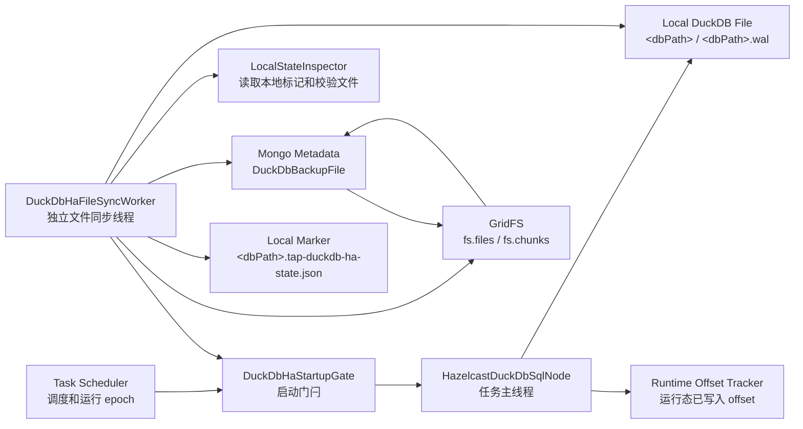
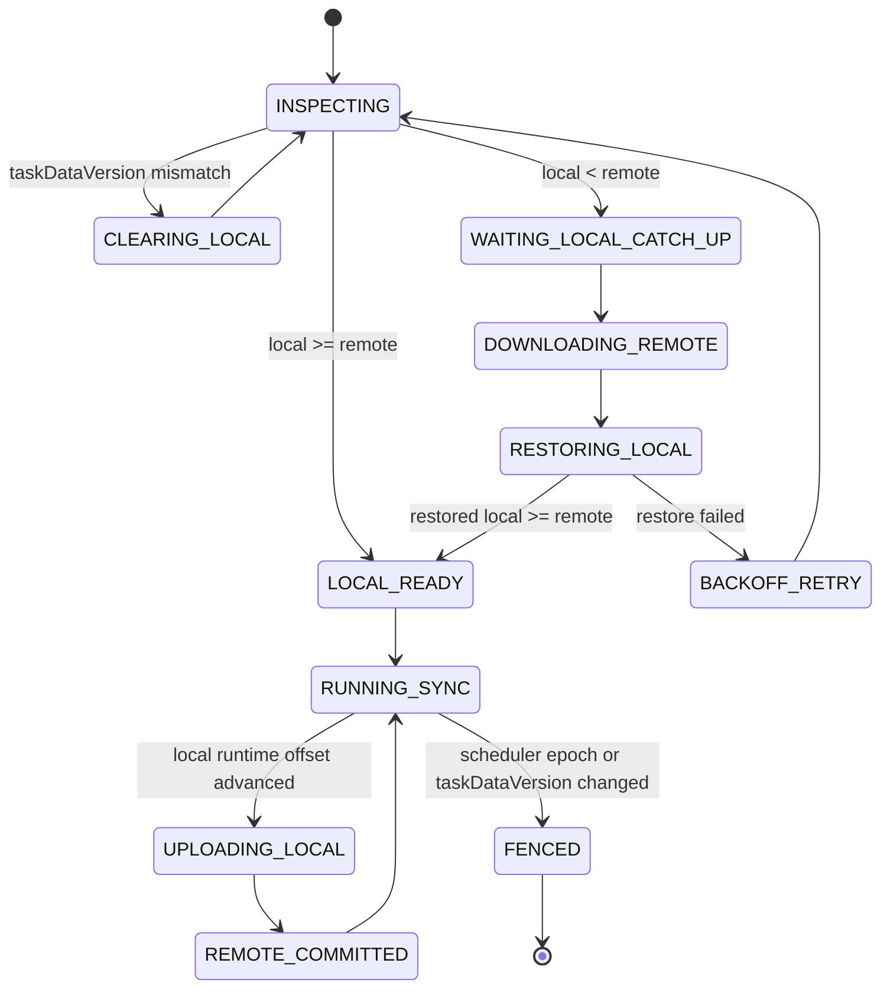

# DuckDB HA方案 - 备份文件方案详细设计 V2

## 1. 文档目的

本文档基于新的核心思路，重新设计 DuckDB HA 备份文件方案。

V2 的核心目标是：

> DuckDB 任务仍然只使用本地 DuckDB 文件运行，现有任务处理逻辑不改变；独立的 HA 文件同步线程负责让本地 DuckDB 文件与 Mongo GridFS 中的最新备份文件保持一致。任务启动前先校验任务数据版本，再比较本地文件 offset 与 GridFS 最新文件 offset：如果任务版本一致且本地 offset 大于等于 GridFS offset，任务直接放行；如果任务版本一致但本地 offset 小于 GridFS offset，任务等待同步线程把本地文件追平到 GridFS offset 后再启动；如果任务版本不一致，以远端任务版本为准，当前本地 DuckDB 文件全部失效并清理，然后按最新任务版本从头恢复。

本方案与“主动维护共享文件”方案是不同路线：

- 不把共享文件作为 DuckDB 运行时数据库文件。
- 不让多个 Engine 同时打开同一个 DuckDB 文件。
- 不改变 DuckDB 节点以本地文件读写为核心的运行逻辑。
- HA 能力由独立文件同步线程提供。

## 2. V2 核心原则

### 2.1 任务运行和文件同步解耦

DuckDB 任务主线程只关心本地文件：

```text
HazelcastDuckDbSqlNode -> DuckDbOperatorImpl -> jdbc:duckdb:<local dbPath>
```

HA 文件同步线程独立负责：

- 启动前检查本地文件版本。
- 查询 Mongo 中 GridFS 最新备份版本。
- 当远端更新时，把 GridFS 文件恢复到本地。
- 当本地更新时，把本地一致性快照上传到 GridFS。
- 维护本地文件 offset 与远端文件 offset 的一致性。

任务主线程不直接处理 GridFS 文件上传下载；它只通过启动门闩等待本地文件达到可运行状态。

### 2.2 启动门闩规则

任务启动前必须先做一次 HA 文件一致性检查。

定义：

- `localTaskDataVersion`：本地 DuckDB 文件所属的任务数据版本。
- `remoteTaskDataVersion`：Mongo 中当前任务节点最新的任务数据版本，由任务 reset 刷新。
- `localStableOffset`：本地 DuckDB 文件已稳定包含的 offset。
- `remoteCommittedOffset`：Mongo/GridFS 最新 `COMMITTED` 备份文件包含的 offset。

启动规则：

```text
if localTaskDataVersion != remoteTaskDataVersion:
  当前任务相关本地文件全部无效
  清理本地 DuckDB 文件、WAL、marker、临时目录
  以 remoteTaskDataVersion 从头恢复或首次运行

if localTaskDataVersion == remoteTaskDataVersion
  and localStableOffset >= remoteCommittedOffset:
  放行任务启动
  HA 文件同步线程继续定期把本地文件备份到 GridFS

if localTaskDataVersion == remoteTaskDataVersion
  and localStableOffset < remoteCommittedOffset:
  任务进入 WAITING_FOR_DUCKDB_FILE_SYNC
  HA 文件同步线程从 GridFS 下载最新备份并恢复本地文件
  等本地 localStableOffset >= remoteCommittedOffset 后放行任务启动
```

这里的“本地 offset”必须是可证明稳定的 offset，不能简单读取内存中的最新事件 offset。启动前没有运行态内存，因此需要依赖本地状态标记文件和 DuckDB 文件校验结果。

任务数据版本优先于 offset 比较。reset 后即使本地 offset 大于远端 offset，只要本地任务版本与远端最新任务版本不一致，本地文件也不能复用。

### 2.3 本地运行逻辑不变

任务被放行后：

- DuckDB 节点仍打开本地 `<dbPath>` 文件。
- 全量写入、CDC 写入、宽表构建、changelog 输出仍走现有逻辑。
- HA 文件同步线程只在稳定点创建本地文件快照，并在锁外上传 GridFS。
- 不因为 HA 引入远程文件读写路径，不把 GridFS 文件作为运行时文件。

### 2.4 独立不等于无协调

同步线程独立运行，但仍需要在两个阶段和任务主线程协调：

- 启动前恢复：必须在 DuckDB JDBC 打开前完成，因为需要覆盖本地 `<dbPath>` / `<dbPath>.wal`。
- 运行中备份：需要在短时间一致性窗口内 flush、checkpoint、复制本地文件，避免复制到不一致文件。

协调的范围只覆盖文件一致性，不改变任务本地处理语义。

## 3. 现有 DuckDB 运行模型

Engine 侧核心类：

- `io.tapdata.flow.engine.V2.node.hazelcast.processor.HazelcastDuckDbSqlNode`
- `io.tapdata.flow.engine.V2.node.duckdb.DuckDbOperator`
- `io.tapdata.flow.engine.V2.node.duckdb.DuckDbOperatorImpl`

当前 DuckDB 节点流程：

1. `doInit()` 解析 `DuckDbSqlNode` 配置。
2. `initDBPath(nodeConfig)` 读取节点级 `dbPath` 或全局 `DEFAULT_DUCK_DB_PATH`。
3. Engine 将配置中的基础目录拼接节点 ID，得到最终本地 DuckDB 文件路径。
4. `DuckDbOperatorImpl` 通过 `jdbc:duckdb:<dbPath>` 打开本地 DuckDB 文件。
5. 上游事件进入 `PerSourceContext`。
6. 全量阶段写入 DuckDB 源缓存表。
7. 全量完成后构建宽表并输出基线。
8. CDC 阶段继续维护本地缓存表和宽表。

本地文件形态：

```text
<dbPath>       DuckDB 主数据库文件
<dbPath>.wal   DuckDB WAL 文件，存在时必须与主文件一起处理
<dbPath>.tmp/  临时目录，不纳入备份
```

过程状态：

```text
DuckDbSqlNodeProcess_<taskId>_<nodeId>
```

包含：

- `process.INIT_CACHE_TABLE`
- `process.JOIN_TO_WIDE_TABLE`
- `process.TABLE_TO_DOWNSTREAM`
- `acceptPreNodeCount`

HA 文件同步必须同时保存 DuckDB 文件、offset、process 状态，否则任务启动时即使文件追平，也可能在全量/CDC 边界发生重复 join 或漏输出。

## 4. 总体架构

### 4.1 组件图



### 4.2 关键组件

| 组件 | 职责 |
| --- | --- |
| `DuckDbHaStartupGate` | 任务启动门闩，等待本地文件 taskDataVersion 与 offset 达到可运行条件 |
| `DuckDbHaFileSyncWorker` | 独立线程，启动前负责恢复追平，运行中负责周期备份上传 |
| `DuckDbLocalStateInspector` | 读取本地 marker、校验 DuckDB 文件、计算本地稳定 offset |
| `DuckDbGridFsBackupCatalog` | 查询 Mongo 元数据，选择最新可用 GridFS 备份 |
| `DuckDbFileSnapshotter` | 在一致性窗口内复制本地 DuckDB 文件 |
| `DuckDbGridFsRepository` | 上传、下载、删除 GridFS 文件，维护 `DuckDbBackupFile` |
| `DuckDbHaSyncStateReporter` | 可选，向 Mongo/Observable 上报同步状态 |

### 4.3 V2 一句话设计

本地版本一致且 offset 追平后，再启动任务；任务本地运行不变；同步线程持续把本地和 GridFS 拉到同一 taskDataVersion 与 offset。

## 5. Offset 与版本模型

### 5.1 任务数据版本

任务 reset 会改变 DuckDB 本地文件的语义边界。reset 前的本地文件和 GridFS 文件即使 offset 更高，也不能用于 reset 后的任务。因此 V2 需要引入任务数据版本：

```text
taskDataVersion
```

含义：

- 每次任务 reset 后刷新一次。
- 同一个 `taskId/nodeId` 下，所有 DuckDB HA 本地文件、marker、Mongo 元数据、GridFS 文件都必须绑定该版本。
- 启动前先比较 `localTaskDataVersion` 与 `remoteTaskDataVersion`。
- 只有任务版本一致，才允许比较 `localStableOffset` 与 `remoteCommittedOffset`。

版本来源：

- `remoteTaskDataVersion` 是权威值，建议存放在 Manager 任务版本字段或 DuckDB HA 版本锚点集合中。
- `localTaskDataVersion` 来自本地 marker。
- `DuckDbBackupFile.taskDataVersion` 标识该备份文件属于哪个任务数据版本。

reset 规则：

```text
task reset:
  remoteTaskDataVersion = remoteTaskDataVersion + 1
  清除旧版本 DuckDbBackupFile 元数据
  删除旧版本 GridFS fs.files / fs.chunks
  清除 DuckDbHaFileSyncState
  清除 processStore
  后续所有备份和恢复都基于新 taskDataVersion
```

需要注意：reset 后可能已经删除了所有 GridFS 备份文件，此时无法从 `DuckDbBackupFile` 推导最新任务版本。因此必须有一个独立于备份文件的远端版本锚点。否则旧 Engine 本地 marker 仍然可能声称自己 offset 很高，启动门闩无法识别这是 reset 前的旧文件。

建议版本锚点：

```text
DuckDbHaTaskVersion
```

示例：

```json
{
  "taskId": "64f0...",
  "nodeId": "duck_node_1",
  "taskDataVersion": 3,
  "resetAt": 1784773845123,
  "resetBy": "user-a",
  "resetReason": "TASK_RESET",
  "updatedAt": 1784773845123
}
```

也可以将 `taskDataVersion` 存在任务节点运行态或 TaskDto 中，但必须满足两个条件：

- reset 后先刷新远端版本，再清理旧 GridFS 文件和本地/运行态状态。
- Engine 启动时能在没有任何备份文件的情况下读取最新版本。

### 5.2 三类 offset

V2 必须区分三类 offset：

| 名称 | 来源 | 用途 |
| --- | --- | --- |
| `localStableOffset` | 本地 marker + 文件校验 | 启动前判断本地文件是否可直接运行 |
| `localRuntimeOffset` | 任务运行期间 `DuckDbBackupOffsetTracker` | 决定何时创建新本地快照并上传 |
| `remoteCommittedOffset` | Mongo `DuckDbBackupFile` 最新 `COMMITTED` 记录 | 代表 GridFS 中可恢复的最新文件版本 |

启动门闩的判断顺序为：

1. 比较 `localTaskDataVersion` 与 `remoteTaskDataVersion`。
2. 版本一致时，比较 `localStableOffset` 与 `remoteCommittedOffset`。
3. 不使用 `localRuntimeOffset` 作为启动放行依据。

### 5.3 本地稳定 offset

`localStableOffset` 不能只靠文件存在判断，应来自本地 HA 状态标记：

```text
<dbPath>.tap-duckdb-ha-state.json
```

示例：

```json
{
  "schemaVersion": 1,
  "taskId": "64f0...",
  "nodeId": "duck_node_1",
  "taskDataVersion": 3,
  "engineId": "engine-a",
  "taskRunId": "run-20260723103000000-engine-a",
  "schedulerEpoch": 18,
  "generationId": "00000128-20260723103045123-a1b2c3",
  "backupVersion": 128,
  "state": "LOCAL_STABLE",
  "dbPath": "/data/tapdata/duckdb/duck_node_1",
  "dbFileSha256": "sha256...",
  "walFileSha256": "sha256...",
  "archiveSha256": "sha256...",
  "appliedOffset": {
    "eventSerialNo": 128,
    "offsetHash": "sha256...",
    "byTable": {
      "source_1.orders": {
        "syncStage": "CDC",
        "streamOffsetJson": "{...}",
        "sourceSerialNo": 128
      }
    }
  },
  "processState": {
    "process": {
      "INIT_CACHE_TABLE": true,
      "JOIN_TO_WIDE_TABLE": true,
      "TABLE_TO_DOWNSTREAM": true
    },
    "acceptPreNodeCount": 2,
    "preNodeCount": 2
  },
  "updatedAt": 1784773845123
}
```

写入要求：

- marker 必须原子写入，先写临时文件，再 rename 覆盖。
- marker 只能在本地 DuckDB 文件已经形成一致性状态后更新。
- 如果恢复或本地快照过程失败，不能更新 marker。
- 启动时 marker 缺失、taskId/nodeId 不匹配、taskDataVersion 不匹配、checksum 不匹配，都视为本地状态不可复用。

### 5.4 远端提交 offset

`remoteCommittedOffset` 来自 Mongo 元数据集合 `DuckDbBackupFile` 中最新可恢复版本：

```text
taskId = 当前任务
nodeId = 当前 DuckDB 节点
taskDataVersion = 当前远端任务数据版本
status = COMMITTED
nodeConfigHash/schemaHash 兼容
按 backupVersion/completedAt 倒序
```

GridFS 中的文件只作为二进制载体，不能单独代表可恢复版本。必须以 `DuckDbBackupFile.status=COMMITTED` 为准。

如果当前 `taskDataVersion` 下没有任何 `COMMITTED` 备份，说明 reset 后还没有形成新的远端基线：

- 本地版本不一致：清理本地旧文件，从空 DuckDB 开始。
- 本地版本一致且本地有效：可放行，并在启动后立即上传本地基线。
- 本地也为空：按 reset 后首次运行处理。

### 5.5 版本与 Offset 比较规则

比较必须先看任务版本：

```text
if local.taskDataVersion != remote.taskDataVersion:
  return VERSION_MISMATCH
```

`VERSION_MISMATCH` 的优先级高于所有 offset 比较。出现该结果时：

- 本地 DuckDB 文件无效。
- 本地 WAL 无效。
- 本地 marker 无效。
- 本地隔离目录和恢复临时目录应清理。
- 不允许因为本地 offset 更高而放行任务。
- 以远端最新 `taskDataVersion` 为准重新恢复或首次运行。

版本一致后，再比较 offset。

单表或单源场景可以用 `eventSerialNo` / `sourceSerialNo` 做快速比较。

多表场景必须使用 offset vector：

```text
local >= remote
  等价于 remote.appliedOffset.byTable 中每个 tableKey
  都能在 local.appliedOffset.byTable 中找到，并且 local 对应 offset 不落后于 remote
```

如果 offset 不可比较：

- 默认按“不满足 local >= remote”处理。
- 启动进入等待同步。
- 同步线程优先从 GridFS 恢复远端最新完整文件。

比较结果：

| 结果 | 含义 | 启动策略 |
| --- | --- | --- |
| `VERSION_MISMATCH` | 本地任务版本与远端最新任务版本不一致 | 清理本地文件，按远端最新任务版本从头恢复 |
| `LOCAL_AHEAD` | 本地 offset 大于远端 offset | 放行任务，立即触发本地备份上传 |
| `EQUAL` | 本地 offset 等于远端 offset | 放行任务，进入周期备份 |
| `LOCAL_BEHIND` | 本地 offset 小于远端 offset | 任务等待，先恢复远端文件到本地 |
| `UNKNOWN` | 本地或远端 offset 不可信/不可比 | 有远端则恢复远端；无远端则按首次运行或失败处理 |

## 6. Mongo 与 GridFS 文件模型

### 6.1 Mongo 中的呈现形式

备份文件在 Mongo 中仍然分为两层：

```text
DuckDbBackupFile
  业务元数据集合
  一条记录代表一个 taskDataVersion 下可审计的备份版本

fs.files
  GridFS 文件头
  一条记录代表一个 archive 文件

fs.chunks
  GridFS 文件分块
  多条 chunk 组成一个 archive
```

`DuckDbBackupFile.gridFsId` 指向 `fs.files._id`。

恢复、比较、清理都以 `DuckDbBackupFile` 为入口；业务逻辑不直接扫描 `fs.files`。

### 6.2 DuckDbBackupFile 文档结构

```json
{
  "_id": "ObjectId",
  "schemaVersion": 2,
  "taskId": "64f0...",
  "nodeId": "duck_node_1",
  "taskDataVersion": 3,
  "nodeName": "DuckDB SQL",
  "engineId": "engine-a",
  "taskRunId": "run-20260723103000000-engine-a",
  "schedulerEpoch": 18,
  "generationId": "00000128-20260723103045123-a1b2c3",
  "backupVersion": 128,
  "parentGenerationId": "00000120-20260723102945123-b2c3d4",
  "status": "COMMITTED",
  "backupType": "FULL_FILE",
  "storageType": "GRIDFS",
  "gridFsId": "668c...",
  "gridFsFilename": "duckdb-ha/tasks/64f0/nodes/duck_node_1/versions/3/generations/00000128-20260723103045123-a1b2c3.zip",
  "dbPathFileName": "duck_node_1",
  "createdAt": 1784773845123,
  "completedAt": 1784773847341,
  "backupReason": "PERIODIC",
  "nodeConfigHash": "sha256...",
  "querySqlHash": "sha256...",
  "schemaHash": "sha256...",
  "appliedOffset": {
    "eventSerialNo": 128,
    "offsetHash": "sha256...",
    "byTable": {
      "source_1.orders": {
        "syncStage": "CDC",
        "streamOffsetJson": "{...}",
        "sourceSerialNo": 128
      }
    }
  },
  "processState": {
    "process": {
      "INIT_CACHE_TABLE": true,
      "JOIN_TO_WIDE_TABLE": true,
      "TABLE_TO_DOWNSTREAM": true
    },
    "acceptPreNodeCount": 2,
    "preNodeCount": 2
  },
  "archive": {
    "format": "ZIP",
    "size": 104857600,
    "sha256": "sha256..."
  },
  "files": [
    {
      "path": "db/duck_node_1",
      "size": 104857600,
      "sha256": "sha256..."
    },
    {
      "path": "db/duck_node_1.wal",
      "size": 1024,
      "sha256": "sha256...",
      "optional": true
    }
  ],
  "expireAt": "2026-07-24T10:30:45.123Z",
  "errorMessage": null
}
```

### 6.3 同步状态集合

建议新增运行态同步状态集合：

```text
DuckDbHaFileSyncState
```

一条记录代表一个任务节点在某个 Engine 上的 HA 文件同步状态。

```json
{
  "taskId": "64f0...",
  "nodeId": "duck_node_1",
  "taskDataVersion": 3,
  "engineId": "engine-a",
  "taskRunId": "run-20260723103000000-engine-a",
  "schedulerEpoch": 18,
  "syncStatus": "WAITING_LOCAL_CATCH_UP",
  "startupGateStatus": "BLOCKED",
  "localGenerationId": "00000120-20260723102945123-b2c3d4",
  "localBackupVersion": 120,
  "remoteGenerationId": "00000128-20260723103045123-a1b2c3",
  "remoteBackupVersion": 128,
  "compareResult": "LOCAL_BEHIND",
  "lastSyncAction": "DOWNLOAD_REMOTE",
  "lastSuccessAt": 1784773847341,
  "lastFailureAt": null,
  "errorMessage": null,
  "updatedAt": 1784773848000
}
```

状态值建议：

- `INSPECTING`
- `LOCAL_READY`
- `WAITING_LOCAL_CATCH_UP`
- `DOWNLOADING_REMOTE`
- `RESTORING_LOCAL`
- `RUNNING_SYNC`
- `UPLOADING_LOCAL`
- `REMOTE_COMMITTED`
- `BACKOFF_RETRY`
- `FAILED`
- `FENCED`

该集合主要用于观测、排障和 Manager 展示，不作为唯一恢复依据。真正恢复仍以本地 marker 和 `DuckDbBackupFile.COMMITTED` 为准。

### 6.4 任务版本锚点集合

建议新增或复用一个远端任务版本锚点：

```text
DuckDbHaTaskVersion
```

该集合不保存文件，只保存当前 `taskId/nodeId` 的最新任务数据版本。它的存在是为了处理 reset 后 GridFS 文件已经被清空，但 Engine 仍需知道“本地文件属于旧版本”的场景。

```json
{
  "taskId": "64f0...",
  "nodeId": "duck_node_1",
  "taskDataVersion": 3,
  "versionStatus": "ACTIVE",
  "resetAt": 1784773845123,
  "resetBy": "user-a",
  "resetReason": "TASK_RESET",
  "latestGenerationId": null,
  "latestBackupVersion": null,
  "createdAt": 1784773845123,
  "updatedAt": 1784773845123
}
```

使用规则：

- 启动门闩先读取 `DuckDbHaTaskVersion.taskDataVersion`，再读取该版本下的 `DuckDbBackupFile`。
- reset 时先刷新该版本，再清理旧版本 GridFS 文件和元数据。
- 新版本下首个备份提交成功后，可以回填 `latestGenerationId/latestBackupVersion`。
- 旧 Engine 即使本地有更高 offset，只要 marker 中的 `taskDataVersion` 小于远端锚点版本，也必须清理本地文件。

### 6.5 索引

`DuckDbBackupFile`：

```text
{ taskId: 1, nodeId: 1, taskDataVersion: 1, status: 1, backupVersion: -1, completedAt: -1 }
{ taskId: 1, nodeId: 1, taskDataVersion: 1, generationId: 1 } unique
{ taskId: 1, nodeId: 1, taskDataVersion: 1, schedulerEpoch: 1, status: 1 }
{ expireAt: 1 }
```

`DuckDbHaFileSyncState`：

```text
{ taskId: 1, nodeId: 1, engineId: 1 } unique
{ taskId: 1, nodeId: 1, taskDataVersion: 1, schedulerEpoch: -1 }
{ updatedAt: -1 }
```

`DuckDbHaTaskVersion`：

```text
{ taskId: 1, nodeId: 1 } unique
{ taskId: 1, nodeId: 1, taskDataVersion: 1 }
```

## 7. 启动流程详细设计

### 7.1 启动顺序

推荐接入 `HazelcastDuckDbSqlNode.doInit()` 的顺序：

1. `super.doInit(context)`
2. 初始化 `clientMongoOperator`
3. 读取 `DuckDbSqlNode` 配置
4. 计算最终 `dbPath`
5. 创建 `DuckDbHaStartupGate`
6. 创建并启动 `DuckDbHaFileSyncWorker` 的 bootstrap 模式
7. `startupGate.awaitReady()`
8. 本地文件 ready 后再初始化 `DuckDbOperatorImpl`
9. 初始化 DuckDB settings
10. 初始化 processStore，并按本地 marker 或远端 meta 恢复 processState
11. 初始化 schema cache、SQL、宽表组件
12. `manageDuckDbTables()`
13. HA worker 切换为 running sync 模式

关键点：

- `awaitReady()` 完成前不能打开 DuckDB JDBC。
- 如果本地落后，等待期间任务不消费上游事件。
- 如果等待超时，任务启动失败或保持调度等待状态，由配置决定。

### 7.2 启动门闩伪流程

```text
startDuckDbNode():
  dbPath = initDBPath(nodeConfig)
  gate = createStartupGate(taskId, nodeId)
  worker = createHaFileSyncWorker(taskId, nodeId, dbPath, gate)

  worker.startBootstrapSync()
  gate.awaitReady(timeout)

  if gate.status != READY:
    throw TaskStartWaitingOrFailed

  duckDbOperator = initDuckDbOperator(dbPath)
  restoreProcessStateFromLocalMarker()
  initDuckDbNodeComponents()
  worker.switchToRunningMode(duckDbOperator, offsetTracker)
```

### 7.3 Bootstrap 同步伪流程

```text
bootstrapSync():
  local = inspectLocalState(dbPath, localMarker)
  remoteVersion = findRemoteTaskDataVersion(taskId, nodeId)

  if local.taskDataVersion != remoteVersion.taskDataVersion:
    gate.block(reason=TASK_VERSION_MISMATCH)
    cleanLocalDuckDbFiles(dbPath)
    local = emptyLocalState(taskDataVersion=remoteVersion.taskDataVersion)

  remote = findLatestCommittedBackup(taskId, nodeId, remoteVersion.taskDataVersion)

  if remote is null and local is valid:
    gate.ready(reason=LOCAL_ONLY)
    scheduleImmediateUpload()
    return

  if remote is null and local is empty:
    gate.ready(reason=FIRST_RUN)
    return

  compareResult = compare(local.stableOffset, remote.committedOffset)

  if local >= remote:
    gate.ready(reason=LOCAL_NOT_BEHIND)
    if local > remote:
      scheduleImmediateUpload()
    return

  if local < remote:
    gate.block(reason=WAITING_LOCAL_CATCH_UP)
    restoreRemoteToLocal(remote)
    localAfter = inspectLocalState(dbPath, localMarker)
    if localAfter >= remote:
      gate.ready(reason=LOCAL_CAUGHT_UP)
    else:
      retryOrFail()
```

### 7.4 启动决策表

| 本地版本 | 远端版本 | 本地状态 | 远端备份 | 比较结果 | 处理 |
| --- | --- | --- | --- | --- | --- |
| 旧版本 | 最新版本 | 任意 | 任意 | `VERSION_MISMATCH` | 清理本地文件和 marker，按远端最新版本从头恢复 |
| 最新版本 | 最新版本 | 无本地文件 | 无远端备份 | 无 | reset 后或首次运行，放行 |
| 最新版本 | 最新版本 | 有本地稳定文件 | 无远端备份 | 本地有效 | 放行，启动后立即上传本地备份 |
| 最新版本 | 最新版本 | 有本地稳定文件 | 有远端备份 | `LOCAL_AHEAD` | 放行，立即上传本地新版本到 GridFS |
| 最新版本 | 最新版本 | 有本地稳定文件 | 有远端备份 | `EQUAL` | 放行，进入周期同步 |
| 最新版本 | 最新版本 | 有本地稳定文件 | 有远端备份 | `LOCAL_BEHIND` | 阻塞任务，下载远端并恢复本地，追平后放行 |
| 最新版本 | 最新版本 | 本地文件损坏 | 有远端备份 | `UNKNOWN` | 阻塞任务，恢复远端 |
| 未知 | 最新版本 | 本地 marker 缺失 | 有远端备份 | `UNKNOWN` | 阻塞任务，恢复远端 |
| 未知 | 最新版本 | 本地 marker 缺失 | 无远端备份 | `UNKNOWN` | 若任务无历史进度或 reset 后新版本无备份，则首次运行，否则启动失败 |
| 任意 | 读取失败 | 有可信本地文件 | 无法确认 | 无法比较 | 默认等待或失败；可配置允许 trusted local 启动 |

### 7.5 等待语义

当 `localStableOffset < remoteCommittedOffset` 时，任务不是失败，而是进入等待：

```text
WAITING_FOR_DUCKDB_FILE_SYNC
```

等待期间：

- 不打开 DuckDB。
- 不消费上游事件。
- Manager/Observable 可以显示等待原因、local offset、remote offset、同步进度。
- 同步线程持续下载、校验、恢复远端文件。
- 追平后自动放行。

建议配置：

| 配置 | 默认值 | 说明 |
| --- | --- | --- |
| `haStartupWaitTimeoutMs` | `600000` | 启动等待本地追平的最长时间 |
| `haStartupWaitOnRemoteUnavailable` | `true` | GridFS 不可访问时是否等待 |
| `haAllowTrustedLocalWhenRemoteUnavailable` | `false` | 远端不可访问但本地可信时是否允许启动 |

默认策略应偏保守：不能确认远端版本时，不轻易启动，避免同一任务在不同 Engine 上出现版本分叉。

## 8. 独立文件同步线程设计

### 8.1 线程模式

`DuckDbHaFileSyncWorker` 有两种模式：

| 模式 | 任务是否已运行 | 主要职责 |
| --- | --- | --- |
| `BOOTSTRAP_SYNC` | 否 | 检查本地/远端 offset，必要时恢复本地，放行启动门闩 |
| `RUNNING_SYNC` | 是 | 周期性把本地稳定快照上传到 GridFS，保证远端不落后太多 |

### 8.2 状态机



### 8.3 Running Sync 主循环

任务运行后，同步线程按固定间隔检查：

```text
runningSyncLoop():
  while task alive and lease valid:
    remoteVersion = findRemoteTaskDataVersion(taskId, nodeId)
    if remoteVersion.taskDataVersion != currentTaskDataVersion:
      fence current worker and stop task

    remote = findLatestCommittedBackup(taskId, nodeId, currentTaskDataVersion)
    localRuntime = offsetTracker.snapshot()
    localStable = inspectLocalMarker()

    if schedulerEpoch changed:
      fence current worker and stop task

    if remote > localStable and remote epoch is current:
      report fatal split-brain risk
      fence current task

    if localRuntime > remote and shouldBackup():
      createLocalStableSnapshot()
      uploadSnapshotToGridFS()
      updateLocalMarker()
      updateRemoteCommittedMeta()

    sleep(syncInterval)
```

正常情况下，任务运行期间只有当前 Engine 能推进本地 offset，因此应该只出现：

- `localRuntime >= remote`
- `localStable >= remote`
- 或短时间内 `localRuntime > remote`，等待下一次上传

如果运行中发现 `remote > localStable`，说明可能有其他 Engine 已经接管并提交了新版本，当前任务必须被 fencing，不能继续写本地文件。

如果运行中发现 `remoteTaskDataVersion != currentTaskDataVersion`，说明任务发生 reset 或新调度版本已经生效，当前任务必须立即停止，不能再上传旧版本本地文件。

### 8.4 触发时机

同步线程支持以下触发：

| 触发原因 | 行为 |
| --- | --- |
| `BOOTSTRAP` | 启动前比较本地和远端，必要时恢复 |
| `PERIODIC` | 周期上传本地快照 |
| `EVENT_THRESHOLD` | 本地 runtime offset 超过远端一定事件数后上传 |
| `FULL_COMPLETE` | 全量转 CDC 边界立即上传 |
| `ENGINE_STOP` | 正常停止时尽力上传 |
| `LOCAL_AHEAD_ON_START` | 启动发现本地领先远端时立即上传 |
| `MANUAL` | 运维手动触发 |

### 8.5 上传策略

上传本地文件时，同步线程执行：

1. 检查当前 worker 是否仍持有任务运行 epoch。
2. 读取远端 `taskDataVersion`，必须等于当前 worker 的 `currentTaskDataVersion`。
3. 判断是否已有上传在进行，有则跳过。
4. 短暂进入一致性窗口。
5. flush 所有 `PerSourceContext`。
6. 持久化 processState。
7. 执行 `FORCE CHECKPOINT`。
8. 读取 `localRuntimeOffset`。
9. 复制 `<dbPath>` 和 `<dbPath>.wal` 到临时目录。
10. 退出一致性窗口。
11. 在锁外压缩、计算 checksum、上传 GridFS。
12. 提交元数据前再次校验远端 `taskDataVersion` 未变化。
13. 元数据从 `CREATING` -> `UPLOADING` -> `COMMITTED`，并写入 `taskDataVersion`。
14. 本地 marker 原子更新为新 generation。

任务主逻辑仍然本地运行，只在第 4 到 9 步存在短暂阻塞。

### 8.6 下载恢复策略

下载远端文件时，同步线程执行：

1. 确认 DuckDB JDBC 尚未打开，或任务处于启动等待阶段。
2. 读取远端 `taskDataVersion`。
3. 查询该 `taskDataVersion` 下最新 `COMMITTED` 备份。
4. 下载 GridFS archive 到临时目录。
5. 校验 archive sha256。
6. 解压并校验文件 sha256。
7. 将现有本地 `<dbPath>` 和 `<dbPath>.wal` 移动到隔离目录。
8. 将远端文件复制到本地路径。
9. 写入包含该 `taskDataVersion` 的本地 marker。
10. 更新 `DuckDbHaFileSyncState`。
11. 通知 `DuckDbHaStartupGate` 放行。

运行中的任务不允许直接覆盖本地 DuckDB 文件。如果运行中远端领先，应先停止/fence 当前任务，再由下一次启动走 bootstrap 恢复。

## 9. 一致性与并发控制

### 9.1 本地文件锁

每个 DuckDB 节点本地路径维护一个文件锁：

```text
<dbPath>.tap-duckdb-ha.lock
```

用途：

- 防止同一 Engine 上两个进程同时恢复或打开同一个本地 DuckDB 文件。
- 防止启动等待期间恢复线程和任务初始化线程并发操作本地文件。
- 作为本地排障依据。

文件锁只保护当前机器本地文件，不替代调度层任务租约。

### 9.2 调度 epoch fencing

必须依赖调度层提供单调递增的运行标识：

```text
taskRunId
schedulerEpoch
engineId
taskDataVersion
```

同步线程提交备份前需要校验：

- 当前 Engine 仍是任务 Active Engine。
- 当前 `schedulerEpoch` 仍是最新 epoch。
- 当前 `taskDataVersion` 仍等于远端最新任务数据版本。
- Mongo 中没有更高 epoch 的 `COMMITTED` 版本。
- Mongo 中没有更高 `taskDataVersion` 的版本锚点。

如果校验失败：

- 当前备份标记为 `STALE` 或 `FAILED_STALE_EPOCH`。
- 当前 worker 进入 `FENCED`。
- 当前任务应停止或等待调度层重新拉起。

如果失败原因是 `taskDataVersion` 已变化，当前本地 DuckDB 文件不能再作为新版本基线上传，必须等待 reset 后的新启动流程清理本地文件。

### 9.3 一致性锁

运行中上传本地快照时需要节点级一致性锁：

```text
duckDbBackupConsistencyLock
```

原则：

- 任务写 DuckDB 的路径持有读锁。
- 同步线程创建本地文件快照时持有写锁。
- 写锁期间完成 flush、checkpoint、本地文件复制。
- 上传 GridFS 不持有写锁。

这样能保持 HA 线程独立运行，同时避免复制到不一致文件。

### 9.4 本地 marker 原子性

marker 更新必须遵循：

```text
write <marker>.tmp
fsync tmp if possible
rename tmp -> marker
```

更新顺序：

1. DuckDB 文件快照成功。
2. GridFS 上传成功。
3. 提交前校验远端 `taskDataVersion` 未变化。
4. Mongo 元数据提交 `COMMITTED` 成功。
5. 本地 marker 更新。

对于启动前从远端恢复：

1. GridFS 下载成功。
2. 文件 checksum 校验成功。
3. meta.taskDataVersion 等于远端版本锚点。
4. 本地文件替换成功。
5. 本地 marker 更新。
6. 启动门闩放行。

## 10. 任务运行期行为

### 10.1 主线程不感知远端文件

任务运行时：

- `processRecordEvent()` 仍处理上游事件。
- `processInitialSyncStage()` 仍写本地 DuckDB 源缓存表。
- `processCdcStage()` 仍更新本地缓存表和宽表。
- `callDuckDB()` / `joinToWideTable()` / `table2Downstream()` 仍按原逻辑执行。

HA 同步线程只消费运行态 offset tracker 和文件快照，不参与事件处理。

### 10.2 本地领先远端

这是正常状态：

```text
localRuntimeOffset > remoteCommittedOffset
```

说明任务正在运行，本地数据已经推进，远端备份稍微落后。同步线程会按周期或事件阈值上传新备份。

此时任务不等待。

### 10.3 本地等于远端

这是理想稳定状态：

```text
localStableOffset == remoteCommittedOffset
```

说明最近一次本地稳定快照已经上传并提交。

### 10.4 本地落后远端

启动前出现：

```text
localStableOffset < remoteCommittedOffset
```

任务等待同步线程恢复远端文件。

运行中出现：

```text
remoteCommittedOffset > localStableOffset
```

这是异常状态，通常表示：

- 同一任务被其他 Engine 接管并提交了更高版本。
- 当前 Engine 的任务租约已过期但任务还在运行。
- 发生 split-brain 风险。

处理：

- 当前同步线程进入 `FENCED`。
- 当前任务停止消费上游事件。
- 由调度层重新拉起，重新走启动门闩。

## 11. 服务恢复场景

### 11.1 任务被调度到其他 Engine

1. Engine B 启动任务。
2. B 的 HA 同步线程先启动 bootstrap 模式。
3. B 先读取远端 `taskDataVersion` 锚点。
4. B 读取本地 marker，通常本地为空或旧版本。
5. 如果本地 `taskDataVersion` 与远端不一致，先清理本地文件。
6. B 查询该 `taskDataVersion` 下 GridFS 最新 `COMMITTED` 备份。
7. 如果 B 本地 offset 小于 GridFS offset，任务进入等待。
8. B 同步线程下载 GridFS 文件并恢复到本地。
9. 本地 marker 更新到远端 generation 和 `taskDataVersion`。
10. 启动门闩放行。
11. 任务在 B 上打开本地 DuckDB 文件并运行。

### 11.2 手动停止后再次重启调度回同一个 Engine

1. 用户停止任务。
2. 当前 Engine 执行 `ENGINE_STOP` 备份。
3. 备份提交成功后，GridFS 与本地 marker offset 一致。
4. 用户再次启动任务，调度仍回到当前 Engine。
5. 启动前先比较本地 `taskDataVersion` 与远端 `taskDataVersion`。
6. 版本一致时再比较本地 offset 与 GridFS offset。
7. 如果本地 offset 大于等于 GridFS offset，直接放行。
8. 任务打开本地 DuckDB 文件继续运行。
9. 同步线程继续周期备份。

如果停止时最终备份失败，但本地 marker 能证明本地文件 taskDataVersion 与远端一致，且本地 offset 大于 GridFS offset：

- 仍可放行任务。
- 启动后立即触发 `LOCAL_AHEAD_ON_START` 上传，把 GridFS 追到本地 offset。

### 11.3 当前 Engine 离线导致任务被系统调度到其他 Engine

1. Engine A 离线，无法保证执行最终备份。
2. Scheduler 关闭 A 的任务租约，分配任务到 Engine B。
3. B 启动前读取远端 `taskDataVersion`。
4. B 查询该版本下 GridFS 最新 `COMMITTED` offset。
5. B 本地通常没有该任务版本的文件，因此本地 offset 小于 GridFS offset。
6. B 等待同步线程下载并恢复 GridFS 文件。
7. 追平后任务启动。
8. B 运行时本地 offset 推进，并由同步线程上传新版本。

该场景的 RPO 由 GridFS 最新 `COMMITTED` 版本决定。A 离线前写入但未被同步线程上传的本地数据不会成为 B 的启动基线，除非后续 A 恢复并且调度层确认 A 的本地版本仍可被采用。

### 11.4 当前 Engine 离线后恢复，任务立刻又回到当前 Engine

设 Engine A 离线后恢复。

情况一：任务未被其他 Engine 接管。

- A 重新启动时，先确认本地 `taskDataVersion` 等于远端 `taskDataVersion`。
- 版本一致且本地 offset 大于等于 GridFS offset，直接放行。
- 如果本地领先 GridFS，启动后立即上传本地备份。

情况二：任务已被 Engine B 接管并产生了更高 GridFS offset。

- A 重新拿到任务时必须重新执行启动门闩。
- 如果 A 本地 offset 小于 GridFS 最新 offset，A 必须等待同步线程把本地文件恢复到 GridFS 最新版本。
- A 不能继续使用旧本地文件运行。

情况三：A 本地 offset 大于 GridFS offset，但调度 epoch 已变化。

- 如果 A 本地版本来自旧 epoch，且没有对应 `COMMITTED` 远端记录，需要由调度层判定是否可信。
- 默认策略是允许可信本地文件启动，但立即上传新备份，并在提交前校验当前 epoch。
- 如果 Mongo 中已经存在更高 epoch 的备份，A 必须被 fencing，不能提交旧 epoch 本地文件覆盖远端基线。

情况四：任务在 A 离线期间被 reset。

- A 重新拿到任务时读取远端 `taskDataVersion`，发现本地 marker 属于旧版本。
- A 必须清理本地 DuckDB 文件、WAL、marker 和隔离目录。
- A 不能因为旧本地 offset 大于新版本 GridFS offset 而放行。
- 新版本下如果没有远端备份，按 reset 后首次运行从空 DuckDB 开始。
- 新版本下如果已经有远端备份，则等待同步线程恢复新版本备份。

核心原则：

- local offset 大于等于 remote offset 可以放行，但仍需满足本地文件可校验、任务租约有效。
- taskDataVersion 不一致时，本地文件永远不能放行。
- remote offset 大于 local offset 必须等待本地追平。
- epoch 高低决定谁有资格继续提交备份。

### 11.5 任务 reset

任务 reset 是 V2 中优先级最高的状态切换。reset 的含义是：当前任务节点的 DuckDB 本地文件、GridFS 备份、processStore 和 offset 语义全部进入新版本。旧版本文件即使 offset 更高，也不能用于新版本任务。

推荐 reset 顺序：

1. 调度层停止当前任务，并等待旧 Engine 释放任务租约；无法等待时也必须先 fencing 旧 epoch。
2. Manager 原子刷新 `DuckDbHaTaskVersion.taskDataVersion`，例如从 `3` 增加到 `4`。
3. 清理旧版本 `DuckDbBackupFile` 元数据。
4. 删除旧版本 GridFS `fs.files` 和 `fs.chunks`。
5. 清理 `DuckDbHaFileSyncState`。
6. 清理 processStore。
7. 尽力通知相关 Engine 清理本地 `<dbPath>`、`<dbPath>.wal`、marker、临时目录和隔离目录。
8. 后续任务启动都以新的 `taskDataVersion=4` 为准。

如果某个 Engine 没收到本地清理通知，下一次启动时仍能通过版本锚点识别本地文件无效：

```text
local.taskDataVersion = 3
remote.taskDataVersion = 4
=> VERSION_MISMATCH
=> cleanLocalDuckDbFiles()
=> 按 version 4 从头恢复或首次运行
```

reset 后远端版本一定是权威最新版本。`localStableOffset` 和 `remoteCommittedOffset` 都必须包含 `taskDataVersion` 维度：

```text
localStableOffset = (taskDataVersion, offsetVector)
remoteCommittedOffset = (taskDataVersion, offsetVector)
```

比较顺序：

1. `taskDataVersion` 不一致：本地无效，清理后从头恢复。
2. `taskDataVersion` 一致：再比较 offset。

reset 后 GridFS 可能没有任何新版本备份文件，这不是异常。只要任务整体进度也已经 reset，新版本首次启动可以创建空 DuckDB 文件，并由同步线程在第一个稳定点上传新版本基线。

## 12. GridFS 版本关系与断点恢复

### 12.1 第一阶段版本关系

每个 GridFS 备份版本都是完整快照：

```text
generation 5  -> full DuckDB archive
generation 10 -> full DuckDB archive
```

即使记录 `parentGenerationId`，也只是用于审计和展示，不代表恢复时需要逐代应用。

### 12.2 同一任务版本下 local 5 与 remote 10

如果启动时发现：

```text
localTaskDataVersion = 3
remoteTaskDataVersion = 3
localStableOffset = 5
remoteCommittedOffset = 10
```

处理：

1. 任务等待。
2. 同步线程下载 generation 10 的完整 archive。
3. 校验后替换本地 DuckDB 文件。
4. 更新本地 marker 为 `taskDataVersion=3`、generation 10。
5. 启动门闩放行。

第一阶段不从 generation 5 patch 到 generation 10。原因：

- DuckDB 主文件和 WAL 必须作为一致性整体处理。
- 当前没有可靠的块级变更链。
- 直接 patch 旧文件风险高，恢复结果难以验证。
- 完整 archive 恢复更容易保证确定性。

### 12.3 同一任务版本下 local 10 与 remote 5

如果启动时发现：

```text
localTaskDataVersion = 3
remoteTaskDataVersion = 3
localStableOffset = 10
remoteCommittedOffset = 5
```

处理：

1. 任务放行。
2. 同步线程立即执行 `LOCAL_AHEAD_ON_START`。
3. 从本地 DuckDB 文件创建一致性快照。
4. 上传 GridFS，提交 generation 10 或更高版本。
5. 远端追平本地。

需要额外校验：

- 本地 marker 与当前 `taskId/nodeId` 匹配。
- 本地 marker 中的 `taskDataVersion` 与远端锚点一致。
- 本地文件能打开。
- 当前 Engine 持有有效 scheduler epoch。

### 12.4 不同任务版本下 local 10 与 remote 0

如果 reset 后启动时发现：

```text
localTaskDataVersion = 3
remoteTaskDataVersion = 4
localStableOffset = 10
remoteCommittedOffset = 0 或无远端备份
```

处理：

1. 不比较 offset。
2. 判定 `VERSION_MISMATCH`。
3. 清理本地 DuckDB 文件、WAL、marker、临时目录、隔离目录。
4. 如果 version 4 下没有远端备份，按 reset 后首次运行，从空 DuckDB 开始。
5. 如果 version 4 下有远端备份，下载并恢复 version 4 的最新 `COMMITTED` 备份。

该场景中，旧本地 offset 10 不具备任何启动放行意义，因为它属于 reset 前的任务数据版本。

### 12.5 断点恢复边界

V2 中“本地追平远端”的含义是：

```text
把远端最新完整备份文件恢复到本地，使本地 offset 达到 remote offset
```

不是：

```text
只下载 remote 相对 local 的差异块，把 local patch 到 remote
```

第一阶段不支持状态级断点恢复。

可作为后续优化的能力：

- GridFS archive 分片上传下载。
- archive 下载断点续传。
- 内容寻址块去重。
- DuckDB 官方增量备份或 WAL replay 能力。

这些优化只能在完整 checksum 校验和 generation 原子提交模型下引入。

## 13. 配置设计

建议在 `DuckDbSqlNode` 增加或调整配置：

| 字段 | 默认值 | 说明 |
| --- | --- | --- |
| `haBackupEnabled` | `false` | 是否启用 DuckDB HA 文件同步 |
| `haBackupStorageType` | `GRIDFS` | 第一阶段固定 GridFS |
| `haSyncIntervalMs` | `60000` | 同步线程周期检查间隔 |
| `haBackupMinEvents` | `1000` | 本地 runtime offset 比远端多多少事件后触发上传 |
| `haStartupWaitTimeoutMs` | `600000` | 启动等待本地追平的最长时间 |
| `haStartupRemoteUnavailablePolicy` | `WAIT` | 远端不可访问时策略：`WAIT` / `FAIL` / `ALLOW_TRUSTED_LOCAL` |
| `haLocalAheadUploadOnStart` | `true` | 启动发现本地领先远端时是否立即上传 |
| `haBackupOnFullComplete` | `true` | 全量转 CDC 后立即上传 |
| `haBackupOnStop` | `true` | 正常停止时尽力上传 |
| `haBackupRetentionCount` | `3` | 保留最近几个成功备份 |
| `haBackupRetentionHours` | `24` | 备份最大保留时间 |
| `haBackupCompressEnabled` | `true` | 是否压缩 archive |
| `haRestoreOnCorruption` | `FALLBACK_PREVIOUS` | 远端备份损坏时尝试上一版本 |

约束：

- 启用 HA 时 `dbPath` 必须非空。
- Preview/TestRun 默认禁用。
- DuckLake 第一阶段不纳入本方案。

## 14. 与 Tapdata 生态的集成

### 14.1 Engine 侧

Engine 侧需要接入：

- DuckDB 节点启动前创建 HA startup gate。
- HA 文件同步线程使用 Engine 当前任务生命周期启动和停止。
- `PerSourceContext` flush / DuckDB checkpoint / processState 持久化作为上传快照的一致性边界。
- 任务关闭时触发最终同步。

### 14.2 Manager / Mongo 访问形态

备份元数据和 GridFS 文件不能假设能通过通用 REST collection 访问。

如果 Engine 使用直连 Mongo：

- 可直接读写 `DuckDbHaTaskVersion`。
- 可直接写 `DuckDbBackupFile`。
- 可直接使用 `GridFSBucket` 上传下载文件。

如果 Engine 使用 `HttpClientMongoOperator`：

- Manager 需要提供专用 API。
- 不能直接访问 `/api/DuckDbBackupFile`，除非 Manager 已注册该资源。
- 任务 reset、备份清理、状态展示都应走专用 API。

建议 Manager API：

```text
GET  /api/duckdb-ha/task-version?taskId=&nodeId=
POST /api/duckdb-ha/task-version/reset
GET  /api/duckdb-ha/backups/latest?taskId=&nodeId=&taskDataVersion=
POST /api/duckdb-ha/backups/creating
POST /api/duckdb-ha/backups/upload
POST /api/duckdb-ha/backups/commit
POST /api/duckdb-ha/backups/fail
GET  /api/duckdb-ha/backups/{generationId}/download
DELETE /api/duckdb-ha/backups?taskId=&nodeId=&taskDataVersion=
POST /api/duckdb-ha/sync-state
```

reset API 必须保证：

- 先刷新 `DuckDbHaTaskVersion.taskDataVersion`。
- 再删除旧 `taskDataVersion` 下的 `DuckDbBackupFile`。
- 再删除旧 GridFS 文件块。
- 操作幂等，重复调用不会误删新版本文件。

### 14.3 Observable

需要展示：

- 启动等待状态。
- 本地 taskDataVersion。
- 远端 taskDataVersion。
- 本地 offset。
- GridFS 最新 offset。
- compare result。
- 同步线程状态。
- 最近上传成功时间。
- 最近恢复成功时间。
- 备份文件大小。
- 连续失败次数。

## 15. 异常处理

### 15.1 GridFS 不可访问

启动前：

- 默认等待或失败，不建议直接启动。
- 若配置 `ALLOW_TRUSTED_LOCAL`，且本地 marker 和文件校验通过，可以放行。
- 放行后同步线程持续重试远端连接。

运行中：

- 任务继续本地运行。
- 同步线程进入 `BACKOFF_RETRY`。
- RPO 持续扩大，需要告警。

### 15.2 本地落后且恢复失败

处理：

- 任务保持 `WAITING_FOR_DUCKDB_FILE_SYNC`。
- 同步线程按退避策略重试。
- 超过 `haStartupWaitTimeoutMs` 后，按任务启动失败处理。
- 不允许打开旧本地文件继续运行。

### 15.3 本地领先但上传失败

处理：

- 任务可以继续运行。
- 同步线程保留失败状态并重试。
- 如果连续失败超过阈值，告警但不默认中断任务。
- 如果任务停止时仍无法上传，下一次同 Engine 启动可在 taskDataVersion 一致且本地 marker 校验通过时放行；其他 Engine 接管只能使用远端较旧版本。

### 15.4 运行中发现远端领先

这是 split-brain 风险。

处理：

- 当前 worker 进入 `FENCED`。
- 当前任务停止消费上游。
- 不再提交本地备份。
- 由调度层重新调度任务。

### 15.5 备份文件损坏

下载后校验：

- archive sha256
- 内部文件 sha256
- manifest 与 Mongo 元数据关键字段一致

失败后：

- 按 `haRestoreOnCorruption=FALLBACK_PREVIOUS` 尝试上一代。
- 全部失败则任务保持等待或启动失败。

## 16. 性能设计

### 16.1 主链路影响

同步线程不参与事件处理，主链路只在创建本地一致性快照时短暂阻塞：

- flush
- checkpoint
- 复制本地文件到临时目录

压缩和上传 GridFS 在锁外执行。

### 16.2 大文件优化

第一阶段使用完整文件快照，简单可靠。

优化策略：

- 降低周期频率。
- 增大 `haBackupMinEvents`。
- 全量完成和任务停止时强制上传。
- 限制保留版本数。
- 上传失败时跳过重叠任务，避免堆积。

后续可评估：

- archive 分片传输。
- 压缩可配置关闭。
- 块级去重。
- 对象存储替代 GridFS。

## 17. 任务清理与保留策略

### 17.1 Reset 清理

任务 reset 时需要先刷新任务版本，再清理旧版本文件：

```text
oldVersion = current remote taskDataVersion
newVersion = oldVersion + 1

update DuckDbHaTaskVersion(taskDataVersion = newVersion)
delete DuckDbBackupFile where taskId/nodeId/taskDataVersion = oldVersion
delete GridFS files where metadata.taskId/nodeId/taskDataVersion = oldVersion
delete DuckDbHaFileSyncState where taskId/nodeId
delete processStore
notify engines to delete local files
```

本地需要清理：

- 本地 `<dbPath>` 文件。
- 本地 `<dbPath>.wal`。
- 本地 HA marker。
- 本地隔离目录。
- 本地临时下载和临时快照目录。

远端需要清理：

- 旧 `taskDataVersion` 下的 `DuckDbBackupFile` 元数据。
- 旧 `taskDataVersion` 下的 GridFS `fs.files` / `fs.chunks`。
- `DuckDbHaFileSyncState` 运行态记录。
- processStore。

必须保留或创建：

- 最新 `DuckDbHaTaskVersion` 锚点。

这样即使所有 GridFS 文件都被删掉，后续 Engine 启动仍然可以读到最新 `taskDataVersion`，从而判定旧本地文件无效。

### 17.2 Reset 幂等性

reset 清理必须幂等：

- 重复刷新版本请求需要有 reset 操作 ID，避免同一次 reset 重复递增版本。
- 删除旧版本 GridFS 文件时必须带 `taskDataVersion` 条件。
- 不能删除最新 `taskDataVersion` 下新产生的备份。
- 旧 Engine 延迟上传旧版本备份时，提交前会因 taskDataVersion 校验失败而标记 `STALE`，不能进入 `COMMITTED`。

### 17.3 保留策略

- 每个 `taskId/nodeId` 保留最近 N 个 `COMMITTED` 版本。
- 保留策略只作用于当前 `taskDataVersion` 下的备份。
- 旧 `taskDataVersion` 文件由 reset 清理负责，不参与普通保留策略。
- 清理时不能删除当前启动门闩正在恢复的 generation。
- 清理失败不应影响主任务，但需要告警。

## 18. 分阶段落地建议

### 18.1 Phase 1：启动门闩 + 完整快照同步

目标：

- 启动前先校验本地和远端任务版本。
- 启动前比较本地和 GridFS offset。
- 本地落后时等待恢复。
- 本地不落后时放行。
- 任务版本不一致时清理本地文件并按新版本从头恢复。
- 运行中周期上传完整快照。

范围：

- `DuckDbHaTaskVersion` 远端版本锚点。
- 本地 marker。
- `DuckDbBackupFile` 元数据。
- GridFS archive 上传下载。
- startup gate。
- 独立 sync worker。

### 18.2 Phase 2：调度 epoch fencing 和可观测

目标：

- 避免 split-brain。
- Manager 展示 HA 同步状态。
- 支持任务 reset 完整清理。

范围：

- `taskRunId/schedulerEpoch` fencing 集成。
- `DuckDbHaFileSyncState`。
- Observable 指标。
- Manager 专用 API。

### 18.3 Phase 3：传输优化

目标：

- 降低大文件上传下载成本。

范围：

- archive 分片。
- 断点传输。
- 块级去重。
- 对象存储适配。

注意：Phase 3 之前仍不支持状态级 patch 恢复。

## 19. 验收标准

### 19.1 启动检查

- 本地 taskDataVersion 与远端 taskDataVersion 不一致，本地文件被清理，不比较 offset。
- 本地 offset 等于 GridFS offset，任务立即启动。
- 本地 offset 大于 GridFS offset，任务立即启动，并触发后台上传。
- 本地 offset 小于 GridFS offset，任务等待，恢复完成后启动。
- 本地 marker 缺失但远端存在，任务等待并恢复远端。
- reset 后新版本无远端备份，旧本地文件被清理，新版本按首次运行启动。

### 19.2 运行同步

- 任务运行逻辑仍只访问本地 DuckDB 文件。
- 同步线程周期上传新备份。
- 上传失败不影响任务运行。
- 连续失败有可观测告警。

### 19.3 故障恢复

- 任务调度到其他 Engine 时，先恢复 GridFS 最新版本再启动。
- 手动停止后回同一 Engine 时，可复用本地文件。
- Engine 离线后其他 Engine 接管时，不使用旧 Engine 未提交文件。
- Engine 恢复后再次接管时，按 local/remote offset 和 epoch 决策。
- Engine 恢复后发现任务已 reset，按远端最新 taskDataVersion 清理旧本地文件。

### 19.4 任务 Reset

- reset 后 `DuckDbHaTaskVersion.taskDataVersion` 刷新。
- reset 后旧 taskDataVersion 的 `DuckDbBackupFile` 被清理。
- reset 后旧 taskDataVersion 的 GridFS `fs.files/fs.chunks` 被清理。
- reset 后本地旧 marker 即使 offset 更高，也不能放行任务。
- reset 后旧 Engine 延迟上传旧版本备份，不能提交为 `COMMITTED`。

### 19.5 数据一致性

- 启动后本地 DuckDB 文件 taskDataVersion 等于远端最新 taskDataVersion。
- 启动后本地 DuckDB 文件 offset 不小于启动时 GridFS 最新 `COMMITTED` offset。
- 本地 processState 与 DuckDB 文件 generation 一致。
- 不恢复 `CREATING` / `UPLOADING` / `FAILED` 备份。
- 本地落后远端时，不允许任务直接打开旧文件运行。

## 20. 总结

V2 方案把 DuckDB HA 的关键点从“任务启动时一次性恢复并回滚重放”调整为“独立 HA 文件同步线程持续维护本地文件与 GridFS 文件的一致性”。任务启动前通过 startup gate 先判断任务数据版本是否一致，再判断本地文件是否已经追平远端；版本不一致则清理本地旧文件，版本一致且本地不落后则立即运行，本地落后则等待同步线程恢复远端文件。

这个模型更贴近“任务仍按本地文件运行”的现有实现，也让 HA 能力集中在文件同步线程、Mongo 元数据、GridFS archive 和启动门闩上。第一阶段坚持完整快照恢复，不做状态级增量 patch，以保证恢复结果确定、可校验、可落地。
