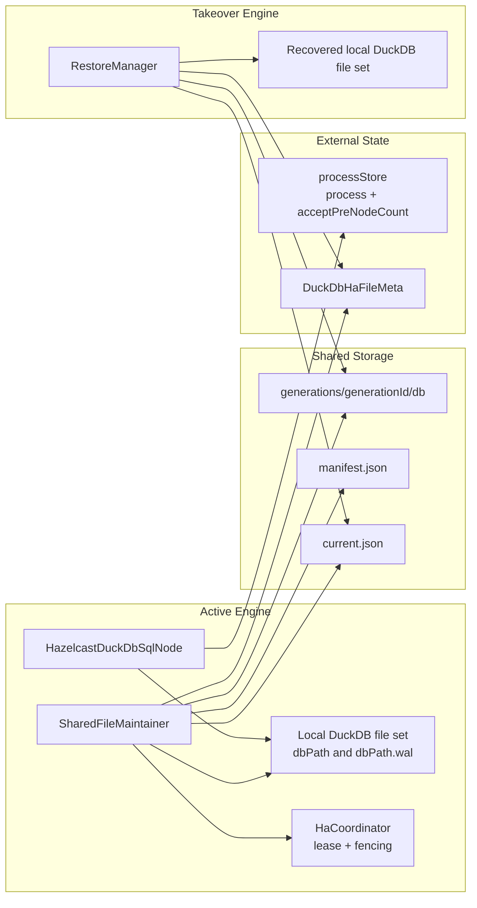

# DuckDB HA 方案 - 主动维护共享文件设计文档

## 1. 文档目的

本文档用于整理 Tapdata DuckDB 节点在多引擎高可用场景下的可落地改造方案。方案主题是“主动维护共享文件”：任务仍然在当前 Active Engine 的本地 DuckDB 文件上运行，由 Active Engine 在稳定一致性点主动把可恢复的 DuckDB 文件代际发布到共享存储；当任务漂移到其他 Engine 时，新 Engine 在 DuckDB 初始化前从共享文件恢复本地工作文件，再继续按现有任务恢复链路运行。

本文档重点回答：

- 当前 `HazelcastDuckDbSqlNode` 为什么只能适配单机或指定 Engine 运行。
- “主动维护共享文件”应该维护哪些文件、哪些状态，以及在什么时机维护。
- 如何避免多 Engine 同时写 DuckDB 文件导致的文件锁、状态错位和下游重复输出。
- 需要新增哪些组件、配置、元数据和代码接入点。
- 第一阶段如何实现，后续如何增强 RPO、性能和一致性。

## 2. 现有实现理解

### 2.1 TM 侧配置

TM 侧节点模型为 `com.tapdata.tm.commons.dag.process.DuckDbSqlNode`，节点类型为 `duckdb_sql_processor`。与 HA 相关的现有字段包括：

- `dbPath`：DuckDB 数据库文件路径配置。当前注释描述为数据库文件路径，实际 Engine 会先把该值当作基础目录校验，再拼接节点 ID 得到最终 DuckDB 文件路径。
- `querySql`：用户配置的 SELECT SQL。
- `wideTableName`、`wideTablePrimaryKey`、`mainTableName`、`fromTables`：宽表物化和增量维护配置。
- `duckLakeEnabled` 等：DuckLake 相关配置，当前不是本文方案的主路径。
- `batchSize`、`threads`、`memoryLimitGB`：运行时性能参数。

### 2.2 Engine 侧路径与连接模式

参考 `io.tapdata.flow.engine.V2.node.hazelcast.processor.HazelcastDuckDbSqlNode`：

1. `doInit()` 调用 `initDBPath(nodeConfig)` 解析路径。
2. `initDBPath()` 优先读取节点级 `dbPath`，否则读取 `DEFAULT_DUCK_DB_PATH`。
3. 若路径非空，先要求该路径是本机目录，然后通过 `buildDbPathWithNodeId(path, nodeId)` 得到最终路径。
4. `initDuckDbOperator(nodeConfig, dbPath, OUTPUT_BATCH_SIZE, obsLogger)` 用该路径创建 `DuckDbOperatorImpl`。
5. `DuckDbOperatorImpl` 若 `dbPath` 非空，会使用 `jdbc:duckdb:<dbPath>` 进入文件持久化模式；否则使用 `jdbc:duckdb:` 进入内存模式。

因此，虽然配置上常说“DuckDB 目录”，但当前最终传给 DuckDB JDBC 的是一个数据库文件路径，例如：

```text
nodeConfig.dbPath = /data/tapdata/duckdb
nodeConfig.id     = duck_node_1
final dbPath      = /data/tapdata/duckdb/duck_node_1
```

DuckDB 文件集合主要围绕该 final dbPath 产生：

- `<dbPath>`：数据库主文件。
- `<dbPath>.wal`：WAL 文件，异常退出后可能用于恢复。
- `<dbPath>.tmp/`：临时目录，不应该作为可恢复共享状态的核心内容。

### 2.3 运行数据写入链路

当前节点把上游事件写入 DuckDB 缓存表，再维护宽表：

1. `tryProcess()` 处理控制事件与 DML 事件。
2. DML 事件进入 `processRecordEvent()`。
3. 通过 `sourceId` 和 `NodeSchemaInfo` 定位 `PerSourceContext`。
4. 全量阶段达到批量条件后进入 `flushContext(context, false)`。
5. CDC 阶段每条事件进入 `flushContext(context, true)`。
6. 全量阶段只写缓存表。
7. 全量完成后通过 `handleAllTablesCdcTransition()` 刷新所有 context、补索引、`joinToWideTable()` 生成宽表基线、`table2Downstream()` 输出宽表全量。
8. CDC 阶段通过 `SmartMerger` 合并事件，先更新源缓存表，再用 `AffectedKeyCalculator` 和 `WideTableIncrementalUpdater` 更新宽表并输出 changelog。

### 2.4 当前已持久化的过程状态

`HazelcastDuckDbSqlNode` 当前不只依赖 DuckDB 文件，还维护了过程状态：

- `process`：
  - `INIT_CACHE_TABLE`
  - `JOIN_TO_WIDE_TABLE`
  - `TABLE_TO_DOWNSTREAM`
- `acceptPreNodeCount`

这些状态会通过 `ConstructIMap` 持久化到外部存储，storeName 为：

```text
DuckDbSqlNodeProcess_<taskId>_<nodeId>
```

这些状态用于避免重启后重复执行宽表全量输出、重复 join 或重复处理全量完成屏障。

### 2.5 当前 HA 缺口

现有实现的关键问题是：DuckDB 文件状态仍在 Engine 本地，任务漂移后新 Engine 无法继承。

更细地看，有四个缺口：

- 文件不可达：Engine A 上的 `<dbPath>`、`<dbPath>.wal` 不一定能被 Engine B 访问。
- 文件与过程状态未绑定：`processStore` 可能已经标记 `JOIN_TO_WIDE_TABLE=true`，但共享文件或新 Engine 本地文件并没有对应的宽表内容。
- 多进程写风险：DuckDB 原生文件格式稳定写入模型是单进程写，不能简单让多台 Engine 同时打开同一个共享文件进行读写。
- 恢复入口缺失：`doInit()` 当前先初始化 DuckDB 连接，再管理表；没有在打开 DuckDB 前做“从共享文件恢复本地工作文件”的步骤。

## 3. DuckDB 约束与设计依据

根据 DuckDB 官方文档：

- DuckDB 文件模式支持一个进程读写；多个进程可以只读访问，但不能同时写同一个原生数据库文件。文档也提示在共享目录或网络存储上访问 DuckDB 文件时需要格外小心。[DuckDB Concurrency](https://duckdb.org/docs/current/connect/concurrency)
- `CHECKPOINT` 会把 WAL 中的数据同步到数据库数据文件，`FORCE CHECKPOINT` 会等待 checkpoint 锁后执行。[DuckDB CHECKPOINT Statement](https://duckdb.org/docs/current/sql/statements/checkpoint)
- DuckDB 持久化数据库会产生主文件、WAL 文件和临时目录；异常退出后 WAL 对恢复有意义。[Files Created by DuckDB](https://duckdb.org/docs/current/operations_manual/footprint_of_duckdb/files_created_by_duckdb)
- `EXPORT DATABASE` 可以把数据库导出成目录并再次导入，但它更适合作为校验、迁移或兜底恢复手段，不适合作为每批 CDC 的高频发布主路径。[EXPORT and IMPORT DATABASE Statements](https://duckdb.org/docs/current/sql/statements/export)

因此，本文方案不建议直接把所有 Engine 的 `dbPath` 都指向同一个共享 DuckDB 文件进行运行时写入。更稳妥的路径是：

- Active Engine 使用本地文件作为真实工作文件。
- 共享存储只保存“已封版、可恢复”的文件代际。
- 任一时刻只有获得任务租约和 fencing token 的 Active Engine 可以发布新代际。
- 接管 Engine 只在启动前复制共享代际到自己的本地工作路径，然后再打开 DuckDB。

## 4. 设计目标

### 4.1 功能目标

- 支持包含 DuckDB 节点的任务在 Engine 故障后漂移到其他 Engine。
- 接管 Engine 不需要用户指定原 Engine，能够从共享文件恢复 DuckDB 缓存表、宽表和必要运行状态。
- Active Engine 在运行期间主动发布可恢复共享文件，减少故障后的重算成本。
- 保证共享文件不会被半写入版本污染，恢复端只消费 `COMMITTED` 代际。
- 文件代际与 `process`、`acceptPreNodeCount` 等过程状态保持一致。

### 4.2 非目标

- 不实现 DuckDB 多主、集群或多 Engine 同时写同一原生 DuckDB 文件。
- 不把 NFS/PVC 等共享目录当作 DuckDB 实时工作目录。
- 第一阶段不承诺严格 `RPO=0`。默认目标是 `RPO <= publishInterval`，依赖上游可重放和下游幂等来补齐发布窗口。
- 第一阶段不做文件级增量、块级增量或 WAL 流复制。
- 不替代 Tapdata 现有任务调度、任务租约、checkpoint 和 offset 提交机制。

## 5. 方案总览

一句话概括：

> 本地运行，稳定点 checkpoint，共享代际发布，接管前恢复，文件状态和过程状态绑定提交。

### 5.1 架构图



### 5.2 核心策略

- `dbPath` 继续指向 Engine 本地文件，保持当前 DuckDB 写入模型。
- 新增 `sharedDbPath` 或共享存储配置，用于保存代际文件，不作为运行时 DuckDB JDBC 路径。
- 每次发布生成一个不可变 generation，不覆盖正在被恢复端读取的旧 generation。
- 通过 `manifest.json` 描述该 generation 的文件列表、校验、过程状态、fencing token、发布原因等。
- 通过 `current.json` 原子切换当前可恢复 generation。
- 恢复端只读取 `current.json` 指向且状态为 `COMMITTED` 的 generation。
- `processStore` 的持久化与 generation 绑定，避免文件和状态错位。

## 6. 共享文件模型

### 6.1 本地工作文件

本地工作文件是当前 `DuckDbOperatorImpl` 真正打开的文件集合：

```text
<localBasePath>/<duckNodeId>
<localBasePath>/<duckNodeId>.wal
<localBasePath>/<duckNodeId>.tmp/
```

其中：

- `<duckNodeId>` 是当前代码通过 `buildDbPathWithNodeId(dbPath, nodeId)` 生成的最终 DuckDB 文件名。
- `<duckNodeId>.wal` 在正常 close 或 checkpoint 后可能不存在，但如果存在，需要纳入文件状态判断。
- `<duckNodeId>.tmp/` 是临时目录，不纳入共享可恢复文件。

### 6.2 共享代际目录

建议共享目录布局如下：

```text
<sharedRoot>/
  duckdb-ha/
    tasks/
      <taskId>/
        nodes/
          <duckNodeId>/
            current.json
            generations/
              <generationId>/
                manifest.json
                db/
                  <duckNodeId>
                  <duckNodeId>.wal
            trash/
            locks/
```

说明：

- `generationId` 单调递增，可以使用 `epoch-sequence-timestamp`，例如 `00000023-20260706153045123`。
- `db/` 中只存可恢复文件，第一阶段通常只包含主文件和必要 WAL。
- `current.json` 是当前可恢复代际指针，必须通过临时文件加原子 rename 或存储层 CAS 更新。
- `trash/` 用于延迟删除旧代际，避免恢复端正在读取时被清理。
- `locks/` 仅在文件系统锁可用时辅助诊断，不应作为唯一 fencing 来源。

### 6.3 manifest 示例

```json
{
  "schemaVersion": 1,
  "taskId": "64f0...",
  "duckNodeId": "duck_node_1",
  "generationId": "00000023-20260706153045123",
  "parentGenerationId": "00000022-20260706152930111",
  "engineId": "engine-a",
  "fenceToken": 23,
  "publishReason": "CDC_BATCH",
  "createdAt": 1783332645123,
  "completedAt": 1783332647341,
  "duckdb": {
    "dbPathFileName": "duck_node_1",
    "checkpoint": "FORCE_CHECKPOINT",
    "format": "NATIVE_FILE_SET"
  },
  "files": [
    {
      "path": "db/duck_node_1",
      "size": 104857600,
      "sha256": "..."
    }
  ],
  "processState": {
    "process": {
      "INIT_CACHE_TABLE": true,
      "JOIN_TO_WIDE_TABLE": true,
      "TABLE_TO_DOWNSTREAM": true
    },
    "acceptPreNodeCount": 2
  },
  "status": "COMMITTED"
}
```

### 6.4 元数据集合

共享文件本身可以恢复，但建议仍新增普通 Mongo 集合，例如 `DuckDbHaFileMeta`，用于查询、清理、告警和 fencing 审计。

建议字段：

- `taskId`
- `duckNodeId`
- `generationId`
- `parentGenerationId`
- `engineId`
- `fenceToken`
- `status`：`PREPARING`、`CHECKPOINTING`、`COPYING`、`VERIFYING`、`COMMITTED`、`FAILED`、`EXPIRED`
- `publishReason`
- `sharedRoot`
- `manifestPath`
- `currentPointerPath`
- `fileCount`
- `totalSize`
- `checksum`
- `processStateHash`
- `createdAt`
- `completedAt`
- `failureReason`
- `restoreCount`
- `lastRestoreAt`

查询当前版本时以 `current.json` 为准，Mongo 元数据用于辅助判断；如果两者冲突，恢复端应优先信任 `current.json + manifest` 的文件完整性，并记录告警。

## 7. 一致性设计

### 7.1 为什么不能只复制 DuckDB 文件

DuckDB 节点当前还有外部过程状态。若只复制文件，可能发生以下错位：

1. Active Engine 执行 `joinToWideTable()` 成功。
2. `markProcessDone(JOIN_TO_WIDE_TABLE)` 已把状态写入外部存储。
3. Active Engine 在发布共享文件前宕机。
4. Takeover Engine 恢复到旧 DuckDB 文件，但从外部存储读到 `JOIN_TO_WIDE_TABLE=true`。
5. 新节点跳过 join，宽表内容缺失或过旧。

因此，文件代际必须和过程状态一起提交。

### 7.2 提交原则

每个可恢复 generation 必须满足：

- DuckDB 文件已经到达稳定点。
- 该稳定点对应的 `process` 和 `acceptPreNodeCount` 已写入 manifest。
- `processStore` 中的状态不能领先于 `current.json` 指向的 generation。
- 任何失败发布都不能改变 `current.json`。
- 恢复端不能使用 `FAILED`、缺少 manifest、校验失败或 fenceToken 过期的代际。

### 7.3 推荐提交顺序

第一阶段建议采用如下顺序：

1. Active Engine 持有任务级 HA lease，并得到 `fenceToken`。
2. 暂停 DuckDB 写入入口，等待当前 flush 完成。
3. 刷新所有 `PerSourceContext` 缓冲。
4. 持久化待提交的 `process` / `acceptPreNodeCount` 到本地内存快照，不立即让外部状态领先共享文件。
5. 执行 `FORCE CHECKPOINT`。
6. 复制 `<dbPath>` 和必要的 `<dbPath>.wal` 到 staging generation。
7. 计算文件大小、sha256、processStateHash。
8. 写入 `manifest.json.tmp`，校验后 rename 为 `manifest.json`。
9. 通过 CAS 或原子 rename 更新 `current.json`。
10. 再把 manifest 中的 processState 写入或校准到 `processStore`。
11. 标记 Mongo 元数据为 `COMMITTED`。
12. 释放 DuckDB 写入入口。

如果现有 `markProcessDone()` 暂时难以改造为延迟提交，至少要在这些关键状态之后立即触发同步发布：

- `INIT_CACHE_TABLE`
- `JOIN_TO_WIDE_TABLE`
- `TABLE_TO_DOWNSTREAM`

并在恢复时以 manifest 内的 processState 回填 `processStore`，修正外部状态和文件状态的偏差。

### 7.4 DuckDB 发布锁

当前 `flushContext()` 内部使用 `synchronized (this)` 包裹单次 flush，但并非所有 DuckDB 写入口都统一进入同一个锁。HA 改造建议新增一个明确的数据库 mutation 锁：

```java
private final Object duckDbMutationLock = new Object();
```

纳入该锁的操作：

- `flushContext()`
- `handleAllTablesCdcTransition()`
- `joinToWideTable()`
- `table2Downstream()` 中读取并输出宽表基线的过程
- `createWideTableIndex()`
- `manageDuckDbTables()`
- `cleanCache()`
- HA publish 的 checkpoint 与文件复制准备阶段

第一阶段可以用简单互斥锁保证正确性。后续若发布耗时明显影响吞吐，可升级为读写锁：普通写入持读锁，发布持写锁。

## 8. 发布流程

### 8.1 触发时机

发布触发分为强制发布和周期发布。

强制发布：

- 节点初始化并完成恢复后，生成空库或初始表结构时可发布一次 `INIT_SCHEMA`。
- 全量缓存完成并执行 `INIT_CACHE_TABLE` 后。
- `joinToWideTable()` 完成后。
- `table2Downstream()` 完成后。
- `doClose()` 正常关闭前或关闭后。
- 任务暂停、停止、迁移前。

周期发布：

- CDC 成功 flush 后标记 dirty。
- 后台 maintainer 按 `publishIntervalMs` 聚合发布。
- dirty event 数达到 `maxDirtyEvents` 时发布。
- 距上次发布超过 `maxPublishLagMs` 时发布。

### 8.2 发布模式

建议提供两种模式：

- `ASYNC`：默认模式。CDC flush 成功后只标记 dirty，由后台线程周期发布。吞吐影响小，RPO 约等于发布间隔。
- `SYNC_ON_CHECKPOINT`：强一致模式。与 Tapdata 任务 checkpoint / offset 提交流程绑定，在任务确认 source offset 前同步发布共享文件。吞吐影响更大，但能把 DuckDB 文件状态与任务恢复点对齐。

第一阶段可以先实现 `ASYNC`，并对关键一次性状态使用同步发布。

### 8.3 发布算法

```text
publish(reason):
  if !haEnabled:
    return

  lease = coordinator.ensureActiveLease(taskId, duckNodeId)
  if lease invalid:
    skip and warn

  synchronized duckDbMutationLock:
    flushAllContexts(syncStage == CDC)
    duckDbOperator.execute("FORCE CHECKPOINT")
    processState = snapshotProcessState()
    generationId = nextGenerationId(lease.fenceToken)
    staging = sharedRepo.createStagingGeneration(generationId)
    copy <dbPath> to staging/db/<duckNodeId>
    if <dbPath>.wal exists:
      copy <dbPath>.wal to staging/db/<duckNodeId>.wal
    calculate checksum
    write manifest.json.tmp
    verify staging by size/checksum
    rename manifest.json.tmp to manifest.json
    casUpdate current.json from oldGeneration to generationId
    persist processState to processStore with generationId
    mark meta COMMITTED
```

### 8.4 文件复制策略

第一阶段推荐 `FULL_GENERATION_COPY`：

- 每次生成完整 generation。
- 不覆盖旧 generation。
- 实现简单，恢复可靠。
- 适合中小规模 DuckDB 文件或发布频率较低的场景。

后续可优化：

- `HARDLINK_BASED_COPY`：同一文件系统下使用 hardlink 或 reflink 作为基础，再覆盖变化文件。
- `RSYNC_LIKE_DELTA`：按块比较复制，减少大文件传输。
- `EXPORT_PARQUET_SNAPSHOT`：用 `EXPORT DATABASE` 输出 Parquet 作为慢速但可读性强的兜底快照。
- `DUCKLAKE_MODE`：对高并发或共享写需求，评估 DuckLake + catalog 的长期路线。

### 8.5 WAL 处理

推荐策略：

- 发布前执行 `FORCE CHECKPOINT`。
- checkpoint 成功后，主文件应包含稳定数据。
- 如果 `<dbPath>.wal` 仍存在，则一并复制并记录在 manifest。
- 不复制 `<dbPath>.tmp/`。
- 恢复时先复制主文件，再复制 WAL。

如果 `FORCE CHECKPOINT` 失败：

- 当前 generation 标记 `FAILED`。
- 不更新 `current.json`。
- 根据配置决定任务继续运行还是报错停止。

## 9. 恢复流程

### 9.1 接入位置

恢复必须发生在 DuckDB JDBC 打开文件之前。建议调整 `HazelcastDuckDbSqlNode.doInit()` 顺序：

```text
super.doInit(context)
nodeConfig = (DuckDbSqlNode) getNode()
dbPath = initDBPath(nodeConfig)

if haEnabled:
  haCoordinator.acquireOrValidateActiveLease(taskId, nodeId)
  restoreManager.restoreBeforeOpen(taskId, nodeId, dbPath)

duckDbOperator = initDuckDbOperator(nodeConfig, dbPath, ...)
initDBSettingsIfNeed(nodeConfig)
initPreNodeCount()
...
manageDuckDbTables()
...
if haEnabled:
  sharedFileMaintainer.start()
```

### 9.2 恢复算法

```text
restoreBeforeOpen(taskId, duckNodeId, localDbPath):
  current = sharedRepo.readCurrent(taskId, duckNodeId)
  if current not exists:
    if task is initial run:
      return EMPTY_LOCAL_DB
    else:
      fail fast or request full resync

  manifest = sharedRepo.readManifest(current.generationId)
  verify manifest.status == COMMITTED
  verify fenceToken and file list

  if local marker generation == manifest.generationId and local checksum valid:
    return LOCAL_ALREADY_CURRENT

  backup local <dbPath> and <dbPath>.wal
  clear local <dbPath>, <dbPath>.wal, <dbPath>.tmp/
  copy generation db files to local path
  verify size/checksum
  write local marker .tapdata-duckdb-ha.json
  restore processStore from manifest.processState
  return RESTORED
```

### 9.3 本地 marker

建议在本地工作目录旁边写入 marker：

```text
<dbPath>.tapdata-ha.json
```

内容包括：

- `taskId`
- `duckNodeId`
- `generationId`
- `fenceToken`
- `restoredAt`
- `sourceManifestPath`
- `checksum`

用途：

- Engine 原地重启时可快速判断本地文件是否已经是当前 generation。
- 避免每次启动都全量复制。
- 便于排障。

## 10. 单活与 fencing

### 10.1 为什么需要 fencing

Tapdata 任务调度正常情况下应保证同一任务单活，但 HA 文件发布不能只依赖调度假设。典型风险：

- Engine A 网络抖动，TM 认为其失联并把任务拉到 Engine B。
- Engine B 开始恢复并运行。
- Engine A 短暂恢复，后台 maintainer 继续向共享目录发布旧状态。

如果没有 fencing，`current.json` 可能被旧 Active 覆盖。

### 10.2 fencing 模型

建议每个任务 DuckDB 节点维护一个单调递增 `fenceToken`：

- 新 Active 获取 lease 时，外部存储原子递增 `fenceToken`。
- 发布 manifest 必须带当前 `fenceToken`。
- 更新 `current.json` 前检查外部最新 `fenceToken` 仍等于自己持有的 token。
- 清理旧 generation 时也必须验证 token。
- 旧 Active 即使还能写共享目录，也不能通过 CAS 更新 `current.json`。

### 10.3 lease 存储

可以优先复用当前 external storage 能力，新增一个 `DuckDbHaLease_<taskId>_<duckNodeId>` 存储：

- `ownerEngineId`
- `fenceToken`
- `leaseExpireAt`
- `heartbeatAt`
- `status`

若 external storage 不可用，HA 模式应启动失败，而不是降级为无 fencing 的共享文件发布。

## 11. 配置设计

建议在 `DuckDbSqlNode` 上新增 HA 配置，默认关闭：

| 字段 | 类型 | 默认值 | 说明 |
| --- | --- | --- | --- |
| `duckDbHaEnabled` | Boolean | `false` | 是否启用主动维护共享文件 |
| `duckDbHaSharedStoreType` | String | `FILE_SYSTEM` | 第一阶段支持共享文件系统，后续可扩展对象存储 |
| `duckDbHaSharedRoot` | String | `null` | 共享文件根路径 |
| `duckDbHaPublishMode` | String | `ASYNC` | `ASYNC` 或 `SYNC_ON_CHECKPOINT` |
| `duckDbHaPublishIntervalMs` | Long | `30000` | 周期发布间隔 |
| `duckDbHaMaxDirtyEvents` | Integer | `10000` | dirty 事件数阈值 |
| `duckDbHaMaxPublishLagMs` | Long | `120000` | 最大发布滞后 |
| `duckDbHaRetainGenerations` | Integer | `3` | 保留最近几个 generation |
| `duckDbHaFailOnPublishError` | Boolean | `false` | 发布失败是否停止任务 |
| `duckDbHaRestorePolicy` | String | `RESTORE_IF_PRESENT` | 无共享代际时的启动策略 |

`duckDbHaRestorePolicy` 建议取值：

- `RESTORE_IF_PRESENT`：有共享代际则恢复；没有则按新任务启动。
- `REQUIRE_SHARED_STATE`：没有共享代际则启动失败。
- `LOCAL_FIRST`：本地 marker 与 current 一致时优先使用本地。

## 12. 代码改造点

### 12.1 新增组件

建议包路径：

```text
io.tapdata.flow.engine.V2.node.duckdb.ha
```

建议类：

- `DuckDbHaConfig`：从 `DuckDbSqlNode` 解析 HA 配置。
- `DuckDbHaCoordinator`：lease、fencing token、heartbeat。
- `DuckDbSharedFileRepository`：共享目录读写、staging、manifest、current 指针。
- `DuckDbSharedFileMaintainer`：后台发布调度、dirty 标记、强制发布。
- `DuckDbRestoreManager`：启动前恢复。
- `DuckDbGenerationManifest`：manifest 模型。
- `DuckDbProcessStateSnapshot`：封装 `process` 和 `acceptPreNodeCount`。
- `DuckDbLocalFileSet`：定位 `<dbPath>`、`<dbPath>.wal`、marker、临时文件。
- `DuckDbFileChecksum`：sha256、size 校验。

### 12.2 `HazelcastDuckDbSqlNode` 改造

建议新增字段：

```java
private DuckDbHaConfig duckDbHaConfig;
private DuckDbHaCoordinator duckDbHaCoordinator;
private DuckDbSharedFileMaintainer duckDbSharedFileMaintainer;
private DuckDbRestoreManager duckDbRestoreManager;
private final Object duckDbMutationLock = new Object();
```

关键接入点：

- `doInit()`：在 `initDuckDbOperator()` 前执行 restore。
- `initPreNodeCount()`：支持从 manifest 恢复 processState 后再读取或校准 processStore。
- `markProcessDone()`：HA 开启时记录 dirty，并对关键状态触发同步发布或事务式提交。
- `persistProcessIfPossible()`：增加 generationId 维度，避免无条件覆盖。
- `flushContext()`：成功 flush 后调用 `duckDbSharedFileMaintainer.markDirty(reason, eventCount)`。
- `handleAllTablesCdcTransition()`：完成全量到 CDC 切换后强制发布。
- `doClose()`：flush 后做 graceful publish，再停止 maintainer 和释放 lease。
- `cleanCache()`：清理本地 DuckDB 文件时同步清理共享代际或标记废弃，避免 reset 后恢复旧文件。

### 12.3 `DuckDbOperator` 改造

建议增加：

```java
void checkpoint(boolean force) throws SQLException;
String getDbPath();
```

第一阶段也可以直接复用：

```java
duckDbOperator.execute("FORCE CHECKPOINT");
```

但封装成接口更利于测试和未来替换实现。

### 12.4 processStore 兼容改造

建议把 processStore value 从裸值扩展为带 generation 的结构：

```json
{
  "generationId": "00000023-20260706153045123",
  "process": {
    "INIT_CACHE_TABLE": true,
    "JOIN_TO_WIDE_TABLE": true,
    "TABLE_TO_DOWNSTREAM": true
  },
  "acceptPreNodeCount": 2,
  "updatedAt": 1783332647341
}
```

兼容旧数据：

- 如果读到旧格式 `Map<String, Boolean>`，按当前逻辑加载。
- HA 开启后第一次成功发布时写入新格式。
- 恢复时若 processStore generation 比 manifest 更新，但 manifest 是 current，则以 manifest 回填并告警。

## 13. 异常场景处理

| 场景 | 处理策略 |
| --- | --- |
| Active 发布中宕机 | staging generation 无 manifest 或未 COMMITTED，恢复端忽略 |
| 复制文件失败 | 标记 `FAILED`，不更新 `current.json` |
| checksum 不一致 | 标记 `FAILED`，保留旧 current |
| 共享存储不可写 | 默认任务继续运行并告警；`duckDbHaFailOnPublishError=true` 时停止任务 |
| 恢复时无 current | 初次全量任务允许空库启动；CDC 恢复任务应失败或要求重置 |
| current 指向缺失 generation | 使用上一个 COMMITTED generation，若无则失败 |
| 旧 Active 继续发布 | CAS 检查 fenceToken 失败，禁止更新 current |
| processStore 领先 manifest | 以 manifest processState 回填，记录严重告警 |
| 本地文件损坏 | 丢弃本地 marker，从共享 current 重新恢复 |
| `FORCE CHECKPOINT` 长时间等待 | 超时失败，本轮不发布；必要时触发任务告警 |

## 14. RPO、RTO 与性能

### 14.1 RPO

默认 `ASYNC` 模式：

```text
RPO <= min(publishIntervalMs, maxPublishLagMs, maxDirtyEvents 触发时间)
```

如果 Active 在两次发布之间宕机，新 Engine 会恢复到最近 `COMMITTED` generation。之后依赖 Tapdata 的 source offset 恢复和 CDC 幂等写入把未发布窗口内的数据重放进 DuckDB。

严格模式：

- 将发布动作绑定到任务 checkpoint / offset commit 前。
- 只有共享文件发布成功后才允许提交对应 source offset。
- 可以把 DuckDB 文件状态与任务恢复点对齐，但会明显增加 checkpoint 延迟。

### 14.2 RTO

恢复时间主要由共享 generation 大小和存储吞吐决定：

```text
RTO ~= 读取 current + 复制文件 + checksum 校验 + DuckDB open recovery
```

优化方向：

- 本地 marker 命中时跳过复制。
- 保留最近 generation，避免 current 损坏时完全失败。
- 大文件场景引入增量复制或 DuckLake 长期方案。

### 14.3 性能影响

第一阶段全量代际复制会带来：

- `FORCE CHECKPOINT` 等待。
- 文件复制 IO。
- checksum CPU 与 IO。
- 发布期间 DuckDB 写入短暂停顿。

建议默认参数保守：

```text
publishIntervalMs   = 30000
maxDirtyEvents      = 10000
maxPublishLagMs     = 120000
retainGenerations   = 3
failOnPublishError  = false
```

## 15. 分阶段落地计划

### Phase 1：可恢复优先

目标：跨 Engine 能恢复，不追求最优性能。

- 新增 HA 配置，默认关闭。
- 新增共享目录 generation、manifest、current 指针。
- 启动前 restore。
- 关键状态后同步发布。
- CDC 周期异步发布。
- `doClose()` graceful publish。
- manifest processState 回填 processStore。
- 单测覆盖 manifest、路径、checksum、current 切换。
- 集成测试覆盖 Engine A 发布、Engine B 恢复并继续 CDC。

### Phase 2：一致性增强

目标：减少状态错位和发布窗口。

- processStore 增加 generationId。
- `markProcessDone()` 与共享 generation 提交绑定。
- 接入任务 checkpoint / offset commit，支持 `SYNC_ON_CHECKPOINT`。
- 引入明确 `duckDbMutationLock` 并覆盖所有 DuckDB mutation。
- 增加 publish timeout、lease heartbeat、fencing CAS。

### Phase 3：性能优化

目标：降低大文件复制成本。

- 增量复制或 reflink/hardlink 优化。
- 发布期间异步 checksum 或分块 checksum。
- 本地 current marker 快速启动。
- 分层 retention 和后台清理。
- 大任务评估 DuckLake 作为长期共享存储路线。

## 16. 测试与验收

### 16.1 单元测试

- `DuckDbLocalFileSet` 能正确识别 `<dbPath>`、`<dbPath>.wal`、marker。
- `DuckDbGenerationManifest` 序列化、反序列化、版本兼容。
- `DuckDbSharedFileRepository` staging 到 committed 的原子切换。
- checksum 不一致时拒绝恢复。
- processStore 旧格式和新格式兼容。
- fenceToken 过期时拒绝更新 current。

### 16.2 集成测试

- 全量阶段写入缓存表后发布，恢复端表数据一致。
- 全量转 CDC 后发布，恢复端宽表存在且 `process` 不重复执行。
- CDC 发布后恢复，继续处理后续 CDC，宽表结果正确。
- Active 在复制中宕机，恢复端忽略 staging。
- Active 发布成功但 Mongo 元数据未成功，恢复端仍可基于 current + manifest 恢复并补元数据。
- processStore 人为领先 manifest，恢复端以 manifest 回填。
- `cleanCache()` 后不会从旧共享 generation 恢复。

### 16.3 验收标准

- 不指定 Engine 启动包含 DuckDB 节点的任务，任务能在任一符合资源条件的 Engine 上接管。
- Active Engine 故障后，Takeover Engine 能在 DuckDB 初始化前恢复本地文件。
- 恢复后的缓存表、宽表和过程状态与最近 `COMMITTED` generation 一致。
- 不会出现两个 Engine 同时成功发布 current。
- 发布失败不会破坏上一代可恢复文件。
- 关闭 HA 配置后，不影响现有单机 DuckDB 行为。

## 17. 关键开放问题

- Tapdata 当前 source offset / checkpoint 提交流程的精确接入点在哪里，是否能支持 `SYNC_ON_CHECKPOINT`。
- external storage 是否能提供可靠 CAS、TTL lease 和 fencing token。
- 客户生产环境共享存储类型是 NFS、K8s PVC、NAS 还是对象存储；不同存储的原子 rename 和 fsync 能力不同。
- DuckDB 文件大小上限和客户可接受的发布间隔，需要用真实任务压测确定默认参数。
- `table2Downstream()` 全量宽表输出与 generation 发布的顺序是否需要进一步绑定下游 ack。

## 18. 推荐结论

建议第一阶段采用“本地运行 + 全量代际发布 + 启动前恢复”的主动维护共享文件方案，而不是让多个 Engine 直接读写同一个共享 DuckDB 文件。

这条路线对现有 `HazelcastDuckDbSqlNode` 改动可控：核心是在 DuckDB 打开前加 restore，在写入稳定点后加 publish，在过程状态提交处绑定 generation。它不能天然做到零数据丢失，但能先解决“任务必须指定 Engine 才能跑”的核心 HA 问题，并为后续接入任务 checkpoint、增量复制或 DuckLake 留出空间。
