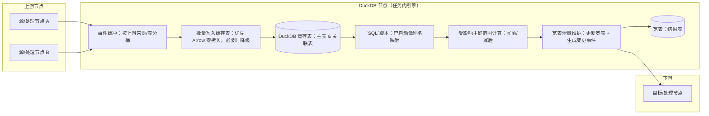
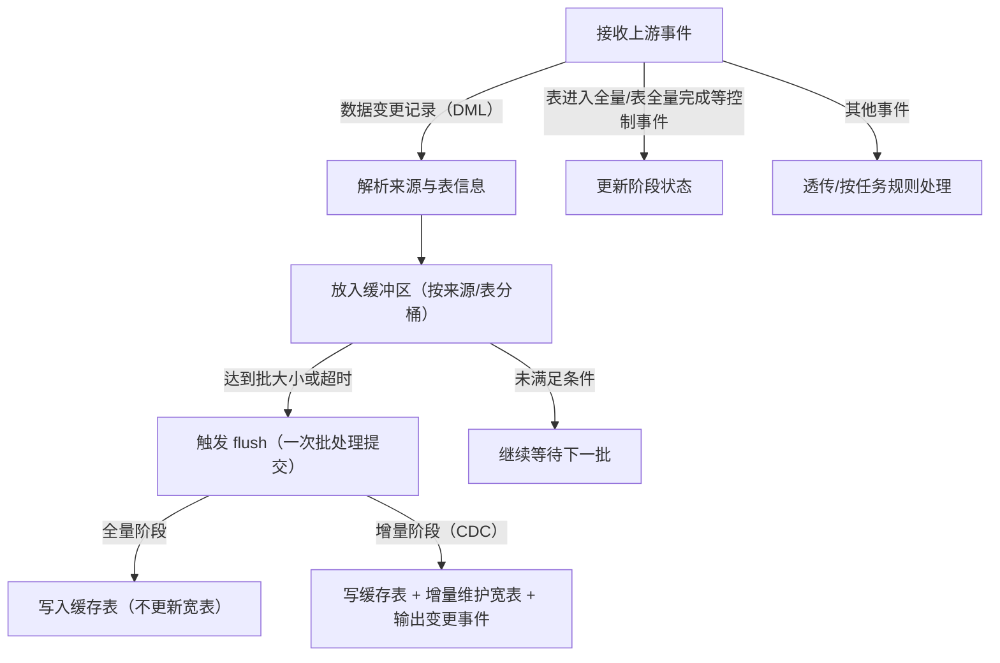

# DuckDB 节点功能说明与使用手册

## 1. 文档目的

本文档用于面向客户介绍当前项目中的 DuckDB 节点能力、适用场景、配置方法和使用步骤，便于客户理解该节点“能做什么”“什么时候用”“怎么用”。

### 1.1 术语与缩写说明

本文档中出现的缩写关键术语，统一在这里给出解释（后续章节首次出现时也会尽量带上中文解释）。

| 缩写 | 全称（英文） | 中文含义 | 在本节点中的含义/用途 |
| --- | --- | --- | --- |
| SQL | Structured Query Language | 结构化查询语言 | 用户编写的查询脚本，用于定义宽表/查询结果 |
| CTE | Common Table Expression | 公共表表达式 | `WITH ... AS (...)` 语法，给复杂 SQL 提供可读的“临时结果集”命名 |
| CDC | Change Data Capture | 变更数据捕获/增量变更 | 全量之后的增量阶段数据变更事件（插入/更新/删除） |
| DDL | Data Definition Language | 数据定义语言 | 建表/删表/改表等结构变更语句（本节点的 SQL 脚本禁止） |
| DML | Data Manipulation Language | 数据操纵语言 | 插入/更新/删除等数据写入语句（本节点的 SQL 脚本禁止） |
| S3 | Simple Storage Service | S3 兼容对象存储 | DuckLake 存储类型之一，数据文件落对象存储 |
| LOCAL | Local filesystem | 本地文件系统 | DuckLake 存储类型之一，数据文件落本地目录 |

## 2. DuckDB 节点是什么

DuckDB 节点是一个内嵌式 SQL（结构化查询语言）处理节点。它会把上游节点的数据写入任务运行时内置的 DuckDB 引擎中，再根据用户配置的 `SELECT` SQL 脚本进行查询、关联、宽表构建和结果输出。

在当前项目中，它主要承担以下角色：

- 多表关联处理节点
- 宽表构建节点
- 本地嵌入式分析计算节点
- 全量结果物化节点
- 全量 + 增量一体化结果输出节点

## 3. 适用场景

DuckDB 节点适合以下业务场景：

- 一张主表关联一张或多张从表
- 异构数据源之间不方便统一下推 SQL
- 需要在任务内部生成一张宽表结果
- 需要在全量完成后把整张宽表发送到下游
- 需要在全量完成后继续接收宽表的增量变化

常见示例：

- 用户表 + 订单表 + 支付表，构建用户订单宽表
- 设备主数据表 + 实时状态表，构建设备当前状态视图
- 客户主表 + 标签表 + 行为汇总表，构建客户画像宽表

## 4. 核心能力说明

### 4.1 支持 SQL 方式定义结果

用户通过 `SQL`脚本 配置 DuckDB 节点的查询逻辑。

当前项目中，DuckDB 节点要求 `SQL`脚本 必须是 `SELECT` 语句，适合如下模式：

- 普通查询
- 多表 `JOIN`
- 子查询
- `CTE`（Common Table Expression，公共表表达式）
- 字段表达式与别名输出

运行时会在初始化阶段对 `SQL`脚本 做“规范化 + 校验”。以下校验不通过会导致任务启动失败或节点初始化失败：

- 规范化（normalize）
  - 去除首尾空白
  - 去掉末尾分号（如果存在）
  - 将同一行内的连续空白字符压缩为单个空格（保留换行）
- 语法解析（parse）
  - 使用 SQL 解析器对语句进行语法解析；语法错误会直接报错
- 语句类型限制（must be SELECT）
  - 必须是 `SELECT` 语句（允许 `UNION` / `EXCEPT` / `INTERSECT`、子查询、CTE、注释等仍属于查询语义的写法）
- 关键字黑名单（禁止 DDL（数据定义语言）/DML（数据操纵语言）/执行类语句）
  - 若 SQL 文本中出现以下关键字（不区分大小写），会被判定为“不安全语句”并拒绝：
    - `CREATE`、`DROP`、`ALTER`、`TRUNCATE`
    - `INSERT`、`UPDATE`、`DELETE`、`MERGE`
    - `EXECUTE`、`EXEC`
  - 说明：当前实现是基于关键字字符串匹配进行拦截，因此即使关键字出现在注释或字符串常量中，也可能触发拒绝；建议在 `SQL`脚本 中避免出现这些关键字文本
- 输出字段检查（must select fields）
  - 需至少能解析出一个 `SELECT` 输出字段，否则会拒绝

“不安全语句”的定义在本节点中非常明确：任何可能改变数据、改变结构、执行外部命令的 SQL（上述关键字覆盖的 DDL（数据定义语言）/DML（数据操纵语言）/执行类语句）都会被拒绝。

### 4.2 支持多上游节点关联

创建合并任务时，通过Sql自动解析出源表，并自动匹配到对应源连接选定源表，如果连接列表中存在多个包含相同表名的源连接，需要用户收到选择对应的连接

这意味着：

- 系统运行时会把这个别名映射为 DuckDB 中的真实缓存表

每张源表都会在全量阶段1:1复制到DuckDB对应的缓存表中，全量结束后会执行 `SQL`脚本 将各表的全量记录合并到缓存宽表中

### 4.3 支持宽表物化

DuckDB 节点不仅可以执行 SQL，还可以把查询结果保存成一张真实存在的宽表。这里的“宽表物化”，可以理解为：系统不是只临时执行一次查询后把结果丢掉，而是把 `SQL` 脚本的结果落成一张可持续维护、可继续输出、可被后续流程使用的结果表。

从用户视角看，宽表物化的意义在于：

- 把多张源表经过关联、筛选、字段整理后的结果，沉淀成一张最终结果表
- 让任务输出不再只是“中间查询结果”，而是一张有明确结构的宽表
- 便于后续继续输出到下游节点、目标库或消费系统

宽表物化通常发生在全量阶段完成之后，形成过程可以理解为以下 5 个步骤：

1. 上游每张参与计算的表，先按节点映射写入 DuckDB 本地缓存表。
2. 全量阶段中，DuckDB 节点持续接收并缓存这些上游全量数据。
3. 当相关上游表的全量数据准备完成后，DuckDB 节点执行用户配置的 `SQL` 脚本。
4. SQL 查询结果不会只作为一次性结果返回，而是被写入对应的宽表中。
5. 如果配置了继续向下游输出，系统会把这张宽表中的结果继续发送到后续节点。

宽表物化要想达到预期效果，通常需要满足以下条件：

- `SQL` 脚本已经正确定义了最终结果结构
- `fromTables` 已正确声明参与查询的上游节点和别名
- `mainTableName`、`wideTableName`、`wideTablePrimaryKey` 等关键配置合理
- 查询结果字段、字段别名、结果粒度已经提前设计清楚

物化完成后，宽表一般具备以下特点：

- 它是一张明确存在的结果表，而不是一次性的临时返回值
- 它的字段结构由 `SQL` 脚本的输出字段决定
- 它的名称由 `wideTableName` 指定，未显式配置时会按节点规则生成默认名称
- 它可以作为 DuckDB 节点后续增量维护的基线结果

举例说明：

- 假设上游有用户表、订单表、支付表
- `SQL` 脚本用于把这三张表关联成“用户订单支付宽表”
- 那么在全量阶段完成后，DuckDB 节点会把这三张表在 DuckDB 本地完成汇总计算，并生成一张宽表，例如 `wide_user_order_payment`
- 这张表中的每一行，不再代表某一张原始源表的数据，而是代表一次已经完成业务整合后的最终结果记录

宽表物化的直接价值包括：

- 把复杂多表 SQL 的结果稳定沉淀下来
- 让下游直接消费整理后的宽表，而不是自己再做关联处理
- 为全量后的增量维护提供基础结果表

同时需要注意以下边界：

- 宽表的结构由 `SQL` 脚本决定，因此 SQL 设计是否清晰，会直接决定宽表是否易于使用
- 如果结果粒度设计不清，宽表可能出现“一行代表什么”不明确的问题
- 如果宽表主键设计不合理，会直接影响后续宽表增量维护能力

### 4.4 支持全量完成后的增量维护

对于 `initial_sync_cdc` 类型任务，当前项目支持 DuckDB 宽表在全量完成后继续进行增量维护。这意味着 DuckDB 节点不是只在全量结束时生成一次宽表，而是可以在后续 CDC（Change Data Capture，增量变更捕获）阶段持续接收上游变更，并把这些变更同步反映到宽表结果中。

要启用这一能力，通常需要同时满足以下前提：

- 任务类型为 `initial_sync_cdc`
- DuckDB 节点已经完成全量阶段的基线宽表构建
- `SQL` 脚本、`fromTables`、`mainTableName`、`wideTablePrimaryKey` 等关键配置正确
- 宽表主键能够稳定标识结果中的一行或一组业务唯一记录

增量维护的处理过程可以理解为以下 6 个步骤：

1. 上游任一参与关联的表产生 CDC（增量变更）事件，例如插入、更新、删除。
2. DuckDB 节点先把这批变更写入对应的 DuckDB 源缓存表，保证本地缓存数据是最新的。
3. 系统根据本次变更涉及的主键和关联关系，判断哪些宽表记录可能受到影响，而不是整张宽表全部重算。
4. 系统基于 `SQL` 脚本重新计算这些受影响的宽表结果行，得到变更后的最新结果。
5. 系统把旧结果与新结果进行对比，判断宽表层面到底是新增、更新、删除，还是无需变化。
6. 系统更新 DuckDB 中的宽表，并按需要把宽表的插入、更新、删除事件继续发送到下游。

从用户视角看，这个能力带来的直接效果是：

- 全量完成后，宽表不会“静止不动”
- 上游表后续新增一条记录，宽表会补出对应结果
- 上游表后续修改关联字段或业务字段，宽表会同步更新对应结果
- 上游表后续删除相关记录，宽表中失效的结果也会被删除或调整

举例说明：

- 假设宽表 SQL 是“用户表关联订单表”
- 全量阶段结束后，`wide_user_orders` 已经生成
- 如果后续订单表新增一笔订单，DuckDB 节点不会重算所有用户订单数据，而是只重算这笔订单相关的那部分宽表结果
- 如果某个用户状态变化导致原本满足条件的订单结果不再满足筛选条件，DuckDB 节点会把对应宽表结果更新或删除

这类增量维护方式的优点是：

- 不需要每次都重跑整张宽表 SQL
- 更适合持续变化的数据同步场景
- 能把宽表结果持续输出给下游系统使用

同时也需要注意以下边界：

- 增量维护的准确性高度依赖 `wideTablePrimaryKey` 设计是否正确
- 如果 SQL 过于复杂、结果主键不稳定，增量维护的可理解性和可验证性都会变差
- DuckDB 节点维护的是“宽表结果的增量变化”，不是简单照搬某一张源表的 CDC 事件

### 4.5 内嵌运行，无需额外分析库

DuckDB 以嵌入式方式运行在引擎进程中，客户不需要单独再部署一套分析型数据库才能使用该节点。

部署特点：

- 无需额外独立 DuckDB 服务
- 支持内存模式
- 支持文件持久化模式
- 支持高级 DuckLake 相关配置

## 5. 运行方式概览

从任务执行角度看，DuckDB 节点的工作过程可以简化理解为 5 步：

1. 上游节点把记录送入 DuckDB 节点。
2. DuckDB 节点在本地 DuckDB 中创建对应缓存表。
3. 全量阶段持续把上游数据写入缓存表。
4. 全量完成后执行宽表 SQL，生成宽表结果。
5. 增量阶段持续维护宽表，并把变更继续输出到下游。

对于包含 DuckDB 节点的 `initial_sync_cdc` 任务，当前项目还额外实现了全量到增量切换屏障，避免相关路径过早进入 CDC 阶段。

## 6. 主要配置项说明

以下是当前项目中客户最需要理解的配置项。

| 配置项 | 是否必填 | 含义 | 建议 |
| --- | --- | --- | --- |
| `SQL`脚本 | 是 | DuckDB 节点执行的 SQL，必须为 `SELECT` | 先从简单 SQL 开始验证 |
| `batchSize` | 否 | 批处理大小 | 建议先使用默认值 |
| `dbPath` | 否 | DuckDB 本地文件目录 | 生产环境建议配置 |
| `threads` | 否 | DuckDB 工作线程数 | 按 CPU 资源设置 |
| `memoryLimitGB` | 否 | DuckDB 内存上限 | 大任务建议设置 |

## 7. 用户必须理解的配置规则

### 7.1 `SQL`脚本 必须是查询语句

允许：

```sql
SELECT u.id, u.name, o.order_id, o.amount
FROM users_alias u
LEFT JOIN orders_alias o ON u.id = o.user_id
```

不允许：

```sql
DELETE FROM users_alias
```

### 7.2 `fromTables` 必须和 SQL 中的表别名一一对应

如果 SQL 中使用了 `users_alias` 和 `orders_alias`，那么 `fromTables` 中必须有对应映射，否则系统无法正确把 SQL 中的别名映射到运行时缓存表。

### 7.3 `wideTablePrimaryKey` 必须稳定

宽表主键是增量更新的关键依据。建议客户保证：

- 该字段必须出现在查询结果中
- 该字段能够唯一标识宽表的一行数据，必要时使用组合键
- 该字段在业务上稳定，不会频繁改变含义

### 7.4 `dbPath` 决定运行模式

- 如果 `dbPath` 为空，则使用内存模式
- 如果 `dbPath` 有值，则使用文件持久化模式

建议：

- 预览、小规模测试任务可使用内存模式
- 生产环境和长时间运行任务建议配置文件模式

### 7.5 推荐优先使用“别名 + 显式字段”的写法

基于当前 DuckDB 节点实现，建议客户统一采用以下 SQL 风格：

- 使用 `fromTables` 中声明的表别名写 SQL
- 显式列出输出字段，避免长期依赖 `SELECT *`
- 主键字段、关联键字段尽量显式输出
- 字段别名保持稳定，便于下游理解和复用

## 8. SQL 编写规范与限制

本节参考当前项目中的 DuckDB SQL 标准校验逻辑，并结合 DuckDB 节点的运行机制，给出客户可直接遵循的 SQL 编写规范。

### 8.1 SQL 编写总原则

DuckDB 节点中的 `SQL`脚本 推荐遵循以下原则：

- 必须是查询型 SQL，而不是写入型或 DDL 型 SQL
- 必须围绕 `fromTables` 中声明的表别名来写
- 应该以结果表视角来设计输出字段
- 应明确考虑宽表主键在结果中的可识别性
- 应优先保证可读性、稳定性和可维护性

### 8.2 推荐写法

推荐示例：

```sql
SELECT
  u.id,
  u.name,
  u.status,
  o.order_id,
  o.amount,
  o.pay_status
FROM users_alias u
LEFT JOIN orders_alias o
  ON u.id = o.user_id
WHERE u.status = 1
```

这类写法的优点是：

- 表别名清晰
- 输出字段明确
- 便于和 `fromTables` 做映射
- 便于宽表主键识别与下游字段理解

### 8.3 允许的 SQL 范围

在满足“必须是 `SELECT` 且不包含禁用关键字”的前提下，DuckDB 节点支持以下查询形态：

- 单表 `SELECT`
- 多表 `JOIN`
- 子查询
- `CTE`（Common Table Expression，公共表表达式）
- 字段表达式
- `UNION`
- `EXCEPT`
- `INTERSECT`
- 合法注释

说明：

- 这些能力属于“查询语义范围内可支持”
- SQL 越复杂，越建议结合真实数据做功能和性能验证

#### CTE（公共表表达式）是什么

CTE（Common Table Expression，公共表表达式）是一种用于提升 SQL 可读性与可维护性的查询写法：把一段子查询先“命名”为临时结果集，再在主查询中像使用表一样引用它。CTE 只在当前这一条 SQL 语句内有效，不会在 DuckDB 中创建真实表，也不会把结果永久保存到磁盘。

常见语法形态是：

```sql
WITH cte_name AS (
  SELECT ...
)
SELECT ...
FROM cte_name
```

你也可以一次定义多个 CTE（用逗号分隔），并按顺序相互引用，最终必须以一条主查询（`SELECT`）结束：

```sql
WITH
active_users AS (
  SELECT id, name
  FROM users_alias
  WHERE status = 1
),
user_orders AS (
  SELECT u.id, u.name, o.order_id, o.amount
  FROM active_users u
  LEFT JOIN orders_alias o ON u.id = o.user_id
)
SELECT *
FROM user_orders
```

在 DuckDB 节点中，CTE 主要用于把复杂关联拆成更清晰的分段逻辑，减少超长嵌套 SQL。只要最终语句仍属于查询语义（`SELECT`）且不触发禁用关键字校验，就可以使用 CTE。

### 8.4 必须遵守的限制

#### 1. 必须是 `SELECT` 语句

不允许把 DuckDB 节点当作写入型 SQL 节点使用。

允许：

```sql
SELECT id, name
FROM users_alias
```

不允许：

```sql
INSERT INTO users_alias VALUES (1, 'Tom')
```

#### 2. 禁止使用 DDL 和 DML 关键字

结合当前项目中的 SQL 校验逻辑，以下关键字属于禁止范围：

- `CREATE`
- `DROP`
- `ALTER`
- `TRUNCATE`
- `INSERT`
- `UPDATE`
- `DELETE`
- `MERGE`
- `EXECUTE`
- `EXEC`

这意味着 DuckDB 节点中的 `SQL`脚本 只能用于“查”和“算”，不能用于“改”和“建”。

#### 3. 必须至少选择一个输出字段

当前项目会校验 SQL 至少能够解析出一个查询字段，因此不应编写无法形成有效输出字段的 SQL。

#### 4. 多表场景必须使用 `fromTables` 中定义的别名

如果 `fromTables` 中配置的是：

```json
[
  { "preNodeId": "node_users", "tableNameInSql": "users_alias" },
  { "preNodeId": "node_orders", "tableNameInSql": "orders_alias" }
]
```

那么 SQL 就应该围绕 `users_alias` 和 `orders_alias` 来写，而不是直接写源系统里的真实物理表名。

#### 5. 宽表主键必须能从查询结果中识别

如果配置了：

```json
{
  "wideTablePrimaryKey": "id,order_id"
}
```

那么建议 SQL 输出中必须明确包含这些字段，且字段语义稳定。

### 8.5 推荐限制

以下并非系统绝对禁止，但从客户交付和后续维护角度，强烈建议限制使用：

- 不建议长期依赖 `SELECT *`
- 不建议使用难以理解的超长嵌套 SQL
- 不建议使用随意命名的临时字段别名
- 不建议让结果主键字段被复杂表达式完全替代
- 不建议在未经验证的情况下直接上线超大范围多表关联

### 8.6 DuckDB 节点特有写法要求

DuckDB 节点和普通数据库 SQL 最大的差别，是它的 SQL 不是直接对源端物理表执行，而是对任务内部缓存表执行。因此需要额外遵循以下要求：

#### 1. SQL 中的表名应理解为“节点别名”

例如：

```sql
SELECT u.id, o.order_id
FROM users_alias u
JOIN orders_alias o ON u.id = o.user_id
```

这里的 `users_alias`、`orders_alias` 不是源端真实表名，而是通过 `fromTables` 映射过来的逻辑名称。

#### 2. 不建议继续沿用旧式占位符写法

旧写法类似：

```sql
SELECT * FROM %s
```

当前项目更推荐的新写法是：

- 在 SQL 中直接写清楚表别名
- 在 `fromTables` 中配置 `preNodeId + tableNameInSql`

#### 3. 多数据源同名表场景下更要坚持别名写法

当多个上游节点的真实表名相同，但来源不同，DuckDB 节点依赖别名映射和内部表替换机制来避免冲突。

因此在这类场景下：

- 更不能直接依赖真实表名
- 必须让每个上游节点在 SQL 中拥有明确别名

### 8.7 推荐 SQL 模板

#### 模板一：单表过滤输出

```sql
SELECT
  u.id,
  u.name,
  u.status
FROM users_alias u
WHERE u.status = 1
```

#### 模板二：主从表关联

```sql
SELECT
  u.id,
  u.name,
  o.order_id,
  o.amount
FROM users_alias u
LEFT JOIN orders_alias o
  ON u.id = o.user_id
```

#### 模板三：带 `CTE` 的清晰写法

```sql
WITH active_users AS (
  SELECT id, name
  FROM users_alias
  WHERE status = 1
)
SELECT
  a.id,
  a.name,
  o.order_id,
  o.amount
FROM active_users a
LEFT JOIN orders_alias o
  ON a.id = o.user_id
```

### 8.8 常见错误写法

#### 错误示例一：使用写入语句

```sql
UPDATE users_alias
SET status = 1
```

原因：

- DuckDB 节点的 `SQL`脚本 不允许写入型语句

#### 错误示例二：SQL 使用了未声明的表名

```sql
SELECT *
FROM users
```

原因：

- 如果 `fromTables` 中定义的是 `users_alias`，那么 SQL 就不能直接写 `users`

#### 错误示例三：宽表主键未出现在结果里

```sql
SELECT
  u.name,
  o.amount
FROM users_alias u
LEFT JOIN orders_alias o
  ON u.id = o.user_id
```

原因：

- 如果宽表主键依赖 `id` 或 `order_id`，但 SQL 没有把这些字段带出来，后续增量维护和定位都会变差

## 9. 推荐使用步骤

### 第一步：确认业务目标

先明确该 DuckDB 节点是要做什么：

- 做单表筛选
- 做多表关联
- 做宽表构建
- 做全量结果输出
- 做全量 + CDC 一体化结果输出

建议客户在设计前就确认结果粒度、下游是否消费、是否需要增量维护。

### 第二步：确认主表、从表和结果粒度

在配置 DuckDB 节点前，先明确三件事：

- 哪个上游表是主表
- 哪些表需要参与关联
- 结果按什么粒度输出

例如：

- 主表：用户表
- 从表：订单表
- 结果粒度：一条用户订单记录一行

### 第三步：先写好目标 SQL

建议先把业务 SQL 独立设计清楚，再落入节点配置。

示例：

```sql
SELECT
  u.id,
  u.name,
  u.status,
  o.order_id,
  o.amount,
  o.pay_status
FROM users_alias u
LEFT JOIN orders_alias o ON u.id = o.user_id
WHERE u.status = 1
```

建议：

- 尽量显式列出字段，少用 `SELECT *`
- 表别名命名尽量清晰
- 宽表主键字段必须包含在输出字段中

### 第四步：配置上游节点和 SQL 别名映射

示例：

```json
{
  "fromTables": [
    {
      "preNodeId": "node_users",
      "tableNameInSql": "users_alias"
    },
    {
      "preNodeId": "node_orders",
      "tableNameInSql": "orders_alias"
    }
  ]
}
```

含义：

- 上游节点 `node_users` 在 SQL 中用 `users_alias`
- 上游节点 `node_orders` 在 SQL 中用 `orders_alias`

### 第五步：配置宽表主键和输出能力

示例：

```json
{
  "wideTablePrimaryKey": "id,order_id",
  "mainTableName": "users_alias",
  "wideTableName": "wide_user_orders",
  "outputChangelogEnabled": true
}
```

建议：

- 如果结果是一对多明细宽表，优先考虑组合主键
- 如果节点只想作为内部计算节点，而不需要把宽表继续下发，下游输出能力要按实际场景评估是否开启

### 第六步：配置 DuckDB 存储目录

示例：

```json
{
  "dbPath": "/data/tapdata/duckdb"
}
```

建议：

- 选择本地可读写且容量充足的目录
- 预留缓存表、宽表以及增量更新所需空间

### 第七步：启动任务并验证结果

任务启动后，建议重点验证：

- 上游数据是否正常进入 DuckDB 节点
- 全量完成后宽表是否生成
- 下游是否收到了预期的全量结果
- CDC 开始后宽表是否持续跟随上游变化

## 10. 配置示例

下面给出一个适合向客户展示的完整示例：

```json
{
  "type": "duckdb_sql_processor",
  "querySql": "SELECT u.id, u.name, o.order_id, o.amount FROM users_alias u LEFT JOIN orders_alias o ON u.id = o.user_id",
  "fromTables": [
    {
      "preNodeId": "node_users",
      "tableNameInSql": "users_alias"
    },
    {
      "preNodeId": "node_orders",
      "tableNameInSql": "orders_alias"
    }
  ],
  "mainTableName": "users_alias",
  "wideTableName": "wide_user_orders",
  "wideTablePrimaryKey": "id,order_id",
  "outputChangelogEnabled": true,
  "batchSize": 2000,
  "dbPath": "/data/tapdata/duckdb",
  "threads": 8,
  "memoryLimitGB": 16
}
```

预期效果：

- 用户表和订单表会被写入 DuckDB 缓存表
- 全量结束后生成 `wide_user_orders`
- 若下游已连接，宽表结果可以继续向下发送
- 后续任一上游表发生 CDC 变化时，宽表会做增量维护

## 11. 使用建议

### 10.1 SQL 设计建议

- 优先使用显式字段列表，不建议长期依赖 `SELECT *`
- 关联条件要完整，避免无意的大范围笛卡尔结果
- 输出字段别名尽量稳定，便于下游理解和使用

### 10.2 主键设计建议

- 优先选择业务稳定键作为 `wideTablePrimaryKey`
- 单字段不足以唯一标识时，请使用组合键
- 避免使用语义容易变化的字段作为唯一主键

### 10.3 资源配置建议

- 大任务建议明确设置 `memoryLimitGB`
- 线程数根据机器 CPU 核数配置，不建议盲目拉高
- 生产环境优先使用文件模式

## 12. 常见问题

### Q1：是否需要额外安装 DuckDB 服务

不需要。当前项目中 DuckDB 以内嵌方式运行在引擎内部。

### Q2：DuckDB 节点只能做全量吗

不是。它既能做全量结果生成，也能在 `initial_sync_cdc` 任务中继续做宽表增量维护。

### Q3：如果 SQL 中表别名与 `fromTables` 对不上会怎样

初始化或后续运行会失败，因为系统无法把 SQL 中的别名正确映射到上游节点和 DuckDB 缓存表。

### Q4：不配置 `dbPath` 会怎样

节点会走内存模式，启动更轻，但不适合依赖本地持久缓存连续运行的生产任务。

### Q5：任务重置时 DuckDB 节点能否清理干净

可以。当前项目中已经包含 DuckDB 节点缓存表和运行状态清理逻辑。

## 13. 当前能力边界

为了让客户预期准确，建议同时说明以下边界：

- 该节点面向 `SELECT` 类分析和关联 SQL，不是通用写入型 SQL 节点
- 多表场景下，`fromTables` 的别名映射是必需配置
- 增量维护能力依赖正确的宽表主键设计
- 复杂 SQL 在语法上允许（例如多表 JOIN、CTE、子查询、UNION/EXCEPT/INTERSECT），但上线前必须结合真实数据验证正确性与性能
- DuckLake 相关参数属于高级部署能力，普通交付场景通常不必默认启用
- SQL 是面向 DuckDB 节点内部缓存表语义编写的，不是直接对源端物理表执行
- 当前更适合做任务内计算、宽表构建和结果输出，不建议把它当成通用数据库开发环境

## 14. 对客户的价值总结

基于当前项目实现，DuckDB 节点可以向客户定位为：

- 一个内嵌式 SQL 计算节点
- 一个多源关联与宽表构建节点
- 一个支持全量 + 增量一体化输出的结果节点
- 一个不依赖外部分析库的轻量级任务内计算方案

建议客户采用的最稳妥落地路径是：

- 先从一主一从的简单关联场景开始
- 明确配置别名、输出字段和宽表主键
- 仅在确实需要下游消费时开启结果输出
- 生产环境使用文件模式并预留足够资源

# 工作机制

本章节用客户可理解的方式说明 DuckDB 节点在运行时的内部工作流程，帮助你理解它为什么能同时做到“多表关联 + 宽表物化 + 全量完成后的增量维护”。

## 1. 总体机制：先把上游变更写入缓存表，再维护宽表

DuckDB 节点的核心思想不是“每来一条上游变更就立即执行一次 `SQL`脚本”。它采用的是“两层表 + 两阶段计算”的方式：

- 第 1 层：把上游多表数据（全量与增量）先写入 DuckDB 的“缓存表”（可理解为任务内的临时表/中间表）
- 第 2 层：把你的 `SQL`脚本 作为“宽表定义”，在合适的时机计算并维护“宽表”（任务内的结果表）
- 全量阶段：全量结束时执行一次 `SQL`脚本，生成宽表基线（即宽表的初始全量结果）
- 增量阶段（CDC，Change Data Capture，增量变更捕获）：只对“受影响主键范围”重算并更新宽表，并输出宽表的 INSERT/UPDATE/DELETE 事件给下游



## 2. 事件进入后的处理：分桶缓冲 + 攒批提交 + 阶段分流（全量/增量）

当上游产生的是 DML（Data Manipulation Language，数据变更语句）类变更（INSERT/UPDATE/DELETE）时，DuckDB 节点不会“来一条就写一条”，而是：

- 先把事件放入缓冲区，并按“上游来源 + 表”进行分桶（避免不同来源/表的事件互相干扰）
- 当满足“达到批大小”或“超过等待超时”条件时，触发一次攒批提交（一次 flush）
- flush 时，根据该表处于哪个阶段选择不同路径：
  - 全量阶段：只把数据写入缓存表，不更新宽表（宽表基线会在全量结束统一生成）
  - 增量阶段（CDC）：先写入缓存表，再增量维护宽表，并向下游输出宽表变更事件



## 3. 全量结束时会做什么：一次性生成宽表基线（并可全量下发）

当系统判定“参与关联/计算的相关表都已完成全量并进入增量阶段（CDC）”时，DuckDB 节点会执行一次“全量结束统一处理”。这段处理顺序是固定的，目的是生成宽表基线并让后续 CDC 可以稳定接续：

1. 刷新所有缓冲区（把全量阶段剩余数据全部写入缓存表）
2. 为缓存表补建索引（根据 `SQL`脚本 解析到的关联键/过滤键，生成对应索引，以降低后续计算开销）
3. 清空宽表（TRUNCATE）并执行 `SQL`脚本，把查询结果按批次全部写入宽表，得到宽表基线
4. 为宽表构建必要的联合索引（通常来自宽表主键/更新条件字段，确保后续按主键范围更新时性能可控）

如果你在节点配置中开启了“结果输出”，那么在宽表基线生成后，系统会把宽表的全量结果按照任务规则下发到下游。

## 4. 增量阶段（CDC）如何更新宽表：受影响范围重算 + 变更类型判断

进入增量阶段后，每一次 flush 的核心动作可以用一句话概括为：写入前算影响范围 → 写缓存表 → 写入后算结果 → 更新宽表 → 输出宽表变更事件。

其中“受影响主键范围”指：这批上游变更可能影响到宽表中的哪些主键值。DuckDB 节点只重算这部分主键对应的宽表行，而不是每次都重算全量宽表，从而把增量维护的成本控制在可接受范围内。

输出给下游的宽表事件，会依据“写入前（before）与写入后（after）的宽表行是否存在/是否变化”进行判断：

- before 有、after 没有：DELETE
- before 没有、after 有：INSERT
- before 有、after 也有且内容变化：UPDATE
- before/after 无差异：不输出事件（避免无意义的重复下发）
