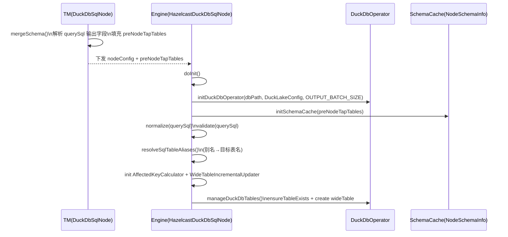
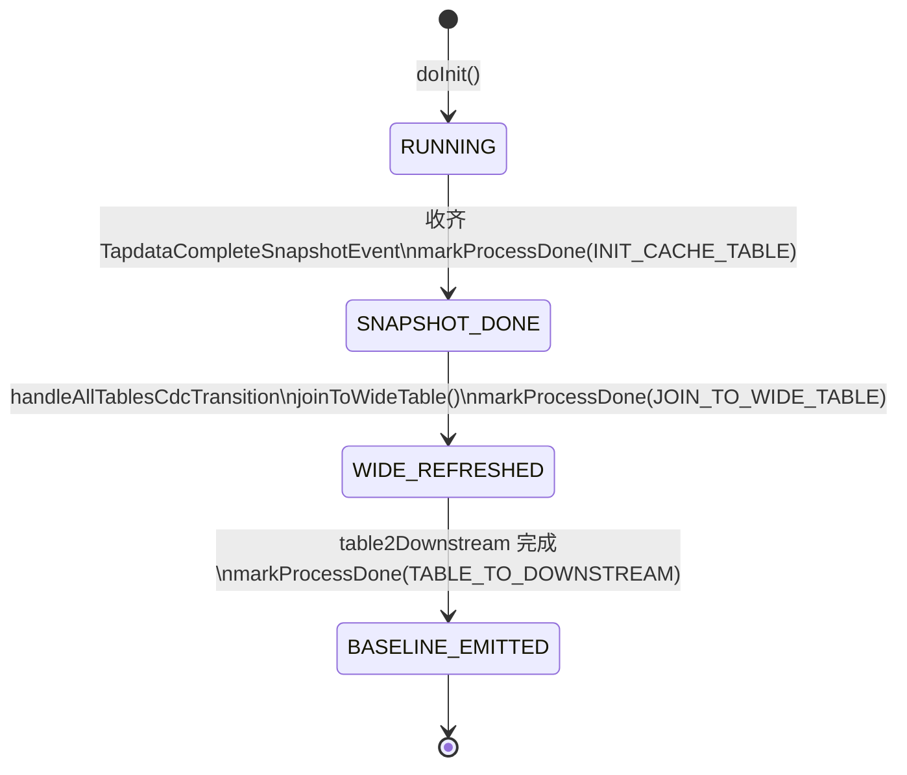
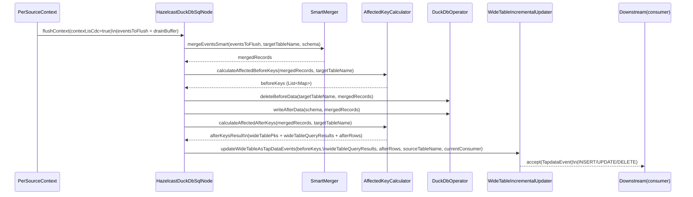

# DuckDB 节点实现原理说明

## 1. 文档目的与范围

本文档面向研发人员，用于解释 Tapdata 引擎中 DuckDB 节点（`duckdb_sql_processor`）在 TM（Task Manager，任务编排与建模）与 Engine（任务运行时）两侧的真实实现机制、关键数据结构、关键算法与边界条件。

本文档明确不做以下事情：

- 不作为客户手册，不解释产品界面字段含义与操作步骤
- 不承诺所有 SQL 形态都可运行，仅解释当前实现确切支持/拦截的范围
- 不讨论 DuckDB 内核实现，仅讨论 Tapdata 侧如何嵌入与驱动 DuckDB

本文档以当前代码为准，关键类（非穷举）：

- TM 侧节点模型：`com.tapdata.tm.commons.dag.process.DuckDbSqlNode`
- Engine 侧运行节点：`io.tapdata.flow.engine.V2.node.hazelcast.processor.HazelcastDuckDbSqlNode`
- SQL 处理：`io.tapdata.flow.engine.V2.node.duckdb.QuerySqlProcessor`、`io.tapdata.flow.engine.V2.node.duckdb.WithCteSqlGenerator`
- Schema/上下文：`io.tapdata.flow.engine.V2.node.duckdb.NodeSchemaInfo`、`io.tapdata.flow.engine.V2.node.duckdb.PerSourceContext`
- 全量/CDC 核心算法：`io.tapdata.flow.engine.V2.node.duckdb.SmartMerger`、`io.tapdata.flow.engine.V2.node.duckdb.AffectedKeyCalculator`、`io.tapdata.flow.engine.V2.node.duckdb.WideTableIncrementalUpdater`、`io.tapdata.flow.engine.V2.node.duckdb.FourStateJudge`
- 存储写入：`io.tapdata.flow.engine.V2.node.duckdb.DuckDbOperator` / `DuckDbOperatorImpl`、`io.tapdata.flow.engine.V2.node.duckdb.ArrowWriter`
- 可靠性：`io.tapdata.flow.engine.V2.node.duckdb.DlqWriter`

## 2. 架构定位与数据流

### 2.1 节点定位：任务内嵌的“缓存表 + 查询 SQL + 物化宽表”运行器

DuckDB 节点在 Engine 内的核心职责不是“对每条事件执行一次 SQL”，而是把上游多表数据写入本地 DuckDB 缓存表，然后以用户配置的查询 SQL（`querySql`）为语义基准，在全量阶段产出一次基线宽表，在 CDC（Change Data Capture，增量变更捕获）阶段按受影响范围更新宽表并输出变更事件。

该设计隐含一个重要事实：节点内部同时承担了三类工作负载，且它们的性能瓶颈与正确性约束完全不同：

- 写负载：将上游表事件批量写入 DuckDB 缓存表（Arrow/Appender 写入）
- 读负载：在全量切换/CDC 更新时执行查询 SQL（或其 CTE 注入版本）获得宽表行
- 维护负载：将宽表更新结果转为 TapdataEvent 并下发下游

### 2.2 端到端数据流图（必要图示）

```mermaid
flowchart LR
  subgraph Upstream[上游节点]
    U1[源/处理节点 A]
    U2[源/处理节点 B]
  end

  subgraph Engine[Engine - HazelcastDuckDbSqlNode]
    BUF[PerSourceContext\n(按 source/table 分桶缓冲)]
    WRITE[DuckDbOperator.writeBatch\n(ArrowWriter 零拷贝/降级)]
    STAGING[(DuckDB 缓存表\nmain & from tables)]
    MV[(宽表 wideTable)]
    Q[querySql / resolvedQuerySql\n(别名替换后)]
    AK[AffectedKeyCalculator\n(before/after 受影响范围)]
    UPD[WideTableIncrementalUpdater\n四态判断 + 批量写宽表]
  end

  subgraph Downstream[下游节点]
    D1[目标/处理节点]
  end

  U1 --> BUF
  U2 --> BUF
  BUF --> WRITE --> STAGING
  STAGING -->|全量切换/CDC 更新| Q --> AK --> UPD --> MV
  UPD -->|TapdataEvent| D1
```

### 2.3 关键阶段：INITIAL_SYNC 与 CDC

节点在运行时严格区分两个阶段：

- INITIAL_SYNC（全量阶段）：只做“写缓存表”，不做“宽表逐条增量维护”
- CDC（增量阶段）：写缓存表 + 计算受影响范围 + 宽表局部更新 + 输出宽表 CDC 事件

这个阶段划分不是文档约定，而是代码路径的硬分叉：`HazelcastDuckDbSqlNode.flushContext(..., isCdc)` 内部根据 `isCdc` 选择 `processInitialSyncStage` 或 `processCdcStage`。

## 3. 术语与对象速查（首次出现的缩写均给出解释）

- TM（Task Manager）：负责任务/节点建模、Schema 推导、配置下发
- Engine：负责任务真实运行、事件处理、状态维护
- Schema：表结构（字段、类型、主键、索引等）
- CDC（Change Data Capture）：增量变更捕获事件流（INSERT/UPDATE/DELETE）
- DDL（Data Definition Language）：建表/删表/改表等结构变更语句（CREATE/DROP/ALTER…）
- DML（Data Manipulation Language）：写数据语句（INSERT/UPDATE/DELETE/MERGE…）
- CTE（Common Table Expression）：通用表表达式（`WITH ... AS (...)`），本节点用于把 CDC 行“注入”为临时表
- PK（Primary Key）：主键；本节点需要“宽表主键”作为增量维护的锚点
- DLQ（Dead Letter Queue）：死信队列；写入失败/处理失败事件的持久化落地

## 4. 配置模型（TM → Engine）与默认值推导

### 4.1 TM 侧节点模型：`DuckDbSqlNode` 的字段与默认值

TM 侧 `DuckDbSqlNode` 的核心字段（只列与运行机制强相关者）：

- `querySql`: 业务查询 SQL（必须配置，TM mergeSchema 会严格校验非空）
- `fromTables`: 关联表配置列表（包含 `preNodeId` 与 `tableNameInSql`）
- `mainTableName`: 主表别名（可空，默认取 `fromTables[0].tableNameInSql`）
- `wideTableName`: 宽表名（可空，默认 `wide_` + `mainTableName`）
- `wideTablePrimaryKey`: 宽表主键（字符串，支持逗号分隔复合主键；TM 会尝试从 SQL 解析推导）
- `outputChangelogEnabled`: 是否输出宽表全量/CDC 事件（TM 默认 true）
- `batchSize`: Engine 批处理阈值（TM 默认 2000）
- `commitIntervalMs`: Engine 定时刷写阈值（TM 默认 5000ms）
- `maxActiveSources`: Engine 活跃上下文最大数量（TM 默认 50）
- `queryTimeoutMs`: 查询超时时间（TM 默认 5000ms）
- `dbPath`: DuckDB 数据库路径（null 表示内存模式；非空表示文件持久化）
- DuckLake 相关（用于数据湖存储扩展）：`duckLakeEnabled` / `duckLakeStorageType` / `duckLakeStoragePath` / `duckLakeMetadataDbUrl`

默认值推导顺序（TM：`resolveMainTableInfo(inputSchemas)`）：

1. `mainTableName` 为空：取 `fromTables[0].tableNameInSql`
2. `mainTablePrimaryKey` 为空：从 `inputSchemas` 找到主表 schema，提取 `primaryKey=true` 的字段（当前实现若存在多主键，先取第一个）
3. `wideTableName` 为空：`wide_` + `mainTableName`
4. `wideTablePrimaryKey`：优先用 `DuckDbSqlPrimaryKeyAnalyzer.analyzePrimaryKeys(querySql)` 分析结果覆盖；最终必须非空，否则 TM 直接抛异常
5. 额外校验：`wideTablePrimaryKey` 中的所有列必须出现在解析出的 SELECT 输出字段列表中，否则 TM mergeSchema 直接失败

### 4.2 TM 的 Schema 推导与 `preNodeTapTables` 传递

TM 的 `mergeSchema(List<Schema> inputSchemas, ...)` 做两件对 Engine 至关重要的事情：

1. 解析 SQL 得到输出字段与 join 元信息：调用 `SqlParserUtil.parseSelectFields(querySql, fromTables, inputSchemas, mainTableName, pkColumns, joinInfo, aliasTableMap)`。
2. 把上游输入 schema（以及宽表 schema）转换成 Engine 可消费的 `TapTableDto` 并写入 `preNodeTapTables`。

这意味着 Engine 初始化时不依赖运行期回查上游结构，而是直接消费 TM 在设计期准备的“schema 快照”。

### 4.3 Engine 侧配置读取与二次默认值推导

Engine 在 `HazelcastDuckDbSqlNode.doInit(...)` 中读取 `DuckDbSqlNode` 配置，并做一次 Engine 侧默认值推导（`resolveMainTableInfo()`）：

- `mainTableName` 为空：取 `fromTables[0].tableNameInSql`
- `wideTableName` 为空：`wide_` + `mainTableName`
- `wideTablePrimaryKey` 不能为空：Engine 从索引/目标表更新条件字段推导（`initIndex(nodeConfig)`），若最终为空直接抛异常

注意：TM 与 Engine 都会推导默认值，但来源不同：

- TM 使用 `inputSchemas` + SQL 解析来推导（更偏“设计期语义”）
- Engine 使用 TapTable index / target updateConditionFields 来推导（更偏“运行期写入/合并语义”）

## 5. Engine 初始化全流程（`doInit`）逐步拆解

### 5.1 初始化顺序（按代码真实发生顺序）

`HazelcastDuckDbSqlNode.doInit` 的关键步骤可以精确拆成以下阶段（省略日志与异常包装）：

1. 初始化 Mongo client（用于 DLQ）：`initClientMongoOperator()`
2. 计算 dbPath：`initDBPath(nodeConfig)`（决定内存/文件模式）
3. 初始化 DuckDbOperator：`initDuckDbOperator(nodeConfig, dbPath, OUTPUT_BATCH_SIZE)`
4. 下发 DB 参数（可选）：`initDBSettingsIfNeed(nodeConfig)`（例如 threads、memoryLimitGB）
5. 统计前置节点数量：`initPreNodeCount()`
6. 读取 querySql 等配置，并先执行轻量 SELECT 形态校验：`DuckDbOperator.ensureSelectQuery(querySql, ...)`
7. 初始化宽表主键：`initIndex(nodeConfig)`（读取 TapTable indexList/target updateConditionFields）
8. 加载 Schema 缓存：`initSchemaCache()`（从 `nodeConfig.preNodeTapTables` 转换并填充 `nodeSchemaCache` 与 `tableSchemaCache`）
9. 规范化 + 深度校验 SQL：`QuerySqlProcessor.normalize(querySql)` + `QuerySqlProcessor.validate(normalizedSql, nodeSchemaCache)`；失败直接抛异常，导致节点初始化失败
10. 推导 `mainTableName` / `wideTableName` 等：`resolveMainTableInfo()`
11. 初始化合并宽表 SQL：`initMergerWideTableSql()`（构造 `INSERT INTO wideTable (...) <querySql>`）
12. 初始化 DLQ 写入器：`dlqWriter = new DlqWriter(...)`
13. 初始化同步阶段跟踪与错误处理：`syncStageTracker` + `ErrorHandler(ERROR_THRESHOLD_COUNT=100, ERROR_THRESHOLD_RATE=0.01)`
14. 初始化 CDC 物化组件（条件：`wideTablePrimaryKey` 非空）：
    - `affectedKeyCalculator = new AffectedKeyCalculator(...)`
    - `resolveSqlTableAliases()`：把 SQL 中逻辑别名替换为 DuckDB 实际表名
    - `wideTableUpdater = new WideTableIncrementalUpdater(...)`
15. 注册“全部表进入 CDC”的回调：`syncStageTracker.setOnAllTablesCdcCallback(this::callDuckDB)`
16. 管理 DuckDB 表生命周期：`manageDuckDbTables()`
17. 若已接收所有前置节点的快照完成事件，触发一次 `initSnapshotComplete()`

其中第 6 与第 9 是两层不同性质的 SQL 校验，必须区分：

- `DuckDbOperator.ensureSelectQuery`：正则级别判定“像 SELECT”（支持前导 `--` 注释，支持 `WITH`/`EXPLAIN`/`ANALYZE` 前缀）
- `QuerySqlProcessor.validate`：JSqlParser 语法树级别判定“必须是 Select 实例”，并做关键字黑名单拦截

### 5.2 初始化时序图（必要图示）



## 6. Schema 缓存与运行时上下文（热路径性能核心）

### 6.1 Schema 缓存的两个 Map：`nodeSchemaCache` 与 `tableSchemaCache`

Engine 侧缓存由 `HazelcastDuckDbSqlNode.initSchemaCache()` 建立，来源是 TM 下发的 `preNodeTapTables`：

- `nodeSchemaCache`: key 为“前置节点标识”（在转换器 `IengineSchemaConverter.convert(...)` 内决定，通常对应 `TapTableDto` 的 nodeId/sourceId），value 为 `NodeSchemaInfo`
- `tableSchemaCache`: key 为表名（`schemaInfo.getTableName()`），value 为 `NodeSchemaInfo`

两个缓存分别服务两类查询：

- “根据 sourceId 找 schema”：用于事件路由与 contextKey 计算（`getNodeSchema(sourceId)`）
- “根据表名找 schema”：用于建表/宽表 schema 查找（`findTable(tableName)`）

### 6.2 `NodeSchemaInfo` 的内容与用途（精确到字段级别）

`NodeSchemaInfo` 持有运行时高频访问的结构信息：

- 基本标识：`nodeId` / `tableName` / `qualifiedName`
- 主键：`primaryKeys`（有序 List）与 `primaryKeySet`（O(1) 判断）
- 字段：`fieldMap`（fieldName → TapField）与 `fieldTypeMap`（fieldName → TapType）
- Arrow：预计算 `arrowSchema` 与 `orderedFields`（写入阶段减少类型推导开销）

典型用途与调用点：

- 表创建：`duckDbOperator.ensureTableExists(schemaInfo, ...)`
- 写入：`duckDbOperator.writeBatch(rows, schemaInfo)`（ArrowWriter 使用 schemaInfo 的 tapTable/arrowSchema）
- 删除：`duckDbOperator.deleteByIds(pkList, schemaInfo)`（复合主键/类型安全删除）
- CDC 辅助：`AffectedKeyCalculator.getTableFields(tableName)` 从 schemaInfo 获取列清单，用于 WITH CTE 临时表列定义

### 6.3 `PerSourceContext`：为什么要按 source/table 分桶缓冲

`HazelcastDuckDbSqlNode.processRecordEvent(...)` 会把每条 DML 事件路由到一个 `PerSourceContext`，该对象保存：

- `targetTableName`: DuckDB 中写入的目标表名（当前实现来自 `schemaInfo.getTargetTableName()`，其返回值实际是“sanitize 后的 tableName”）
- `batchBuffer`: `List<TapdataEvent>`（按批聚合写入）
- `schema`: `NodeSchemaInfo`（让 flush 直接拿到 schema）
- `operator`: 为该 context 创建的专用 DuckDbOperator（优先独立连接，失败则回退共享 duckDbOperator）
- 批处理参数：`batchSize` 与 `timeout`（由 `updateAcceptor(concurrentBatchSize, commitIntervalMs)` 设置）

触发刷写的条件由 `PerSourceContext.needAccept()` 严格定义：

- `batchBuffer.size() >= batchSize`：立即刷写
- 或者距离上次 accept 超过 `timeout`（默认由节点配置 `commitIntervalMs` 下发）：定时刷写，避免长时间积压

## 7. SQL 处理：规范化、校验、别名替换、CTE 注入

### 7.1 SQL 必须是 SELECT：两层判定的真实差异

Engine 在 doInit 阶段对 SQL 做两层判定：

1. `DuckDbOperator.ensureSelectQuery(sql, context)` 使用正则 `SELECT_PATTERN` 判断是否像 SELECT：

   - 支持前导空白
   - 支持若干行 `--` 单行注释
   - 支持 `WITH` 或 `EXPLAIN` 前缀（可选）
   - 支持可选 `ANALYZE` 前缀
   - 最终必须匹配到 `SELECT` 开头

2. `QuerySqlProcessor.validate(normalizedSql, nodeSchemaCache)` 使用 JSqlParser 解析语法树，并强制：

   - `CCJSqlParserUtil.parse(sql)` 能解析成功，否则失败
   - `statement instanceof Select` 必须为 true，否则失败

因此即使正则允许 `EXPLAIN SELECT` 形态，最终仍可能被第 2 层拒绝（因为语法树类型不再是 `Select`）。

### 7.2 规范化（normalize）的确切算法

`QuerySqlProcessor.normalize(sql)` 的规则是确定的、可复现的：

1. `trim()` 去掉首尾空白
2. 若以 `;` 结尾，删除最后一个分号字符
3. 按 `\n` 分割成多行，对每一行执行：
   - `line.replaceAll("\\s+", " ")`：把该行内所有连续空白（空格/Tab 等）压缩为一个空格
   - `line.trim()`：去掉该行首尾空白
4. 用 `\n` 重新拼接

该规范化对关键字黑名单有实际影响：它会把同一行内多个空白压缩为单空格，但不会把换行改成空格。

### 7.3 深度校验（validate）的关键字黑名单与误杀风险

`QuerySqlProcessor.validate` 的黑名单拦截逻辑是纯文本包含匹配（大小写不敏感，先 upper）：

```text
"CREATE ", "DROP ", "ALTER ", "TRUNCATE ",
"INSERT ", "UPDATE ", "DELETE ", "MERGE ",
"EXECUTE ", "EXEC "
```

重要边界：

- 匹配项带尾随空格，因此 `CREATE\n` 不会命中 `"CREATE "`（换行不会被当作空格）
- 这是“字符串 contains”级别的拦截，因此关键字出现在注释或字符串常量中也会触发拒绝
- 该拦截并不取代“必须为 Select 语法树”的约束；即使绕开关键词匹配，也仍需要通过 JSqlParser 的 Select 类型检查

### 7.4 表别名解析与替换（resolveSqlTableAliases）的真实算法与约束

为什么必须替换：

- 用户 SQL 使用的是逻辑别名（`fromTables.tableNameInSql`）
- DuckDB 运行时写入与查询必须指向实际缓存表名（`NodeSchemaInfo.getTargetTableName()`）

替换发生时机：

- 仅发生在 doInit 阶段一次：`resolveSqlTableAliases()`
- 替换后的 SQL 写回到节点字段 `this.querySql`，后续所有 CDC CTE 查询与宽表刷新均复用该 SQL

替换算法（精确描述）：

1. 遍历 `fromTables`，对每个 `FromTableConfig(preNodeId, tableNameInSql)`：
2. 调用 `getNodeSchema(preNodeId)` 得到 `NodeSchemaInfo`，若找不到直接抛 `TapCodeException`
3. 取 `targetTableName = schemaInfo.getTargetTableName()`
4. 使用正则边界替换：对每个别名 `alias` 构造 `Pattern.compile("\\b" + quote(alias) + "\\b")`，逐个替换为 `targetTableName`

边界条件：

- `\b` 的“单词边界”只对 `[A-Za-z0-9_]` 这类字符天然友好；如果 SQL 别名包含特殊字符（例如带 `-`），其边界行为可能与预期不同
- 该算法不会解析 SQL AST，只是文本替换；如果别名出现在字符串常量/注释中也会被替换

### 7.5 CDC 场景下的 WITH CTE 注入：`WithCteSqlGenerator`

CDC 增量维护时需要把“变更行”注入 SQL 以获得受影响宽表行。实现并不重写用户 SQL，而是把 CDC 行构造为一个临时表（CTE），再把用户 SQL 作为主体拼接进去。

生成的批量 SQL 模板（按当前实现）：

```sql
WITH <tableName> (<field1>, <field2>, ...) AS (
  VALUES
    (<v11>, <v12>, ...),
    (<v21>, <v22>, ...)
)
<SqlJoinUtil.forceInnerJoin(querySql, tableName)>
```

关键点：

- `<fields>` 列清单来自 schema（`NodeSchemaInfo.getFieldNames()`）或宽表 schema 缓存
- `<values>` 的值使用 `DuckDbSqlValueFormatter.format(value)` 做 SQL 字面量转义与 NULL 处理
- `SqlJoinUtil.forceInnerJoin(...)` 会对原 SQL 做 join 语义修正，确保临时表被纳入查询（实现细节由 `SqlJoinUtil` 决定）

## 8. DuckDB 运行模式与写入机制（ArrowWriter / DuckLake）

### 8.1 dbPath 与连接模式

Engine 通过 `initDBPath(nodeConfig)` 决定 DuckDB 运行模式：

- `dbPath == null`：DuckDB 以内存模式运行（数据库文件不落盘）
- `dbPath != null`：DuckDB 使用文件持久化（dbPath 指向目录/文件路径，具体由实现决定）

此外，节点会为每个 `PerSourceContext` 尝试创建“独立 operator”（`createContextOperator()`），其构造为：

- `new DuckDbOperatorImpl(dbPath, false, concurrentBatchSize, commitIntervalMs)`；失败则回退为共享 `duckDbOperator`

这会带来一个实现层面的约束：如果独立 operator 构造成功，每个 context 可能拥有自己的连接与 batchBuffer，flush 时必须持有 `context.getCommitLock()` 以保持该 context 内的写入顺序。

### 8.2 ArrowWriter 写入：零拷贝优先，失败自动降级

`DuckDbOperatorImpl.writeBatch(...)` 最终由 `ArrowWriter` 执行写入，核心策略：

- 优先尝试 Arrow Stream 零拷贝（`registerArrowStream` + `INSERT INTO ... SELECT * FROM stream`）
- 若零拷贝失败，降级到 DuckDB Appender API（`DuckDBAppender`）

该策略对性能的含义是明确的：写入路径尽量避免 JDBC 层按行/按字段的重复序列化开销。

### 8.3 DuckLake 扩展：三层优先级与建表 SQL 拼接

`HazelcastDuckDbSqlNode.initDuckDbOperator(...)` 在构造 `DuckDbOperatorImpl` 时会读取 DuckLake 配置（优先级：节点 > 全局环境变量 > 默认值）：

1. 节点级：`node.getDuckLakeEnabled()` / `node.getDuckLakeStorageType()` / `node.getDuckLakeStoragePath()` / `node.getDuckLakeMetadataDbUrl()`
2. 全局级（环境变量）：`DuckDbSqlConfig.isDuckLakeEnabled()` 等
3. 默认值：enabled=false，storageType=LOCAL，storagePath=/tmp/ducklake，metadataUrl=null

当 DuckLake enabled 生效后，`DuckDbOperatorImpl` 会在写入时走 `ArrowWriter.writeWithArrow(..., useDuckLake=true)`，其会先确保 DuckLake 表存在，并用如下格式构造 CREATE TABLE（示例）：

```sql
CREATE TABLE IF NOT EXISTS <tableName> (
  "id" BIGINT,
  "name" VARCHAR,
  PRIMARY KEY (id)
) WITH (
  SNAPSHOTS = TRUE,
  LOCAL = '/tmp/ducklake'
);
```

边界说明：

- `duckLakeStorageType` 目前仅影响 `WITH (...)` 中拼接 `LOCAL='...'` 或 `S3='...'`
- `duckLakeMetadataDbUrl` 在当前写入链路中未被 ArrowWriter 使用（字段保留但未接入）

## 9. DuckDB 表生命周期管理（缓存表 + 宽表）

### 9.1 表生命周期入口：`manageDuckDbTables()`

初始化时，`HazelcastDuckDbSqlNode.manageDuckDbTables()` 会确保三类表存在：

1. 主表缓存：如果配置了 `mainTableName`，调用 `findTable(mainTableName)` 获取 schema，再 `duckDbOperator.ensureTableExists(schema, shouldRecreate)`
2. 关联表缓存：遍历 `fromTables`，对每个 `preNodeId` 调用 `getNodeSchema(preNodeId)` 获得 schema，再 ensure
3. 宽表：调用 `manageWideTable(shouldRecreate)`

当前 `shouldRecreateTables()` 固定返回 false，因此默认策略是“只创建缺失表，不主动 drop/recreate”。

### 9.2 宽表创建的多级策略（代码真实路径）

`manageWideTable(shouldRecreate)` 的逻辑是确定的：

1. 通过 `information_schema.tables` 判断宽表是否存在（使用 `table_name = '<lowercase>'` 比较）
2. 若存在且不重建：直接跳过
3. 若需要重建：先 `DROP TABLE IF EXISTS <quoted wideTableName>`
4. 创建宽表的策略按优先级依次尝试：
   - 策略 1：若 `findTable(wideTableName)` 得到 `NodeSchemaInfo` 且 fieldMap 非空，则 `WideTableDdlGenerator.generateCreateTableDdl(schemaInfo)` 建表
   - 策略 2：否则尝试 `CREATE TABLE ... AS <querySql> WHERE 1=0`（`WideTableDdlGenerator.generateCreateTableAsSelect`）
   - 策略 3：若仍失败，从 `WideTableDdlGenerator.extractSelectFields(querySql)` 提取字段名，生成传统 DDL 并建表

### 9.3 宽表索引创建时机：`createWideTableIndex()`

宽表索引并不是 doInit 立即创建，而是当“宽表全量数据已输出到下游”的过程状态发生变化时触发：

- `callDuckDB(isCdc)` 内部判断 `process[TABLE_TO_DOWNSTREAM]` 从 false→true 的边缘，并在此时调用 `createWideTableIndex()`
- `createWideTableIndex()` 调用 `WideTableDdlGenerator.generateIndex(wideTableSchemaInfo, wideTablePrimaryKey)` 并执行 `duckDbOperator.executeUpdate(createIndexDdl)`

这等价于把“索引成本”延后到宽表真正可用的时刻，避免初始化阶段做不必要的重型操作。

## 10. 全量阶段（INITIAL_SYNC）写入机制

### 10.0 双阶段 flushContext 分流图（可读性优先）

下图把“事件进入节点 → 分桶缓冲 → 触发 flush → 进入全量/CDC 两条路径”的关键分叉点画清楚，便于开发排障时快速定位自己处在链路的哪一步。

```mermaid
flowchart TD
  E[tryProcess(tapdataEvent)] -->|TapRecordEvent| PR[processRecordEvent]
  E -->|TapdataCompleteSnapshotEvent| SNAP[acceptPreNodeCount++\ninitSnapshotComplete()]
  E -->|TapdataBeginTableSnapshotEvent| INIT_T[initTable(sourceTableName)\nensureTableExists(schema,true)]
  E -->|其他事件| PASS[透传]

  PR --> RID[解析 tableId / sourceId]
  RID --> SCHEMA[getNodeSchema(sourceId)\n命中?]
  SCHEMA -->|命中| CTX1[contextKey=sourceId|qualifiedName\ntargetTableName=schemaInfo.getTargetTableName()]
  SCHEMA -->|未命中| CTX2[contextKey=sourceId:tableId\ntargetTableName=sanitize(tableId)]
  CTX1 --> CTX[getOrCreateContext]
  CTX2 --> CTX
  CTX --> BUF[context.addEvent -> batchBuffer]
  BUF -->|needAccept()==true| FLUSH[flushContext(context,isCdc)]
  BUF -->|needAccept()==false| WAIT[等待下一批/超时触发]

  FLUSH -->|isCdc=false| IS[processInitialSyncStage\n仅写缓存表]
  FLUSH -->|isCdc=true| CDC[processCdcStage\n写缓存表 + 更新宽表 + 输出 CDC]
```

### 10.1 事件进入节点：`tryProcess` 与分流规则

`HazelcastDuckDbSqlNode.tryProcess(tapdataEvent, consumer)` 的核心分流（只保留与数据正确性相关的规则）：

- `TapdataCompleteSnapshotEvent`：累加 `acceptPreNodeCount`，当收齐所有前置节点快照完成事件后触发 `initSnapshotComplete()`，并标记 process 状态
- `TapdataBeginTableSnapshotEvent`：调用 `initTable(sourceTableName)` 强制 `ensureTableExists(schemaInfo, true)`
- `TapRecordEvent`（DML）：调用 `processRecordEvent(recordEvent, tapdataEvent)`
- 其他非 DML：透传

注意：错误阈值统计发生在分流之前（`errorHandler.recordEvent()`），其统计口径是“进入处理的事件总数”，不是“成功处理的事件数”。

### 10.2 DML 事件路由与缓冲：`processRecordEvent` → `PerSourceContext`

处理每条 DML 时：

1. `tableId = TapEventUtil.getTableId(recordEvent)`
2. `sourceId = resolveSourceId(tapdataEvent)`（当前实现是 `tapdataEvent.getNodeIds().get(0)`）
3. 从 `nodeSchemaCache` 查 `schemaInfo = getNodeSchema(sourceId)`：
   - 若 schemaInfo 有效：`targetTableName = schemaInfo.getTargetTableName()`，`contextKey = sourceId + "|" + qualifiedName`
   - 否则走 fallback：`targetTableName = sanitize(tableId)`，`contextKey = sourceId + ":" + tableId`
4. `trackSyncStage(targetTableName, tapdataEvent)` 更新该表的 SyncStage
5. `getOrCreateContext(...)`，并把事件加入 `context.batchBuffer`
6. 若 `context.needAccept()` 为 true，则 `flushContext(context, isCdc)`（其中 isCdc 由 `syncStageTracker.isTableInInitialSync(...)` 反推）

### 10.3 flushContext 在全量阶段的确切行为：`processInitialSyncStage`

当 `isCdc == false`：

- `eventsToFlush = context.drainBuffer()`
- `operator.executeInTransaction(() -> operator.insertBatch(context.getSchema(), eventsToFlush))`

这里的关键点是：全量阶段并不进行宽表更新，而是只保证缓存表的数据在 DuckDB 内形成完整基线；宽表基线由“全量→CDC 切换回调”统一处理。

## 11. 全量到 CDC 切换（宽表基线生成与全量输出）

### 11.1 切换触发条件：SyncStageTracker 的 onAllTablesCdcCallback

`syncStageTracker` 会对每个目标表维护当前阶段（INITIAL_SYNC / CDC），并在 `doInit` 中注册回调：

- `syncStageTracker.setOnAllTablesCdcCallback(this::callDuckDB)`

当 tracker 判断“所有相关表都进入 CDC”后，会触发：

- `callDuckDB(isCdc)` → `handleAllTablesCdcTransition(isCdc)`

### 11.2 切换回调的执行顺序：刷新缓存 → 补索引 → 刷新宽表 → 全量输出

`handleAllTablesCdcTransition(isCdc)` 的顺序是固定的：

1. `flushAllContexts(isCdc)`：把所有 context 缓冲刷入 DuckDB（确保基线完整）
2. `loadTableIndex()`：为缓存表补建 joinKey 索引（通过 duckdb_indexes() 判断是否已存在）
3. `joinToWideTable()`：
   - 事务内 `TRUNCATE wideTable`
   - 执行 `mergerWideTableSql`（其为 `INSERT INTO wideTable (cols) <querySql>`）
4. `table2Downstream()`：若 `outputChangelogEnabled=true`，按批读取宽表并向下游发出全量插入事件

这四步严格对应“先可计算、再可查询、再可输出”的工程顺序。

### 11.3 过程状态机与持久化（processStore / process / acceptPreNodeCount）

DuckDB 节点需要跨重启/跨 failover 记住“我已经做过哪些一次性动作”，否则会出现：

- 已输出过全量宽表基线，但重启后重复输出（下游重复数据）
- 已做过 joinToWideTable/table2Downstream，但重启后再次 TRUNCATE/INSERT（宽表被重置）

因此节点维护了两类状态：

1. `process: Map<String, Boolean>`：记录一次性过程是否完成
   - `INIT_CACHE_TABLE`：已完成“收齐前置节点快照完成事件 + initSnapshotComplete()”
   - `JOIN_TO_WIDE_TABLE`：已完成全量结束后的 `joinToWideTable()`（TRUNCATE + INSERT INTO wideTable）
   - `TABLE_TO_DOWNSTREAM`：已完成全量宽表基线下发（`table2Downstream()` 全量 select 并 emit）
2. `acceptPreNodeCount: int`：已收到的 `TapdataCompleteSnapshotEvent` 数量，用于判断是否收齐所有前置节点

这两类状态会尝试持久化到外部存储（Hazelcast IMap 封装）：

- storeName：`DuckDbSqlNodeProcess_<taskId>_<nodeId>`
- key：
  - `process`（常量 `PROCESS_STORE_KEY`）
  - `acceptPreNodeCount`（常量 `ACCEPT_PRE_NODE_COUNT_STORE_KEY`）

持久化的真实策略（严格按代码行为）：

- 只有满足条件才初始化 processStore：
  - 不是 preview task
  - externalStorageDto 可用（type 非空）
  - jetContext.hazelcastInstance 可用
- 初始化失败：降级为“仅内存状态”，不影响主链路运行，但重启后会丢失过程状态
- 读取不到外部状态：不会立刻覆盖外部存储（避免把空状态写回去误覆盖），仅使用内存默认值继续运行

过程状态机（以过程状态为主，忽略细节异常分支）：



## 12. CDC 增量维护：从事件合并到宽表四态输出

### 12.1 CDC flush 的整体算法骨架（与代码一致）

当 `flushContext(..., isCdc=true)`，会执行 `processCdcStage(context, eventsToFlush)`，其算法骨架如下：

1. 事件合并：`SmartMerger.mergeEventsSmart(eventsToFlush, targetTableName, schema)`
2. 写入前受影响范围（beforeKeys）：`affectedKeyCalculator.calculateAffectedBeforeKeys(mergedRecords, targetTableName)`
3. 写入缓存表（两步）：
   - `deleteBeforeData(operator, targetTableName, mergedRecords, schema)`：按主键批量删除 before 行
   - `writeAfterData(operator, schema, mergedRecords)`：Arrow 批量写 after 行
4. 写入后受影响范围（afterKeysResult）：`affectedKeyCalculator.calculateAffectedAfterKeys(mergedRecords, targetTableName)`，返回：
   - `wideTablePks`：受影响宽表主键集合
   - `wideTableQueryResults`：WITH CTE 查询得到的宽表结果集（可复用）
   - `afterRows`：CDC after 行（用于备用查询）
5. 更新宽表并输出事件：`updateWideTable(targetTableName, beforeKeys, afterKeysResult, mergedRecords)`

单个 context 的 CDC flush 时序图（把“beforeKeys 必须在写入前算、afterKeysResult 必须在写入后算”这件事画清楚）：



### 12.5 事务边界与一致性：工程设计诉求 vs 当前代码行为

工程文档（早期设计）通常会把“删除 before + 写入 after”描述为同一事务的原子动作；但需要明确：当前实现并不是所有链路都严格包裹在 `executeInTransaction` 内。

以 `HazelcastDuckDbSqlNode.processCdcStage` 为例：

- 代码中确实存在“事务包裹”的意图（`executeInTransaction`），但当前被注释掉，实际执行是顺序调用 `deleteBeforeData` 然后 `writeAfterData`
- 宽表更新器 `WideTableIncrementalUpdater.applyWideTableChanges` 也是顺序调用“宽表 deleteByIds + writeBatch”，并未在该方法内显式包裹事务

因此在需要严格一致性的场景，必须把下面这类风险显式纳入评估：

- 删除成功但写入失败：缓存表或宽表可能出现短暂缺行（取决于上层重试/补偿策略）
- 宽表 delete 已执行但 writeBatch 失败：下游 CDC 事件是否已发射、宽表是否部分更新，需要结合消费端幂等策略评估

这也是为什么本节点在多处选择“容错优先”：例如 `updateWideTable(...)` 对宽表更新做 try/catch 并吞异常，以避免宽表问题阻断源表缓存表的正确写入。

### 12.2 SmartMerger：为什么 CDC 必须先做“事件合并”

CDC 事件在一个 flush 批次中可能包含同一主键的多次 UPDATE/DELETE/INSERT。若不合并，写入与宽表更新会产生：

- 重复 delete/insert 导致无意义的写放大
- 同一主键在批次内状态翻转导致最终结果不确定

`SmartMerger.mergeEventsSmart` 的关键策略是把事件按主键归并为 `MergedRecord`，并在 `MergedRecord` 内同时保存：

- `beforeRows`：需要从缓存表删除的旧行集合
- `afterRows`：需要写入缓存表的新行集合（Map 去重）
- `mainTableBeforePks` / `mainTableAfterPks`：宽表增量计算所需的 PK 集合

这让后续删除、写入、受影响范围计算都避免重新遍历原始事件列表。

### 12.3 AffectedKeyCalculator：beforeKeys 与 afterKeysResult 的差别

`AffectedKeyCalculator` 在本实现中提供两个入口：

- `calculateAffectedBeforeKeys(mergedRecords, tableName)`：在写缓存表之前计算“可能需要从宽表删除/更新的主键集合”
- `calculateAffectedAfterKeys(mergedRecords, tableName)`：在写缓存表之后计算“宽表最终应变成什么”，并返回可复用的查询结果

其内部实现依赖 WITH CTE 查询：

- 把 beforeRows/afterRows 注入为临时表
- 执行 `resolvedQuerySql`（已做表别名替换）
- 从查询结果中提取宽表主键：`TablePkUtils.pkValues(results, wideTablePrimaryKey)`

### 12.4 WideTableIncrementalUpdater：四态判断与批量写宽表

`updateWideTable(...)` 最终调用：

`wideTableUpdater.updateWideTableAsTapDataEvents(beforeKeys, wideTableQueryResults, afterRows, sourceTableName, currentConsumer)`

该方法内部（简化后）执行三件事：

1. 准备宽表查询结果（优先复用 `wideTableQueryResults`；为空时用 afterRows 重新执行 WITH CTE 查询）
2. 四态判断生成 TapdataEvent：`FourStateJudge.judge(beforePks, afterData)`
3. 若 `enableWriteWideTable=true` 且事件非空：
   - 批量删除旧宽表行：优先走 `duckDbOperator.deleteByIds(pkList, wideTableSchemaInfo)`
   - 批量写入新宽表行：优先走 `duckDbOperator.writeBatch(rows, wideTableSchemaInfo)`
4. 把生成的 TapdataEvent 通过 `currentConsumer.get().accept(event, ProcessResult.create())` 直接下发到下游

四态判断（`FourStateJudge`）的精确定义：

- 对每个 beforePk：
  - 若该 pk 不存在于 afterPks 集合：输出 DELETE 事件（TapDeleteRecordEvent.before = pk）
- 对每个 afterRow：
  - 若该 row 的 pk 存在于 beforePks：输出 UPDATE（TapUpdateRecordEvent.after = row）
  - 否则输出 INSERT（TapInsertRecordEvent.after = row）

注意：当前实现并没有输出“SKIP”事件；所谓“跳过”只体现在“如果没有差异则 events 为空，不触发写入/不触发下游发射”。

## 13. 下游输出：全量与 CDC 两条路径

### 13.1 全量输出（宽表基线）

全量输出发生在 `handleAllTablesCdcTransition` 的 `table2Downstream()` 内，且受 `outputChangelogEnabled` 控制：

- `outputChangelogEnabled=false`：完全不输出宽表基线与 CDC 事件（仅维护内部宽表与缓存表）
- `outputChangelogEnabled=true`：宽表基线按批读取（batchSize=1000，见 `OUTPUT_BATCH_SIZE` 常量）并输出为插入事件

### 13.2 CDC 输出（宽表变更）

CDC 输出发生在 `WideTableIncrementalUpdater.executeAndUpdate(...)`：

- 它在内部生成 TapdataEvent，并立即通过 `currentConsumer` 发射
- 该输出严格以宽表四态判断结果为准，与上游原始 CDC 事件类型无直接对应关系

## 14. 错误处理与可靠性机制（阈值停机 + DLQ 落地）

### 14.1 错误阈值：停止处理的精确定义

`HazelcastDuckDbSqlNode` 使用：

- `ERROR_THRESHOLD_COUNT = 100`
- `ERROR_THRESHOLD_RATE = 0.01`（1%）

逻辑是：每进入一条事件就 `recordEvent()`，发生异常就 `recordError(...)`，当数量或比例超过阈值时 `shouldStopTask()` 返回 true，节点将直接停止继续处理后续事件（返回而非抛出），避免异常被无限放大。

### 14.2 DLQ：写入内容、触发点与数据结构

DLQ 落地由 `DlqWriter` 完成，写入 Mongo collection（由节点常量指定）。在当前节点中：

- flushContext 捕获异常后调用 `writeToDlq(context, payload, error)`
- payload 从事件提取：优先取 after，否则取 before（见 `extractDataFromEvents`）

`DlqWriter.write(...)` 支持 D6 结构，记录字段包含：

- `contextKey` / `targetTableName`
- `payload`（行数据数组）
- `taskId` / `syncBatchId`
- `failedSql`（如果调用方提供）
- `error`（type/message/code）与 `errorMessage` / `errorClass`
- `mergedRecordState`（可选：beforeRows/afterRows/mainTableBeforePks/mainTableAfterPks/tableName）

该结构的价值在于：即使线上复现困难，也能从 DLQ 中还原“本批次写入/宽表更新”在逻辑层面的输入与中间态。

## 15. 性能与并发：可观测的调优点

### 15.1 批量相关参数（明确到默认值）

与吞吐直接相关的关键参数/常量：

- `DuckDbSqlNode.DEFAULT_BATCH_SIZE = 2000`（TM 默认）
- Engine 常量 `OUTPUT_BATCH_SIZE = 1000`（宽表全量输出批次）
- `PerSourceContext.batchSize` 默认 1000，但在创建时会被 `updateAcceptor(concurrentBatchSize, commitIntervalMs)` 覆盖
- `commitIntervalMs` 默认 5000ms（TM 默认；用于定时 flush）
- `maxActiveSources` 默认 50（超过将触发 evict）

### 15.2 活跃上下文淘汰（evictIfNecessary）的真实语义

当 `sourceContexts.size() >= maxActiveSources` 时：

- 节点会从 `sourceAccessOrder`（按访问顺序）驱逐最老的 context
- 驱逐前会尝试 `flushContext(evicted, isInitialSync)`，然后关闭该 context 的独立 operator

这意味着：在“高 sourceId/高表数量”的场景下，context 驱逐会带来额外 flush 与连接 churn，必须把 `maxActiveSources` 与 `batchSize/commitIntervalMs` 协同调优。

上下文淘汰（近似 LRU）的控制流图：

```mermaid
flowchart TD
  A[getOrCreateContext] --> B{sourceContexts.size >= maxActiveSources?}
  B -->|否| RET[直接创建并返回 context]
  B -->|是| EVICT[evictIfNecessary()]
  EVICT --> PICK[从 sourceAccessOrder 取 eldestKey]
  PICK --> POP[从 sourceContexts 移除 evicted]
  POP --> STAGE{该表仍处于 INITIAL_SYNC?}
  STAGE -->|是| FL1[flushContext(evicted,isCdc=false)]
  STAGE -->|否| FL2[flushContext(evicted,isCdc=true)]
  FL1 --> CLOSE[closeContextOperator(evicted)]
  FL2 --> CLOSE
  CLOSE --> RET
```

## 16. 技术边界、已知风险与实现差异点

### 16.1 表名唯一性的实现差异

`NodeSchemaInfo.getTargetTableName()` 的注释描述是 `sourceId__tableName`，但当前返回值实际是 `safeTableName`（仅 sanitize 表名，不包含 sourceId 前缀）。

影响：

- 同一任务内如果存在不同 sourceId 但表名相同，缓存表可能发生冲突（取决于上游如何配置与路由）
- 文档/设计中若沿用“sourceId__tableName”假设，会与当前实现不一致

### 16.2 SQL 别名替换是文本级，不是 AST 级

- 会替换注释/字符串中的别名
- `\b` 边界对特殊字符别名不可靠
- 替换顺序按 fromTables 遍历顺序执行，若存在“短别名包含在长别名中”的情况，需要特别关注替换后的语义

### 16.3 SQL 黑名单拦截带尾随空格

`"CREATE "` 这类匹配带尾随空格，结合“保留换行”的 normalize，可能存在理论上的绕过形态；但仍需通过 JSqlParser 的 Select 类型检查，因此绕过对安全性的实际影响取决于 JSqlParser 能否接受该语法。

### 16.4 DuckLake metadata URL 未接入

`duckLakeMetadataDbUrl` 字段在节点/全局配置中存在，但当前 ArrowWriter 的 DuckLake 建表语句未使用该 URL，属于“字段已定义但执行链路未使用”。

## 17. 附录：关键调用链速查（开发排障用）

### 17.1 全量阶段主链路（调用链级别）

```text
tryProcess
  -> processRecordEvent
    -> getOrCreateContext + addEvent
      -> needAccept? true
        -> flushContext(isCdc=false)
          -> processInitialSyncStage
            -> DuckDbOperator.insertBatch(schema, events)
```

### 17.2 CDC 阶段主链路（调用链级别）

```text
tryProcess
  -> processRecordEvent
    -> flushContext(isCdc=true)
      -> processCdcStage
        -> SmartMerger.mergeEventsSmart
        -> AffectedKeyCalculator.calculateAffectedBeforeKeys
        -> deleteBeforeData + writeAfterData
        -> AffectedKeyCalculator.calculateAffectedAfterKeys
        -> WideTableIncrementalUpdater.updateWideTableAsTapDataEvents
          -> FourStateJudge.judge
          -> applyWideTableChanges(deleteByIds + writeBatch)
          -> currentConsumer.accept(TapdataEvent)
```
