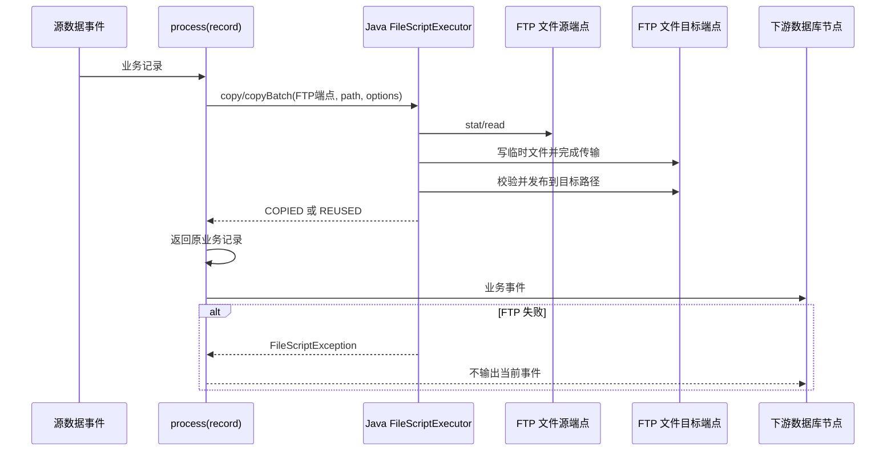

# TAP-12832 增强 JS 节点支持 FTP 文件同步概要设计

| 属性 | 内容 |
| --- | --- |
| 需求 | [TAP-12832：【MGM】增强 JS 节点支持 FTP 文件同步后继续下游数据库同步](https://tapdata.atlassian.net/browse/TAP-12832) |
| 文档日期 | 2026-09-07 |
| 文档状态 | 修订后的概要设计建议稿，供产品与研发评审 |
| 关键业务语义 | 源节点与目标节点仍按原任务同步；增强 JS 节点在事件处理过程中额外调用 Java 内置方法执行 FTP 文件操作 |
| 代码基线 | tapdata：`6ecef80360`；tapdata-web：`f9f9f529b`；tapdata-connectors：`3a9f746c`；tapdata-common-lib：`f5a1fe3` |
| 交付范围 | 方案概要设计，不包含功能实现 |

## 1. 设计结论

本需求的核心是给增强 JS 节点增加同步调用的 Java 文件能力。源节点和目标节点仍然是任务原有的数据流两端；JS 节点只是位于数据流中的增强处理步骤，在处理每条事件时根据脚本逻辑额外调用 FTP 方法。Java 方法同步完成文件复制、校验并返回结果，JS 再决定返回原业务记录继续下游数据库同步，或抛出异常阻止当前事件继续流转。

建议复用现有 `ScriptExecutorsManager` 的宿主对象注入机制，在 GraalJS 上下文中增加一个窄接口 `ftp`（也可命名为 `file`，最终以产品命名为准）。这个对象只做 JS 参数校验和调用适配，实际文件操作委托给数据源侧已经使用的统一 `FileOperationService`；JS 和引擎都不能获得 `FTPClient`、账号密码、InputStream、数据库客户端或任意 Java 类。

FTP 不是任务数据流的 source/target 节点配置，而是 JS 脚本使用的外部服务参数。JS 节点提供可自由增删的键值参数，参数可标记为加密；脚本通过 `jsNodeConfig.get(key)` 读取参数，或让 Java 文件 facade 根据参数 key 前缀解析端点。Agent 运行时由共享 `FileOperationService` 复用数据源侧的 `FileConfig`、`FileProtocolEnum`、`TapFileStorageBuilder` 和 `TapFileStorage`，任务的源/目标连接配置不被改变。

同步语义如下：

```text
业务事件从原源节点进入增强 JS
  → JS 根据记录和 jsNodeConfig.get(key) 计算 FTP 调用参数
  → 调用 Java ftp.copy/copyBatch
  → Java 完成传输并返回结果；失败抛出类型化异常
  → JS 校验结果并返回原业务记录
  → 下游数据库节点按既有链路写入
```

Java 文件方法成功只表示文件已按约定落盘，不表示数据库已经提交。数据库失败或任务重启后，业务事件仍按原断点重放；文件方法通过“不覆盖 + 目标文件校验”复用已经完成的传输。

## 2. 需求分析与边界

### 2.1 需求响应

| 编号 | 需求 | 方案响应 |
| --- | --- | --- |
| R1 | 在 JS 节点中配置 FTP 所需参数 | JS 节点提供通用参数列表，支持任意 key、类型和加密标记；脚本按 key 读取，FTP 方法不依赖固定表单字段 |
| R2 | 支持单个或多个匹配文件，保留名称和目录结构 | 复用数据源侧 `FileConfig` 的多路径/递归/匹配能力及共享 `copy`/`copyBatch` 服务；默认按源根目录计算相对路径，使用二进制流复制 |
| R3 | 文件成功后再继续正常数据库同步 | `ftp.copy/copyBatch` 同步返回成功后，脚本才返回业务记录；脚本抛错或返回 null 时沿现有 JS 节点语义阻止/过滤事件 |
| R4 | 文件失败、超时、校验失败时不写依赖数据 | Java 方法区分可重试与不可重试错误；最终抛出异常，不能由通用“跳过异常”配置静默放行依赖事件 |
| R5 | 重试或重启避免重复传输 | `overwrite=false` 为默认策略；目标已存在时按长度及可选摘要校验，匹配则返回 `REUSED`，不匹配则报冲突 |
| R6 | 重试或重启不产生非预期数据库重复 | 保留原事件与源位点；目标数据库继续使用主键幂等或既有 Exactly Once 能力。FTP 方法不推进源位点 |
| R7 | 记录文件清单、结果、时间和错误 | Java 返回结构化结果并写任务日志；可选记录文件操作审计，但不把文件正文放入事件或 JS 返回值 |
| R8 | 支持大小、数量或校验值验证 | 每次复制检查写入结果和字节数；支持 `NONE`、`SIZE`、`CHECKSUM` 三档，正式验收建议 `CHECKSUM` |

### 2.2 已确认行为与默认行为

| 场景 | 方案行为 |
| --- | --- |
| 一条记录关联多个文件 | JS 调用 `copyBatch`；Java 全部成功才返回，任一失败抛错 |
| 不同记录关联不同文件 | 每条记录独立调用；A 成功即可进入下游，B 的失败不回滚 A |
| 多条记录引用同一文件 | 目标文件已存在且版本/校验一致时返回 `REUSED` |
| FTP 参数缺失 | `jsNodeConfig.get(key)` 返回缺失错误或 Java 方法抛参数错误；脚本可根据业务条件决定是否执行 FTP 操作 |
| DELETE 事件 | 默认不复制文件，按原 JS/DML 行为透传；如 DELETE 也有文件动作，另行设计删除接口和权限 |
| 多条输出 | 一期验收按一条输入对应一条输出；JS 返回 List 的场景必须另行证明子事件标识和目标幂等性 |
| 文件失败 | 先按方法选项进行有限重试；最终异常交给任务错误处理，不能返回原记录假装成功 |
| 试运行/模型推演 | 默认 `dryRun=true`，只校验路径和连接配置，不写目标 FTP；真实调试使用隔离目录和独立开关 |

### 2.3 不纳入本期

- 通用 Workflow、跨任务触发、任务启动前的全局文件屏障。
- FTP 文件解析、格式转换、压缩解压、源文件移动/删除。
- TB 级切片和字节级断点续传；一期按文件重试，已完成文件可复用。
- JS 直接创建任意 FTP 客户端、直接读取密码或调用数据库写入依赖表。
- SFTP/FTPS 新协议能力。若现场实际不是普通 FTP，应先扩展对应连接和存储适配器。

## 3. 现有实现与差距

| 代码位置 | 已有能力 | 需要改造的点 |
| --- | --- | --- |
| [`JsProcessorNode.java`](/Users/gavinxiao/kit/tapdata/tapdata/manager/tm-common/src/main/java/com/tapdata/tm/commons/dag/process/JsProcessorNode.java) / [`ScriptProcessNode.java`](/Users/gavinxiao/kit/tapdata/tapdata/manager/tm-common/src/main/java/com/tapdata/tm/commons/dag/process/script/ScriptProcessNode.java) | JS 节点保存 script、declareScript、jsType | 增加通用参数列表（key、类型、值、加密标记、描述），保存时校验 key 唯一性和参数类型 |
| [`HazelcastJavaScriptProcessorNode.java`](/Users/gavinxiao/kit/tapdata/tapdata/iengine/iengine-app/src/main/java/io/tapdata/flow/engine/V2/node/hazelcast/processor/HazelcastJavaScriptProcessorNode.java) | 创建 JS 引擎、绑定 `ScriptExecutorsManager`、调用 `process(record)` | 创建并注入 `jsNodeConfig` 参数访问器和共享文件服务的 JS 适配器；把当前事件上下文传给适配器；节点关闭时释放服务引用 |
| [`ScriptExecutorsManager.java`](/Users/gavinxiao/kit/tapdata/tapdata/iengine/iengine-app/src/main/java/io/tapdata/flow/engine/V2/script/ScriptExecutorsManager.java) | 按连接创建并缓存 PDK ScriptExecutor | 只负责宿主对象注入和服务引用管理；不实现 FTP 连接、重试或协议命令 |
| 数据源侧 `FileConnector.java` / 新增共享 `FileOperationService` | `FileConnector` 已按 `FileConfig`、`FileProtocolEnum` 和 `TapFileStorageBuilder` 创建文件存储，并支持多路径、递归、匹配规则 | 抽取读、写、复制、校验、临时文件发布和批量处理为共享服务；数据源连接器与 JS facade 都调用同一实现 |
| [`ScriptUtil.java`](/Users/gavinxiao/kit/tapdata/tapdata/iengine/iengine-common/src/main/java/com/tapdata/processor/ScriptUtil.java) | GraalJS HostAccess 和允许类列表 | 使用显式 Java facade/ProxyObject 注入，不开放 FTPClient 或通用类访问 |
| [`FtpFileStorage.java`](/Users/gavinxiao/kit/tapdata/tapdata-connectors/file-storages/ftp-file/src/main/java/io/tapdata/storage/ftp/FtpFileStorage.java) | FTP 登录、目录枚举、读写、大小和时间读取 | 仅补充共享服务所需的目录创建、可靠 rename、`storeFile`/`completePendingCommand` 返回值检查、有限超时和 checksum 辅助能力；不在引擎复制 FTP 实现 |
| [`TapFileStorage.java`](/Users/gavinxiao/kit/tapdata/tapdata-common-lib/plugin-kit/tapdata-api/src/main/java/io/tapdata/file/TapFileStorage.java) / [`FileConnector.java`](/Users/gavinxiao/kit/tapdata/tapdata-connectors/connectors-common/file-connector-core/src/main/java/io/tapdata/common/FileConnector.java) | 存储抽象和按协议构建实例 | 将共享服务依赖的能力以兼容方式补充到抽象层，数据源 connector 和 JS facade 共用，不让上层直接依赖 FTPClient |
| [`HazelcastProcessorBaseNode.java`](/Users/gavinxiao/kit/tapdata/tapdata/iengine/iengine-app/src/main/java/io/tapdata/flow/engine/V2/node/hazelcast/processor/HazelcastProcessorBaseNode.java) | 支持并发、批处理及事件上下文；JS 结果后才 enqueue | 使用文件同步的 JS 节点默认关闭记录级并发，保证 Java 方法调用和业务事件顺序可解释 |
| [`HazelcastBaseNode.java`](/Users/gavinxiao/kit/tapdata/tapdata/iengine/iengine-app/src/main/java/io/tapdata/flow/engine/V2/node/hazelcast/HazelcastBaseNode.java) | 统一异常处理与可跳过错误 | 增加文件错误类型；文件依赖错误默认不可跳过，避免事件在文件失败时继续下游 |
| [`JSProcessNodeTestRunService.java`](/Users/gavinxiao/kit/tapdata/tapdata/iengine/iengine-app/src/main/java/io/tapdata/services/JSProcessNodeTestRunService.java) | JS 试运行和日志收集 | 试运行必须显式使用 dry-run 文件 facade，禁止真实 FTP 写入 |

数据源侧当前链路已经覆盖多路径文件源、递归目录、文件匹配和多种协议：`FileConnector.initConnection` 加载 `FileConfig`，通过 `FileProtocolEnum` 选择存储实现，再由 `TapFileStorageBuilder` 创建 `TapFileStorage`。本需求应在这条链路上增加共享的 `FileOperationService`，而不是在 `iengine` 中新增一套 FTP executor。`FileConnector` 的既有读写流程和 JS facade 的复制流程都委托该服务；服务内部再调用 `TapFileStorage`，协议差异继续由各文件存储 connector 承担。

共享服务建议拆成三层：

1. `tapdata-api` 提供稳定的请求、结果、能力和服务接口，例如 `FileCopyRequest`、`FileOperationResult`、`TapFileOperationService`，引擎只依赖这一层。
2. `connectors-common/file-connector-core` 提供 `DefaultFileOperationService`、`FileStorageSessionManager` 和通用路径/校验/临时发布逻辑；它复用现有 `FileConfig`、`FileProtocolEnum`、`TapFileStorageBuilder`。
3. `file-storages/*` 只提供各协议的 `TapFileStorage` 实现。FTP、SFTP、SMB、S3FS、OSS 的连接、目录和读写能力在这里维护，服务层不按协议复制代码。

连接验证也应复用数据源侧 `FileTest` 的路径检查和 `TapFileStorageBuilder` 装配逻辑，抽取为共享校验入口；JS 节点保存或试运行时只调用该入口，不再另外实现一套 FTP 测试连接流程。

引擎侧的 `FileScriptExecutor` 只是 `TapFileOperationService` 的 JS 适配器：将 `scriptParams` 和脚本请求映射成 `FileCopyRequest`，调用共享服务并把结果转换成 `Map`。如果运行环境使用 connector 独立类加载器，应通过 `FileOperationServiceProvider`/SPI 获取实现，并把同一 `TapFileStorage` API 及实现包加载到对应 connector classloader；不能让引擎反射创建 `FtpFileStorage` 或持有 FTP 客户端。

复用关系如下：

```text
数据源 FileConnector ─┐
                     ├─> TapFileOperationService
JS ftp facade ────────┘       ├─ FileConfig / FileProtocolEnum
                              ├─ TapFileStorageBuilder
                              └─ TapFileStorage（FTP/SFTP/SMB/S3FS/OSS）
```

复用的是服务、请求模型、协议适配器和会话管理，不是把数据源 connector 的私有 `storage` 字段直接暴露给 JS。这样可以避免源节点停止、分区重建或 connector classloader 回收时影响 JS 节点。

## 4. 方案比较与推荐

| 方案 | 做法 | 结论 |
| --- | --- | --- |
| A. JS 直接使用 FTP Java 类 | 在脚本中 import `FTPClient` 或调用任意外部 jar | 安全边界、连接复用、异常和凭据暴露不可控，不采用 |
| B. 引擎新增独立 FTP executor | JS facade 在 `iengine` 内自行解析参数、创建 `FtpFileStorage`、实现复制和重试 | 不采用。会与数据源侧多协议文件能力重复，后续 FTP/SFTP/SMB 等修复需要维护两套实现 |
| C. JS facade 委托共享 `FileOperationService` | `FileConnector` 和 JS facade 共用同一服务；服务统一调用 `TapFileStorage`，参数映射由 facade 完成 | **推荐**。复用现有多文件/多协议能力，新增协议时 JS 自动获得同一能力，符合“同步事件中由 JS 调用 Java 方法”的需求 |
| D. 直接借用源节点 connector 的私有 storage 对象 | JS 节点持有源节点 `FileConnector.storage` 并跨节点调用 | 不采用。生命周期、并发、拓扑依赖和跨 classloader 不可控；只复用共享服务和存储实现，不直接借用私有对象 |
| E. 新增独立文件任务，再由 Workflow 触发数据库任务 | 文件和数据拆成两个任务 | 不能表达每条业务记录的文件依赖，超出本需求范围 |

## 5. JS 节点通用参数配置

### 5.1 设计原则

FTP 只是 JS 节点可以调用的一个外部服务，不应把节点配置模型设计成固定的“FTP host/port/username/password”表单。节点应提供通用参数列表，用户可以自由增加、修改和删除参数；FTP 只是通过约定的 key 使用这些参数，未来也可以用同一机制调用 HTTP、消息队列或其他外部服务。

参数的显示名称、key、类型、值、是否加密和描述由用户配置。key 必须唯一，建议禁止 `tapdata.` 保留前缀；参数列表的结构不绑定任何具体业务字段。

### 5.2 参数模型

建议在 `JsProcessorNode`/`ScriptProcessNode` 中增加 `scriptParams`：

```json
{
  "scriptParams": [
    {
      "key": "ftp.read.host",
      "type": "string",
      "value": "ftp.example.com",
      "encrypted": false,
      "description": "FTP 读取端点"
    },
    {
      "key": "ftp.read.password",
      "type": "string",
      "value": "<encrypted-or-secret-ref>",
      "encrypted": true,
      "description": "FTP 密码"
    },
    {
      "key": "ftp.write.port",
      "type": "number",
      "value": 21,
      "encrypted": false,
      "description": "FTP 写入端口"
    }
  ]
}
```

支持的基础类型建议为 `string`、`number`、`boolean`、`json`。非加密值可以按类型保存；加密值由后端使用现有密文/Secret 存储机制保存，节点 JSON 中只保留密文或 secretRef。UI 回显加密参数时只显示掩码，不能通过任务导出、日志或调试结果泄露明文。

示例中的 `ftp.read.*`、`ftp.write.*` 只是参数命名约定，不是固定 schema；用户可以使用任意业务 key。只有在使用 `copyByConfig` 时，才需要通过 `sourcePrefix`/`targetPrefix` 明确告诉 Java facade 如何把这些 key 映射为 FTP 端点字段。

### 5.3 参数访问 Java 方法

在 JS 引擎中注入 `jsNodeConfig` 参数访问器：

```java
public interface JsNodeConfigAccessor {
    Object get(String key) throws JsNodeConfigException;

    boolean has(String key);

    Object getOrDefault(String key, Object defaultValue) throws JsNodeConfigException;
}
```

JS 使用方式：

```javascript
function process(record) {
    var host = jsNodeConfig.get("ftp.read.host");
    var password = jsNodeConfig.get("ftp.read.password");
    var verify = jsNodeConfig.getOrDefault("ftp.verify", "SIZE");

    // 加密参数在运行时透明解密；不会回写到节点配置。
    var result = ftp.copy({
        source: {
            host: host,
            port: jsNodeConfig.getOrDefault("ftp.read.port", 21),
            username: jsNodeConfig.get("ftp.read.username"),
            password: password
        },
        target: {
            host: jsNodeConfig.get("ftp.write.host"),
            port: jsNodeConfig.getOrDefault("ftp.write.port", 21),
            username: jsNodeConfig.get("ftp.write.username"),
            password: jsNodeConfig.get("ftp.write.password")
        },
        sourcePath: record.file_path,
        targetPath: record.file_path,
        verify: verify,
        overwrite: false
    });
    if (result.status !== "COPIED" && result.status !== "REUSED") {
        throw new Error("FTP copy failed");
    }
    return record;
}
```

`jsNodeConfig.get(key)` 是明确的 Java 方法调用，而不是把全部参数自动塞进 JS 全局变量。缺少 key 时抛出 `JS_NODE_CONFIG_KEY_NOT_FOUND`；`has` 只判断存在性；`getOrDefault` 只在 key 不存在时使用默认值。加密只解决存储和传输保护，脚本主动调用 `jsNodeConfig.get` 后仍可获得明文，因此运行日志、脚本模板和错误摘要不得打印返回值。

为减少密码进入 JS 的机会，FTP facade 还应提供按 key 前缀解析的重载：

```javascript
var result = ftp.copyByConfig({
    sourcePrefix: "ftp.read.",
    targetPrefix: "ftp.write.",
    sourcePath: record.file_path,
    targetPath: record.file_path,
    verify: jsNodeConfig.getOrDefault("ftp.verify", "SIZE"),
    overwrite: false
});
```

`copyByConfig` 在 Java 内部读取和解密 `ftp.read.*`/`ftp.write.*` 参数，脚本不需要接触密码。`copy` 适合参数动态计算的场景，`copyByConfig` 是 FTP 固定参数场景的推荐写法。

### 5.4 通用参数到共享文件服务的映射

通用参数不意味着引擎把任意 key 直接传给底层 connector。`FileServiceConfigMapper` 在共享服务边界完成一次受控映射：读取脚本指定的参数前缀，补充协议字段，转换为 `FileServiceConfig` 和底层 `TapFileStorage` 所需的扁平参数。映射规则由共享服务/协议适配器维护，前端不因此增加固定 FTP 表单。

例如，用户可以使用任意业务 key，并在脚本中声明映射：

```javascript
var result = ftp.copyByConfig({
    sourcePrefix: "mgm.in.",
    targetPrefix: "mgm.out.",
    protocolKey: "mgm.file.protocol",
    sourcePath: record.file_path,
    targetPath: record.file_path
});
```

共享映射器再把 `mgm.in.host`、`mgm.in.port`、`mgm.in.username` 等参数转换为 FTP 适配器需要的 `ftpHost`、`ftpPort`、`ftpUsername` 等字段；如果 `protocolKey` 为 `sftp`、`smb`、`s3fs` 或 `oss`，则选择对应已有 `TapFileStorage` 实现。缺少协议适配器必需参数时由共享服务返回统一参数错误。这样既保留了参数 key 的自由度，也保证所有协议继续走数据源侧已有的连接、目录、读写和错误处理。

### 5.5 用户操作流程

```text
拖入增强 JS 节点
  → 在“脚本参数”中增加任意 key/value
  → 对密码、Token 等参数勾选“加密存储”
  → 编写 JS，通过 jsNodeConfig.get(key) 或 ftp.copyByConfig 使用
  → 保存任务并按原数据流运行
```

用户不需要预先创建 FTP 连接资源，也不需要记忆任何连接标识。参数是否用于 FTP 完全由脚本决定；同一套参数能力可以支持其他增强 JS 场景。

## 6. Java 方法与 JS 调用接口

### 6.1 Java 对象注入

在 `HazelcastJavaScriptProcessorNode.buildEngine()` 中向脚本上下文注入：

```java
((ScriptEngine) engine).put("jsNodeConfig", jsNodeConfigAccessor);
((ScriptEngine) engine).put("ftp", fileScriptExecutor);
```

`jsNodeConfigAccessor` 只负责按 key 读取当前 JS 节点的通用参数，并以 `jsNodeConfig` 名称暴露给脚本；`fileScriptExecutor` 是面向 JS 的窄 facade，不是 `FTPClient`，内部只依赖 `TapFileOperationService`。建议接口如下，实际包名以现有工程约定为准：

```java
public interface FileScriptExecutor extends AutoCloseable {
    Map<String, Object> copy(Map<String, Object> request) throws FileScriptException;

    Map<String, Object> copyBatch(List<Map<String, Object>> requests) throws FileScriptException;

    Map<String, Object> copyByConfig(Map<String, Object> request) throws FileScriptException;

    Map<String, Object> stat(Map<String, Object> request) throws FileScriptException;

    boolean exists(Map<String, Object> request) throws FileScriptException;

    List<Map<String, Object>> list(Map<String, Object> request)
            throws FileScriptException;
}
```

共享层的边界建议如下：

```java
public interface TapFileOperationService extends AutoCloseable {
    FileOperationResult copy(FileCopyRequest request) throws FileOperationException;

    FileBatchResult copyBatch(List<FileCopyRequest> requests) throws FileOperationException;

    FileStat stat(FileEndpoint endpoint, String path) throws FileOperationException;

    void retain(FileServiceConfig serviceConfig) throws FileOperationException;

    void release(FileServiceConfig serviceConfig);
}
```

`FileCopyRequest`、`FileEndpoint` 和 `FileServiceConfig` 只描述协议、端点参数、路径、校验和重试策略，不暴露具体 FTP 客户端。`DefaultFileOperationService` 负责跨存储的复制编排，`TapFileStorage` 负责协议读写；数据源 `FileConnector` 的目录扫描和文件写入也应逐步迁移到该服务，避免 JS 侧再实现一套“临时文件、校验、重试、发布”的逻辑。

使用 `Map/List` 作为参数和返回值，避免把 Java Bean 类型暴露给 GraalJS。`copy` 接收脚本在运行时组装的 FTP 端点参数；`copyByConfig` 根据 `sourcePrefix`、`targetPrefix` 从 `jsNodeConfigAccessor` 读取并解密参数，映射成共享服务的 `FileCopyRequest`。共享服务再通过 `FileStorageSessionManager` 创建或复用 `TapFileStorage` 会话。连接缓存可使用协议 + 规范化端点配置指纹 + taskId 作为 key，并以引用计数管理数据源 connector 和 JS 节点的使用；节点关闭时只释放自身引用，不直接销毁其他节点仍在使用的会话。这里的 FTP 源/目标只表示一次文件操作的两个端点，与任务 DAG 的源节点/目标节点没有绑定关系。

### 6.2 `copy` 请求与返回值

```json
{
  "source": {
    "host": "ftp-read.example.com",
    "port": 21,
    "username": "reader",
    "password": "<runtime-secret>"
  },
  "sourcePath": "orders/2026/09/0001.json",
  "target": {
    "host": "ftp-write.example.com",
    "port": 21,
    "username": "writer",
    "password": "<runtime-secret>"
  },
  "targetPath": "orders/2026/09/0001.json",
  "verify": "CHECKSUM",
  "overwrite": false,
  "retryTimes": 2,
  "expectedSize": 1024,
  "expectedChecksum": "sha256:..."
}
```

`source` 和 `target` 是本次 FTP 文件操作的端点参数，不是任务中的源节点和目标节点。脚本也可以不把密钥组装进 `copy`，而是使用 `copyByConfig` 让 Java 在内部按参数前缀解析密文。

返回成功时：

```json
{
  "status": "COPIED",
  "sourcePath": "orders/2026/09/0001.json",
  "targetPath": "orders/2026/09/0001.json",
  "bytes": 1024,
  "verify": "CHECKSUM",
  "checksum": "sha256:...",
  "reused": false,
  "attempts": 1,
  "durationMs": 842
}
```

目标文件已存在且通过版本/大小/摘要检查时返回 `status=REUSED`、`reused=true`。目标文件存在但内容不一致时抛出 `FILE_TARGET_CONFLICT`，默认不覆盖。`copyBatch` 返回每个文件结果和汇总状态；只要有一个文件失败，整个方法抛出异常，JS 不应返回业务记录。

### 6.3 JS 示例

```javascript
function process(record) {
    if (record.op === "delete" || !record.file_path) {
        return record;
    }

    var result = ftp.copyByConfig({
        sourcePrefix: "ftp.read.",
        targetPrefix: "ftp.write.",
        sourcePath: record.file_path,
        targetPath: record.target_file_path || record.file_path,
        verify: jsNodeConfig.getOrDefault("ftp.verify", "CHECKSUM"),
        overwrite: false,
        expectedChecksum: record.file_checksum
    });

    if (result.status !== "COPIED" && result.status !== "REUSED") {
        throw new Error("FTP file is not ready: " + record.file_path);
    }

    // 只有 Java 方法成功并完成校验，原业务事件才会进入下游数据库节点。
    return record;
}
```

需要动态计算 FTP 端点时，可以显式读取通用参数后调用 `copy`：

```javascript
function process(record) {
    var result = ftp.copy({
        source: {
            host: jsNodeConfig.get("ftp.read.host"),
            port: jsNodeConfig.getOrDefault("ftp.read.port", 21),
            username: jsNodeConfig.get("ftp.read.username"),
            password: jsNodeConfig.get("ftp.read.password")
        },
        sourcePath: record.file_path,
        target: {
            host: jsNodeConfig.get("ftp.write.host"),
            port: jsNodeConfig.getOrDefault("ftp.write.port", 21),
            username: jsNodeConfig.get("ftp.write.username"),
            password: jsNodeConfig.get("ftp.write.password")
        },
        targetPath: record.target_file_path || record.file_path,
        verify: "CHECKSUM",
        overwrite: false,
        expectedChecksum: record.file_checksum
    });

    if (result.status !== "COPIED" && result.status !== "REUSED") {
        throw new Error("FTP file is not ready: " + record.file_path);
    }

    // 只有 Java 方法成功并完成校验，原业务事件才会进入下游数据库节点。
    return record;
}
```

多个文件使用：

```javascript
function process(record) {
    var requests = record.files.map(function (file) {
        return {
            source: {
                host: jsNodeConfig.get("ftp.read.host"),
                port: jsNodeConfig.getOrDefault("ftp.read.port", 21),
                username: jsNodeConfig.get("ftp.read.username"),
                password: jsNodeConfig.get("ftp.read.password")
            },
            sourcePath: file.path,
            target: {
                host: jsNodeConfig.get("ftp.write.host"),
                port: jsNodeConfig.getOrDefault("ftp.write.port", 21),
                username: jsNodeConfig.get("ftp.write.username"),
                password: jsNodeConfig.get("ftp.write.password")
            },
            targetPath: file.targetPath || file.path,
            verify: "SIZE",
            overwrite: false
        };
    });
    var result = ftp.copyBatch(requests);
    if (result.status !== "SUCCESS") {
        throw new Error("One or more FTP files failed");
    }
    return record;
}
```

JS 不需要创建 FTP 客户端或读取文件流；当脚本确实需要动态组装端点时，可以按 key 调用 `jsNodeConfig.get`，但不应把密码写入日志、返回记录或异常文本。优先使用 `copyByConfig`，让密码只在 Java facade 内部出现。Java 方法返回的结果可以写入日志或业务字段，但不得把文件正文放入记录。

## 7. 运行时流程与失败语义

### 7.1 初始化

1. TM 保存节点时校验 `scriptParams` 的 key 唯一性、类型、加密标记和密文/secretRef 格式；不要求识别参数是否用于 FTP。
2. Agent 启动 JS 节点时，`HazelcastJavaScriptProcessorNode` 从 `FileOperationServiceProvider` 获取共享服务，创建 `jsNodeConfigAccessor` 和 `FileScriptExecutor`；没有文件事件时不建立 socket。
3. `FileScriptExecutor.copyByConfig` 按 `sourcePrefix`/`targetPrefix` 查找通用参数，映射为共享服务的 `FileServiceConfig`；共享服务使用与数据源 connector 相同的 `FileProtocolEnum`、`TapFileStorageBuilder` 和存储实现。`copy` 只负责把显式端点转换为同一请求模型。
4. `FileStorageSessionManager` 按协议、规范化端点参数和任务范围复用会话；会话异常由共享服务销毁并重建，JS 不感知具体客户端。
5. 数据源 `FileConnector` 和 JS facade 都通过 retain/release 管理共享服务引用；节点停止、任务取消或 JS 引擎关闭时只释放当前引用，最后一个引用释放后才销毁底层会话。

### 7.2 单条同步事件



图中的 `S` 和 `D` 是任务原有的数据源节点与数据库目标节点；`SF`、`TF` 仅是脚本本次文件操作选择的 FTP 端点，两组配置彼此独立。

Java 方法必须同步返回最终结果；不能启动后台线程后立即返回 `QUEUED`，否则 JS 返回业务记录时文件可能尚未落盘。多个文件通过 `copyBatch` 在 Java 内执行，避免 JS 自己管理并发和部分成功状态。

### 7.3 传输实现

1. 共享 `FileOperationService` 校验 source/target 端点参数和相对路径，计算完整路径；这些端点不是任务 DAG 的源节点/目标节点。
2. 源文件不存在时返回明确的 `FILE_NOT_FOUND`；不要把空文件列表当成功。
3. 目标不存在时写入目标临时路径，如 `.tapdata-tmp/<taskId>/<nodeId>/<eventId>/<uuid>.part`。
4. 共享服务使用 `TapFileStorage.readFile`/`saveFile`（必要时使用 `openFileOutputStream`）以二进制流从源存储写入目标存储；内存只保存固定大小缓冲区，不把整个文件读入 JS 或 MongoDB。
5. 共享服务检查底层存储的写入、流关闭和完成回执；FTP 的 `storeFile`/`completePendingCommand` 检查只在 `FtpFileStorage` 适配器内部实现，不在引擎重复处理。
6. 按 `verify` 检查实际字节数、目标文件大小或 checksum；校验通过后再 rename 到最终路径。
7. 最终路径已存在时，`overwrite=false` 下先比较元数据；一致则 `REUSED`，不一致则冲突失败。
8. 清理本次临时文件并记录错误阶段；不删除由其他任务创建的正式文件。

### 7.4 异常和重试

| 异常 | 重试 | JS/任务行为 |
| --- | --- | --- |
| 连接中断、临时网络错误、数据超时 | 在 `retryTimes` 和 `recordTimeoutMs` 内重试 | 最终失败抛异常，当前事件不输出 |
| 源文件不存在 | 可选短暂重试，最终为 `FILE_NOT_FOUND` | JS 不应返回原记录 |
| 目标权限、路径越界、配置错误、目标冲突 | 不重试 | 立即抛异常，任务失败 |
| 校验不一致、源文件传输期间发生变化 | 有限重试 | 不发布目标文件，最终抛异常 |
| FTP 回复结果未知 | 先 stat/对账，不能直接覆盖重传 | 对账失败则抛异常 |
| 任务停止或线程中断 | 关闭流和连接 | 不返回成功结果，保留临时文件清理信息 |

FTP 异常使用独立错误码，例如 `JS_FTP_CONNECT_FAILED`、`JS_FTP_FILE_NOT_FOUND`、`JS_FTP_TRANSFER_FAILED`、`JS_FTP_VERIFY_FAILED`、`JS_FTP_TARGET_CONFLICT`。这些错误默认不能匹配任务的“跳过异常”策略；如产品允许跳过，必须由业务明确把该文件动作声明为非必需，并在脚本中显式处理。

## 8. 幂等、重试和数据库一致性

本方案不新增文件状态 Guard，也不把文件 READY 作为引擎级提交点。幂等主要由以下三层共同保证：

1. 文件层：由共享 `FileOperationService` 统一实现默认不覆盖、临时文件发布和对账；用 `expectedChecksum` 或源文件的 `size + lastModified` 判断目标是否是同一版本。正式场景建议业务记录携带不可变文件版本/摘要。
2. 事件层：FTP 方法不修改源位点。JS 返回原事件，沿用现有处理器和目标节点的断点语义；任务重启时同一业务事件会再次调用 Java 方法并得到 `REUSED`。
3. 数据库层：继续使用目标表唯一键、`updateOrInsert` 或当前任务满足条件时的 Exactly Once。FTP 成功但数据库写入失败时不回滚 FTP 文件，重试通过 `REUSED` 避免重复传输。

关键窗口：

| 故障窗口 | 恢复处理 |
| --- | --- |
| FTP 写入临时文件中断 | 删除本次临时文件并重传；不影响其他记录 |
| rename 完成但响应丢失 | 先检查最终文件元数据，匹配则返回 `REUSED`，不盲目覆盖 |
| Java 返回成功后 JS/任务崩溃 | 业务事件重放，FTP 返回 `REUSED` |
| 数据库已提交但源位点未推进 | 目标数据库按既有唯一键/Exactly Once 处理重复事件 |
| 目标文件被外部删除或篡改 | 下一次调用校验失败或重新复制同一版本；不能仅因历史成功而直接放行 |

如果目标数据库没有稳定唯一键、Exactly Once 能力或其他幂等方案，本文不能承诺“重启不重复写入”；该场景应在任务保存/启动检查中提示风险。

## 9. 并发、资源和安全

- 启用 FTP JS 方法的节点默认关闭记录级并发，保证同一同步事件中的 Java 调用与业务输出顺序清晰；`copyBatch` 内部可使用有限文件并发。
- 文件会话由共享 `FileStorageSessionManager` 按协议和规范化端点配置指纹缓存，设置最大连接数、空闲回收和总超时；数据源 connector 与 JS facade 共享服务策略，但不会直接共享私有 connector 字段。
- 使用有界缓冲区和有界批量请求；`copyBatch` 限制文件数量、单文件大小和总字节数。
- GraalJS 只拿到 `FileScriptExecutor` facade。`ScriptUtil` 继续禁止 `File`、`Runtime`、`ProcessBuilder`、ClassLoader 等宿主访问；不开放 `FTPClient`、`TapFileStorage` 或共享服务实现类。
- Java facade 只允许访问本次调用提供的端点参数和根目录，拒绝路径越界；日志记录脱敏端点标识、相对路径、阶段、字节数、重试次数和耗时，不记录密码、密文或完整连接串。
- 试运行时注入 dry-run executor：`stat/list` 可按权限执行，`copy/copyBatch` 返回 `DRY_RUN` 摘要或直接拒绝写操作；不能误写生产目标 FTP。
- 任务取消必须能关闭 FTP 流和 socket；前端超时不能让后台传输继续无主运行。

## 10. 可观测性

任务日志至少包含：taskId、nodeId、事件标识的脱敏值、FTP 端点的脱敏标识、源/目标相对路径、操作类型、状态（COPIED/REUSED/DRY_RUN/FAILED）、字节数、校验方式、attempt、阶段、错误码、耗时。不得记录 `scriptParams` 的明文值、密文或 secretRef。

指标采用低基数标签：任务、节点、阶段、错误类别。文件路径和事件明细写日志或可分页审计记录，不作为 Prometheus 标签。建议在 JS 节点日志中显示 `ftp_copy_total`、`ftp_reuse_total`、`ftp_copy_failed_total`、`ftp_copy_bytes_total`、`ftp_copy_duration_ms` 和 `ftp_copy_retry_total`。

## 11. 改造范围

| 工作包 | 主要改造 | 产出 |
| --- | --- | --- |
| 1. JS 节点通用参数 | 通用 key/type/value 列表、增删改、加密标记、密文/secretRef 存储和权限校验 | 用户可自由配置 FTP 或其他外部服务参数，无需预先创建或记忆连接 ID |
| 2. 共享文件操作 API | `tapdata-api` 增加 `TapFileOperationService`、`FileCopyRequest`、`FileOperationResult` 等稳定接口 | 数据源 connector 与 JS facade 使用同一请求/结果模型 |
| 3. 数据源侧共享实现 | `connectors-common/file-connector-core` 增加 `DefaultFileOperationService`、`FileStorageSessionManager`、通用校验和发布流程 | 复用 `FileConfig`、`FileProtocolEnum`、`TapFileStorageBuilder`，不在引擎重写 FTP/多协议逻辑 |
| 4. 存储适配器 | `FtpFileStorage`、`TapFileStorage` 兼容扩展 | mkdir、rename、严格返回值、校验、超时和清理；所有上层调用同一适配器 |
| 5. Java 文件 facade | `FileScriptExecutor`、`FileOperationServiceProvider`、`ScriptExecutorsManager` 引用管理 | `copy/copyBatch/stat/exists/list` 只做 JS 映射，实际调用共享服务 |
| 6. JS 节点注入 | `HazelcastJavaScriptProcessorNode`、`ScriptUtil`、节点 DTO | 将 `jsNodeConfig` 参数访问器和共享服务 facade 注入 JS，关闭时释放引用 |
| 7. 节点配置 UI | [`tapdata-web/packages/dag/src/components/form/js-processor/index.tsx`](/Users/gavinxiao/kit/tapdata/tapdata-web/packages/dag/src/components/form/js-processor/index.tsx) | 提供可增删参数列表、类型和加密开关，生成 `jsNodeConfig.get`/`ftp.copyByConfig` 模板 |
| 8. 异常与试运行 | `HazelcastBaseNode`、[`JSProcessNodeTestRunService.java`](/Users/gavinxiao/kit/tapdata/tapdata/iengine/iengine-app/src/main/java/io/tapdata/services/JSProcessNodeTestRunService.java) | 文件错误不可静默跳过，试运行通过共享服务 dry-run，不建立真实写入会话 |
| 9. 目标幂等与复用验收 | 数据源 connector、JS 节点及 MGM 现场数据 | 验证同一协议/参数复用服务、不同参数隔离、主键/Exactly Once 和数据库重复写入边界 |

## 12. 验收测试建议

| 编号 | 场景 | 预期 |
| --- | --- | --- |
| AC-01 | JS 调用 `ftp.copy` 复制单个二进制文件 | Java 方法同步返回 `COPIED`，目标内容和大小正确，JS 返回原记录 |
| AC-02 | JS 调用 `ftp.copyBatch` 复制多个文件 | 全部成功才返回 `SUCCESS`；任一失败抛异常，JS 不输出当前记录 |
| AC-03 | 同一记录的 FTP 成功后数据库写入失败并重试 | 第二次返回 `REUSED`，不重复传输；数据库按原幂等机制处理 |
| AC-04 | A、B 两条事件分别关联不同文件 | A 成功后可先进入下游；B 失败不回滚 A |
| AC-05 | 节点内增加、修改、删除任意脚本参数，并标记密码为加密 | 保存成功；脚本可通过 `jsNodeConfig.get(key)` 或 `jsNodeConfig.has(key)` 读取，UI 不回显明文 |
| AC-06 | 参数 key 缺失、类型错误、密文解密失败或无读取权限 | 节点保存/启动或 Java 方法调用明确失败，不把明文写入日志 |
| AC-07 | FTP 文件操作路径越界、绝对路径、源目标同路径 | 参数校验失败，不访问 FTP；任务源/目标节点配置不受影响 |
| AC-08 | 目标已存在且大小/摘要一致 | 返回 `REUSED`；目标不被覆盖 |
| AC-09 | 目标已存在但内容不一致 | 返回 `JS_FTP_TARGET_CONFLICT`，默认不覆盖 |
| AC-10 | `storeFile` 或 `completePendingCommand` 返回失败 | 不发布正式文件，JS 收到异常 |
| AC-11 | 连接中断、数据超时、任务取消 | 在总超时内重试或失败；任务停止后无后台传输 |
| AC-12 | 中文文件名、子目录、零字节文件 | 编码、目录、大小和校验正确 |
| AC-13 | `verify=CHECKSUM` 内容损坏 | 校验失败，不返回成功；`SIZE` 模式的保证边界有日志说明 |
| AC-14 | 试运行/模型推演 | `copy/copyBatch` 不写目标 FTP，日志标记 `DRY_RUN` |
| AC-15 | 旧 JS 任务未配置 FTP | 行为与改造前一致，不注入或不要求 `ftp` |
| AC-16 | `ftp.copy` 抛错但脚本捕获后返回 record | 文件错误类型默认不可跳过；任务不能静默放行依赖事件 |
| AC-17 | 节点复制、任务导出和 secret 权限变化 | 不泄露参数明文、密文或 secretRef；参数 key 保持；无权解密时阻止运行并给出明确错误 |
| AC-18 | 多分区/记录级并发 | 启用 FTP 的节点按配置关闭记录级并发；事件顺序和目标幂等可验证 |
| AC-19 | 大文件和批量上限 | 内存只随缓冲区增长，超过文件数/字节/超时限制明确失败 |
| AC-20 | 数据源 FileConnector 与 JS facade 使用同一协议/端点执行文件操作 | 两者经过同一个 `FileOperationService` 和 `TapFileStorage` 适配器；不出现引擎独立 FTP 实现 |
| AC-21 | FTP、SFTP、SMB、S3FS 等不同协议通过共享服务执行 | JS facade 只改变参数映射，协议操作由对应已有 storage connector 完成；新增协议无需修改 JS facade |
| AC-22 | 数据源 connector 与 JS 节点同时使用同一文件服务 | 会话按配置指纹和引用计数管理；一方停止不影响另一方，最后一个引用释放后才关闭会话 |
| AC-23 | 同一协议但端点参数、租户或权限不同 | 服务会话隔离，不能因缓存误用其他参数或凭据 |

## 13. 待确认事项

| 优先级 | 事项 | 影响 |
| --- | --- | --- |
| P0 | MGM 实际使用普通 FTP、FTPS 还是 SFTP | 决定连接类型和存储适配器；当前方案按普通 FTP |
| P0 | 业务记录中的源路径、目标路径、文件版本/摘要字段 | 决定 JS 模板和 `expectedChecksum` 是否可用 |
| P0 | 通用参数 key/type/加密策略及运行时解密权限 | 决定 `jsNodeConfig.get`、`copyByConfig` 的参数解析和安全边界 |
| P0 | `FileOperationService` 放入哪个公共 API/connector 模块，以及 Agent 的 connector classloader 装配方式 | 决定数据源 connector 与 JS facade 能否真正复用同一实现，避免引擎产生重复 FTP 代码 |
| P0 | 目标数据库唯一键、写入策略和 Exactly Once 能力 | 决定数据库重放是否满足 R6 |
| P0 | FTP 端点是否允许写入临时目录和 rename | 不支持时无法保证正式文件不出现半成品，需要调整发布策略 |
| P1 | 单文件大小、每条记录文件数、峰值事件速率 | 决定连接池、超时、批量和内存上限 |
| P1 | 源文件是否由生产者以临时文件发布后再改名 | 影响源文件传输过程中被修改的检测策略 |
| P1 | 是否需要 FTP 文件列表/存在性方法，还是只需要复制 | 决定第一期 facade 的最小 API |

## 14. 参考资料

- [TAP-12832 需求](https://tapdata.atlassian.net/browse/TAP-12832)
- [TAP-12613 Workflow 需求](https://tapdata.atlassian.net/browse/TAP-12613)：仅作为边界参考，本方案不依赖 Workflow。
- [HazelcastJavaScriptProcessorNode.java](/Users/gavinxiao/kit/tapdata/tapdata/iengine/iengine-app/src/main/java/io/tapdata/flow/engine/V2/node/hazelcast/processor/HazelcastJavaScriptProcessorNode.java)：JS 引擎构建、脚本执行和资源关闭。
- [ScriptExecutorsManager.java](/Users/gavinxiao/kit/tapdata/tapdata/iengine/iengine-app/src/main/java/io/tapdata/flow/engine/V2/script/ScriptExecutorsManager.java)：当前 Java 宿主执行器和连接缓存模式。
- [ScriptUtil.java](/Users/gavinxiao/kit/tapdata/tapdata/iengine/iengine-common/src/main/java/com/tapdata/processor/ScriptUtil.java)：GraalJS HostAccess 与类访问限制。
- [FileConnector.java](/Users/gavinxiao/kit/tapdata/tapdata-connectors/connectors-common/file-connector-core/src/main/java/io/tapdata/common/FileConnector.java)：数据源侧文件 connector 的初始化、目录扫描和存储生命周期。
- [FileConfig.java](/Users/gavinxiao/kit/tapdata/tapdata-connectors/connectors-common/file-connector-core/src/main/java/io/tapdata/common/FileConfig.java)、[FileProtocolEnum.java](/Users/gavinxiao/kit/tapdata/tapdata-connectors/connectors-common/file-connector-core/src/main/java/io/tapdata/common/FileProtocolEnum.java)：多路径配置与协议到 `TapFileStorage` 的映射。
- [TapFileStorageBuilder.java](/Users/gavinxiao/kit/tapdata/tapdata-common-lib/plugin-kit/tapdata-api/src/main/java/io/tapdata/file/TapFileStorageBuilder.java)：现有文件存储实例构建入口，作为共享服务的底层装配方式。
- [FtpFileStorage.java](/Users/gavinxiao/kit/tapdata/tapdata-connectors/file-storages/ftp-file/src/main/java/io/tapdata/storage/ftp/FtpFileStorage.java)、[FtpConfig.java](/Users/gavinxiao/kit/tapdata/tapdata-connectors/file-storages/ftp-file/src/main/java/io/tapdata/storage/ftp/FtpConfig.java)：现有 FTP 存储实现和配置字段。
- [TapFileStorage.java](/Users/gavinxiao/kit/tapdata/tapdata-common-lib/plugin-kit/tapdata-api/src/main/java/io/tapdata/file/TapFileStorage.java)：文件存储抽象。
