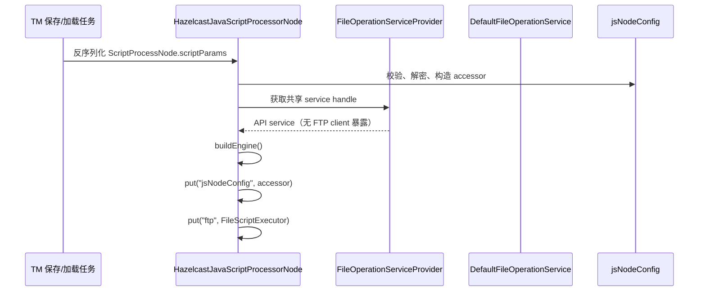
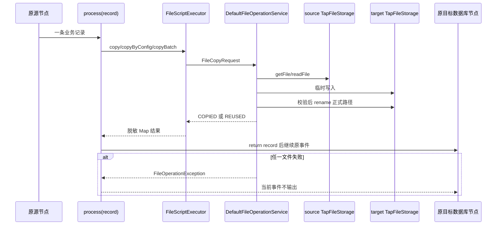

# TAP-12832 增强 JS 节点文件同步详细设计

| 属性 | 内容 |
| --- | --- |
| 需求 | [TAP-12832：增强 JS 节点支持 FTP 文件同步后继续下游数据库同步](https://tapdata.atlassian.net/browse/TAP-12832) |
| 上位文档 | [TAP-12832 增强 JS 节点支持 FTP 文件同步概要设计](/Users/gavinxiao/kit/tapdata/tapdata/docs/jsNode/TAP-12832-enhanced-js-ftp-sync-design.md) |
| 开发计划 | [TAP-12832 增强 JS 节点文件同步开发计划](/Users/gavinxiao/kit/tapdata/tapdata/docs/jsNode/TAP-12832-enhanced-js-ftp-sync-development-plan.md) |
| 文档目的 | 把概要设计转换为可实现的模块、类、方法、数据结构、调用时序和验收边界 |
| 代码基线 | `tapdata`、`tapdata-web`、`tapdata-connectors`、`tapdata-common-lib` 当前工作区代码 |
| 设计状态 | 详细设计，供研发拆分任务和代码评审使用 |

## 1. 设计目标和结论

本次功能给增强 JS 节点增加两个受控 Java 宿主对象：

```javascript
jsNodeConfig.get("任意参数 key")
ftp.copyByConfig({ ... })
ftp.copy({ ... })
ftp.copyBatch([ ... ])
```

脚本仍然由现有 `process(record)` 执行。`ftp.copy` 或 `ftp.copyBatch` 同步完成文件传输和校验后，脚本返回业务记录，事件才进入原有下游节点。文件服务不是任务 DAG 的 source/target 节点，也不是连接管理中的独立资源；它是 JS 节点在处理事件时使用的外部副作用能力。

实现上不在 `iengine` 重写 FTP。新增的 `TapFileOperationService` 放在文件 connector 公共模块，复用现有 `FileConfig`、`FileProtocolEnum`、`TapFileStorageBuilder` 和各协议 `TapFileStorage` 实现。数据源 `FileConnector` 和 JS facade 均通过该服务执行文件操作。引擎只持有 API 接口和一个面向 JS 的窄 facade，不接触 `FTPClient`、账号密码、`InputStream` 或 connector 私有 `storage` 字段。

本期推荐的运行语义是“每条业务数据各自等待关联文件”：一条事件所关联的 `copyBatch` 全部成功后，该事件继续；另一条事件的文件失败只阻止另一条事件，不回滚已经成功的事件。

## 2. 现有代码基线分析

### 2.1 JS 节点执行链

| 位置 | 现有代码事实 | 改造用途 |
| --- | --- | --- |
| [`ScriptProcessNode.java`](/Users/gavinxiao/kit/tapdata/tapdata/manager/tm-common/src/main/java/com/tapdata/tm/commons/dag/process/script/ScriptProcessNode.java:41) | 持久化 `script`、`declareScript`、`jsType` 三个字段 | 增加通用 `scriptParams` 参数列表；保持旧任务字段兼容 |
| [`JsProcessorNode.java`](/Users/gavinxiao/kit/tapdata/tapdata/manager/tm-common/src/main/java/com/tapdata/tm/commons/dag/process/JsProcessorNode.java:16) | 仅声明节点类型，继承脚本字段 | 不增加 FTP 专用字段，参数能力由父类复用 |
| [`HazelcastJavaScriptProcessorNode.java`](/Users/gavinxiao/kit/tapdata/tapdata/iengine/iengine-app/src/main/java/io/tapdata/flow/engine/V2/node/hazelcast/processor/HazelcastJavaScriptProcessorNode.java:65) | 每个工作线程创建一个 JS engine；`buildEngine` 注入 `ScriptExecutorsManager`、`source`、`target` 和 `env` | 在相同位置注入 `jsNodeConfig` 和 `ftp`；在 `doClose` 释放文件服务引用 |
| [`ScriptUtil.java`](/Users/gavinxiao/kit/tapdata/tapdata/iengine/iengine-common/src/main/java/com/tapdata/processor/ScriptUtil.java:63) | GraalJS 使用 `SANDBOX_HOST_ACCESS`，禁止 `File`、`Runtime`、`ProcessBuilder`、`ClassLoader` 等宿主能力 | 继续只允许显式注入的 facade；不增加 FTP 客户端类到允许类列表 |
| [`ScriptExecutorsManager.java`](/Users/gavinxiao/kit/tapdata/tapdata/iengine/iengine-app/src/main/java/io/tapdata/flow/engine/V2/script/ScriptExecutorsManager.java:29) | 负责 PDK connector 的脚本执行器和连接缓存 | 保持职责不变，不把文件传输塞进该 manager |
| [`JSProcessNodeTestRunService.java`](/Users/gavinxiao/kit/tapdata/tapdata/iengine/iengine-app/src/main/java/io/tapdata/services/JSProcessNodeTestRunService.java:33) | 通过完整测试任务执行 JS 并收集日志 | 传递参数列表，并保证试运行使用 `dryRun` 文件 facade |

`HazelcastJavaScriptProcessorNode.tryProcess` 当前在第 314 行附近拿到线程独占 engine，在第 317 行调用 `process(record)`；脚本结果为 `null` 时不输出，返回 Map 时继续单条事件，返回 List 时克隆输出事件。文件方法必须在脚本调用期间同步完成，不能在后台异步排队后立即返回业务记录。

当前 `supportConcurrentProcess()` 在第 500 行返回 `true`。FTP 客户端状态包含当前工作目录和数据连接，不能跨线程共享，因此本期在检测到节点配置了文件 facade 时让该节点关闭记录级并发；`copyBatch` 内部只允许由共享服务使用有界并发。若后续保留节点并发，必须将存储会话改为每工作线程独占，不能只把现有单个 `TapFileStorage` 放入共享 Map。

### 2.2 前端配置和试运行链

[`tapdata-web/packages/dag/src/nodes/JavaScript.js`](/Users/gavinxiao/kit/tapdata/tapdata-web/packages/dag/src/nodes/JavaScript.js:17) 目前 form schema 只有名称、`jsType`、脚本和 schemaPreview；增强 JS、迁移 JS、标准 JS 共用 [`js-processor/index.tsx`](/Users/gavinxiao/kit/tapdata/tapdata-web/packages/dag/src/components/form/js-processor/index.tsx:38) 中的编辑器。

`js-processor/index.tsx` 在第 62 行初始化试运行参数，在第 287 行调用 `testRunJsRpc`。新增参数列表应直接来自 `form.values.scriptParams`，不能依赖组件内部副本，否则保存内容与试运行内容会不一致。请求中要同时传递：

```json
{
  "taskId": "...",
  "jsNodeId": "...",
  "script": "...",
  "jsType": 0,
  "scriptParams": [
    {"key":"ftp.read.host","type":"string","value":"...","encrypted":false}
  ],
  "testRunInputEventJson": "[...]"
}
```

前端参数值回显使用掩码。已保存的加密值不能因为试运行接口而下发明文；后端在任务运行环境解密后注入 `jsNodeConfig`，返回日志和异常时再次脱敏。

### 2.3 数据源侧文件链路

现有文件 connector 已经具备可复用的协议装配链：

```text
FileConnector.initConnection
  -> FileConfig.load(connectionParams/nodeConfig)
  -> FileProtocolEnum.fromValue(protocol)
  -> TapFileStorageBuilder.build()
  -> TapFileStorage（FTP/SFTP/SMB/S3FS/NFS/OSS）
```

具体代码如下：

- [`FileConnector.java`](/Users/gavinxiao/kit/tapdata/tapdata-connectors/connectors-common/file-connector-core/src/main/java/io/tapdata/common/FileConnector.java:44) 加载 connection 和 node 参数，第 65 行通过协议枚举和 builder 创建 storage，第 108 行基于多路径、递归、include/exclude 读取文件。
- [`FileConfig.java`](/Users/gavinxiao/kit/tapdata/tapdata-connectors/connectors-common/file-connector-core/src/main/java/io/tapdata/common/FileConfig.java:22) 将 `filePathString` 拆为 `filePathSet`，将 include/exclude 规则拆为集合。
- [`FileProtocolEnum.java`](/Users/gavinxiao/kit/tapdata/tapdata-connectors/connectors-common/file-connector-core/src/main/java/io/tapdata/common/FileProtocolEnum.java:3) 已映射 FTP、SFTP、SMB、S3FS、NFS、OSS 等协议。
- [`TapFileStorageBuilder.java`](/Users/gavinxiao/kit/tapdata/tapdata-common-lib/plugin-kit/tapdata-api/src/main/java/io/tapdata/file/TapFileStorageBuilder.java:26) 通过 classloader 装配 `TapFileStorage` 并调用 `init(params)`。
- [`TapFileStorage.java`](/Users/gavinxiao/kit/tapdata/tapdata-common-lib/plugin-kit/tapdata-api/src/main/java/io/tapdata/file/TapFileStorage.java:13) 已提供 `readFile`、`saveFile`、`move`、`delete`、`getFilesInDirectory` 和存在性查询。

因此文件服务应放在 `file-connector-core`，调用同一套 `TapFileStorage`。JS 不能直接取得 `FileConnector.storage`，因为该字段是 connector 私有生命周期的一部分，源节点重连、停止或 classloader 回收会使跨节点引用失效。

### 2.4 FTP 适配器现状和必须修复的问题

[`FtpFileStorage.java`](/Users/gavinxiao/kit/tapdata/tapdata-connectors/file-storages/ftp-file/src/main/java/io/tapdata/storage/ftp/FtpFileStorage.java:21) 当前负责 FTP 登录、读写和目录扫描：

- 第 27 行设置连接和数据超时，第 32 行连接，第 34 行登录，第 41 行进入被动模式并使用二进制传输。
- 第 96 行 `readFile(path, Consumer)` 会调用 `completePendingCommand()`；第 110 行返回原始流时由调用者负责流关闭和协议完成。
- 第 133 行 `saveFile` 调用 `storeFile`，但当前没有检查 boolean 返回值。
- 第 123 行 `move` 仍然抛出 `UnsupportedOperationException`。
- 第 204 行通过 `changeWorkingDirectory` 判断目录存在，部分方法会改变 FTP 当前工作目录。

共享服务依赖这些方法时，必须先修复 storage 适配器的返回值检查、目录创建和可靠 rename；不能在引擎里再写一套 `FTPClient` 逻辑来绕过这些问题。

## 3. 模块和依赖边界

### 3.1 模块分层

```text
tapdata-common-lib/plugin-kit/tapdata-api
  ├─ TapFileOperationService
  ├─ FileCopyRequest / FileBatchRequest / FileOperationResult
  ├─ FileEndpoint / FileVerifyMode / FileCapability
  └─ FileOperationException

tapdata-connectors/connectors-common/file-connector-core
  ├─ DefaultFileOperationService
  ├─ FileStorageSessionManager
  ├─ FileServiceConfigMapper
  ├─ FilePathPolicy / FileTransferExecutor / FileValidator
  └─ FileConnector、FileTest 改为调用共享服务

tapdata-connectors/file-storages/*
  └─ TapFileStorage 协议实现（FTP/SFTP/SMB/S3FS/NFS/OSS）

tapdata/iengine/iengine-app
  ├─ FileOperationServiceProvider（SPI/connector classloader 适配）
  ├─ JsNodeConfigAccessor
  └─ FileScriptExecutor（仅 JS 映射和权限边界）
```

`iengine-app` 只依赖 `tapdata-api` 的稳定接口。运行时通过已有 connector classloader/SPI 装配 `file-connector-core` 实现；不要在 iengine 的 pom 中新增 Apache Commons Net 或 FTP storage 的直接实现依赖。这样 FTP、SFTP、SMB 等协议仍由 file-storages 模块维护，数据源与 JS 自动获得同一修复。

### 3.2 不复用的对象

以下对象不能从源数据节点跨节点传给 JS：

1. `FileConnector.storage` 私有字段。
2. `FTPClient`、SFTP channel、SMB client 等协议客户端。
3. 用户名、密码、密钥和原始 `InputStream`。
4. 带有 connector 生命周期的 `TapConnectionContext`。

复用的对象是 `TapFileStorage` 接口、协议 builder、参数映射、路径策略、临时文件发布、校验和会话管理实现。

## 4. 持久化数据结构和校验

### 4.1 `ScriptProcessNode` 字段

在 [`ScriptProcessNode.java`](/Users/gavinxiao/kit/tapdata/tapdata/manager/tm-common/src/main/java/com/tapdata/tm/commons/dag/process/script/ScriptProcessNode.java:41) 增加持久化字段 `scriptParams`：

```java
@EqField
protected List<JsNodeConfigParam> scriptParams = new ArrayList<>();
```

使用父类字段可让 `JsProcessorNode`、`MigrateJsProcessorNode`、`StandardJsProcessorNode` 和 `StandardMigrateJsProcessorNode` 共享模型。持久化字段使用 `scriptParams`，运行时注入对象固定使用 `jsNodeConfig`；两者分离可以避免把 DAG 数据结构误当成脚本宿主对象，也避免注入一个泛化的 `config` 变量造成重名。

参数 DTO 建议放在 `tm-commons`，代码如下：

```java
public class JsNodeConfigParam implements Serializable {
    private String key;
    private JsNodeConfigValueType type; // STRING, NUMBER, BOOLEAN, JSON
    private Object value;
    private boolean encrypted;
    private String description;
}
```

持久化时，`value` 只允许普通值或现有密文/secretRef 格式。不要新增一套独立密钥系统；使用平台当前的加密存储和 secret 权限校验。运行时解密后的值只存在内存，不回写 DAG。

### 4.2 参数校验规则

保存任务时在 TM 层完成结构校验，启动任务时再次完成安全校验：

| 规则 | 约束 |
| --- | --- |
| key | 非空，建议正则 `[A-Za-z0-9_./:-]{1,128}`；禁止重复；禁止 `tapdata.` 保留前缀 |
| type | 只允许 `STRING`、`NUMBER`、`BOOLEAN`、`JSON`；未知类型直接拒绝 |
| value | 单项不超过 64 KB；JSON 必须可解析；集合和深层嵌套限制深度 |
| encrypted | 非敏感值不能误标为密文；密文无权解密时启动失败 |
| description | 只用于 UI 和审计，不能参与协议映射 |
| 总量 | 建议不超过 100 个参数、总序列化大小不超过 512 KB |

重复 key、空 key、类型不匹配和非法密文应在保存时返回字段级错误，不等到处理第一条业务数据才失败。

### 4.3 运行时访问器

在 `iengine` 新增 `JsNodeConfigAccessor`：

```java
public interface JsNodeConfigAccessor {
    Object get(String key);
    boolean has(String key);
    Object getOrDefault(String key, Object defaultValue);
}
```

实现类 `DefaultJsNodeConfigAccessor` 在构造时接收已校验的参数 Map 和 secret 解密器，方法要求：

1. `get(key)` 不存在时抛 `JS_NODE_CONFIG_KEY_NOT_FOUND`，不能返回 `null` 混淆“没有 key”和“值就是 null”。
2. `has(key)` 只做存在性判断，不触发异常。
3. `getOrDefault(key, defaultValue)` 仅在不存在时使用默认值；类型转换失败抛 `JS_NODE_CONFIG_TYPE_INVALID`。
4. key 只按精确字符串查找，不做模糊匹配或前缀猜测。
5. 访问器不提供 `all()`、反射、类加载或导出明文的方法。

示例：

```javascript
var host = jsNodeConfig.get("mgm.in.host");
var port = jsNodeConfig.getOrDefault("mgm.in.port", 21);
if (jsNodeConfig.has("mgm.verify")) {
    verifyMode = jsNodeConfig.get("mgm.verify");
}
```

## 5. 文件服务公共 API

### 5.1 API DTO

以下类型放在 `tapdata-api` 的 `io.tapdata.file.operation` 包中，避免引擎依赖 connector 实现：

```java
public enum FileVerifyMode { NONE, SIZE, CHECKSUM }

public enum FileOperationStatus { COPIED, REUSED, DRY_RUN }

public final class FileEndpoint {
    private String protocol;              // ftp/sftp/smb/s3fs/oss...
    private Map<String, Object> params;   // 已由服务边界脱敏/解密后的内部值
    private String rootPath;
}

public final class FileCopyRequest {
    private FileEndpoint source;
    private FileEndpoint target;
    private String sourcePath;
    private String targetPath;
    private boolean overwrite;
    private FileVerifyMode verifyMode;
    private String expectedChecksum;
    private int retryTimes;
    private long timeoutMs;
    private boolean dryRun;
}

public final class FileOperationResult {
    private FileOperationStatus status;
    private String sourcePath;
    private String targetPath;
    private long bytes;
    private String checksum;
    private int attempts;
    private long durationMs;
}

public final class FileBatchResult {
    private boolean success;
    private List<FileOperationResult> items;
    private int copied;
    private int reused;
    private long bytes;
}
```

`FileEndpoint.params` 只在 Java 服务内部存在。JS `copyByConfig` 使用配置 key 前缀构造 endpoint，脚本无需读取密码；JS `copy` 允许动态构造参数，但返回值和异常都必须脱敏。

### 5.2 服务接口

```java
public interface TapFileOperationService extends AutoCloseable {
    FileOperationResult copy(FileCopyRequest request);
    FileBatchResult copyBatch(List<FileCopyRequest> requests);
    FileMetadata stat(FileEndpoint endpoint, String path);
    boolean exists(FileEndpoint endpoint, String path);
    List<FileMetadata> list(FileListRequest request);
    FileValidationResult validate(FileEndpoint endpoint, String path, FileAccess access);
    @Override void close();
}
```

`copyBatch` 的原子性是“服务调用范围内全部成功才返回 success”，不承诺跨事件、跨数据库事务的回滚。已经发布的前一个文件不能在后一个文件失败时删除，除非调用方显式配置清理策略；默认只清理本批次临时文件。

### 5.3 JS facade 接口

`FileScriptExecutor` 只暴露以下 Java 方法：

```java
public final class FileScriptExecutor {
    public Map<String, Object> copy(Map<String, Object> options);
    public Map<String, Object> copyByConfig(Map<String, Object> options);
    public Map<String, Object> copyBatch(List<Map<String, Object>> options);
    public boolean exists(Map<String, Object> options);
}
```

一期建议只开放 `copy`、`copyByConfig`、`copyBatch`、`exists`；`stat/list` 是否开放取决于 MGM 是否确实需要。不要把 `delete`、`move` 作为一期 JS 默认能力，避免脚本误删源文件或破坏外部文件状态。

JS 推荐写法：

```javascript
function process(record) {
    var result = ftp.copyByConfig({
        sourcePrefix: "mgm.in",
        targetPrefix: "mgm.out",
        sourcePath: record.file_path,
        targetPath: record.file_path,
        verify: jsNodeConfig.getOrDefault("mgm.file.verify", "SIZE"),
        overwrite: false,
        retryTimes: 2,
        timeoutMs: 120000
    });

    if (result.status !== "COPIED" && result.status !== "REUSED") {
        throw new Error("file operation did not complete");
    }
    return record;
}
```

动态端点场景可使用 `copy`，但不建议把密码拼入记录或日志：

```javascript
var result = ftp.copy({
    source: {
        protocol: jsNodeConfig.get("mgm.in.protocol"),
        rootPath: jsNodeConfig.getOrDefault("mgm.in.rootPath", "/"),
        params: {
            host: jsNodeConfig.get("mgm.in.host"),
            port: jsNodeConfig.getOrDefault("mgm.in.port", 21),
            username: jsNodeConfig.get("mgm.in.username"),
            password: jsNodeConfig.get("mgm.in.password")
        }
    },
    sourcePath: record.source_file,
    target: {
        protocol: jsNodeConfig.get("mgm.out.protocol"),
        rootPath: jsNodeConfig.getOrDefault("mgm.out.rootPath", "/"),
        params: {
            host: jsNodeConfig.get("mgm.out.host"),
            port: jsNodeConfig.getOrDefault("mgm.out.port", 21),
            username: jsNodeConfig.get("mgm.out.username"),
            password: jsNodeConfig.get("mgm.out.password")
        }
    },
    targetPath: record.target_file,
    verify: "CHECKSUM",
    overwrite: false
});
```

## 6. 共享服务实现设计

### 6.1 `FileServiceConfigMapper`

`FileServiceConfigMapper` 位于 `file-connector-core`，负责把通用参数或显式 endpoint 转换成现有 storage 需要的扁平 Map：

```java
public interface FileServiceConfigMapper {
    Map<String, Object> mapStorageParams(FileEndpoint endpoint);
}
```

`copyByConfig` 的映射规则：

1. 读取 `protocolKey`，默认为 `ftp`；只允许 `FileProtocolEnum` 中已有协议。
2. 读取 `sourcePrefix` 或 `targetPrefix` 下的 key，去掉前缀后映射到协议字段。
3. 仅保留协议适配器声明的字段；未知 key 可保留在 endpoint metadata，但不能直接传到 storage。
4. 补充 `encoding`、connectTimeout、dataTimeout、passiveMode 等公共字段默认值。
5. 任何必需字段缺失都抛 `FILE_CONFIG_INVALID`，错误只包含 key 名，不包含值。

例如 `mgm.in.host`、`mgm.in.port`、`mgm.in.username`、`mgm.in.password` 映射为 FTP storage 所需的 `ftpHost`、`ftpPort`、`ftpUsername`、`ftpPassword`。映射器不绑定前端字段；前端只编辑任意 key。

### 6.2 `FileStorageSessionManager`

```java
public interface FileStorageSessionManager extends AutoCloseable {
    FileStorageSession retain(FileEndpoint endpoint);
    void release(FileStorageSession session);
    void invalidate(FileStorageSession session);
    @Override void close();
}
```

实现要求：

- 会话 key 使用 `protocol + normalizedParamsFingerprint + tenantId + taskId`，密码参与指纹但不能写日志。
- 每个 JS 工作线程使用独立 `TapFileStorage`；同一线程内的连续事件可复用，不跨线程共享 FTP 当前工作目录。
- 数据源 connector 也使用该 manager 的实现，但保留自己的 connector context 引用；一方停止只 `release` 自己的引用。
- 设置最大会话数、空闲回收、连接建立超时和总操作超时；超过上限抛 `FILE_SESSION_LIMIT`。
- `invalidate` 在连接断开、`completePendingCommand` 失败或协议回复异常后销毁并重建，不复用损坏 session。

### 6.3 `DefaultFileOperationService.copy`

推荐实现顺序：

```java
public FileOperationResult copy(FileCopyRequest request) {
    NormalizedCopyRequest normalized = validator.validateAndNormalize(request);
    if (normalized.isDryRun()) {
        validator.validateAccess(normalized);
        return result(DRY_RUN, normalized);
    }

    FileStorageSession source = sessions.retain(normalized.source());
    FileStorageSession target = sessions.retain(normalized.target());
    try {
        TapFile sourceMeta = source.storage().getFile(normalized.sourcePath());
        if (sourceMeta == null || sourceMeta.getType() != TapFile.TYPE_FILE) {
            throw new FileOperationException(FILE_NOT_FOUND, normalized.sourcePath());
        }

        ExistingTarget existing = targetProbe.probe(target, normalized.targetPath());
        if (existing.matches(normalized, sourceMeta)) {
            return result(REUSED, normalized).bytes(existing.length());
        }
        if (existing.exists() && !normalized.overwrite()) {
            throw new FileOperationException(FILE_TARGET_CONFLICT, normalized.targetPath());
        }

        String tempPath = tempPathFactory.create(normalized);
        try {
            transfer.copy(source.storage(), normalized.sourcePath(),
                    target.storage(), tempPath, normalized.timeoutMs());
            verifier.verify(sourceMeta, target.storage(), tempPath, normalized);
            publisher.publish(target.storage(), tempPath,
                    normalized.targetPath(), normalized.overwrite());
            return result(COPIED, normalized);
        } finally {
            cleanup.deleteIfOwned(target.storage(), tempPath);
        }
    } catch (RetryableFileException e) {
        sessions.invalidate(source);
        sessions.invalidate(target);
        throw retryExecutor.retry(request, e);
    } finally {
        sessions.release(source);
        sessions.release(target);
    }
}
```

这段代码是实现骨架，具体异常和流关闭必须由 `FileTransferExecutor` 完成。传输使用固定大小 buffer；禁止 `readFile()` 后把完整内容转成 byte[] 再交给 JS。

### 6.4 `copyBatch`

`copyBatch` 先校验所有请求，再依次或按有限并发调用 `copy`。批次规则：

- 任一请求参数非法时，整个批次不开始传输。
- 已经成功发布的文件不因后续失败自动删除；返回/抛出的异常包含成功项数量和失败项索引。
- 临时文件必须按请求唯一，清理只删除本次调用创建的路径。
- 默认最大文件数 100、总字节数和总耗时均有限制，超限抛 `FILE_BATCH_LIMIT`。
- 需要严格全有或全无的业务必须在脚本外使用任务编排；本服务不提供跨远端 FTP 的分布式事务。

### 6.5 路径和发布策略

`FilePathPolicy` 统一处理：

1. 规范化 `/`、`.`、`..` 和重复分隔符。
2. 拒绝绝对本地路径、协议前缀、根目录跳出和控制字符。
3. endpoint `rootPath` 与相对 path 拼接后仍必须位于 root 内。
4. 临时目录格式为 `.tapdata-tmp/<taskId>/<nodeId>/<eventId>/<uuid>.part`，不能由脚本覆盖。
5. 目标正式文件只在传输和校验成功后发布；若协议支持原子 rename，必须使用 rename。
6. 不支持 rename 的协议要由 capability 明确标识；一期 FTP 必须补充可靠 rename，其他协议暂时返回 `FILE_UNSUPPORTED_OPERATION`，不能假装原子发布。

## 7. 具体代码改造清单

### 7.1 `tm-commons`

文件：[`ScriptProcessNode.java`](/Users/gavinxiao/kit/tapdata/tapdata/manager/tm-common/src/main/java/com/tapdata/tm/commons/dag/process/script/ScriptProcessNode.java)

改造：

1. 增加 `@EqField protected List<JsNodeConfigParam> scriptParams`。
2. 提供 getter/setter，默认空列表，旧 JSON 缺字段时反序列化为空列表。
3. 在节点校验策略中调用 `JsNodeConfigValidator`，报错定位到参数数组下标和 key。
4. 在节点复制、导入导出、配置比较中保留参数字段；敏感值比较使用密文/secretRef 指纹，不将明文放到 diff。
5. `StandardJsProcessorNode` 不因字段存在而获得文件能力；运行时只根据任务节点实际配置注入 facade。

### 7.2 引擎 JS processor

文件：[`HazelcastJavaScriptProcessorNode.java`](/Users/gavinxiao/kit/tapdata/tapdata/iengine/iengine-app/src/main/java/io/tapdata/flow/engine/V2/node/hazelcast/processor/HazelcastJavaScriptProcessorNode.java)

新增字段：

```java
private JsNodeConfigAccessor jsNodeConfigAccessor;
private FileScriptExecutor fileScriptExecutor;
private FileOperationServiceHandle fileServiceHandle;
private boolean fileOperationEnabled;
```

`ensureSharedInit()` 的改造顺序：

1. 保留现有 script、standard、finalJs、`ScriptExecutorsManager` 初始化。
2. 从当前 `ScriptProcessNode` 读取 `scriptParams`，通过 `DefaultJsNodeConfigAccessorFactory` 创建访问器。
3. 当节点声明 `fileOperationEnabled`（或脚本参数包含协议配置且产品开关打开）时，从 `FileOperationServiceProvider` 获取服务 handle，并创建 `FileScriptExecutor`。
4. provider 获取失败应在节点初始化时报 `FILE_SERVICE_UNAVAILABLE`，不要等第一条数据才得到空指针。
5. 没有文件配置的旧任务不创建 socket、session 或 storage。

`buildEngine()` 在现有第 224 行之后增加：

```java
ScriptEngine scriptEngine = (ScriptEngine) engine;
scriptEngine.put("jsNodeConfig", new JsNodeConfigScriptFacade(jsNodeConfigAccessor));
if (fileOperationEnabled) {
    scriptEngine.put("ftp", fileScriptExecutor);
}
```

注入对象名称固定为 `jsNodeConfig`，不要注入名为 `config` 的对象。对于没有开启文件能力的旧任务，`ftp` 保持未定义，避免改变旧脚本的全局变量行为；`jsNodeConfig` 可注入空访问器，旧脚本不会受影响。

`tryProcess()` 不需要复制文件逻辑。它只需保证：

- `buildEngine` 创建的 facade 与该线程 engine 生命周期一致。
- 脚本抛出 `FileOperationException` 时由 `wrapScriptProcessException` 保留原始 error code 和 dynamic parameters，不要全部降为无法识别的通用文本。
- 测试任务线程创建的临时 engine 也注入同一个 dry-run facade，不得复用工作线程 Graal context。

`doClose()` 在关闭 `scriptExecutorsManager` 前关闭 `fileScriptExecutor`，然后释放 `fileServiceHandle`。关闭顺序如下：

```text
停止接受事件
  -> 等待/中断文件操作
  -> close FileScriptExecutor
  -> release FileOperationServiceHandle
  -> close source/target ScriptExecutor
  -> close JS engines
```

`supportConcurrentProcess()` 不能依赖尚未执行的 `ensureSharedInit()`。应直接从节点参数判断文件能力，或在 processor 构造/`doInit` 前完成该字段初始化。推荐写成：

```java
private boolean hasFileOperationConfig() {
    Node<?> node = getNode();
    if (!(node instanceof ScriptProcessNode)) {
        return false;
    }
    List<JsNodeConfigParam> params = ((ScriptProcessNode) node).getScriptParams();
    return params != null && !params.isEmpty()
            && featureSwitch.fileOperationForJsEnabled();
}

@Override
public boolean supportConcurrentProcess() {
    return !hasFileOperationConfig();
}
```

这是一期最安全的并发边界。若未来需要并发，先完成每线程 session、FTP 命令串行化和批量限流测试，再单独开放节点级开关。

### 7.3 `ScriptUtil`

文件：[`ScriptUtil.java`](/Users/gavinxiao/kit/tapdata/tapdata/iengine/iengine-common/src/main/java/com/tapdata/processor/ScriptUtil.java)

不把 `FileScriptExecutor` 或 `JsNodeConfigAccessor` 加入 `ALLOWED_HOST_CLASSES`，因为对象是通过 `ScriptEngine.put` 注入的，不需要 `Java.type`。保持以下安全策略：

- `SANDBOX_HOST_ACCESS` 继续禁止 `java.io.File`、`Runtime`、`ProcessBuilder`、`ClassLoader`、系统环境和进程创建。
- 不向 `initBuildInMethod` 添加 FTP 类或文件系统类。
- facade 的公开方法只接受 `Map`/`List`/基础值，避免 Graal 访问内部实现方法。
- facade 返回普通 Map，不能返回 `TapFileStorage`、InputStream 或 Java 异常对象。

### 7.4 前端节点 schema 和参数组件

文件：[`JavaScript.js`](/Users/gavinxiao/kit/tapdata/tapdata-web/packages/dag/src/nodes/JavaScript.js)

在 `script` 前增加：

```javascript
scriptParams: {
  type: 'array',
  default: [],
  'x-component': 'JsNodeConfigEditor',
  'x-component-props': { maxItems: 100 },
}
```

`JsNodeConfigEditor` 应提供：

- key 输入、类型选择、值输入、加密开关、描述输入。
- 增加、删除、上移、下移和重复 key 即时提示。
- 加密值只显示掩码；切换为非加密必须再次确认并由后端校验。
- 插入脚本模板：`jsNodeConfig.get('key')`、`jsNodeConfig.getOrDefault('key', value)`、`ftp.copyByConfig({...})`。

文件：[`js-processor/index.tsx`](/Users/gavinxiao/kit/tapdata/tapdata-web/packages/dag/src/components/form/js-processor/index.tsx)

改造：

1. 试运行调用第 287 行的 `testRunJsRpc` 时追加 `scriptParams: form.values.scriptParams || []`。
2. 试运行结果只展示 `status`、路径摘要、字节数和耗时；过滤 password/token/secret 等字段。
3. `mockInputValid` 仍只负责业务事件 JSON；参数错误由后端返回字段级错误。
4. 获取样例数据和脚本编辑不应改变参数列表。

迁移 JS 和标准 JS 如共用该组件，统一使用同一字段名；不在某一个节点上增加 FTP 专用字段。

### 7.5 测试运行服务

文件：[`JSProcessNodeTestRunService.java`](/Users/gavinxiao/kit/tapdata/tapdata/iengine/iengine-app/src/main/java/io/tapdata/services/JSProcessNodeTestRunService.java)

任务 DTO 反序列化后，节点中的 `scriptParams` 会随 DAG 进入测试任务。新增要求：

1. 试运行任务创建 `DryRunFileOperationService` 或在 `FileScriptExecutor` 中设置 `dryRun=true`。
2. `exists/stat/list` 可按权限执行；`copy/copyBatch` 只返回 `DRY_RUN`，不得调用目标写入方法。
3. 试运行日志显示 `DRY_RUN`、校验结果和参数 key，不显示参数值。
4. 测试线程仍沿用 `HazelcastJavaScriptProcessorNode` 当前 10 秒 engine 超时；文件超时必须小于该总预算，避免线程被后台 socket 卡住。
5. 连接/参数验证失败时返回结构化 code；不要把 `Throwable.getMessage()` 中可能包含的连接串直接写入结果。

### 7.6 `FileConnector` 和 `FileTest`

文件：[`FileConnector.java`](/Users/gavinxiao/kit/tapdata/tapdata-connectors/connectors-common/file-connector-core/src/main/java/io/tapdata/common/FileConnector.java)

把第 65 行的 `buildStorage()` 保留为兼容入口，但内部委托 `FileStorageSessionManager` 或 `DefaultFileOperationService` 的 builder。数据源读流程可继续使用 `TapFileStorage`，新增复制流程统一走 service，避免同一模块有两套路径校验和重试。

推荐抽取：

```java
protected FileStorageSession openStorageSession(Map<String, Object> params);
protected FileValidationResult validateFilePath(FileConfig config);
```

第 117 行的 `connectionTest()` 不再单独复制装配逻辑，改为调用共享 `FileValidator`；`FileTest` 保留连接字符串格式化和测试项适配。

### 7.7 `TapFileStorage` 与协议适配器

文件：[`TapFileStorage.java`](/Users/gavinxiao/kit/tapdata/tapdata-common-lib/plugin-kit/tapdata-api/src/main/java/io/tapdata/file/TapFileStorage.java)

保持已有方法签名兼容，增加能力查询而不是强迫所有协议立即实现 rename：

```java
default EnumSet<FileStorageCapability> capabilities() {
    return EnumSet.noneOf(FileStorageCapability.class);
}
```

文件：[`FtpFileStorage.java`](/Users/gavinxiao/kit/tapdata/tapdata-connectors/file-storages/ftp-file/src/main/java/io/tapdata/storage/ftp/FtpFileStorage.java)

必须完成以下修复：

1. `saveFile` 检查 `storeFile` 返回值；失败抛带 `FILE_WRITE_FAILED` 的异常。
2. `openFileOutputStream` 关闭时检查 `completePendingCommand` 返回值；流关闭异常不能被吞掉。
3. 实现 `move` 为同一 FTP endpoint 内的 `rename`，返回 false 或抛统一异常时由 service 处理。
4. 增加 `makeDirectory`/递归创建父目录，或在 service 中通过 capability 判断后明确失败。
5. 对 `changeWorkingDirectory`、`retrieveFileStream`、`listFiles` 做线程隔离；session 不跨线程共享。
6. 对不存在文件返回 null/false，协议网络错误抛 `FILE_REMOTE_IO_FAILED`，不要混用“文件不存在”和“连接失败”。

SFTP、SMB 等当前 `move` 也可能抛 `UnsupportedOperationException`。在各 adapter 声明 capability；service 在发布前检查，不能捕获后无条件覆盖正式文件。

## 8. 完整运行时流程

### 8.1 任务启动



没有文件能力的旧任务不调用 provider，也不创建任何远端 session。

### 8.2 单条事件



不同记录之间没有文件级全局 barrier。A 事件文件成功即可以进入 DB，B 事件文件失败只阻止 B。

### 8.3 关闭和重连

连接断开时 service 将 session 标记 invalid，下一次重试重新通过 `TapFileStorageBuilder` 创建 storage。节点关闭时先停止新事件，再释放本节点引用；如果数据源 connector 仍在使用同一配置，不能提前销毁它的 session。

## 9. 错误模型和任务错误处理

建议新增统一错误码：

| Code | 含义 | 是否重试 |
| --- | --- | --- |
| `JS_NODE_CONFIG_KEY_NOT_FOUND` | 脚本读取不存在的 key | 否 |
| `JS_NODE_CONFIG_TYPE_INVALID` | 参数类型转换失败 | 否 |
| `FILE_SERVICE_UNAVAILABLE` | provider/实现未装配 | 否 |
| `FILE_CONFIG_INVALID` | 协议或必填参数缺失 | 否 |
| `FILE_SESSION_LIMIT` | 会话或并发达到上限 | 可有限重试 |
| `FILE_CONNECT_FAILED` | 连接/登录失败 | 可有限重试 |
| `FILE_NOT_FOUND` | 源文件不存在 | 可短暂重试，最终失败 |
| `FILE_PATH_FORBIDDEN` | 路径越界或非法路径 | 否 |
| `FILE_WRITE_FAILED` | 写入或 FTP store 失败 | 可有限重试 |
| `FILE_VERIFY_FAILED` | 长度/checksum 校验失败 | 可有限重试 |
| `FILE_TARGET_CONFLICT` | 目标存在且内容不一致 | 否 |
| `FILE_UNSUPPORTED_OPERATION` | 协议不支持原子发布等能力 | 否 |
| `FILE_TIMEOUT` | 单文件或批次超时 | 可有限重试 |
| `FILE_BATCH_LIMIT` | 文件数、大小或总耗时超限 | 否 |
| `FILE_DRY_RUN_WRITE_BLOCKED` | 试运行试图写远端 | 否 |
| `FILE_REMOTE_IO_FAILED` | 远端协议操作失败 | 可有限重试 |

当前 [`HazelcastBaseNode.errorHandle`](/Users/gavinxiao/kit/tapdata/tapdata/iengine/iengine-app/src/main/java/io/tapdata/flow/engine/V2/node/hazelcast/HazelcastBaseNode.java:713) 会根据 `ErrorEvent` 和任务 skip 策略处理异常。改造 `wrapScriptProcessException` 时必须保留上述 code；文件依赖错误默认标记为不可跳过，不能让用户用通用“跳过 JS 异常”把业务记录放行。若产品需要“文件可选”，应由脚本显式捕获指定 code 并写出业务标记，且任务 UI 明确显示这是非强依赖模式。

重试只在 service 内执行，JS 不写 for-loop 重试 FTP。每次重试必须重新检查最终目标，避免在响应丢失时盲目重复覆盖。

## 10. 幂等和一致性边界

文件成功和数据库提交不属于同一事务。保证方式是：

1. 文件层默认 `overwrite=false`；目标存在且 size/checksum 与源版本一致时返回 `REUSED`。
2. 文件发布使用临时路径和 rename，避免半成品被下游看到。
3. JS 不推进源位点；任务重启会重放事件并重新得到 `REUSED`。
4. 数据库仍依赖原有唯一键、update/insert 或 Exactly Once 机制。

以下情况不承诺回滚：

- FTP 已发布、数据库随后失败：文件保留，重试通过 `REUSED`。
- `copyBatch` 的前 N 个文件已发布、第 N+1 个失败：不自动删除前 N 个。
- 目标文件被外部进程修改或删除：下一次操作按校验结果返回冲突或重新复制。
- 一个事件关联多个目标 endpoint：各 endpoint 之间没有分布式事务。

如果目标数据库没有稳定唯一键或 Exactly Once 能力，任务启动检查应提示“文件幂等不能保证数据库不重复”。

## 11. 功能边界

### 11.1 本期支持

- 增强 JS 节点在单条事件中同步调用 Java 文件方法。
- 任意 key/type/value 的节点参数，参数可标记加密，脚本通过 `jsNodeConfig.get(key)` 读取。
- `copy`、`copyByConfig`、`copyBatch`，二进制流传输，大小或 checksum 校验。
- 复用 FTP、SFTP、SMB、S3FS、NFS、OSS 已有 storage adapter；是否开放给 JS 由 capability 和协议包决定。
- 同一事件中多个文件全部成功后输出该事件；不同事件互不构成全局 barrier。
- 重试、临时文件、目标复用、路径校验和任务级日志。

### 11.2 本期不支持

- JS 直接 `Java.type("org.apache.commons.net.ftp.FTPClient")`。
- 在连接管理中预创建并记忆 FTP connection ID。
- 把任务源/目标连接配置改造成 FTP 配置。
- 引擎内独立维护 FTP/SFTP/SMB 客户端实现。
- FTP 文件解析、压缩、解压、断点续传和 TB 级切片。
- 默认暴露删除和移动源文件的脚本 API。
- 文件成功作为跨任务、跨记录的全局提交屏障。
- 用文件操作替代数据库目标写入或修改源位点。

## 12. 用例场景

### UC-01：每条订单记录同步一个 FTP 文件

记录包含 `file_path=/orders/2026/09/001.pdf`。脚本调用 `copyByConfig`：源 FTP 从 `mgm.in.*` 参数读取，目标 FTP 从 `mgm.out.*` 参数读取，`verify=SIZE`。

预期：源文件读取、目标临时写入、大小校验、rename 成功后返回原记录；数据库目标照常写入订单行。

### UC-02：一条记录关联多个文件

记录包含 `files` 数组。脚本构造 `copyBatch`，批次内有合同、发票、签收单三个文件。

预期：三个文件全部返回 `COPIED/REUSED` 才返回记录；任一个源文件不存在或校验失败，当前记录抛异常且不进入数据库目标。已经发布的文件不自动回滚，重试时返回 `REUSED`。

### UC-03：不同记录各自等待文件

A 记录关联文件 A，B 记录关联文件 B。A 传输成功，B 因权限失败。

预期：A 可继续下游，B 由任务错误处理；没有“等待所有记录文件完成”的全局 barrier，也不回滚 A。

### UC-04：数据库失败后重试

文件已经发布，数据库因短暂网络错误未提交，源事件重放。

预期：共享 service 检查目标文件的 size/checksum，返回 `REUSED`，不重复上传；数据库按既有幂等策略处理重放事件。

### UC-05：任意参数 key 和加密密码

用户配置 `mgm.in.host`、`mgm.in.password`、`customerA.archive.root` 等任意 key，并只对 password 开启加密存储。

预期：保存时 key 唯一校验通过；脚本使用 `jsNodeConfig.get("mgm.in.host")`；密码在 service 内解密并用于 adapter，日志和试运行结果不显示明文。

### UC-06：试运行

用户在 JS 表单输入样例事件并点击试运行。

预期：参数、路径和访问权限被校验；`copy/copyBatch` 返回 `DRY_RUN`，目标 FTP 无正式文件写入；日志显示操作摘要和校验结果。

### UC-07：路径越界和目标冲突

脚本传入 `../../etc/passwd` 或目标同名文件内容不同且 `overwrite=false`。

预期：前者返回 `FILE_PATH_FORBIDDEN`，后者返回 `FILE_TARGET_CONFLICT`；都不修改目标，不进入下游。

### UC-08：数据源 connector 与 JS 同时使用同一 FTP 服务

文件源 connector 正在扫描目录，JS 节点同时向同一 FTP endpoint 写文件。

预期：二者通过同一共享 service 和 storage adapter，但 session 按线程/引用隔离；停止 JS 节点不会销毁仍被数据源使用的 session。

### UC-09：协议不支持原子发布

脚本选择某个 adapter，但该 adapter 未声明 rename capability。

预期：service 在正式写入前返回 `FILE_UNSUPPORTED_OPERATION`，不能退化成直接写正式路径并假装成功。是否支持该协议需通过 adapter 补齐后再上线。

## 13. 验收测试矩阵

| 编号 | 验证点 | 结果 |
| --- | --- | --- |
| DT-01 | 旧 JS 任务无 `jsNodeConfig`，脚本仍正常返回记录 | 无兼容性回归 |
| DT-02 | `jsNodeConfig.get/has/getOrDefault` 的缺失 key、默认值和类型错误 | code 明确，值不进日志 |
| DT-03 | FTP 单文件二进制传输和中文文件名 | 字节、名称、目录正确 |
| DT-04 | 目标已存在且 size/checksum 一致 | 返回 `REUSED`，不覆盖 |
| DT-05 | 目标存在但内容不一致 | `FILE_TARGET_CONFLICT` |
| DT-06 | FTP `storeFile=false`、`completePendingCommand=false` | 失败不发布正式文件 |
| DT-07 | 源文件不存在、连接断开、超时、任务取消 | 有限重试后失败，流和 session 释放 |
| DT-08 | `copyBatch` 全成功、部分失败、超限 | 状态和清理边界符合设计 |
| DT-09 | 多条事件 A/B 独立处理 | A 成功不受 B 失败回滚 |
| DT-10 | 试运行/模型推演 | 远端无写入，返回 `DRY_RUN` |
| DT-11 | FTP、SFTP、SMB、S3FS 走同一 service | JS facade 无协议分支复制 |
| DT-12 | FileConnector 和 JS 同时操作 | 会话引用和生命周期不互相破坏 |
| DT-13 | 多线程/多分区 | 文件启用时节点串行；session 不跨线程共享 |
| DT-14 | 路径越界、协议未知、密码无权限 | 启动或调用失败，不访问远端 |
| DT-15 | 错误 skip 策略 | 文件依赖错误默认不可跳过 |
| DT-16 | 任务导出、复制、审计和日志 | 不泄露明文、密文或 secretRef |

## 14. 实施顺序和提交拆分

建议按以下顺序拆分，避免前端先产生无法运行的配置：

1. **公共 API**：增加 operation DTO、错误码、capability 和 `TapFileOperationService` 接口。
2. **storage adapter**：修复 FTP `storeFile`/`completePendingCommand` 检查，实现 rename 和 capability；补齐公共测试。
3. **file-connector-core**：抽取 mapper、session manager、validator、transfer executor 和 default service；让 `FileTest` 使用共享 validator。
4. **tm-commons**：增加 `JsNodeConfigParam`、节点字段、保存/导入导出/配置比较校验。
5. **iengine facade**：增加 provider、accessor、`FileScriptExecutor`，改造 JS engine 注入、异常保留和关闭流程。
6. **试运行**：改造 `JSProcessNodeTestRunService` 和测试任务参数，强制 dry-run。
7. **前端**：增加 `JsNodeConfigEditor`、schema、脚本模板、掩码和试运行参数传递。
8. **集成验收**：覆盖单文件、批次、重试、数据库失败重放、并发、协议复用和安全边界。

每个提交都应保持旧 JS 任务可运行；在公共 service 和 adapter 未完成前，不应把 `ftp` 对象注入生产引擎。

## 15. 风险和上线前检查

| 风险 | 处理 |
| --- | --- |
| connector classloader 无法加载共享 service 实现 | 先在 Agent 启动自检 provider 和 `TapFileStorageBuilder`，失败时阻止启用文件能力 |
| FTP 当前工作目录导致路径串扰 | 每个线程独占 storage；所有路径调用使用绝对/规范化路径并加 adapter 测试 |
| FTP 写入成功但响应丢失 | 通过最终路径 stat 和 checksum 对账，匹配时返回 `REUSED` |
| 大文件占用内存 | 固定 buffer、流式传输、文件数/字节数/超时上限 |
| 通用参数泄密 | UI 掩码、后端密文/secret 权限、日志脱敏、facade 不提供 all/export |
| 用户捕获异常后误放行业务数据 | 文件错误默认不可跳过；在运行时识别 `FileOperationException` code |
| 多协议能力不一致 | 由 capability 明确声明；不支持原子发布的协议拒绝执行，不静默降级 |
| 数据库不具备幂等 | 任务启动提示风险；本文只保证文件层复用，不承诺数据库事务 |

上线前必须确认：MGM 实际协议（FTP/FTPS/SFTP）、端点是否允许临时目录和 rename、业务记录中的路径/版本字段、单文件和批次上限，以及目标数据库唯一键/Exactly Once 能力。

## 16. 参考代码

- [HazelcastJavaScriptProcessorNode.java](/Users/gavinxiao/kit/tapdata/tapdata/iengine/iengine-app/src/main/java/io/tapdata/flow/engine/V2/node/hazelcast/processor/HazelcastJavaScriptProcessorNode.java)
- [ScriptUtil.java](/Users/gavinxiao/kit/tapdata/tapdata/iengine/iengine-common/src/main/java/com/tapdata/processor/ScriptUtil.java)
- [ScriptExecutorsManager.java](/Users/gavinxiao/kit/tapdata/tapdata/iengine/iengine-app/src/main/java/io/tapdata/flow/engine/V2/script/ScriptExecutorsManager.java)
- [ScriptProcessNode.java](/Users/gavinxiao/kit/tapdata/tapdata/manager/tm-common/src/main/java/com/tapdata/tm/commons/dag/process/script/ScriptProcessNode.java)
- [JavaScript.js](/Users/gavinxiao/kit/tapdata/tapdata-web/packages/dag/src/nodes/JavaScript.js)
- [js-processor/index.tsx](/Users/gavinxiao/kit/tapdata/tapdata-web/packages/dag/src/components/form/js-processor/index.tsx)
- [JSProcessNodeTestRunService.java](/Users/gavinxiao/kit/tapdata/tapdata/iengine/iengine-app/src/main/java/io/tapdata/services/JSProcessNodeTestRunService.java)
- [FileConnector.java](/Users/gavinxiao/kit/tapdata/tapdata-connectors/connectors-common/file-connector-core/src/main/java/io/tapdata/common/FileConnector.java)
- [FileConfig.java](/Users/gavinxiao/kit/tapdata/tapdata-connectors/connectors-common/file-connector-core/src/main/java/io/tapdata/common/FileConfig.java)
- [FileProtocolEnum.java](/Users/gavinxiao/kit/tapdata/tapdata-connectors/connectors-common/file-connector-core/src/main/java/io/tapdata/common/FileProtocolEnum.java)
- [TapFileStorageBuilder.java](/Users/gavinxiao/kit/tapdata/tapdata-common-lib/plugin-kit/tapdata-api/src/main/java/io/tapdata/file/TapFileStorageBuilder.java)
- [TapFileStorage.java](/Users/gavinxiao/kit/tapdata/tapdata-common-lib/plugin-kit/tapdata-api/src/main/java/io/tapdata/file/TapFileStorage.java)
- [FtpFileStorage.java](/Users/gavinxiao/kit/tapdata/tapdata-connectors/file-storages/ftp-file/src/main/java/io/tapdata/storage/ftp/FtpFileStorage.java)

## 17. 当前实现对齐说明

以下内容以当前代码为准，覆盖早期方案中的抽象接口差异：

1. `FileScriptExecutor` 当前只开放 `copy`、`copyByConfig`、`copyBatch`、`exists`；`stat/list/delete/move` 没有注入到 JS。
2. `copyByConfig` 要求 `sourcePrefix`、`targetPrefix` 指向参数前缀，前缀下必须有 `protocol`，可选 `rootPath/path`，其余参数交给共享 `FileServiceConfigMapper`。示例使用 `mgm.in`，不传 `protocolKey`。
3. `copy` 的 endpoint 结构是 `{protocol, rootPath, params}`；账号、密码、端口等放在 `params` 中。脚本通过 `jsNodeConfig` 读取后才组成 endpoint。
4. 引擎注入的是 `new JsNodeConfigScriptFacade(jsNodeConfigAccessor)`，不会把内部 accessor 或完整配置 Map 暴露给 GraalJS；文件对象只在存在协议参数且 `tapdata.js.file-operation.enabled` 未关闭时注入。
5. `DefaultFileStorageSessionManager` 使用“当前线程 + 协议 + rootPath + 排序后的参数”作为 session key，确保 FTP 当前目录状态不跨线程共享；引用释放后连接保留到 service close，以支持同线程事件复用。
6. TM 保存和 DAG 独立更新都会对 `encrypted=true` 参数执行幂等 AES256 密文持久化；引擎正式任务使用现有 resolver 解密，试运行不提供 secret resolver 并强制 dry-run。
7. `FileCopyRequest` 和 `FilePathPolicy` 双层拒绝绝对路径、协议 URL、`..` 和控制字符；文件 service 使用临时文件、能力检查、size/checksum 校验、重试和 `REUSED` 复用。

这些边界是一期验收契约。若后续扩展 `stat/list`、跨线程 session 或协议专属参数，应先更新公共 API、前端模板、权限模型和对应步骤验收文档。
