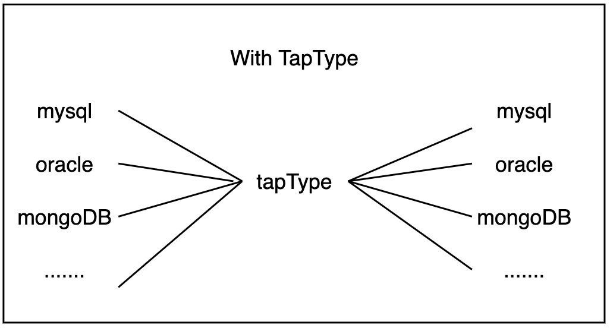
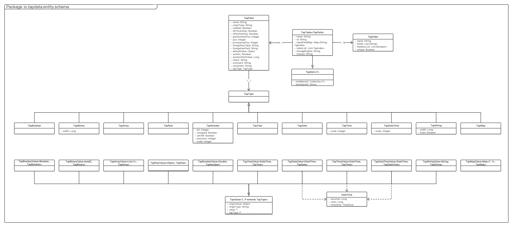
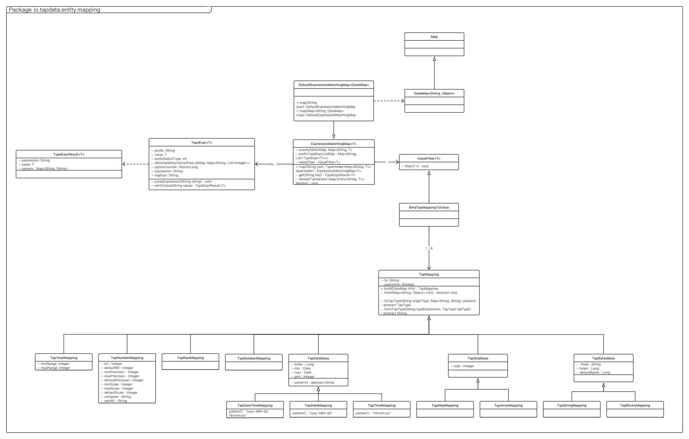

# Data Types

Data types is the mapping of data type (include capabilities) with TapType.   
TapType is the generic type definition in iDaaS Incremental Engine.

* PDK connector define data types json mapping, let Incremental Engine know the mapping of data types with TapTypes.
* Records with TapTypes will flow into Incremental Engine to do processing, join, etc.
* Once the records with TapTypes will flow into a PDK target, Incremental engine will conjecture the best data types for PDK developer to create the table, base on the input of data types json mapping.

If without TapType, the conversion lines is like below, which is very complex to maintain.


With TapType in the middle of type conversion, the conversion can be maintainable and the fundamental for data processing, join, etc.



Above is the important concept to implement PDK connector, especially for the data source which need create table for insert records.

### TapType
There are 11 types of TapType.
* TapBoolean
* TapDate
* TapArray
* TapRaw
* TapNumber
* TapBinary
* TapTime
* TapMap
* TapString
* TapDateTime
* TapYear

We also have 11 types of TapValue for each TapType to combine value with it's TapType.
* TapBooleanValue
* TapDateValue
* TapArrayValue
* TapRawValue
* TapNumberValue
* TapBinaryValue
* TapTimeValue
* TapMapValue
* TapStringValue
* TapDateTimeValue
* TapYearValue

Below is schema class diagram



Data Types in spec.json is to describe the capabilities of data types for Incremental Engine to conjecture the best data types to create table before record insertion. 

**If the database support insert record without table creation, like MongoDB, Kafka, etc, then please ignore this document, just leave dataTypes empty in spec.json.**

## Data type expression

- key is data type expression to easily matching multiple data types with several combinations which are the same type of data. 
- value is the capabilities description for min, max value, unsigned, etc. 
 
For example of the data type expression,

int[($bit)][unsigned][zerofill] can match below types 
- int
- int(8)
- int(32) unsigned
- int(64) unsigned zerofill

By this expression, the dataTypes configuration can be simplified a lot.  


The value is a json value, below is a must, 
```json
{
  "to": "TapString"
}
```
The "to" means the data type expression will be converted to the specified TapType. 
* TapBoolean
* TapDate
* TapArray
* TapRaw
* TapNumber
* TapBinary
* TapTime
* TapMap
* TapString
* TapDateTime
* TapYear

Common fields
```text
{
  "name" : "typeName", //Optional, name of data type, will display to users. If not specified, name will be generated automatically by removing all variables. 
  "queryOnly" : true, //Optional, default is false. The type is only for query, will not be used for table creation. 
  "priority" : 1 //Optional, default is Integer.MAX_VALUE. If source type matches multiple target types which is the same score (bit or bytes), then the target type will be selected when the priority is the smallest.
  "pkEnablement" : true //Optional, default is true. Whether the data type can be primary key or not. 
}
```

Some TapType have extra fields
* TapNumber
```text
{ 
    "to": "TapNumber",
  
    "bit": 64, //max bit
    "defaultBit" : 10, //default bit
    "preferBit" : 32, //prefer bit by developer experience, only used for limit bit as a source.
    "bitRatio" : 1, //1 is default. Some databases, bit means bit, but some bit means byte, then "bitRatio" should be 8. 
    
    "precision" : [1, 30], //precision range, [min, max]
    "defaultPrecision" : 10, //default precision
    "preferPrecision" : 12, //prefer precision by developer experience, only used for limit bit as a source. 
    
    "scale" : [0, 30], //scale range, [min, max], distinguish int, long and float, double.  
    "defaultScale" : 3, //default scale
    "preferScale" : 6, //prefer scale by developer experience, only used for limit scale as a source.
    
    "value": [-128, 127], //Also support like [ "-3.402823466E+38", "3.402823466E+38"], the min/max value of this data type.
    "unsignedValue": [0, 255], //Also support like [ "-3.402823466E+38", "3.402823466E+38"], the min/max value of this data type when unsigned. 
    
    "fixed" : false, // Default is false, if true, means it is important to preserve exact precision, normally with precision and scale specified. Otherwise only precision or none specified.  
    
    "unsigned" : "unsignedEx", //alias of unsigned, different database may use different label for unsigned
    "zerofill" : "zerofill" //alias of zerofill, different database may use different label for zerofill
}
```
For the data type accuracy, we prefer

**value/unsignedValue > bit > precision**


for example

```text
{
    "tinyint[unsigned]": {"to": "TapNumber","bit": 8,"precision": 3,"value": [ -128, 127],"unsignedValue": [ 0, 255],"unsigned": "unsigned"},
    "smallint[unsigned]": {"to": "TapNumber","bit": 16,"value": [ -32768, 32767],"unsignedValue": [ 0, 65535],"unsigned": "unsigned","precision": 5},
    "mediumint[unsigned]": {"to": "TapNumber","bit": 24,"precision": 7,"value": [ -8388608, 8388607],"unsignedValue": [ 0, 16777215],"unsigned": "unsigned"},
    "int[unsigned]": {"to": "TapNumber","bit": 32,"precision": 10,"value": [ -2147483648, 2147483647],"unsignedValue": [ 0, 4294967295],"unsigned": "unsigned"},
    "bigint[unsigned]": {"to": "TapNumber","bit": 64,"precision": 19,"value": [ -9223372036854775808, 9223372036854775807], "unsignedValue": [ 0, 18446744073709551615],"unsigned": "unsigned"},
    "decimal[($precision,$scale)][unsigned]": {"to": "TapNumber","precision": [ 1, 65],"scale": [ 0, 30],"defaultPrecision": 10,"defaultScale": 0,"unsigned": "unsigned", "fixed": true},
    "float($precision,$scale)[unsigned]": {"to": "TapNumber","precision": [ 1, 30],"scale": [ 0, 30],"value": [ "-3.402823466E+38", "3.402823466E+38"],"unsigned": "unsigned","fixed": false},
    "float": {"to": "TapNumber","precision": [ 1, 6],"scale": [ 0, 6],"fixed": false},
    "double": {"to": "TapNumber","precision": [ 1, 11],"scale": [ 0, 11],"fixed": false},
    "double[($precision,$scale)][unsigned]": {"to": "TapNumber","precision": [ 1, 255],"scale": [ 0, 30],"value": [ "-1.7976931348623157E+308", "1.7976931348623157E+308"],"unsigned": "unsigned","fixed": false}
}

```    
* TapString
```text
{
    "byte" : "16m", //Max length of string, support string with suffix "k", "m", "g", "t", "p", also number
    "defaultByte" : "1m", //Default byte when no byte variable is specified
    "preferByte" : 100, //prefer byte by developer experience, only used for limit byte as a source.
    "byteRatio" : 1, // 1 is default. Some databases, byte means byte, but some byte means char, like utf8 1 char mean 3 bytes, then "bitRatio" should be 3 
    "fixed" : false //false is default, length is fixed or not. When length is fixed, space will be placed to fulfill the length 
}
```
for example
```text
{
    "char[($byte)]": {"to": "TapString","byte": 255, "byteRatio": 3, "defaultByte": 1,"fixed": true},
    "varchar($byte)": {"to": "TapString","byte": 65535,"defaultByte": 1},
    "tinytext": {"to": "TapString","byte": 255},
    "text": {"to": "TapString","byte": "64k"},
    "mediumtext": {"to": "TapString","byte": "16m"},
    "longtext": {"to": "TapString","byte": "4g"},
}
```
* TapBinary
```text
{
    "byte" : "16m", //Max length of binary, support string with suffix "k", "m", "g", "t", "p", also number
    "defaultByte" : "1m", //Default byte when no byte variable is specified
    "preferByte" : 100, //prefer byte by developer experience, only used for limit byte as a source. 
    "fixed" : false //false is default, length is fixed or not. When length is fixed, space will be placed to fulfill the length 
}
```
for example
```text
{
    "binary[($byte)]": {"to": "TapBinary","byte": 255,"defaultByte": 1,"fixed": true},
    "varbinary[($byte)]": {"to": "TapBinary","byte": 65535,"defaultByte": 1},
    "tinyblob": {"to": "TapBinary","byte": 255},
    "blob": {"to": "TapBinary","byte": "64k"},
    "mediumblob": {"to": "TapBinary","byte": "16m"},
    "longblob": {"to": "TapBinary","byte": "4g"},
}
```
* TapDate
```text
{
    "range" : ["1000-01-01", "9999-12-31"], //Range of date
    "pattern" : "yyyy-MM-dd", //The pattern to parse the date of range 
    "withTimezone" : false //false is default, DateTime will have TimeZone or not.   
}
```
for example

```text
{
    "date": {"to": "TapDate","range": [ "1000-01-01", "9999-12-31"],"pattern": "yyyy-MM-dd"},
}
```
* TapDateTime
```text
{
    "range" : ["1000-01-01", "9999-12-31"], //Range of date
    "pattern" : "yyyy-MM-dd", //The pattern to parse the date of range 
    "withTimezone" : false, //false is default, DateTime will have TimeZone or not.
    "fraction" : [0, 9], //min is 0, max is 9. 0 mean second, 3 mean millisecond, 6 mean microsecond, 9 mean nanosecond
    "defaultFraction" : 0, //when fraction is a variable, but not specified, defaultFraction will be used as its fraction
}
```
for example

```text
{
    "datetime[($fraction)]": {"to": "TapDateTime","range": [ "1000-01-01 00:00:00.000000", "9999-12-31 23:59:59.999999"],"pattern": "yyyy-MM-dd HH:mm:ss.SSSSSS","fraction": [0, 6], "defaultFraction": 0},
    "timestamp[($fraction)]": {"to": "TapDateTime","range": [ "1970-01-01 00:00:01.000000", "2038-01-19 03:14:07.999999"],"pattern": "yyyy-MM-dd HH:mm:ss.SSSSSS","fraction": [0, 6], "defaultFraction": 0,"withTimeZone": true}
}
```
* TapTime
```text
{
    "range" : ["-838:59:59","838:59:59"], //Range of date
    "withTimezone" : false, //false is default, DateTime will have TimeZone or not.
}
```
for example
```text
{
    "time": {"to": "TapTime","range": ["-838:59:59","838:59:59"]},
}
```


Example of Doris data type expression is below, 
```json
{
  "char[($byte)]": {"to": "TapString","byte": 255, "byteRatio": 3, "defaultByte": 1,"fixed": true},
  "varchar($byte)": {"to": "TapString","byte": 65535,"defaultByte": 1},
  "tinytext": {"to": "TapString","byte": 255},
  "text": {"to": "TapString","byte": "64k"},
  "mediumtext": {"to": "TapString","byte": "16m"},
  "longtext": {"to": "TapString","byte": "4g"},
  "json": {"to": "TapMap","byte": "4g","queryOnly": true},
  "binary[($byte)]": {"to": "TapBinary","byte": 255,"defaultByte": 1,"fixed": true},
  "varbinary[($byte)]": {"to": "TapBinary","byte": 65535,"defaultByte": 1},
  "tinyblob": {"to": "TapBinary","byte": 255},
  "blob": {"to": "TapBinary","byte": "64k"},
  "mediumblob": {"to": "TapBinary","byte": "16m"},
  "longblob": {"to": "TapBinary","byte": "4g"},
  "bit[($bit)]": {"to": "TapNumber","bit": 64,"precision": 20,"value": [ 0, 18446744073709552000]},
  "tinyint[unsigned]": {"to": "TapNumber","bit": 8,"precision": 3,"value": [ -128, 127],"unsignedValue": [ 0, 255],"unsigned": "unsigned"},
  "smallint[unsigned]": {"to": "TapNumber","bit": 16,"value": [ -32768, 32767],"unsignedValue": [ 0, 65535],"unsigned": "unsigned","precision": 5},
  "mediumint[unsigned]": {"to": "TapNumber","bit": 24,"precision": 7,"value": [ -8388608, 8388607],"unsignedValue": [ 0, 16777215],"unsigned": "unsigned"},
  "int[unsigned]": {"to": "TapNumber","bit": 32,"precision": 10,"value": [ -2147483648, 2147483647],"unsignedValue": [ 0, 4294967295],"unsigned": "unsigned"},
  "bigint[unsigned]": {"to": "TapNumber","bit": 64,"precision": 19,"value": [ -9223372036854775808, 9223372036854775807], "unsignedValue": [ 0, 18446744073709551615],"unsigned": "unsigned"},
  "decimal[($precision,$scale)][unsigned]": {"to": "TapNumber","precision": [ 1, 65],"scale": [ 0, 30],"defaultPrecision": 10,"defaultScale": 0,"unsigned": "unsigned", "fixed": true},
  "float($precision,$scale)[unsigned]": {"to": "TapNumber","precision": [ 1, 30],"scale": [ 0, 30],"value": [ "-3.402823466E+38", "3.402823466E+38"],"unsigned": "unsigned","fixed": false},
  "float": {"to": "TapNumber","precision": [ 1, 6],"scale": [ 0, 6],"fixed": false},
  "double": {"to": "TapNumber","precision": [ 1, 11],"scale": [ 0, 11],"fixed": false},
  "double[($precision,$scale)][unsigned]": {"to": "TapNumber","precision": [ 1, 255],"scale": [ 0, 30],"value": [ "-1.7976931348623157E+308", "1.7976931348623157E+308"],"unsigned": "unsigned","fixed": false},
  "date": {"to": "TapDate","range": [ "1000-01-01", "9999-12-31"],"pattern": "yyyy-MM-dd"},
  "time": {"to": "TapTime","range": ["-838:59:59","838:59:59"]},
  "datetime[($fraction)]": {"to": "TapDateTime","range": [ "1000-01-01 00:00:00.000000", "9999-12-31 23:59:59.999999"],"pattern": "yyyy-MM-dd HH:mm:ss.SSSSSS","fraction": [ 0, 6],"defaultFraction": 0},
  "timestamp[($fraction)]": {"to": "TapDateTime","range": [ "1970-01-01 00:00:01.000000", "2038-01-19 03:14:07.999999"],"pattern": "yyyy-MM-dd HH:mm:ss.SSSSSS","fraction": [ 0, 6],"defaultFraction": 0,"withTimeZone": true}
}
```

## Data types class diagram

