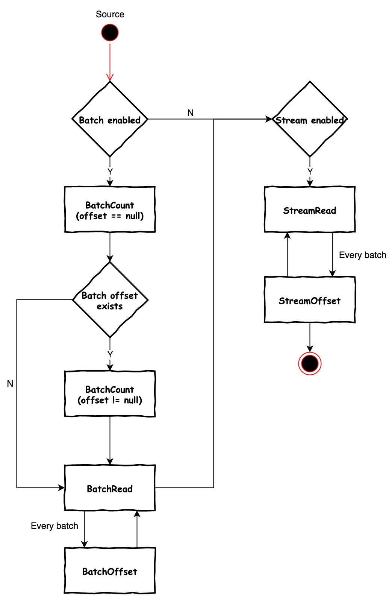
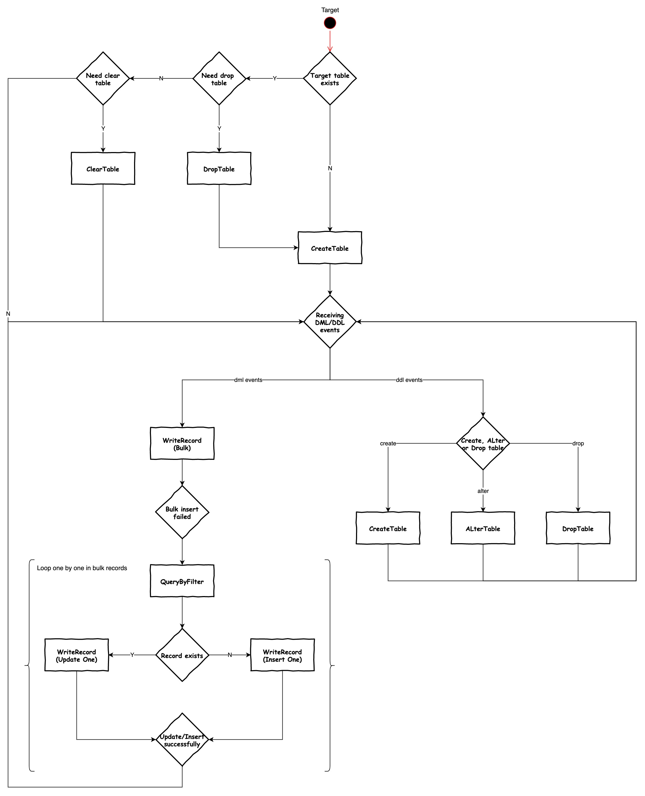
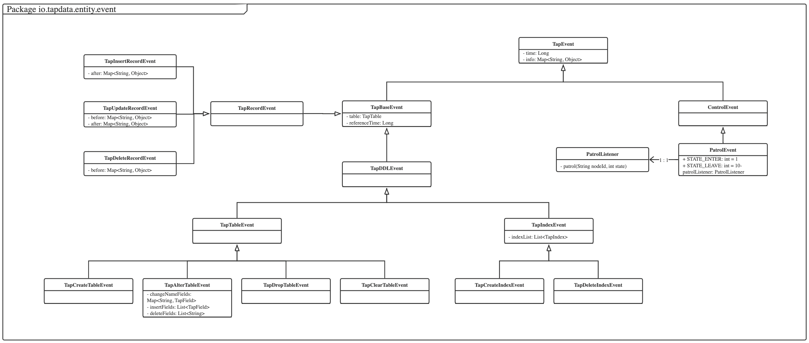

# Development Guide

## Develop PDK connector

There are 11 methods to implement. The more developer implement, the more features that your connector provides. 
* PDK Source methods to implement
    - BatchCount
        - Return the total record size for batch read.
    - BatchRead 
        - Return the record events from batch read, once this method end, incremental engine will consider batch read is finished.
    - StreamRead
        - Return the record events or ddl events from stream read, this method will always be called once it returns.
* PDK Target methods to implement 
    - writeRecord 
        - Write record events into target data source. 
    - QueryByFilter
        - Verify the record with certain filter is exists or not. if exists, then update, other wise do insert. 
    - CreateTable
        - Create the table with given conjectured data types.  
    - AlterTable
        - Alter table with conjectured data types that triggered by the stream ddl events.  
    - DropTable
        - Drop table that triggered by the stream ddl events or by user selection
    - ClearTable
        - Clear table by user selection.

## Plugin diagrams

Source methods invocation state diagram

Target methods invocation state diagram


TapEvent class diagram


Record conversion from source to target diagram


## Methods
### Batch Read
```java
@TapConnectorClass("spec.json")
public class SampleConnector extends ConnectorBase {
    /**
     * The method invocation life circle is below,
     * onStart -> batchRead -> onStop
     *
     * In connectorContext,
     * you can get the connection/node config which is the user input for your connection/node form, described in your spec.json file.
     *
     * Param table is the table to do the batch read.
     *
     *
     * @param connectorContext
     * @param table is the table to do the batch read.
     * @param offset if null, start from beginning, if not null, start from specified offset.
     * @param eventBatchSize max batch size for record events.
     * @param eventsOffsetConsumer consumer accept a list of record events and batch read offset.
     */
    private void batchRead(TapConnectorContext connectorContext, TapTable table, Object offset, int eventBatchSize, BiConsumer<List<TapEvent>, Object> eventsOffsetConsumer) {
        //TODO batch read all records from database, use consumer#accept to send to incremental engine.

        //Below is sample code to generate records directly.
        for (int j = 0; j < 1; j++) {
            List<TapEvent> tapEvents = list();
            for (int i = 0; i < eventBatchSize; i++) {
                TapInsertRecordEvent recordEvent = insertRecordEvent(map(
                        entry("id", counter.incrementAndGet()),
                        entry("description", "123"),
                        entry("name", "123"),
                        entry("age", 12)
                ), table.getId());
                tapEvents.add(recordEvent);
            }
            eventsOffsetConsumer.accept(tapEvents, null);
        }
        counter.set(counter.get() + 1000);
    }
}
```
### Batch Count
```java
@TapConnectorClass("spec.json")
public class SampleConnector extends ConnectorBase implements TapConnector {
    /**
     * The method invocation life circle is below,
     * onStart -> batchCount -> onStop
     *
     * Total count of batch read for specified table
     *
     * @param connectorContext
     * @param table
     * @return
     */
    private long batchCount(TapConnectorContext connectorContext, TapTable table) {
        //TODO Count the batch size.
        return 20L;
    }
}
``` 
### Stream Read
```java
@TapConnectorClass("spec.json")
public class SampleConnector extends ConnectorBase {
    /**
     * The method invocation life circle is below,
     * onStart -> batchRead -> onStop
     *
     * In connectorContext,
     * you can get the connection/node config which is the user input for your connection/node form, described in your spec.json file.
     *
     * @param connectorContext task context.
     * @param tableList is the tables to do stream read.
     * @param streamOffset where the stream read will start from.
     * @param batchSize the max size for each batch.
     * @param consumer use it to accept a batch of events and mark stream started/stopped.
     */
    private void streamRead(TapConnectorContext connectorContext, List<String> tableList, Object streamOffset, int batchSize, StreamReadConsumer consumer) {
        //TODO using CDC APi or log to read stream records from database, use consumer#accept to send to incremental engine.

        consumer.streamReadStarted();
        //Below is sample code to generate stream records directly
        while(!isShutDown.get()) {
            String tableId = tableList.get(0);
            List<TapEvent> tapEvents = list();
            for (int i = 0; i < batchSize; i++) {
                TapInsertRecordEvent event = insertRecordEvent(map(
                        entry("id", counter.incrementAndGet()),
                        entry("description", "123"),
                        entry("name", "123"),
                        entry("age", 12)
                ), tableId);
                tapEvents.add(event);
            }

            sleep(1000L);
            consumer.accept(tapEvents, null);
        }
    }
}
```

### Stream Offset
```java
@TapConnectorClass("spec.json")
public class SampleConnector extends ConnectorBase {
    /**
     * The method invocation life circle is below,
     * onStart -> timestampToStreamOffset -> onStop
     *
     * Use timestamp to get corresponding stream offset; if timestamp is null, means current stream offset.
     * Support it if your connector are capable to do it.
     *
     * @param connectorContext
     * @param timestamp the timestamp to return corresponding stream offset.
     * @return
     */
    private Object timestampToStreamOffset(TapConnectorContext connectorContext, Long timestamp) {
        return null;
    }
}
```
### Register Capabilities
```java
@TapConnectorClass("spec.json")
public class SampleConnector extends ConnectorBase implements TapConnector {
    /**
     * Register connector capabilities here.
     *
     * To be as a source, please implement at least one of batchReadFunction or streamReadFunction.
     * To be as a target, please implement WriteRecordFunction.
     * To be as a source and target, please implement the functions that source and target required.
     *
     * @param connectorFunctions
     * @param codecRegistry
     */
    @Override
    public void registerCapabilities(ConnectorFunctions connectorFunctions, TapCodecRegistry codecRegistry) {
        //Register the 11 methods to implement. 
        //If connector don't provide the capability, need remove this method registration. 
        connectorFunctions.supportBatchRead(this::batchRead);
        connectorFunctions.supportStreamRead(this::streamRead);
        connectorFunctions.supportBatchCount(this::batchCount);
        connectorFunctions.supportQueryByAdvanceFilter(this::queryByAdvanceFilter);
        connectorFunctions.supportWriteRecord(this::writeRecord);
        connectorFunctions.supportDropTable(this::dropTable);
        connectorFunctions.supportCreateTable(this::createTable);
        connectorFunctions.supportClearTable(this::clearTable);
        connectorFunctions.supportCreateIndex(this::createIndex);
        connectorFunctions.supportTimestampToStreamOffset(this::timestampToStreamOffset);

        //Below capabilities, developer can decide to implement or not.
        //onStart/onStop mean the start and stop for a task, once the task will be reset, releaseExternalFunction will be called if you support it. Then you can release the external resources for the task.
//		connectorFunctions.supportReleaseExternalFunction(this::releaseExternal);
        //Provide a way to output runtime memory for this connector.
//		connectorFunctions.supportMemoryFetcher(this::memoryFetcher);
        //Query indexes
//		connectorFunctions.supportQueryIndexes(this::queryIndexes);
        //Support alter field name ddl event
//		connectorFunctions.supportAlterFieldNameFunction(this::alterFieldName);
        
        //Only need for a source connector
        codecRegistry.registerToTapValue(TDDUser.class, value -> new TapStringValue(toJson(value)));

        //If database need insert record before table created, please implement the custom codec for the TapValue that data types in spec.json didn't cover.
        //TapTimeValue, TapMapValue, TapDateValue, TapArrayValue, TapYearValue, TapNumberValue, TapBooleanValue, TapDateTimeValue, TapBinaryValue, TapRawValue, TapStringValue
        codecRegistry.registerFromTapValue(TapRawValue.class, "text", tapRawValue -> {
            if (tapRawValue != null && tapRawValue.getValue() != null)
                return toJson(tapRawValue.getValue());
            return "null";
        });
        codecRegistry.registerFromTapValue(TapBooleanValue.class, "boolean", tapValue -> {
            if (tapValue != null) {
                Boolean value = tapValue.getValue();
                if (value != null && value) {
                    return 1;
                }
            }
            return 0;
        });
    }
}
```

### Custom Codec
* Source codec
  
    - PDK can recognize generic types in your records and convert them into TapValue.

    - To convert custom class, developer need to provide the codec for how to convert the custom class into a type of TapValue, so that different data source can be able to insert this value.
    
    - The origin object will be stored in the field originValue of TapValue, if the target is the same data source, connector can still get the original value to insert.

* Target codec (Only for the database that need create table before record insertion)
    - Data types json mapping is not covered all the TapValue, then please provide the custom codec for the TapValue can be converted to which data type and provide the conversion method.   


```java
@TapConnectorClass("spec.json")
public class SampleConnector extends ConnectorBase {
    @Override
    public void registerCapabilities(ConnectorFunctions connectorFunctions, TapCodecRegistry codecRegistry) {
        //TDDUser object will be convert into json string.  
        codecRegistry.registerToTapValue(TDDUser.class, value -> new TapStringValue(toJson(value)));

        //If database need insert record before table created, please implement the custom codec for the TapValue that data types in spec.json didn't cover.
        //TapTimeValue, TapMapValue, TapDateValue, TapArrayValue, TapYearValue, TapNumberValue, TapBooleanValue, TapDateTimeValue, TapBinaryValue, TapRawValue, TapStringValue
        codecRegistry.registerFromTapValue(TapRawValue.class, "text", tapRawValue -> {
            if (tapRawValue != null && tapRawValue.getValue() != null)
                return toJson(tapRawValue.getValue());
            return "null";
        });
        codecRegistry.registerFromTapValue(TapBooleanValue.class, "boolean", tapValue -> {
            if (tapValue != null) {
                Boolean value = tapValue.getValue();
                if (value != null && value) {
                    return 1;
                }
            }
            return 0;
        });
    }
}
```
### Write Record
```java
@TapConnectorClass("spec.json")
public class SampleConnector extends ConnectorBase {
    /**
     * The method invocation life circle is below,
     * onStart -> writeRecord -> onStop
     *
     * Through this method, Insert/Update/Delete record events will be passed into tapRecordEvents param, apply the event into database.
     * Use writeListResultConsumer to accept the number of inserted/updated/deleted and errorMap for each failed record event.
     *
     * @param connectorContext
     * @param tapRecordEvents
     * @param table
     * @param writeListResultConsumer
     */
    private void writeRecord(TapConnectorContext connectorContext, List<TapRecordEvent> tapRecordEvents, TapTable table, Consumer<WriteListResult<TapRecordEvent>> writeListResultConsumer) {
        //TODO write records into database

        //Below is sample code to print received events which suppose to write to database.
        AtomicLong inserted = new AtomicLong(0); //insert count
        AtomicLong updated = new AtomicLong(0); //update count
        AtomicLong deleted = new AtomicLong(0); //delete count
        for(TapRecordEvent recordEvent : tapRecordEvents) {
            if(recordEvent instanceof TapInsertRecordEvent) {
                inserted.incrementAndGet();
                TapLogger.info(TAG, "Record Write TapInsertRecordEvent {}", toJson(recordEvent));
            } else if(recordEvent instanceof TapUpdateRecordEvent) {
                updated.incrementAndGet();
                TapLogger.info(TAG, "Record Write TapUpdateRecordEvent {}", toJson(recordEvent));
            } else if(recordEvent instanceof TapDeleteRecordEvent) {
                deleted.incrementAndGet();
                TapLogger.info(TAG, "Record Write TapDeleteRecordEvent {}", toJson(recordEvent));
            }
        }
        //Need to tell incremental engine to write result
        writeListResultConsumer.accept(writeListResult()
                .insertedCount(inserted.get())
                .modifiedCount(updated.get())
                .removedCount(deleted.get()));
    }
}
```
