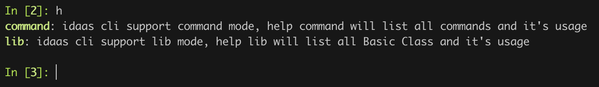
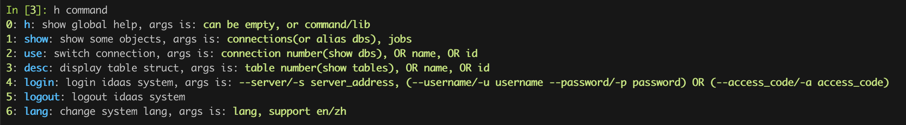
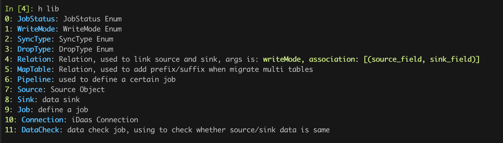
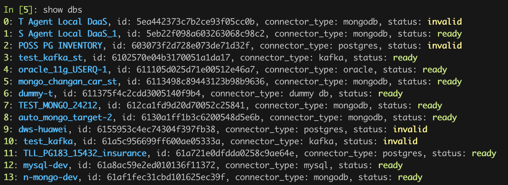
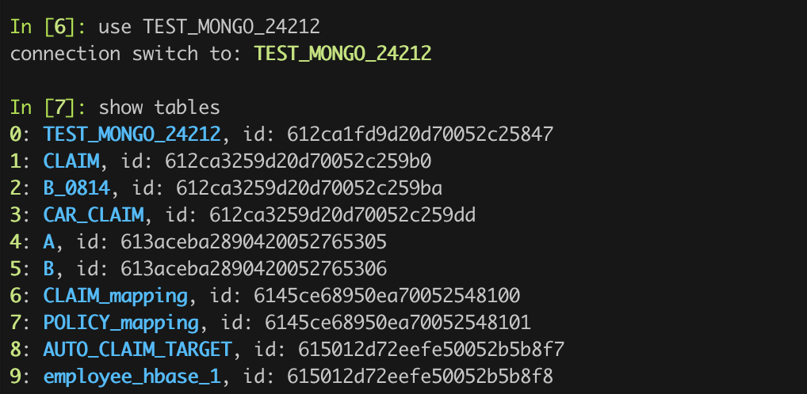
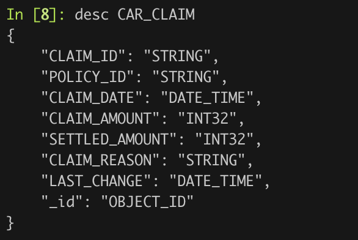
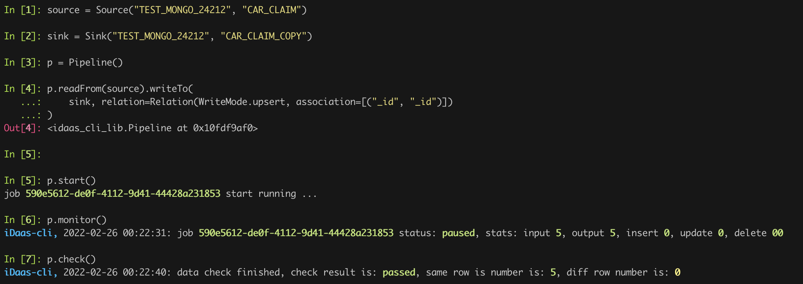
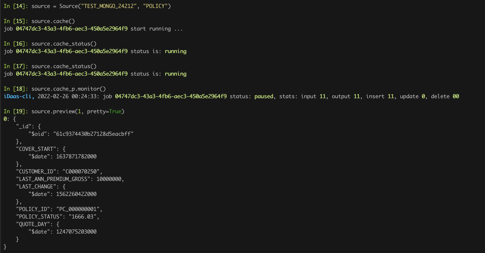

# TAPDATA OpenSource Terminal Client

## Install
1. Install python 3.7, pip, ipython By Yourself
2. Run `pip3 install -r requirements.txt`, install client requirements
3. If you want to embed it into your code as Python SDK, please [read this article](https://github.com/tapdata/tapdata/tree/master/tapshell/docs/Python-Sdk.md).

## Prepare
1. Edit config.ini, set server as iDaas Server address, and access_code as auth

You can ignore it, and run login after start client

## Run
1. `bash cli.sh` will open terminal client

## Help Command
*. Run `h` will display common help message


*. Run `h command` will display command mode message


*. Run `h lib` will display lib mode message


## Example
### Login


### See your Connections





### Migrate a table with Data Check


### Migrate a table with UDF

### Cache a table and Preview it


## Document
### 初始化
1. 可以在 config.ini 填写地址和访问串, 启动时会自动识别并登录
2. 可以在启动后, 通过 `login(server, access_code)` 进行手动登录
3. 如果要作为Python Sdk的形式内嵌到您的代码当中，请看[这篇文档](https://github.com/tapdata/tapdata/tree/master/tapshell/docs/Python-Sdk_zh-hans.md)

### 列出所有数据连接
show dbs
```
>>> show dbs
id     status  database_type   name
9c6046: ready   mysql           docker_mysql_5562
9c604b: ready   mysql           docker_mysql_8023_target
9c6052: ready   oracle          oracle_19c_TAPDATA
```

### 切换到某个连接
use 连接, 可以使用 show 的简略 id, 或者使用名字
比如: use 9c6046, use docker_mysql_5562

### 列出当前连接的全部数据表
show tables

### 查看表信息
desc 表, 可以使用 show 的简略 id, 或者使用名字

### 查看表的示例数据
peek 表, 可以使用 show 的简略 id, 或者使用名字

### 创建连接
1. 支持使用封装对象创建, 比如 MongoDB
```
m = MongoDB("source").
m.host("192.168.1.181:32560").db("source").username("root").password("Gotapd8!").type("source").props("authSource=admin");
m.validate()
CHECK_CONNECT: passed
CHECK_AUTH: passed
CHECK_PERMISSION: passed
LOAD_SCHEMA: passed
CHECK_CDC_PERMISSION: passed

m.save()
```

2. 使用标准对象进行创建
```
m = DataSource("source")
m.connector("mongodb")
其余与封装对象一样, 需要保证每个属性与定义的数据表单一致

m.validate()
m.save()
```

### 库复制任务创建
1. 可以使用简单语法: `库名.syncTo(目标库名, prefix=, suffix=)` 直接创建任务
比如: docker_mysql_5562.syncTo(oracle_19c_TAPDATA, prefix="p_")
返回一个任务, 可以通过返回的对象进行 start/stop/status/monitor 的操作

2. 可以使用标准语法创建任务
```
p = Pipeline()
p.readFrom(source).writeTo(sink, prefix=, suffix=)
```

### 表复制任务创建
使用标准语法创建任务
```
p = Pipeline()
p.readFrom(source.table).writeTo(sink.table)

p.accurateDelay() # 开启精准延迟计算
```

### 数据校验
在创建表复制任务之后, 可以直接调用 `p.check()` 启动校验任务, 并打印校验结果, 重复调用可实时获取最新结果

### 计算任务创建
使用标准语法创建任务
```
p = Pipeline("name")
p.readFrom(source1.table).writeTo(sink.table, writeMode=upsert)
p.readFrom(source2.table).filter("table_id > 1").writeTo(sink.table, writeMode=update)
```

创建的是一个主从表合并的任务, 支持的算子有:
1. filter: 过滤源数据, 参数为 "a > 1 and b < 2" 类似风格, 简单查询与组合
2. filterColumn: 保留或者删除某些列, 第一个参数为数组, 列名, 第二个参数为行为, keep 保留, delete 删除
3. rename: 两个参数, 列名修改
4. js: 自定义 js, 输入字符串, 为 js 脚本
5. agg: 聚合, 暂时不建议使用

### 列出 api
show apis

### 发布 api
publish name db.table

### 取消发布 api
unpublish name
